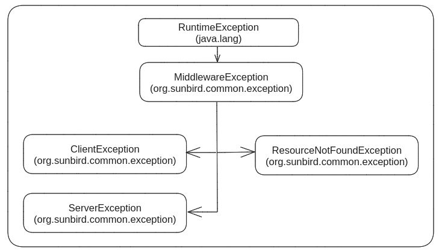

This document explains about the various error responses the inQuiry micro service currently throws. The intent of this document is to look through the errors and classify it and propose any changes in terms of error reporting.

Broadly classified, there are three types of error responses that are coming out of the APIs.


|  **Error Classification**  |  **HTTP Status Code**  |  **Description / Usage**  | 
|  --- |  --- |  --- | 
| CLIENT_ERROR | 400 | The client sends a bad request that resulted in service validating and throwing the error. | 
| RESOURCE_NOT_FOUND | 404 | The client request for a resource that is not found in the server. | 
| SERVER_ERROR | 500 | Service resulted in unexpected results while processing the client request. | 

Reference : org.sunbird.common.exception.ResponseCode


## Sunbird Exception Hierarchy


Sunbird Exception Hierarchy


## Current Scenarios of various exceptions
The below exceptions are from release 5.6.0

ClientException
```java
Class
    ClientException
        assessment-actors  (31 usages found)
            org.sunbird.managers  (26 usages found)
                AssessmentManager.scala  (22 usages found)
                    34 throw new ClientException(errCode, "Visibility cannot be Parent!")
                    53 throw new ClientException("ERR_ACCESS_DENIED", s"$resName visibility is private, hence access denied")
                    61 if (StringUtils.isBlank(request.getRequest.getOrDefault("channel", "").asInstanceOf[String])) throw new ClientException("ERR_INVALID_CHANNEL", "Please Provide Channel!")
                    69 throw new ClientException("ERR_ACCESS_DENIED", "Channel id is not matched")
                    83 throw new ClientException(errCode, node.getMetadata.getOrDefault("objectType", "").asInstanceOf[String].replace("Image", "") + " with visibility Parent, can't be updated individually.")
                    92 throw new ClientException(errCode, s"${node.getObjectType.replace("Image", "")} with visibility Parent, can't be sent for review individually.")
                    94 throw new ClientException(errCode, s"${node.getObjectType.replace("Image", "")} with status other than Draft can't be sent for review.")
                    107 throw new ClientException(errCode, s"${node.getObjectType.replace("Image", "")} with visibility Parent, can't be sent for review individually.")
                    109 throw new ClientException(errCode, s"${node.getObjectType.replace("Image", "")} with status other than Draft can't be sent for review.")
                    112 throw new ClientException("ERR_MANDATORY_FIELD_VALIDATION", s"Mandatory Fields ${messages.asJava} Missing for ${node.getIdentifier.replace(".img", "")}")
                    139 throw new ClientException(errCode, s"${node.getObjectType.replace("Image", "")} with visibility Parent, can't be sent for publish individually.")
                    141 throw new ClientException(errCode, s"${node.getObjectType.replace("Image", "")} having Processing status can't be sent for publish.")
                    152 throw new ClientException(errCode, s"${node.getObjectType.replace("Image", "")} with visibility Parent, can't be sent for publish individually.")
                    154 throw new ClientException(errCode, s"${node.getObjectType.replace("Image", "")} having Processing status can't be sent for publish.")
                    157 throw new ClientException("ERR_MANDATORY_FIELD_VALIDATION", s"Mandatory Fields ${messages.asJava} Missing for ${node.getIdentifier.replace(".img", "")}")
                    165 throw new ClientException(errCode, s"${node.getObjectType.replace("Image", "")} with identifier : ${node.getIdentifier} is already Retired.")
                    174 throw new ClientException(errCode, s"${node.getObjectType.replace("Image", "")} with visibility Parent, can't be sent for reject individually.")
                    176 throw new ClientException(errCode, s"${node.getObjectType.replace("Image", "")} is not in 'Review' state for identifier: " + node.getIdentifier)
                    185 throw new ClientException("ERR_QUESTION_SET_ADD", "Node with Identifier " + node.getIdentifier + " is not a Question Set")
                    216 throw new ClientException("ERR_QUESTION_SET", "Object with identifier: " + content.get("identifier") + " is not Live. Please Publish it.")
                    237 throw new ClientException("ERR_MANDATORY_FIELD_VALIDATION", s"Mandatory Fields ${messages.asJava} Missing for ${content.get("identifier").toString}")
                    284 if (StringUtils.isBlank(beJobRequestEvent)) throw new ClientException("BE_JOB_REQUEST_EXCEPTION", "Event is not generated properly.")
                CopyManager.scala  (4 usages found)
                    61 requestObjectType, nodeObjectType)) throw new ClientException(AssessmentConstants.ERR_INVALID_OBJECT_TYPE, s"Please Provide Valid ${requestObjectType} Identifier
                    63 throw new ClientException(AssessmentConstants.ERR_INVALID_REQUEST, "Question With Visibility Parent Cannot Be Copied Individually!")
                    270 throw new ClientException(AssessmentConstants.ERR_INVALID_REQUEST, "Please provide valid value for " + keysNotPresent)
                    276 throw new ClientException(AssessmentConstants.ERR_INVALID_REQUEST, "QuestionSet With Status " + node.getMetadata.get(AssessmentConstants
            org.sunbird.utils  (5 usages found)
                RequestUtil.scala  (5 usages found)
                    24 getRequest.containsKey(prop))) throw new ClientException("ERROR_RESTRICTED_PROP", "Properties in list " + restrictedProps.mkString("[", ", ", "]") + " are not
                    29 throw new ClientException(ErrorCodes.ERR_BAD_REQUEST.name(), s"Request Body cannot be Empty.")
                    32 throw new ClientException(ErrorCodes.ERR_BAD_REQUEST.name(), s"Cannot update content status to : ${SYSTEM_UPDATE_ALLOWED_CONTENT_STATUS.mkString("[", ", ", "]")}.")
                    38 throw new ClientException(ErrorCodes.ERR_BAD_REQUEST.name(), "Required field identifier is missing or empty.")
                    41 throw new ClientException(ErrorCodes.ERR_BAD_REQUEST.name(), "Request contains more than the permissible limit of identifiers: " + reqSize + ". Permissible limit is: "+questionListLimit)
        qs-hierarchy-manager  (24 usages found)
            org.sunbird.managers  (24 usages found)
                HierarchyManager.scala  (11 usages found)
                    124 throw new ClientException("ERR_BRANCHING_LOGIC", s"Branching Is Not Enabled For ${rootNode.getIdentifier}. Please Enable Branching Or Remove branchingLogic from Request.")
                    255 throw new ClientException(ErrorCodes.ERR_BAD_REQUEST.name(), "rootId is mandatory")
                    258 throw new ClientException(ErrorCodes.ERR_BAD_REQUEST.name(), "children are mandatory")
                    262 throw new ClientException(ErrorCodes.ERR_BAD_REQUEST.name(), "Branch Rule Found For The Node Which Is Not A Children Having Identifier
                    281 throw new ClientException(ErrorCodes.ERR_BAD_REQUEST.name(), "Children which are not available are: " + filteredList)
                    285 throw new ClientException(ErrorCodes.ERR_BAD_REQUEST.name(), s"Children must be of types $ASSESSMENT_OBJECT_TYPES for ids:  ${invalidNodes.map(_.getIdentifier)}")
                    320 throw new ClientException("ERR_BRANCHING_LOGIC", s"Branching Is Not Enabled For ${unitId}. Please Enable Branching Or Remove branchingLogic from Request.")
                    696 throw new ClientException("ERR_BRANCHING_LOGIC", s"Dependent Children Found! Please Remove Children With Identifiers ${target} For Node : ${identifier}")
                    708 throw new ClientException("ERR_BRANCHING_LOGIC", s"Source With Identifiers ${sourceIds.diff(childrenIds).asJava} Not Found! Please Provide Valid Source Identifier.")
                    716 throw new ClientException("ERR_BRANCHING_LOGIC", "An Object Can't Depend On More Than 1 Object")
                    721 throw new ClientException("ERR_BRANCHING_LOGIC", s"${source.get(0)} Is Already Children Of ${pSource.get(0)}. So It Can't Be Parent For ${entry._1}")
                UpdateHierarchyManager.scala  (13 usages found)
                    66 throw new ClientException(ErrorCodes.ERR_BAD_REQUEST.name(), "Hierarchy data is empty")
                    72 throw new ClientException("ERR_QS_UPDATE_HIERARCHY", "Question cannot have children in hierarchy")
                    90 throw new ClientException(HierarchyErrorCodes.ERR_INVALID_ROOT_ID, "Please Provide Valid Root Node Identifier")
                    102 throw new ClientException(HierarchyErrorCodes.ERR_INVALID_ROOT_ID, "Invalid MimeType for Root Node Identifier  : " + identifier)
                    106 throw new ClientException(HierarchyErrorCodes.ERR_INVALID_ROOT_ID, "Invalid Visibility found for Root Node Identifier  : " + identifier)
                    195 throw new ClientException("ERR_UPDATE_QS_HIERARCHY", s"Object Type is mandatory for creation of node with id: ${nodeModified._1}")
                    198 throw new ClientException("ERR_UPDATE_QS_HIERARCHY", s"Visibility can be only of type Parent for identifier: ${nodeModified._1}")
                    200 throw new ClientException("ERR_UPDATE_QS_HIERARCHY", s"Visibility can be only of type ${HierarchyConstants.QUESTION_VISIBILITY.asJava} for identifier: ${nodeModified._1}")
                    524 throw new ClientException("ERR_BRANCHING_LOGIC", s"Branching Is Not Enabled For: ${node.getIdentifier}. Please Remove branchingLogic from ${node.getIdentifier}")
                    541 throw new ClientException("ERR_BRANCHING_LOGIC", s"Please Provide Branching Rules for : ${branchingLogic.keySet.toList.diff(target).asJava}")
                    544 throw new ClientException("ERR_BRANCHING_LOGIC", s"Please Provide Dependent Object Within Same Parent having identifier : ${node.getIdentifier}")
                    547 throw new ClientException("ERR_BRANCHING_LOGIC", "An Object Can't Depend On More Than 1 Object")
                    550 throw new ClientException("ERR_BRANCHING_LOGIC", "A Dependent Object Can't Have Further Dependent Object")
        Maven: org.sunbird:graph-engine_2.11:1.0-SNAPSHOT  (18 usages found)
            src.main.scala.org.sunbird.graph.nodes  (6 usages found)
                DataNode.scala  (6 usages found)
                    77 throw new ClientException(ErrorCodes.ERR_BAD_REQUEST.name(), "identifiers is mandatory")
                    179 else throw new ClientException("ERR_INVALID_RELATION_OBJECT", "Invalid Relation Object Found.")
                    216 if (metadata.isEmpty) throw new ClientException(ErrorCodes.ERR_BAD_REQUEST.name(), s"Invalid Request. Cannot update status of Image Node to $status.")
                    261 throw new ClientException(ResponseCode.RESOURCE_NOT_FOUND.name(), s"Error! Node(s) doesn't Exists with identifier : ${request.getContext.get("identifier")}.")
                    266 throw new ClientException(ErrorCodes.ERR_BAD_REQUEST.name(), s"Cannot update content with FAILED status for id : ${node.getIdentifier}.")
                    304 throw new ClientException(ErrorCodes.ERR_BAD_REQUEST.name(), s"Request contains invalid identifiers : ${missingIds.mkString("[", ", ", "]")}.")
            src.main.scala.org.sunbird.graph.relations  (2 usages found)
                RelationHandler.scala  (2 usages found)
                    18 throw new ClientException(GraphErrorCodes.ERR_RELATION_CREATE.toString, "UnSupported Relation: " + relationType)
                    21 throw new ClientException(GraphErrorCodes.ERR_RELATION_CREATE.toString, "UnSupported Relation: " + relationType)
            src.main.scala.org.sunbird.graph.schema  (1 usage found)
                DefinitionDTO.scala  (1 usage found)
                    126 throw new ClientException(ResponseCode.CLIENT_ERROR.name, "Invalid request", java.util.Arrays.asList("Invalid Props are : " + invalidProps.asJavaCollection))
            src.main.scala.org.sunbird.graph.schema.validator  (9 usages found)
                FrameworkValidator.scala  (2 usages found)
                    52 case _ => throw new ClientException("CLIENT_ERROR", "Validation Errors.", util.Arrays.asList("Please provide correct value for [" + cat + "]"))
                    64 throw new ClientException("CLIENT_ERROR", "Validation Errors.", errors)
                PropAsEdgeValidator.scala  (4 usages found)
                    30 throw new ClientException("ERR_INVALID_EDGE_PROPERTY", key + " value should be one of " + list)
                    34 throw new ClientException("ERR_INVALID_EDGE_PROPERTY", key + " value should be any of " + list)
                    36 throw new ClientException("ERR_INVALID_EDGE_PROPERTY", key + " given datatype is invalid.")
                    39 throw new ClientException("ERR_EMPTY_EDGE_PROPERTY_LIST", "The list to validate input is empty.")
                RelationValidator.scala  (1 usage found)
                    45 throw new ClientException(ResponseCode.CLIENT_ERROR.name, "Error while validating relations :: " + errList)
                VersionKeyValidator.scala  (2 usages found)
                    26 if(!isValid)throw new ClientException(ResponseCode.CLIENT_ERROR.name, "Invalid version Key")
                    55 throw new ClientException("BLANK_VERSION", "Error! Version Key cannot be Blank. | [Node Id: " + node.getIdentifier + "]")
        Maven: org.sunbird:platform-common:1.0-SNAPSHOT  (10 usages found)
            org.sunbird.common  (2 usages found)
                HttpUtil  (2 usages found)
                    getMetadata(String, Map<String, String>)  (2 usages found)
                        79 throw new ClientException("ERR_API_CALL", "Fetching of file related metadata Failed with response code " + response.getStatus() + " and message: " + response.getStatusText());
                        82 throw new ClientException("ERR_API_CALL", "Something Went Wrong While Making API Call | Error is: " + e.getMessage());
        Maven: org.sunbird:schema-validator:1.0-SNAPSHOT  (1 usage found)
            org.sunbird.schema.dto  (1 usage found)
                ValidationResult  (1 usage found)
                    ValidationResult(List<String>, Map<String, Object>, Map<String, Object>, Map<String, Object>)  (1 usage found)
                        28 throw new ClientException(ResponseCode.CLIENT_ERROR.name(), "Validation Errors", messages);
```


ResourceNotFoundException
```java
Class
    ResourceNotFoundException
    New instance creation  (14 usages found)
        qs-hierarchy-manager  (2 usages found)
            org.sunbird.managers  (2 usages found)
                UpdateHierarchyManager.scala  (2 usages found)
                    267 throw new ResourceNotFoundException("ERR_UPDATE_QS_HIERARCHY", s"No node found with id: $nodeId")
                    288 } else throw new ResourceNotFoundException(HierarchyErrorCodes.ERR_CONTENT_NOT_FOUND, "Content not found with identifier: " + nodeId)
        Maven: org.sunbird:graph-engine_2.11:1.0-SNAPSHOT  (6 usages found)
            src.main.scala.org.sunbird.graph.schema  (2 usages found)
                CategoryDefinitionValidator.scala  (2 usages found)
                    56 throw new ResourceNotFoundException(resp.getParams.getErr, resp.getParams.getErrmsg + " " + resp.getResult)
                    62 throw new ResourceNotFoundException(channelCatResp.getParams.getErr, channelCatResp.getParams.getErrmsg + " " + channelCatResp.getResult)
            src.main.scala.org.sunbird.graph.schema.validator  (4 usages found)
                FrameworkValidator.scala  (3 usages found)
                    182 throw new ResourceNotFoundException("ERR_VALIDATING_CONTENT_FRAMEWORK", s"Nodes not found for Id's $ids ")
                    195 throw new ResourceNotFoundException("ERR_VALIDATING_CONTENT_FRAMEWORK", s"No nodes found for $termName with ids: ${node.getMetadata.get(termName)}")
                    197 throw new ResourceNotFoundException("ERR_VALIDATING_CONTENT_FRAMEWORK", s"No nodes found for $termName with ids: ${node.getMetadata.get(termName)}")
                VersioningNode.scala  (1 usage found)
                    44 throw new ResourceNotFoundException(GraphErrorCodes.ERR_INVALID_NODE.toString, "Node Not Found With Identifier : " + identifier)
```
ServerException
```java
Class
    ServerException
        assessment-actors  (3 usages found)
            org.sunbird.managers  (3 usages found)
                AssessmentManager.scala  (1 usage found)
                    207 } else throw new ServerException("ERR_QUESTION_SET_HIERARCHY", "No hierarchy is present in cassandra for identifier:" + rootNode.getIdentifier)
                CopyManager.scala  (2 usages found)
                    107 throw new ServerException("ERR_QUESTIONSET_COPY", "Something Went Wrong, Please Try Again")
                    116 throw new ServerException("ERR_QUESTIONSET_COPY", "Something Went Wrong, Please Try Again")
        qs-hierarchy-manager  (4 usages found)
            org.sunbird.managers  (4 usages found)
                HierarchyManager.scala  (3 usages found)
                    488 throw new ServerException("ERR_WHILE_FETCHING_HIERARCHY_FROM_CASSANDRA", "Error while fetching hierarchy from cassandra")
                    493 throw new ServerException("ERR_WHILE_FETCHING_HIERARCHY_FROM_CASSANDRA", "Error while fetching hierarchy from cassandra")
                    575 throw new ServerException("SERVER_ERROR", "Invalid response from search")
                UpdateHierarchyManager.scala  (1 usage found)
                    128 throw new ServerException(HierarchyErrorCodes.ERR_HIERARCHY_NOT_FOUND, "No hierarchy is present in cassandra for identifier:" + rootNode.getIdentifier)
        Maven: org.sunbird:graph-engine_2.11:1.0-SNAPSHOT  (9 usages found)
            src.main.scala.org.sunbird.graph.external.store  (5 usages found)
                ExternalStore.scala  (5 usages found)
                    49 throw new ServerException(ErrorCodes.ERR_SYSTEM_EXCEPTION.name, "Exception Occurred While Saving The Record. Exception is : " + e.getMessage)
                    92 throw new ServerException(ErrorCodes.ERR_SYSTEM_EXCEPTION.name, "Exception Occurred While Reading The Record. Exception is : " + e.getMessage)
                    110 throw new ServerException(ErrorCodes.ERR_SYSTEM_EXCEPTION.name, "Exception Occurred While Reading The Record. Exception is : " + e.getMessage)
                    150 throw new ServerException(ErrorCodes.ERR_SYSTEM_EXCEPTION.name, "Exception Occurred While Reading The Record. Exception is : " + e.getMessage)
                    181 throw new ServerException(ErrorCodes.ERR_SYSTEM_EXCEPTION.name, "Exception Occurred While Saving The Record. Exception is : " + e.getMessage)
            src.main.scala.org.sunbird.graph.relations  (2 usages found)
                AbstractRelation.scala  (1 usage found)
                    66 throw new ServerException(GraphErrorCodes.ERR_RELATION_VALIDATE.toString, "Error occurred while validating the relation", e)
                SequenceMembershipRelation.scala  (1 usage found)
                    25 throw new ServerException(GraphErrorCodes.ERR_RELATION_VALIDATE.toString, e.getMessage, e)
            src.main.scala.org.sunbird.graph.schema  (1 usage found)
                CategoryDefinitionValidator.scala  (1 usage found)
                    65 } else throw new ServerException(resp.getParams.getErr, resp.getParams.getErrmsg + " " + resp.getResult)
            src.main.scala.org.sunbird.graph.schema.validator  (1 usage found)
                FrameworkValidator.scala  (1 usage found)
                    152 throw new ServerException("ERR_GRAPH_PROCESSING_ERROR", "Unable To Fetch Nodes From Graph. Exception is: " + e.getMessage)
        Maven: org.sunbird:platform-common:1.0-SNAPSHOT  (13 usages found)
            org.sunbird.common  (7 usages found)
                HttpUtil  (7 usages found)
                    post(String, Map<String, Object>, Map<String, String>)  (2 usages found)
                        33 throw new ServerException("ERR_INVALID_REQUEST_BODY", "Request Body is Missing!");
                        38 throw new ServerException("ERR_API_CALL", "Something Went Wrong While Making API Call | Error is: " + e.getMessage());
                    get(String, String, Map<String, String>)  (1 usage found)
                        58 throw new ServerException("ERR_API_CALL", "Something Went Wrong While Making API Call | Error is: " + e.getMessage());
                    getMetadata(String, Map<String, String>)  (1 usage found)
                        84 throw new ServerException("ERR_API_CALL", "Something Went Wrong While Making API Call | Error is: " + e.getMessage());
                    validateRequest(String, Map<String, String>)  (2 usages found)
                        90 throw new ServerException("ERR_INVALID_URL", "Url Parameter is Missing!");
                        92 throw new ServerException("ERR_INVALID_HEADER_PARAM", "Header Parameter is Missing!");
                    getResponse(HttpResponse<String>)  (1 usage found)
                        100 throw new ServerException("ERR_DATA_PARSER", "Unable to parse data! | Error is: " + e.getMessage());
        Maven: org.sunbird:schema-validator:1.0-SNAPSHOT  (1 usage found)
            org.sunbird.schema  (1 usage found)
                SchemaValidatorFactory  (1 usage found)
                    getExternalStoreName(String, String)  (1 usage found)
                        39 throw new ServerException("ERR_KEYSPACE_NOT_DEFINED", "Key space for " + name + " is not configured.");
```

## API Error Responses from inQuiry microservice


400 Bad Request

|  **API Functionality**  |  **HTTP Error Code**  |  **Existing Error Response**  | 
|  --- |  --- |  --- | 
| Question Create | 400 Bad Request | 
```
{
    "id": "api.question.create",
    "ver": "3.0",
    "ts": "2023-05-14T14:27:33ZZ",
    "params": {
        "resmsgid": "c34e2d4f-779b-49fc-9d6a-db4466c8de3a",
        "msgid": null,
        "err": "CLIENT_ERROR",
        "status": "failed",
        "errmsg": "Validation Errors"
    },
    "responseCode": "CLIENT_ERROR",
    "result": {
        "messages": [
            "Required Metadata name not set"
        ]
    }
}
```
 | 
| Question Create | 400 Bad Request | 
```
{
    "id": "api.question.create",
    "ver": "3.0",
    "ts": "2023-05-14T14:26:17ZZ",
    "params": {
        "resmsgid": "e45e51ca-8c4e-4585-ab03-75ab8b131bb5",
        "msgid": null,
        "err": "CLIENT_ERROR",
        "status": "failed",
        "errmsg": "Validation Errors"
    },
    "responseCode": "CLIENT_ERROR",
    "result": {
        "messages": [
            "Required Metadata code not set"
        ]
    }
}
```
 | 
| Question Create | 400 Bad Request | 
```
{
    "id": "api.question.create",
    "ver": "3.0",
    "ts": "2023-05-14T14:26:27ZZ",
    "params": {
        "resmsgid": "0020dd04-65ad-4e8a-9194-bb927025d3e0",
        "msgid": null,
        "err": "CLIENT_ERROR",
        "status": "failed",
        "errmsg": "Validation Errors"
    },
    "responseCode": "CLIENT_ERROR",
    "result": {
        "messages": [
            "Required Metadata mimeType not set"
        ]
    }
}
```
 | 
| Question Create | 400 Bad Request | 
```
{
    "id": "api.question.create",
    "ver": "3.0",
    "ts": "2023-05-14T14:51:49ZZ",
    "params": {
        "resmsgid": "3814749d-47a0-4e38-a040-6d32e8e4cbcf",
        "msgid": null,
        "err": "CLIENT_ERROR",
        "status": "failed",
        "errmsg": "Validation Errors"
    },
    "responseCode": "CLIENT_ERROR",
    "result": {
        "messages": [
            "Required Metadata primaryCategory not set"
        ]
    }
}
```
 | 
| Question Create | 400 Bad Request | 
```
{
    "id": "api.question.create",
    "ver": "3.0",
    "ts": "2023-05-14T14:26:35ZZ",
    "params": {
        "resmsgid": "4ab85c6e-3ee4-4dc3-bcbf-0292b734dfdc",
        "msgid": null,
        "err": "CLIENT_ERROR",
        "status": "failed",
        "errmsg": "Validation Errors"
    },
    "responseCode": "CLIENT_ERROR",
    "result": {
        "messages": [
            "Metadata mimeType should be one of: [application/vnd.sunbird.question]"
        ]
    }
}
```
 | 
| Question Update | 400 Bad Request | 
```
{
    "id": "api.question.update",
    "ver": "3.0",
    "ts": "2023-05-14T14:29:03ZZ",
    "params": {
        "resmsgid": "d43a4913-d662-4a8a-8859-9add9a04da52",
        "msgid": null,
        "err": "CLIENT_ERROR",
        "status": "failed",
        "errmsg": "Invalid version Key"
    },
    "responseCode": "CLIENT_ERROR",
    "result": {
        "messages": null
    }
}
```
 | 
| Question Review | 400 Bad Request | 
```
{
    "id": "api.question.review",
    "ver": "3.0",
    "ts": "2023-05-14T14:30:20ZZ",
    "params": {
        "resmsgid": "fd89269b-36f9-4673-8af4-db41b5f60716",
        "msgid": null,
        "err": "ERR_MANDATORY_FIELD_VALIDATION",
        "status": "failed",
        "errmsg": "Mandatory Fields [body] Missing for do_21379593928588492814142"
    },
    "responseCode": "CLIENT_ERROR",
    "result": {
        "messages": null
    }
}
```
 | 
| Question Review | 400 Bad Request | 
```
{
    "id": "api.question.review",
    "ver": "3.0",
    "ts": "2023-05-14T14:30:24ZZ",
    "params": {
        "resmsgid": "851c2874-e6fe-42b0-8c4f-67c234154bc8",
        "msgid": null,
        "err": "ERR_MANDATORY_FIELD_VALIDATION",
        "status": "failed",
        "errmsg": "Mandatory Fields [responseDeclaration] Missing for do_21379593932446105614143"
    },
    "responseCode": "CLIENT_ERROR",
    "result": {
        "messages": null
    }
}
```
 | 
| Question Review | 400 Bad Request | 
```
{
    "id": "api.question.review",
    "ver": "3.0",
    "ts": "2023-05-14T14:30:29ZZ",
    "params": {
        "resmsgid": "23ee2a5c-6ad7-4bae-80c2-94d42f82546d",
        "msgid": null,
        "err": "ERR_MANDATORY_FIELD_VALIDATION",
        "status": "failed",
        "errmsg": "Mandatory Fields [interactions] Missing for do_21379593936168550414144"
    },
    "responseCode": "CLIENT_ERROR",
    "result": {
        "messages": null
    }
}
```
 | 
| Question Review | 400 Bad Request | 
```
{
    "id": "api.question.review",
    "ver": "3.0",
    "ts": "2023-05-14T14:30:34ZZ",
    "params": {
        "resmsgid": "3de1955f-c480-4903-ba17-05e59cf2dc43",
        "msgid": null,
        "err": "ERR_MANDATORY_FIELD_VALIDATION",
        "status": "failed",
        "errmsg": "Mandatory Fields [answer] Missing for do_21379593940282572814145"
    },
    "responseCode": "CLIENT_ERROR",
    "result": {
        "messages": null
    }
}
```
 | 
| Question Publish | 400 Bad Request | 
```
{
    "id": "api.question.publish",
    "ver": "3.0",
    "ts": "2023-05-14T14:30:56ZZ",
    "params": {
        "resmsgid": "3c82e765-b5e0-4fec-8e5e-87d66f60b323",
        "msgid": null,
        "err": "ERR_MANDATORY_FIELD_VALIDATION",
        "status": "failed",
        "errmsg": "Mandatory Fields [body] Missing for do_21379593958717030414146"
    },
    "responseCode": "CLIENT_ERROR",
    "result": {
        "messages": null
    }
}
```
 | 
| Question Publish | 400 Bad Request | 
```
{
    "id": "api.question.publish",
    "ver": "3.0",
    "ts": "2023-05-14T14:31:00ZZ",
    "params": {
        "resmsgid": "e54e1b92-98a8-46bb-a27c-f9790dffd713",
        "msgid": null,
        "err": "ERR_MANDATORY_FIELD_VALIDATION",
        "status": "failed",
        "errmsg": "Mandatory Fields [responseDeclaration] Missing for do_21379593961955328014147"
    },
    "responseCode": "CLIENT_ERROR",
    "result": {
        "messages": null
    }
}
```
 | 
| Question Publish | 400 Bad Request | 
```
{
    "id": "api.question.publish",
    "ver": "3.0",
    "ts": "2023-05-14T14:31:04ZZ",
    "params": {
        "resmsgid": "80ab8746-8455-4d62-9bf9-886bd38851d8",
        "msgid": null,
        "err": "ERR_MANDATORY_FIELD_VALIDATION",
        "status": "failed",
        "errmsg": "Mandatory Fields [interactions] Missing for do_21379593964663603214148"
    },
    "responseCode": "CLIENT_ERROR",
    "result": {
        "messages": null
    }
}
```
 | 
| Question Publish | 400 Bad Request | 
```
{
    "id": "api.question.publish",
    "ver": "3.0",
    "ts": "2023-05-14T14:31:07ZZ",
    "params": {
        "resmsgid": "7ec01a2a-3e35-46d7-8385-0dcc81780708",
        "msgid": null,
        "err": "ERR_MANDATORY_FIELD_VALIDATION",
        "status": "failed",
        "errmsg": "Mandatory Fields [answer] Missing for do_21379593967552921614149"
    },
    "responseCode": "CLIENT_ERROR",
    "result": {
        "messages": null
    }
}
```
 | 
| Question List | 400 Bad Request | 
```
{
    "id": "api.questions.list",
    "ver": "3.0",
    "ts": "2023-05-14T14:31:29ZZ",
    "params": {
        "resmsgid": "f76b3bb2-05f0-428a-b0ee-113609f12b6f",
        "msgid": null,
        "err": "ERR_BAD_REQUEST",
        "status": "failed",
        "errmsg": "Request contains invalid identifiers : [do_list_abc_123]."
    },
    "responseCode": "CLIENT_ERROR",
    "result": {
        "messages": null
    }
}
```
 | 
| Question List | 400 Bad Request | 
```
{
    "id": "api.questions.list",
    "ver": "3.0",
    "ts": "2023-05-14T14:31:34ZZ",
    "params": {
        "resmsgid": "9edb0e68-8a15-4219-a92a-902efcc786ee",
        "msgid": null,
        "err": "ERR_BAD_REQUEST",
        "status": "failed",
        "errmsg": "Request contains invalid identifiers : [do_list_abc_234, do_list_abc_123]."
    },
    "responseCode": "CLIENT_ERROR",
    "result": {
        "messages": null
    }
}
```
 | 
| Question Import | 400 Bad Request | 
```
{
    "id": "api.question.import",
    "ver": "3.0",
    "ts": "2023-05-14T14:32:00ZZ",
    "params": {
        "resmsgid": "b71e805f-5341-4e56-93ed-9f57fd293864",
        "msgid": null,
        "err": "ERR_REQUIRED_PROPS_VALIDATION",
        "status": "failed",
        "errmsg": "Validation Failed! Mandatory Properties Are [\"name\",\"code\",\"mimeType\",\"framework\",\"channel\"] | Required Property's Missing For [fb1aef22-88e4-4f91-8055-6086bf338bf1]"
    },
    "responseCode": "CLIENT_ERROR",
    "result": {
        "messages": null
    }
}
```
 | 
| Question Import | 400 Bad Request | 
```
{
    "id": "api.question.import",
    "ver": "3.0",
    "ts": "2023-05-14T14:32:09ZZ",
    "params": {
        "resmsgid": "6a19eeec-b742-4057-a782-c5c1a6a73695",
        "msgid": null,
        "err": "ERR_READ_SOURCE",
        "status": "failed",
        "errmsg": "Received Invalid Response While Reading Data From Source. Response Code is : RESOURCE_NOT_FOUND"
    },
    "responseCode": "CLIENT_ERROR",
    "result": {
        "messages": null
    }
}
```
 | 
| Question Reject | 400 Bad Request | 
```
{
    "id": "api.question.reject",
    "ver": "3.0",
    "ts": "2023-05-14T14:32:19ZZ",
    "params": {
        "resmsgid": "1acd73e6-d400-492e-abf5-5654c3425934",
        "msgid": null,
        "err": "ERR_QUESTION_REJECT",
        "status": "failed",
        "errmsg": "Question is not in 'Review' state for identifier: do_21379594026542694414151"
    },
    "responseCode": "CLIENT_ERROR",
    "result": {
        "messages": null
    }
}
```
 | 
| QuestionSet Create | 400 Bad Request | 
```
{
    "id": "api.questionset.create",
    "ver": "3.0",
    "ts": "2023-05-14T14:32:44ZZ",
    "params": {
        "resmsgid": "9ce43dcc-49c6-4b19-9285-1e4019bfbf30",
        "msgid": null,
        "err": "CLIENT_ERROR",
        "status": "failed",
        "errmsg": "Validation Errors"
    },
    "responseCode": "CLIENT_ERROR",
    "result": {
        "messages": [
            "Required Metadata name not set"
        ]
    }
}
```
 | 
| QuestionSet Create | 400 Bad Request | 
```
{
    "id": "api.questionset.create",
    "ver": "3.0",
    "ts": "2023-05-14T14:32:53ZZ",
    "params": {
        "resmsgid": "6ac7f1cc-a41a-4bf4-a5f7-49f16beece82",
        "msgid": null,
        "err": "CLIENT_ERROR",
        "status": "failed",
        "errmsg": "Validation Errors"
    },
    "responseCode": "CLIENT_ERROR",
    "result": {
        "messages": [
            "Required Metadata code not set"
        ]
    }
}
```
 | 
| QuestionSet Create | 400 Bad Request | 
```
{
    "id": "api.questionset.create",
    "ver": "3.0",
    "ts": "2023-05-14T14:32:56ZZ",
    "params": {
        "resmsgid": "6a4dc627-3593-49d5-adcf-d0c0a077cff6",
        "msgid": null,
        "err": "CLIENT_ERROR",
        "status": "failed",
        "errmsg": "Validation Errors"
    },
    "responseCode": "CLIENT_ERROR",
    "result": {
        "messages": [
            "Required Metadata mimeType not set"
        ]
    }
}
```
 | 
| QuestionSet Update | 200 OK | ?? | 
| QuestionSet Update Hierarchy | 400 Bad Request | 
```
{
    "id": "api.questionset.hierarchy.update",
    "ver": "3.0",
    "ts": "2023-05-14T14:33:44ZZ",
    "params": {
        "resmsgid": "948bf8e0-c33c-40ed-8e69-fdecace00b7d",
        "msgid": null,
        "err": "ERR_INVALID_ROOT_ID",
        "status": "failed",
        "errmsg": "Please Provide Valid Root Node Identifier"
    },
    "responseCode": "CLIENT_ERROR",
    "result": {
        "messages": null
    }
}
```
 | 
| QuestionSet Review | 400 Bad Request | 
```
{
    "id": "api.questionset.review",
    "ver": "3.0",
    "ts": "2023-05-14T14:34:05ZZ",
    "params": {
        "resmsgid": "f90d747b-be39-4fad-992c-c5e2c8575806",
        "msgid": null,
        "err": "ERR_MANDATORY_FIELD_VALIDATION",
        "status": "failed",
        "errmsg": "Mandatory Fields [responseDeclaration] Missing for do_21379594112953548814163"
    },
    "responseCode": "CLIENT_ERROR",
    "result": {
        "messages": null
    }
}
```
 | 
| QuestionSet Publish | 400 Bad Request | 
```
{
    "id": "api.questionset.publish",
    "ver": "3.0",
    "ts": "2023-05-14T14:34:33ZZ",
    "params": {
        "resmsgid": "25552ef2-1af5-4bbb-80cb-d68b8f229b1f",
        "msgid": null,
        "err": "ERR_MANDATORY_FIELD_VALIDATION",
        "status": "failed",
        "errmsg": "Mandatory Fields [responseDeclaration] Missing for do_21379594136426086414168"
    },
    "responseCode": "CLIENT_ERROR",
    "result": {
        "messages": null
    }
}
```
 | 
| QuestionSet Retire | 400 Bad Request | 
```
{
    "id": "api.questionset.retire",
    "ver": "3.0",
    "ts": "2023-05-14T14:35:05ZZ",
    "params": {
        "resmsgid": "b2e2a370-dee4-47cb-8fe6-a250cdc70f7c",
        "msgid": null,
        "err": "ERR_QUESTION_SET_RETIRE",
        "status": "failed",
        "errmsg": "QuestionSet with identifier : do_21379594162091622414177 is already Retired."
    },
    "responseCode": "CLIENT_ERROR",
    "result": {
        "messages": null
    }
}
```
 | 
| QuestionSet Reject | 400 Bad Request | 
```
{
    "id": "api.questionset.reject",
    "ver": "3.0",
    "ts": "2023-05-14T14:38:57ZZ",
    "params": {
        "resmsgid": "ff2aac33-c257-487a-85a8-b44a013e2f71",
        "msgid": null,
        "err": "ERR_QUESTION_SET_REJECT",
        "status": "failed",
        "errmsg": "QuestionSet is not in 'Review' state for identifier: do_21379594343893401614182"
    },
    "responseCode": "CLIENT_ERROR",
    "result": {
        "messages": null
    }
}
```
 | 
| QuestionSet Import | 400 Bad Request | 
```
{
    "id": "api.questionset.import",
    "ver": "3.0",
    "ts": "2023-05-14T14:39:31ZZ",
    "params": {
        "resmsgid": "b8a1999b-5893-4ef5-801d-b7c73813119f",
        "msgid": null,
        "err": "ERR_REQUIRED_PROPS_VALIDATION",
        "status": "failed",
        "errmsg": "Validation Failed! Mandatory Properties Are [\"name\",\"code\",\"mimeType\",\"framework\",\"channel\"] | Required Property's Missing For [4f85db76-f8c4-41d0-b45c-a8cadba2f618]"
    },
    "responseCode": "CLIENT_ERROR",
    "result": {
        "messages": null
    }
}
```
 | 
| QuestionSet Import | 400 Bad Request | 
```
{
    "id": "api.questionset.import",
    "ver": "3.0",
    "ts": "2023-05-14T14:39:36ZZ",
    "params": {
        "resmsgid": "45cd3ffc-205e-44cd-8017-40804711aa2a",
        "msgid": null,
        "err": "ERR_READ_SOURCE",
        "status": "failed",
        "errmsg": "Received Invalid Response While Reading Data From Source. Response Code is : RESOURCE_NOT_FOUND"
    },
    "responseCode": "CLIENT_ERROR",
    "result": {
        "messages": null
    }
}
```
 | 
| QuestionSet Add Children | 400 Bad Request | 
```
{
    "id": "api.questionset.add",
    "ver": "3.0",
    "ts": "2023-05-14T14:39:44ZZ",
    "params": {
        "resmsgid": "6f0aa0d2-6d4a-4788-8a22-0c68d8bb841a",
        "msgid": null,
        "err": "ERR_BAD_REQUEST",
        "status": "failed",
        "errmsg": "children are mandatory"
    },
    "responseCode": "CLIENT_ERROR",
    "result": {
        "messages": null
    }
}
```
 | 
| QuestionSet Remove Children | 400 Bad Request | 
```
{
    "id": "api.questionset.remove",
    "ver": "3.0",
    "ts": "2023-05-14T14:40:01ZZ",
    "params": {
        "resmsgid": "242d2006-4e0e-49d8-8edd-725e68fd6a16",
        "msgid": null,
        "err": "ERR_BAD_REQUEST",
        "status": "failed",
        "errmsg": "children are mandatory"
    },
    "responseCode": "CLIENT_ERROR",
    "result": {
        "messages": null
    }
}
```
 | 


404 Not Found

|  **API Functionality**  |  **HTTP Error Code**  |  **Existing Error Response**  | 
|  --- |  --- |  --- | 
| Question Create | 404 Not Found | 
```
{
    "id": "api.question.create",
    "ver": "3.0",
    "ts": "2023-05-14T14:26:45ZZ",
    "params": {
        "resmsgid": "ae6a0c53-2e1b-40fd-8085-7a6463675a5b",
        "msgid": null,
        "err": "404",
        "status": "failed",
        "errmsg": "Entry is not found in cassandra for content with identifier: obj-cat:random-category-name_question_all {}"
    },
    "responseCode": "RESOURCE_NOT_FOUND",
    "result": {
        "messages": null
    }
}
```
 | 
| Question Read | 404 Not Found | 
```
{
    "id": "api.question.read",
    "ver": "3.0",
    "ts": "2023-05-14T14:28:25ZZ",
    "params": {
        "resmsgid": "f8088bfa-ba98-49d0-ac9b-8cdc4d15f173",
        "msgid": null,
        "err": "NOT_FOUND",
        "status": "failed",
        "errmsg": "Error! Node(s) doesn't Exists. | [Invalid Node Id.]: do_1111111"
    },
    "responseCode": "RESOURCE_NOT_FOUND",
    "result": {
        "messages": null
    }
}
```
 | 
| Question Update | 404 Not Found | 
```
{
    "id": "api.question.update",
    "ver": "3.0",
    "ts": "2023-05-14T14:30:11ZZ",
    "params": {
        "resmsgid": "12a442d1-851b-4bd4-b664-878688497a55",
        "msgid": null,
        "err": "NOT_FOUND",
        "status": "failed",
        "errmsg": "Error! Node(s) doesn't Exists. | [Invalid Node Id.]: do_abc_123"
    },
    "responseCode": "RESOURCE_NOT_FOUND",
    "result": {
        "messages": null
    }
}
```
 | 
| Question Review | 404 Not Found | 
```
{
    "id": "api.question.review",
    "ver": "3.0",
    "ts": "2023-05-14T14:30:41ZZ",
    "params": {
        "resmsgid": "6d9184ee-1cb3-4c99-acd8-d05fb764aeca",
        "msgid": null,
        "err": "NOT_FOUND",
        "status": "failed",
        "errmsg": "Error! Node(s) doesn't Exists. | [Invalid Node Id.]: do_abcq_1234"
    },
    "responseCode": "RESOURCE_NOT_FOUND",
    "result": {
        "messages": null
    }
}
```
 | 
| Question Publish | 404 Not Found | 
```
{
    "id": "api.question.publish",
    "ver": "3.0",
    "ts": "2023-05-14T14:31:12ZZ",
    "params": {
        "resmsgid": "486fabc5-9ca9-40c4-8aa9-48c4c493bc52",
        "msgid": null,
        "err": "NOT_FOUND",
        "status": "failed",
        "errmsg": "Error! Node(s) doesn't Exists. | [Invalid Node Id.]: do_abcq_1234"
    },
    "responseCode": "RESOURCE_NOT_FOUND",
    "result": {
        "messages": null
    }
}
```
 | 
| Question Reject | 404 Not Found | 
```
{
    "id": "api.question.reject",
    "ver": "3.0",
    "ts": "2023-05-14T14:32:24ZZ",
    "params": {
        "resmsgid": "49b848a4-17d1-43dd-9fe8-508f224dd6f5",
        "msgid": null,
        "err": "NOT_FOUND",
        "status": "failed",
        "errmsg": "Error! Node(s) doesn't Exists. | [Invalid Node Id.]: do_abc_reject_1111"
    },
    "responseCode": "RESOURCE_NOT_FOUND",
    "result": {
        "messages": null
    }
}
```
 | 
| QuestionSet Create | 404 Not Found | 
```
{
    "id": "api.questionset.create",
    "ver": "3.0",
    "ts": "2023-05-14T14:33:04ZZ",
    "params": {
        "resmsgid": "6b5f76da-2fbd-433b-9660-1d7913be0db6",
        "msgid": null,
        "err": "404",
        "status": "failed",
        "errmsg": "Entry is not found in cassandra for content with identifier: obj-cat:test-questionset-category_questionset_all {}"
    },
    "responseCode": "RESOURCE_NOT_FOUND",
    "result": {
        "messages": null
    }
}
```
 | 
| QuestionSet Read | 404 Not Found | 
```
{
    "id": "api.questionset.read",
    "ver": "3.0",
    "ts": "2023-05-14T14:33:10ZZ",
    "params": {
        "resmsgid": "9322f6f9-da7b-481f-9a67-281403c321f5",
        "msgid": null,
        "err": "NOT_FOUND",
        "status": "failed",
        "errmsg": "Error! Node(s) doesn't Exists. | [Invalid Node Id.]: questionset_123_invalid"
    },
    "responseCode": "RESOURCE_NOT_FOUND",
    "result": {
        "messages": null
    }
}
```
 | 
| QuestionSet Update | 404 Not Found | 
```
{
    "id": "api.questionset.update",
    "ver": "3.0",
    "ts": "2023-05-14T14:33:27ZZ",
    "params": {
        "resmsgid": "0f41b47c-7f8d-46dc-87dd-171ef4d8bfb6",
        "msgid": null,
        "err": "NOT_FOUND",
        "status": "failed",
        "errmsg": "Error! Node(s) doesn't Exists. | [Invalid Node Id.]: invalid_questionset_id"
    },
    "responseCode": "RESOURCE_NOT_FOUND",
    "result": {
        "messages": null
    }
}
```
 | 
| QuestionSet Update Hierarchy | 404 Not Found | 
```
{
    "id": "api.questionset.hierarchy.update",
    "ver": "3.0",
    "ts": "2023-05-14T14:33:49ZZ",
    "params": {
        "resmsgid": "d63ee9b1-1a49-455a-a9a0-accd6bc5a036",
        "msgid": null,
        "err": "NOT_FOUND",
        "status": "failed",
        "errmsg": "Error! Node(s) doesn't Exists. | [Invalid Node Id.]: do_qs_12345"
    },
    "responseCode": "RESOURCE_NOT_FOUND",
    "result": {
        "messages": null
    }
}
```
 | 
| QuestionSet Update Hierarchy | 404 Not Found | 
```
{
    "id": "api.questionset.hierarchy.update",
    "ver": "3.0",
    "ts": "2023-05-14T14:33:54ZZ",
    "params": {
        "resmsgid": "c9fdb65f-a071-41b9-a0eb-0f7a160329ee",
        "msgid": null,
        "err": "NOT_FOUND",
        "status": "failed",
        "errmsg": "Error! Node(s) doesn't Exists. | [Invalid Node Id.]: do_q_123456"
    },
    "responseCode": "RESOURCE_NOT_FOUND",
    "result": {
        "messages": null
    }
}
```
 | 
| QuestionSet Review | 404 Not Found | 
```
{
    "id": "api.questionset.review",
    "ver": "3.0",
    "ts": "2023-05-14T14:34:25ZZ",
    "params": {
        "resmsgid": "8050b405-6c9f-431a-a5ed-2465bd92aa3d",
        "msgid": null,
        "err": "NOT_FOUND",
        "status": "failed",
        "errmsg": "Error! Node(s) doesn't Exists. | [Invalid Node Id.]: do_qs_12345"
    },
    "responseCode": "RESOURCE_NOT_FOUND",
    "result": {
        "messages": null
    }
}
```
 | 
| QuestionSet Publish | 404 Not Found | 
```
{
    "id": "api.questionset.publish",
    "ver": "3.0",
    "ts": "2023-05-14T14:34:39ZZ",
    "params": {
        "resmsgid": "c08b8af9-5b03-47b0-b2be-1a37e840fae0",
        "msgid": null,
        "err": "NOT_FOUND",
        "status": "failed",
        "errmsg": "Error! Node(s) doesn't Exists. | [Invalid Node Id.]: do_1234_publish"
    },
    "responseCode": "RESOURCE_NOT_FOUND",
    "result": {
        "messages": null
    }
}
```
 | 
| QuestionSet Read Hierarchy | 404 Not Found | 
```
{
    "id": "api.questionset.hierarchy.get",
    "ver": "3.0",
    "ts": "2023-05-14T14:34:47ZZ",
    "params": {
        "resmsgid": "d229d131-d787-480a-bbfa-2800d59dcb5a",
        "msgid": null,
        "err": "RESOURCE_NOT_FOUND",
        "status": "failed",
        "errmsg": "rootId do_21379594147649945614172 does not exist"
    },
    "responseCode": "RESOURCE_NOT_FOUND",
    "result": {}
}
```
 | 
| QuestionSet Read Hierarchy | 404 Not Found | 
```
{
    "id": "api.questionset.hierarchy.get",
    "ver": "3.0",
    "ts": "2023-05-14T14:34:51ZZ",
    "params": {
        "resmsgid": "3dceeaa5-13ad-400a-9470-869017e71239",
        "msgid": null,
        "err": "RESOURCE_NOT_FOUND",
        "status": "failed",
        "errmsg": "rootId do_qs_123_abc does not exist"
    },
    "responseCode": "RESOURCE_NOT_FOUND",
    "result": {}
}
```
 | 
| QuestionSet Retire | 404 Not Found | 
```
{
    "id": "api.questionset.retire",
    "ver": "3.0",
    "ts": "2023-05-14T14:35:17ZZ",
    "params": {
        "resmsgid": "995b39d1-87fc-439e-992a-397175f77fb9",
        "msgid": null,
        "err": "NOT_FOUND",
        "status": "failed",
        "errmsg": "Error! Node(s) doesn't Exists. | [Invalid Node Id.]: do_qs_1234"
    },
    "responseCode": "RESOURCE_NOT_FOUND",
    "result": {
        "messages": null
    }
}
```
 | 
| QuestionSet Reject | 404 Not Found | 
```
{
    "id": "api.questionset.reject",
    "ver": "3.0",
    "ts": "2023-05-14T14:39:23ZZ",
    "params": {
        "resmsgid": "acd9ed0b-3aec-481c-ac52-3476b805f099",
        "msgid": null,
        "err": "NOT_FOUND",
        "status": "failed",
        "errmsg": "Error! Node(s) doesn't Exists. | [Invalid Node Id.]: do_qs_123445"
    },
    "responseCode": "RESOURCE_NOT_FOUND",
    "result": {
        "messages": null
    }
}
```
 | 
| QuestionSet Add Children | 404 Not Found | 
```
{
    "id": "api.questionset.add",
    "ver": "3.0",
    "ts": "2023-05-14T14:39:53ZZ",
    "params": {
        "resmsgid": "673887df-8c4d-4b84-90d5-874f3868d5ce",
        "msgid": null,
        "err": "NOT_FOUND",
        "status": "failed",
        "errmsg": "Error! Node(s) doesn't Exists. | [Invalid Node Id.]: do_qs_12333333"
    },
    "responseCode": "RESOURCE_NOT_FOUND",
    "result": {
        "messages": null
    }
}
```
 | 
| QuestionSet Remove Children | 404 Not Found | 
```
{
    "id": "api.questionset.remove",
    "ver": "3.0",
    "ts": "2023-05-14T14:40:07ZZ",
    "params": {
        "resmsgid": "015b90c2-bb4c-4a24-a270-dba2acf21538",
        "msgid": null,
        "err": "NOT_FOUND",
        "status": "failed",
        "errmsg": "Error! Node(s) doesn't Exists. | [Invalid Node Id.]: do_qs_1111223333"
    },
    "responseCode": "RESOURCE_NOT_FOUND",
    "result": {
        "messages": null
    }
}
```
 | 


## Proposed Error Response

## Solution 1
Recommendation is to use the error standards as specified in the [http://jsonapi.org](http://jsonapi.org)

code: an application-specific error code, expressed as a string value.

title: a short, human-readable summary of the problem that  **SHOULD NOT**  change from occurrence to occurrence of the problem, except for purposes of localization.

detail: a human-readable explanation specific to this occurrence of the problem. Like title, this field’s value can be localized.

source: an object containing references to the primary source of the error. It  **SHOULD**  include one of the following members or be omitted:

pointer : a JSON Pointer to the value in the request document that caused the error

parameter: a string indicating which URI query parameter caused the error.

header : a string indicating the name of a single request header which caused the error.

Refer - [https://jsonapi.org/format/#error-objects](https://jsonapi.org/format/#error-objects)


Sample error structure
```
{
  "errors": [
    {
      "code":   "1000",
      "source": { "pointer": "name" },
      "detail": "Required Metadata name not set."
    },
    {
      "code":   "1001",
      "source": { "pointer": "code" },
      "detail": "Required Metadata code not set."
    },
    {
      "code":   "1002",
      "source": { "pointer": "mimeType" },
      "detail": "Required Metadata mimeType not set."
    }
  ]
}
```


We can reserve error codes for the parent category of errors, something like outlined below,

CLIENT_ERROR - 10000 to 20000

RESOURCE_NOT_FOUND - 20001 to 30000

SERVER_ERROR - 30001 to 40000

The Error class will be part of knowlg core

Sample code for exception,


```
throw new ClientException("ERR_INVALID_REQUEST", "A summary of the error", listOfErrors;
```

## Solution 2
Preparing a key / value of the field with the error and corresponding message. 

Sample error structure
```
{
  "errors": {
      "name" : "Required Metadata name not set.",
      "code" : "Required Metadata code not set.",
      "mimeType" : "Required Metadata mimeType not set."
    }
}
```


One limitation with this approach is if there are multiple errors to be returned on the same field, then it becomes difficult.

Sample code for exception,


```
throw new ClientException("ERR_INVALID_REQUEST", "A summary of the error", mapOfErrors); 
```

## Proposed Error Category and Definitions
ClientException - Can the client recover from an error by fixing the error and resubmitting?

ResourceNotFoundException - The resource that is requested by the client is not found in the server. Client can recover from this error by correcting the mistake if possible.

ServerException - May be a external API call failed. Nothing for the client to fix an resubmit, but in some case can be retried 

1incompleteRecheck if we are using the right exception in the right context

|  **Error Category**  |  **HTTP Error Code**  |  **Error Sub Category**  |  **Error Code**  |  **Scenarios Applicable**  | 
|  --- |  --- |  --- |  --- |  --- | 
| ERR_INVALID_REQUEST | 400 | ERR_MANDATORY_FIELD_MISSING |  | Mandatory attributes are missing or missing values<ul><li>Mandatory fields missing

</li><li>Required fields are not passed

</li><li>Some examples

<ul><li>Identifier missing

</li><li>rootId missing

</li><li>childrens are not given

</li></ul></li></ul> | 
| ERR_INVALID_REQUEST | 400 | ERR_INVALID_PROPERTY_SUPPLIED | 1000 | When property is invalid or given in wrong place in the request<ul><li>The property inside the request pay load is not recognised by the server

</li><li>The property given is restricted for usage

</li><li>Schema validation errors detected on the properties

</li><li>Some examples

<ul><li>Questions requested with children in hierarchy

</li></ul></li></ul> | 
| ERR_INVALID_REQUEST | 400 | ERR_INVALID_VALUE_SUPPLIED |  | Request has an invalid value when validating<ul><li>Any validation errors detected on the value supplied 

</li><li>Some examples

<ul><li>Channel id not matching

</li><li>Identifier supplied is not valid

</li><li>Value supplied is not valid for the key

</li><li>More values supplied than the limit

</li><li>Incorrect children values supplied

</li><li>Invalid identifiers

</li><li>Invalid mimeType

</li></ul></li></ul> | 
| ERR_INVALID_REQUEST | 400 | ERR_VALUE_CANNOT_BE_EMPTY | 1001 | In case of conditionally required and not always mandatory<ul><li>Not defined as mandatory, but conditionally needs a value

</li></ul> | 
|  | 400 | ERR_OPERATION_NOT_PERMITTED |  | Errors due to the current state of the resource<ul><li>Question visibility is private

</li><li>Question Visibility cannot be Parent

</li><li>Channel id not matching

</li><li>Updating individually for an item whose visibility is parent

</li><li>Sending for a review individually for an item whose visibility is parent

</li><li>Branching logic not expected

</li><li>Invalid visibility

</li></ul> | 
|  | 400 | ERR_RESOURCE_STATE_INVALID |  | State or status of the resource is not in the desired form for carrying out the current operation<ul><li>An Object Can't Depend On More Than 1 Object

</li><li>A Dependent Object Can't Have Further Dependent Object

</li><li>Invalid Relation Object Found.

</li><li>Dependent Children Found!

</li></ul> | 
| ERR_RESOURCE_NOT_FOUND | 404 | ERR_RESOURCE_NOT_FOUND |  | The requested resource is not found in the server<ul><li>Nodes doesn’t exist with the given identifier

</li><li>Source With Identifiers not found

</li><li>Content not found

</li><li>No hierarchy found in Cassandra

</li></ul> | 
| ERR_SERVER_EXCEPTION | 500 | ERR_API_CALL |  | Exception occurred while making API calls | 
| ERR_SERVER_EXCEPTION | 500 | ERR_JOB_SUBMISSION |  | Exception occurred when submitting the jobs<ul><li>Kafka event was not generated properly

</li></ul> | 
| ERR_SERVER_EXCEPTION | 500 | ERR_DATA_STORE |  | Exception occurred while performing operation against the various data stores  | 
| ERR_SERVER_EXCEPTION | 500 | ERR_DATA_PARSING |  | Exception occurred while parsing the input data  | 
| ERR_SERVER_EXCEPTION | 500 | ERR_SYSTEM_EXCEPTION |  | Other exception occurred in the server side | 


*****

[[category.storage-team]] 
[[category.confluence]] 
