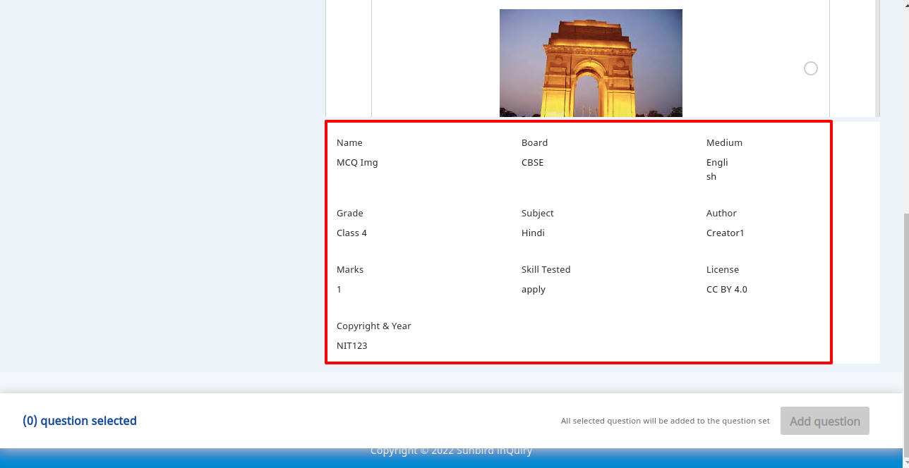
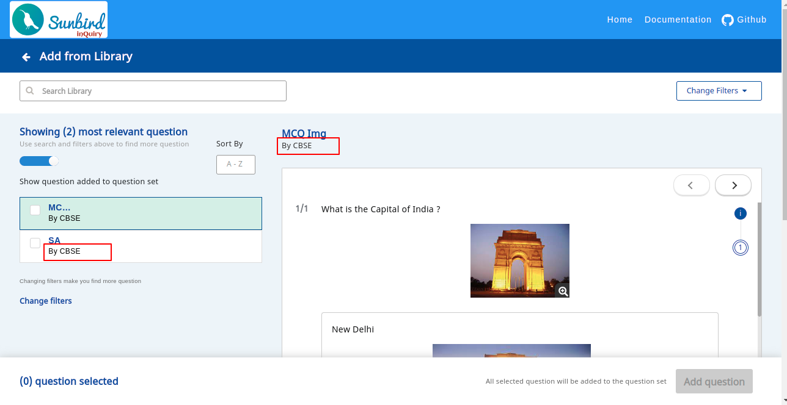

## Introduction:
This document helps to understand various BMGS hard-codings present in the Question Set Editor and how it can be removed.


## Background:
As part of BMGS hard-coding removal changes in Question Set Editor, the editor should be able to configure and work with any framework (agriculture framework or  k-12 framework).


## Problem Statement:

1. The QuestionSet Editor does have major hard coding specific to BMGS, only a few code related changes to be made to make it further configurable [[\[Design] BMGS hardcoding in Questionset Editor|[Design]-BMGS-hardcoding-in-Questionset-Editor]]


1. But in “Add From Library” feature of editor, the editor is using an npm package known as  **resource-library**  have some hard codings in the UI which is to made configurable.


## Key design problems(In Resource Library):

### Background:
Resource Library enables the feature of Question Bank where creator can select a question from the list of questions and add it to the Question set.


### Problem Statement 1:
The Question in Question bank shows BMGS and various other fields  which it’s not configurable, how to make it configurable? 

 **Solution 1** we can use the form config which is being used while question creation.

.png)If the question creation form is having  **Title, Learning level, Board, Medium, Grade, Subject** and **Marks** fields. 

The same field code and label can be used to display  the various metadatas in the questions of the question bank.

Pros:
* No Additional form config is to be the added.


* If each channel have different form for question creation, the meta data displayed in the question bank will be consistent with the form configuration of that channel.


Cons
* The Question may have some additional metadata but it will not be shown in the UI of Question Bank.


 **Solution 2 (Not Recommended)** We can define a new form config in which these fields can be set as config. 

Pros:
* For each channel we can define different form config to display the metadata and show some additional information which might not be present in create question form.


Cons
* It will add additional form config to the editor just to display metadata


### Problem Statement 2:
Board value is getting displayed to the questions in the question bank, how to make it generic?

 **Solution:** 

We can make this field configurable by passing a config to resource-library


```
editorConfig = {
  config: {
  ...
  ...
  libraryConfig: {
    createdByField: 'board' // board, hospital, school, etc..
    }
  }
}
```
Using this libraryConfig we can display whichever value we want to show in above page.


*****

[[category.storage-team]] 
[[category.confluence]] 
