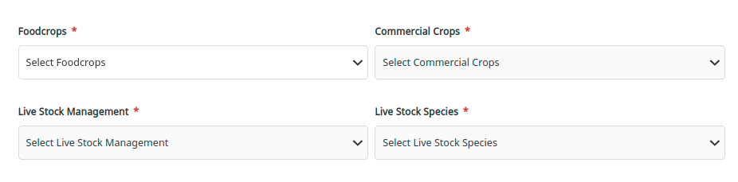
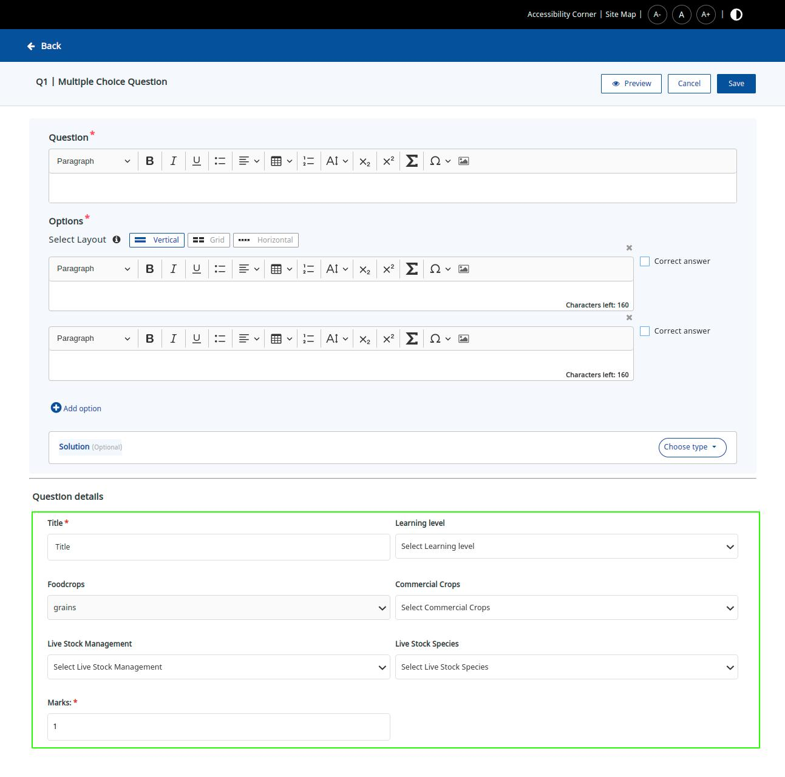
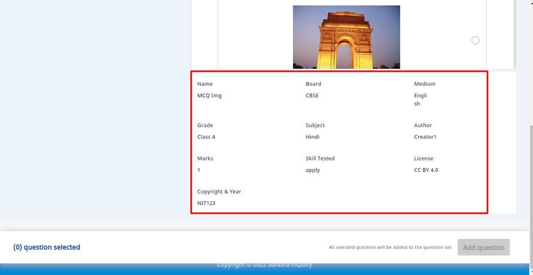
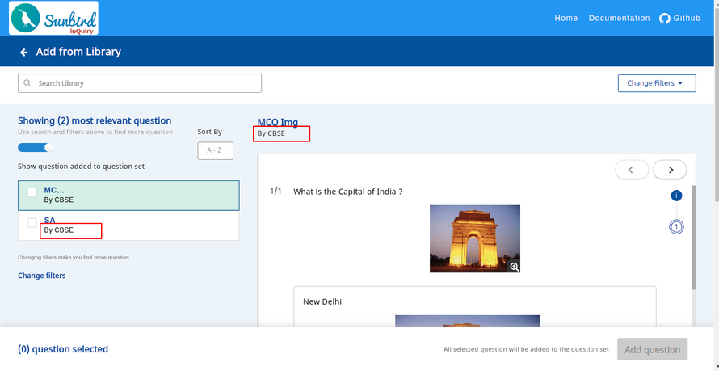

## Background:
Currently, the Question Set Form includes four types of framework categories:  **board, medium, grade, and subject** , which are associated with questions and question sets. If any adopter wishes to incorporate non-educational framework categories like  **"food crops," "commercial crops," "livestock species," or "livestock management"**  into questions and question sets, we need to analyse whether this is feasible. If not, we should identify the challenges and gaps involved in implementing such changes.


# Question Set Create & Update

### How do we configure various fields in Question Set Form?
In object-category-definition we have various forms configurations, by modifying the form configuration we can configure various fields. 

Form Configs for above fields:

Modify the objectCategoryDefinition.forms.create.properties → fields of "Framework details"

Form configs for foodcrops, commercialcrops, livestockspecies, livestockmanagement fields
```
{
    "code": "foodcrops",
    "name": "Foodcrops",
    "label": "Foodcrops",
    "placeholder": "Select Foodcrops",
    "description": "Foodcrops of the Question Set",
    "default": "",
    "dataType": "text",
    "inputType": "select",
    "editable": true,
    "required": true,
    "visible": true,
    "depends": [],
    "renderingHints": {
        "class": "sb-g-col-lg-1 required"
    },
    "validations": [
        {
            "type": "required",
            "message": "Foodcrops is required"
        }
    ]
},
{
    "code": "commercialcrops",
    "name": "Commercial Crops",
    "label": "Commercial Crops",
    "placeholder": "Select Commercial Crops",
    "description": "Commercial Crops for the Question Set",
    "default": "",
    "dataType": "list",
    "inputType": "select",
    "editable": true,
    "required": true,
    "visible": true,
    "depends": [
        "foodcrops"
    ],
    "renderingHints": {
        "class": "sb-g-col-lg-1 required"
    },
    "validations": [
        {
            "type": "required",
            "message": "Commercial Crops is required"
        }
    ]
},
{
    "code": "livestockmanagement",
    "name": "Live Stock Management",
    "label": "Live Stock Management",
    "placeholder": "Select Live Stock Management",
    "description": "Live Stock Management of the Question Set",
    "default": "",
    "dataType": "list",
    "inputType": "select",
    "editable": true,
    "required": true,
    "visible": true,
    "depends": [
        "foodcrops",
        "commercialcrops"
    ],
    "renderingHints": {
        "class": "sb-g-col-lg-1 required"
    },
    "validations": [
        {
            "type": "required",
            "message": "Live Stock Management is required"
        }
    ]
},
{
    "code": "livestockspecies",
    "name": "Live Stock Species",
    "label": "Live Stock Species",
    "placeholder": "Select Live Stock Species",
    "description": "Live Stock Species of the Question Set",
    "default": "",
    "dataType": "list",
    "inputType": "select",
    "editable": true,
    "required": true,
    "visible": true,
    "depends": [
        "foodcrops",
        "commercialcrops",
        "livestockmanagement"
    ],
    "renderingHints": {
        "class": "sb-g-col-lg-1 required"
    },
    "validations": [
        {
            "type": "required",
            "message": "Live Stock Species is required"
        }
    ]
}
```
 **Note:-**  For configuring form config for different channel we should have a channel level category definition.


### How the values in fields get populated ?
The values in the field get the value from framework read API call and it get attached to the fields drop downs. It’s also dynamicno code change is required for it.


###  Is that all ?
No, with the above configuration we can load the  **"food crops," "commercial crops," "livestock species," or "livestock management"** fields and its drop down values. But On Creating/Updating the question set metadata question set service will throw error.


```
"Metadata treatment cannot have new property with name foodcrops”,
"Metadata hospital cannot have new property with name commercialcrops”,
"Metadata department cannot have new property with name livestockspecies”,
"Metadata doctor cannot have new property with name livestockmanagement"
```

### How to allow these fields to be saved as part of Question Set and define it’s config and schema.
Question and Question Set have default config and schema for one instance of sunbirdEd. 

Ex - [question-config](https://github.com/Sunbird-inQuiry/inquiry-api-service/blob/master/schemas/question/1.0/config.json) and [question-schema](https://github.com/Sunbird-inQuiry/inquiry-api-service/blob/master/schemas/question/1.0/schema.json)

But if in a single instance of sunbird-Ed we want one of the channel to be used for educational framework and another channel for agriculture framework then a primary-category-definition is to be defined for that  specific channel.

Configuration to define the config and schema to allow the  **"food crops," "commercial crops," "livestock species," or "livestock management"** fields in question set for specific channel


```diff
{
    "request": {
        "objectCategoryDefinition": {
            "objectMetadata": {
                "config": {
                    "sourcingSettings": {
                    ...
                    },
+                    "frameworkCategories": [
+                        "foodcrops",
+                        "commercialcrops",
+                        "livestockspecies",
+                        "livestockmanagement"
+                    ],
+                    "orgFrameworkTerms": [],
+                    "targetFrameworkTerms": []
                },
                "schema": {
                    "properties": {
+                        "foodcrops": {
+                            "type": "string"
+                        },
+                        "commercialcrops": {
+                            "type": "array"
+                        },
+                        "livestockmanagement": {
+                            "type": "array"
+                        },
+                        "livestockspecies": {
+                            "type": "array"
+                        }
                    }
                }
            },
            "forms": {
            ...
            }
        }
    }
}
```
After the above steps we will have to restart the assessment service.

(Everytime a new schema or config is done to allow new type of fields in question there will be dependency on devops to restart the service.)


## Question Create and Update

### To Configure fields for Question
Configuration to define the config and schema to allow the  **"food crops," "commercial crops," "livestock species," or "livestock management"** fields in question for specific channel.

Step1 - Create channel level Question category definition

Setp2- Update the form configuration for the question which is defined in the question set category definition at objectCategoryDefinition.forms.childMetadata

Complete questionset category defintion sample:
```json
{
    "request": {
        "objectCategoryDefinition": {
            "objectMetadata": {
                "config": {
                    "sourcingSettings": {
                        "collection": {
                            "maxDepth": 1,
                            "addFromLibraryEnabled": true,
                            "enableAddFromLibrary": true,
                            "objectType": "QuestionSet",
                            "primaryCategory": "Practice Question Set",
                            "isRoot": true,
                            "iconClass": "fa fa-book",
                            "children": {},
                            "questionSet": {
                                "maxQuestionsLimit": 10
                            },
                            "hierarchy": {
                                "level1": {
                                    "name": "Section",
                                    "type": "Unit",
                                    "mimeType": "application/vnd.sunbird.questionset",
                                    "primaryCategory": "Practice Question Set",
                                    "iconClass": "fa fa-folder-o",
                                    "children": {
                                        "Question": [
                                            "Multiple Choice Question",
                                            "Subjective Question"
                                        ]
                                    }
                                }
                            }
                        }
                    },
                    "frameworkCategories": [
                        "foodcrops",
                        "commercialcrops",
                        "livestockspecies",
                        "livestockmanagement"
                    ],
                    "orgFrameworkTerms": [
                        "foodcropsIds",
                        "commercialcropsIds",
                        "livestockmanagementIds",
                        "livestockspeciesIds"
                    ],
                    "targetFrameworkTerms": []
                },
                "schema": {
                    "properties": {
                        "mimeType": {
                            "type": "string",
                            "enum": [
                                "application/vnd.sunbird.questionset"
                            ]
                        },
                        "shuffleScore": {
                            "type": "integer"
                        },
                        "foodcrops": {
                            "type": "string"
                        },
                        "commercialcrops": {
                            "type": "array"
                        },
                        "livestockmanagement": {
                            "type": "array"
                        },
                        "livestockspecies": {
                            "type": "array"
                        }
                    }
                }
            },
            "forms": {
                "childMetadata": {
                    "templateName": "",
                    "required": [],
                    "properties": [
                        {
                            "code": "name",
                            "dataType": "text",
                            "description": "Name of the content",
                            "editable": true,
                            "inputType": "text",
                            "label": "Title",
                            "name": "Title",
                            "placeholder": "Title",
                            "renderingHints": {
                                "class": "sb-g-col-lg-1 required"
                            },
                            "required": true,
                            "visible": true,
                            "validations": [
                                {
                                    "type": "max",
                                    "value": "100",
                                    "message": "Input is Exceeded"
                                },
                                {
                                    "type": "required",
                                    "message": "Title is required"
                                }
                            ]
                        },
                        {
                            "code": "bloomsLevel",
                            "dataType": "text",
                            "description": "Learning level",
                            "editable": true,
                            "inputType": "select",
                            "label": "Learning level",
                            "name": "Learning level",
                            "placeholder": "Select Learning level",
                            "renderingHints": {
                                "class": "sb-g-col-lg-1"
                            },
                            "required": false,
                            "visible": true,
                            "range": [
                                "remember",
                                "understand",
                                "apply",
                                "analyse",
                                "evaluate",
                                "create"
                            ],
                            "validations": []
                        },
                        {
                            "code": "foodcrops",
                            "default": "",
                            "visible": true,
                            "editable": false,
                            "dataType": "text",
                            "renderingHints": {
                                "class": "sb-g-col-lg-1"
                            },
                            "description": "Foodcrops",
                            "label": "Foodcrops",
                            "required": false,
                            "name": "Foodcrops",
                            "inputType": "select",
                            "placeholder": "Select Foodcrops"
                        },
                        {
                            "code": "commercialcrops",
                            "visible": true,
                            "editable": true,
                            "default": "",
                            "dataType": "list",
                            "renderingHints": {
                                "class": "sb-g-col-lg-1"
                            },
                            "description": "",
                            "label": "Commercial Crops",
                            "required": false,
                            "name": "Commercial Crops",
                            "inputType": "select",
                            "placeholder": "Select Commercial Crops"
                        },
                        {
                            "code": "livestockmanagement",
                            "visible": true,
                            "editable": true,
                            "default": "",
                            "dataType": "list",
                            "renderingHints": {
                                "class": "sb-g-col-lg-1"
                            },
                            "description": "Live Stock Management",
                            "label": "Live Stock Management",
                            "required": false,
                            "name": "Live Stock Management",
                            "inputType": "select",
                            "placeholder": "Select Live Stock Management"
                        },
                        {
                            "code": "livestockspecies",
                            "visible": true,
                            "editable": true,
                            "default": "",
                            "dataType": "list",
                            "renderingHints": {
                                "class": "sb-g-col-lg-1"
                            },
                            "description": "",
                            "label": "Live Stock Species",
                            "required": false,
                            "name": "Live Stock Species",
                            "inputType": "select",
                            "placeholder": "Select Live Stock Species"
                        },
                        {
                            "code": "maxScore",
                            "dataType": "number",
                            "description": "Marks",
                            "editable": true,
                            "inputType": "text",
                            "label": "Marks:",
                            "name": "Marks",
                            "placeholder": "Marks",
                            "tooltip": "Provide marks of this question.",
                            "renderingHints": {
                                "class": "sb-g-col-lg-1 required"
                            },
                            "validations": [
                                {
                                    "type": "pattern",
                                    "value": "^[1-9]{1}[0-9]*$",
                                    "message": "Input should be numeric"
                                },
                                {
                                    "type": "required",
                                    "message": "Marks is required"
                                }
                            ]
                        }
                    ]
                },
                "create": {
                    "templateName": "",
                    "required": [],
                    "properties": [
                        {
                            "name": "Basic details",
                            "fields": [
                                {
                                    "code": "appIcon",
                                    "name": "Icon",
                                    "label": "Icon",
                                    "placeholder": "Icon",
                                    "description": "Icon for the question set",
                                    "dataType": "text",
                                    "inputType": "appIcon",
                                    "editable": true,
                                    "required": true,
                                    "visible": true,
                                    "renderingHints": {
                                        "class": "sb-g-col-lg-1 required"
                                    }
                                },
                                {
                                    "code": "name",
                                    "name": "Name",
                                    "label": "Name",
                                    "placeholder": "Name",
                                    "description": "Name of the QuestionSet",
                                    "dataType": "text",
                                    "inputType": "text",
                                    "editable": true,
                                    "required": true,
                                    "visible": true,
                                    "renderingHints": {
                                        "class": "sb-g-col-lg-1 required"
                                    },
                                    "validations": [
                                        {
                                            "type": "max",
                                            "value": "120",
                                            "message": "Input is Exceeded"
                                        },
                                        {
                                            "type": "required",
                                            "message": "Name is required"
                                        }
                                    ]
                                },
                                {
                                    "code": "description",
                                    "name": "Description",
                                    "label": "Description",
                                    "placeholder": "Description",
                                    "description": "Description of the content",
                                    "dataType": "text",
                                    "inputType": "textarea",
                                    "editable": true,
                                    "required": true,
                                    "visible": true,
                                    "renderingHints": {
                                        "class": "sb-g-col-lg-1 required"
                                    },
                                    "validations": [
                                        {
                                            "type": "required",
                                            "message": "description is required"
                                        }
                                    ]
                                },
                                {
                                    "code": "keywords",
                                    "name": "Keywords",
                                    "label": "keywords",
                                    "placeholder": "Enter Keywords",
                                    "description": "Keywords for the Question Set",
                                    "dataType": "list",
                                    "inputType": "keywords",
                                    "editable": true,
                                    "required": false,
                                    "visible": true,
                                    "renderingHints": {
                                        "class": "sb-g-col-lg-1"
                                    }
                                },
                                {
                                    "code": "instructions",
                                    "name": "Instructions",
                                    "label": "Instructions",
                                    "placeholder": "Enter Instructions",
                                    "description": "Instructions for the question set",
                                    "dataType": "text",
                                    "inputType": "richtext",
                                    "editable": true,
                                    "required": false,
                                    "visible": true,
                                    "renderingHints": {
                                        "class": "sb-g-col-lg-2"
                                    },
                                    "validations": [
                                        {
                                            "type": "maxLength",
                                            "value": "500",
                                            "message": "Input is Exceeded"
                                        }
                                    ]
                                },
                                {
                                    "code": "primaryCategory",
                                    "name": "Type",
                                    "label": "Type",
                                    "placeholder": "",
                                    "description": "Type or Category of the Question Set",
                                    "dataType": "text",
                                    "inputType": "text",
                                    "editable": false,
                                    "required": false,
                                    "visible": true,
                                    "renderingHints": {
                                        "class": "sb-g-col-lg-1"
                                    }
                                },
                                {
                                    "code": "additionalCategories",
                                    "name": "Additional Category",
                                    "label": "Additional Category",
                                    "placeholder": "Select Additional Category",
                                    "description": "Additonal Category of the Question Set",
                                    "default": "",
                                    "dataType": "list",
                                    "inputType": "nestedselect",
                                    "editable": true,
                                    "required": false,
                                    "visible": true,
                                    "renderingHints": {
                                        "class": "sb-g-col-lg-1"
                                    }
                                }
                            ]
                        },
                        {
                            "name": "Framework details",
                            "fields": [
                                {
                                    "code": "foodcrops",
                                    "name": "Foodcrops",
                                    "label": "Foodcrops",
                                    "placeholder": "Select Foodcrops",
                                    "description": "Foodcrops of the Question Set",
                                    "default": "",
                                    "dataType": "text",
                                    "inputType": "select",
                                    "editable": true,
                                    "required": true,
                                    "visible": true,
                                    "depends": [],
                                    "renderingHints": {
                                        "class": "sb-g-col-lg-1 required"
                                    },
                                    "validations": [
                                        {
                                            "type": "required",
                                            "message": "Foodcrops is required"
                                        }
                                    ]
                                },
                                {
                                    "code": "commercialcrops",
                                    "name": "Commercial Crops",
                                    "label": "Commercial Crops",
                                    "placeholder": "Select Commercial Crops",
                                    "description": "Commercial Crops for the Question Set",
                                    "default": "",
                                    "dataType": "list",
                                    "inputType": "select",
                                    "editable": true,
                                    "required": true,
                                    "visible": true,
                                    "depends": [
                                        "foodcrops"
                                    ],
                                    "renderingHints": {
                                        "class": "sb-g-col-lg-1 required"
                                    },
                                    "validations": [
                                        {
                                            "type": "required",
                                            "message": "Commercial Crops is required"
                                        }
                                    ]
                                },
                                {
                                    "code": "livestockmanagement",
                                    "name": "Live Stock Management",
                                    "label": "Live Stock Management",
                                    "placeholder": "Select Live Stock Management",
                                    "description": "Live Stock Management of the Question Set",
                                    "default": "",
                                    "dataType": "list",
                                    "inputType": "select",
                                    "editable": true,
                                    "required": true,
                                    "visible": true,
                                    "depends": [
                                        "foodcrops",
                                        "commercialcrops"
                                    ],
                                    "renderingHints": {
                                        "class": "sb-g-col-lg-1 required"
                                    },
                                    "validations": [
                                        {
                                            "type": "required",
                                            "message": "Live Stock Management is required"
                                        }
                                    ]
                                },
                                {
                                    "code": "livestockspecies",
                                    "name": "Live Stock Species",
                                    "label": "Live Stock Species",
                                    "placeholder": "Select Live Stock Species",
                                    "description": "Live Stock Species of the Question Set",
                                    "default": "",
                                    "dataType": "list",
                                    "inputType": "select",
                                    "editable": true,
                                    "required": true,
                                    "visible": true,
                                    "depends": [
                                        "foodcrops",
                                        "commercialcrops",
                                        "livestockmanagement"
                                    ],
                                    "renderingHints": {
                                        "class": "sb-g-col-lg-1 required"
                                    },
                                    "validations": [
                                        {
                                            "type": "required",
                                            "message": "Live Stock Species is required"
                                        }
                                    ]
                                },
                                {
                                    "code": "audience",
                                    "name": "Audience",
                                    "label": "Audience",
                                    "placeholder": "Select Audience",
                                    "description": "Audience of the Question Set",
                                    "dataType": "list",
                                    "inputType": "select",
                                    "editable": true,
                                    "required": true,
                                    "visible": true,
                                    "range": [
                                        "Student",
                                        "Teacher",
                                        "Administrator"
                                    ],
                                    "renderingHints": {
                                        "class": "sb-g-col-lg-1 required"
                                    },
                                    "validations": [
                                        {
                                            "type": "required",
                                            "message": "Audience is required"
                                        }
                                    ]
                                }
                            ]
                        },
                        {
                            "name": "Question set behaviour",
                            "fields": [
                                {
                                    "code": "maxTime",
                                    "name": "MaxTimer",
                                    "label": "Set Maximum Time",
                                    "placeholder": "HH:mm:ss",
                                    "description": "This is the maximum time allowed for the users to complete the assessment",
                                    "default": "3600",
                                    "dataType": "text",
                                    "inputType": "timer",
                                    "editable": true,
                                    "required": true,
                                    "visible": true,
                                    "renderingHints": {
                                        "class": "sb-g-col-lg-1"
                                    },
                                    "validations": [
                                        {
                                            "type": "time",
                                            "message": "Please enter in hh:mm:ss",
                                            "value": "HH:mm:ss"
                                        },
                                        {
                                            "type": "max",
                                            "value": "05:59:59",
                                            "message": "max time should be less than 05:59:59"
                                        }
                                    ]
                                },
                                {
                                    "code": "warningTime",
                                    "name": "Warning Time",
                                    "label": "Set Warning Timer",
                                    "placeholder": "hh:mm:ss",
                                    "description": "Timer to warn users about the time left to complete the assessment",
                                    "dataType": "list",
                                    "inputType": "timer",
                                    "editable": true,
                                    "required": false,
                                    "visible": true,
                                    "depends": [
                                        "maxTime"
                                    ],
                                    "renderingHints": {
                                        "class": "sb-g-col-lg-1",
                                        "required": true
                                    },
                                    "validations": [
                                        {
                                            "type": "time",
                                            "message": "Please enter hh:mm:ss",
                                            "value": "HH:mm:ss"
                                        },
                                        {
                                            "type": "compare",
                                            "criteria": {
                                                "<=": [
                                                    "maxTime"
                                                ]
                                            },
                                            "message": "warning time should be less than max timer"
                                        }
                                    ]
                                },
                                {
                                    "code": "showTimer",
                                    "name": "Show Timer",
                                    "label": "Show Timer",
                                    "placeholder": "Show Timer",
                                    "description": "Show Timer",
                                    "default": "No",
                                    "dataType": "text",
                                    "inputType": "select",
                                    "range": [
                                        "Yes",
                                        "No"
                                    ],
                                    "editable": true,
                                    "required": true,
                                    "visible": true,
                                    "depends": [
                                        "maxTime"
                                    ],
                                    "renderingHints": {
                                        "class": "sb-g-col-lg-1"
                                    }
                                },
                                {
                                    "code": "requiresSubmit",
                                    "name": "Submit Confirmation",
                                    "label": "Submit Confirmation Page",
                                    "placeholder": "Select Submit Confirmation",
                                    "description": "Allows users to review and submit the assessment",
                                    "dataType": "text",
                                    "inputType": "select",
                                    "output": "identifier",
                                    "range": [
                                        {
                                            "identifier": "Yes",
                                            "label": "Enable"
                                        },
                                        {
                                            "identifier": "No",
                                            "label": "Disable"
                                        }
                                    ],
                                    "editable": true,
                                    "required": false,
                                    "visible": true,
                                    "renderingHints": {
                                        "class": "sb-g-col-lg-1"
                                    }
                                },
                                {
                                    "code": "maxAttempts",
                                    "name": "Max Attempts",
                                    "label": "Max Attempts",
                                    "placeholder": "Max Attempts",
                                    "description": "Max Attempts",
                                    "dataType": "number",
                                    "inputType": "select",
                                    "editable": true,
                                    "required": false,
                                    "visible": true,
                                    "range": [
                                        1,
                                        2,
                                        3,
                                        4,
                                        5,
                                        6,
                                        7,
                                        8,
                                        9,
                                        10,
                                        11,
                                        12,
                                        13,
                                        14,
                                        15,
                                        16,
                                        17,
                                        18,
                                        19,
                                        20,
                                        21,
                                        22,
                                        23,
                                        24,
                                        25
                                    ],
                                    "renderingHints": {
                                        "class": "sb-g-col-lg-1"
                                    }
                                },
                                {
                                    "code": "summaryType",
                                    "name": "summaryType",
                                    "label": "Summary Type",
                                    "placeholder": "Select Summary Type",
                                    "description": "summaryType",
                                    "dataType": "text",
                                    "inputType": "select",
                                    "editable": true,
                                    "required": false,
                                    "visible": true,
                                    "range": [
                                        "Complete",
                                        "Score",
                                        "Duration",
                                        "Score & Duration"
                                    ],
                                    "renderingHints": {
                                        "class": "sb-g-col-lg-1"
                                    }
                                }
                            ]
                        },
                        {
                            "name": "Question set behaviour",
                            "fields": [
                                {
                                    "code": "author",
                                    "name": "Author",
                                    "label": "Author",
                                    "placeholder": "Author",
                                    "description": "Author of the question set",
                                    "dataType": "text",
                                    "inputType": "text",
                                    "editable": true,
                                    "required": true,
                                    "visible": true,
                                    "renderingHints": {
                                        "class": "sb-g-col-lg-1 required"
                                    },
                                    "validations": [
                                        {
                                            "type": "required",
                                            "message": "Author is required"
                                        }
                                    ]
                                },
                                {
                                    "code": "attributions",
                                    "name": "Attributions",
                                    "label": "Attributions",
                                    "placeholder": "Enter Attributions",
                                    "description": "Attributions of the question set",
                                    "dataType": "text",
                                    "inputType": "text",
                                    "editable": true,
                                    "required": false,
                                    "visible": true,
                                    "renderingHints": {
                                        "class": "sb-g-col-lg-1"
                                    }
                                },
                                {
                                    "code": "copyright",
                                    "name": "Copyright & year",
                                    "label": "Copyright & year",
                                    "placeholder": "Copyright & year",
                                    "description": "Copyright & year",
                                    "dataType": "text",
                                    "inputType": "text",
                                    "editable": true,
                                    "required": false,
                                    "visible": true,
                                    "renderingHints": {
                                        "class": "sb-g-col-lg-1"
                                    }
                                },
                                {
                                    "code": "license",
                                    "name": "license",
                                    "label": "license",
                                    "placeholder": "Select license",
                                    "description": "license",
                                    "dataType": "text",
                                    "inputType": "select",
                                    "editable": true,
                                    "required": false,
                                    "visible": true,
                                    "range": "",
                                    "renderingHints": {
                                        "class": "sb-g-col-lg-1"
                                    }
                                }
                            ]
                        }
                    ]
                },
                "delete": {},
                "publish": {},
                "publishchecklist": {
                    "templateName": "",
                    "required": [],
                    "properties": []
                },
                "requestforchangeschecklist": {},
                "review": {},
                "search": {
                    "templateName": "",
                    "required": [],
                    "properties": [
                        {
                            "code": "primaryCategory",
                            "dataType": "list",
                            "description": "Type",
                            "editable": true,
                            "default": [],
                            "renderingHints": {
                                "class": "sb-g-col-lg-1"
                            },
                            "inputType": "nestedselect",
                            "label": "Question Type(s)",
                            "name": "Type",
                            "placeholder": "Select QuestionType",
                            "required": false,
                            "visible": true
                        },
                        {
                            "code": "foodcrops",
                            "visible": true,
                            "depends": [],
                            "editable": true,
                            "dataType": "list",
                            "description": "Food crops",
                            "label": "Food crops",
                            "required": false,
                            "name": "Food crops",
                            "inputType": "select",
                            "placeholder": "Select Food crops",
                            "output": "name",
                            "renderingHints": {
                                "class": "sb-g-col-lg-1"
                            }
                        },
                        {
                            "code": "commercialcrops",
                            "visible": true,
                            "editable": true,
                            "dataType": "list",
                            "description": "",
                            "label": "Commercial Crops(s)",
                            "required": false,
                            "name": "Commercial Crops",
                            "inputType": "nestedselect",
                            "placeholder": "Select Commercial Crops",
                            "output": "name",
                            "depends": [
                                "foodcrops"
                            ],
                            "renderingHints": {
                                "class": "sb-g-col-lg-1"
                            }
                        },
                        {
                            "code": "livestockmanagement",
                            "visible": true,
                            "depends": [
                                "foodcrops",
                                "commercialcrops"
                            ],
                            "editable": true,
                            "default": "",
                            "dataType": "list",
                            "renderingHints": {
                                "class": "sb-g-col-lg-1"
                            },
                            "description": "Live Stock Management",
                            "label": "Live Stock Management(es)",
                            "required": false,
                            "name": "Live Stock Management",
                            "inputType": "nestedselect",
                            "placeholder": "Select Live Stock Management",
                            "output": "name"
                        },
                        {
                            "code": "livestockspecies",
                            "visible": true,
                            "depends": [
                                "foodcrops",
                                "commercialcrops",
                                "livestockmanagement"
                            ],
                            "editable": true,
                            "default": "",
                            "dataType": "list",
                            "renderingHints": {
                                "class": "sb-g-col-lg-1"
                            },
                            "description": "",
                            "label": "Live Stock Species(s)",
                            "required": false,
                            "name": "Live Stock Species",
                            "inputType": "nestedselect",
                            "placeholder": "Select Live Stock Species",
                            "output": "name"
                        }
                    ]
                },
                "searchConfig": {},
                "unitMetadata": {
                    "templateName": "",
                    "required": [],
                    "properties": [
                        {
                            "code": "name",
                            "dataType": "text",
                            "description": "Name of the content",
                            "editable": true,
                            "inputType": "text",
                            "label": "Title",
                            "name": "Title",
                            "placeholder": "Title",
                            "renderingHints": {
                                "class": "sb-g-col-lg-1 required"
                            },
                            "required": true,
                            "visible": true,
                            "validations": [
                                {
                                    "type": "max",
                                    "value": "120",
                                    "message": "Input is Exceeded"
                                },
                                {
                                    "type": "required",
                                    "message": "Title is required"
                                }
                            ]
                        },
                        {
                            "code": "description",
                            "dataType": "text",
                            "description": "Description of the content",
                            "editable": true,
                            "inputType": "textarea",
                            "label": "Description",
                            "name": "Description",
                            "placeholder": "Description",
                            "renderingHints": {
                                "class": "sb-g-col-lg-1 required"
                            },
                            "required": true,
                            "visible": true,
                            "validations": [
                                {
                                    "type": "max",
                                    "value": "500",
                                    "message": "Input is Exceeded"
                                }
                            ]
                        },
                        {
                            "code": "instructions",
                            "name": "Instructions",
                            "label": "Instructions",
                            "placeholder": "Enter Instructions",
                            "description": "Instructions for the section",
                            "dataType": "text",
                            "inputType": "richtext",
                            "editable": true,
                            "required": false,
                            "visible": true,
                            "renderingHints": {
                                "class": "sb-g-col-lg-2 required"
                            },
                            "validations": [
                                {
                                    "type": "maxLength",
                                    "value": "500",
                                    "message": "Input is Exceeded"
                                }
                            ]
                        },
                        {
                            "code": "maxQuestions",
                            "name": "Show Questions",
                            "label": "Count of questions to be displayed in this section",
                            "placeholder": "Input count of questions to be displayed",
                            "description": "By default all questions are shown unless specific count is entered.",
                            "default": "",
                            "dataType": "number",
                            "inputType": "select",
                            "editable": true,
                            "required": false,
                            "visible": true,
                            "renderingHints": {
                                "class": "sb-g-col-lg-1"
                            }
                        },
                        {
                            "code": "shuffle",
                            "name": "Shuffle Questions",
                            "label": "Shuffle Questions",
                            "placeholder": "Shuffle Questions",
                            "description": "If shuffle questions is selected, users are presented with questions in a random order whenever they attempt the assessment",
                            "default": "false",
                            "dataType": "boolean",
                            "inputType": "checkbox",
                            "editable": true,
                            "required": false,
                            "visible": true,
                            "renderingHints": {
                                "class": "sb-g-col-lg-1"
                            }
                        },
                        {
                            "code": "showFeedback",
                            "name": "Show Feedback",
                            "label": "Show Question Feedback",
                            "placeholder": "Select Option",
                            "description": "If feedback is selected, users are informed whether they have correctly answered question or not",
                            "dataType": "text",
                            "inputType": "select",
                            "range": [
                                "Yes",
                                "No"
                            ],
                            "editable": true,
                            "required": false,
                            "visible": true,
                            "renderingHints": {
                                "class": "sb-g-col-lg-1"
                            }
                        },
                        {
                            "code": "showSolutions",
                            "name": "Show Solution",
                            "label": "Show Solution",
                            "placeholder": "Select Option",
                            "description": "If show solution is selected then solutions for each question will be shown to the user",
                            "dataType": "text",
                            "inputType": "select",
                            "range": [
                                "Yes",
                                "No"
                            ],
                            "editable": true,
                            "required": false,
                            "visible": true,
                            "renderingHints": {
                                "class": "sb-g-col-lg-1"
                            }
                        }
                    ]
                },
                "update": {}
            }
        }
    }
}
```
Here is the payload to create channel level MCQ question category definition

MCQ question category definition
```
{
    "request": {
        "objectCategoryDefinition": {
            "categoryId": "obj-cat:multiple-choice-question",
            "targetObjectType": "Question",
            "channel": "0138934136407244800",
            "objectMetadata": {
                "config": {
                    "frameworkCategories": [
                        "foodcrops",
                        "commercialcrops",
                        "livestockspecies",
                        "livestockmanagement"
                    ],
                    "orgFrameworkTerms": [
                        "foodcropsIds",
                        "commercialcropsIds",
                        "livestockmanagementIds",
                        "livestockspeciesIds"
                    ]
                },
                "schema": {
                    "properties": {
                        "interactionTypes": {
                            "type": "array",
                            "items": {
                                "type": "string",
                                "enum": [
                                    "choice"
                                ]
                            }
                        },
                        "mimeType": {
                            "type": "string",
                            "enum": [
                                "application/vnd.sunbird.question"
                            ]
                        },
                        "foodcrops": {
                            "type": "string"
                        },
                        "commercialcrops": {
                            "type": "array"
                        },
                        "livestockmanagement": {
                            "type": "array"
                        },
                        "livestockspecies": {
                            "type": "array"
                        }
                    }
                }
            },
            "forms": {},
            "name": "Multiple Choice Question"
        }
    }
}
```
After the above steps we will have to restart the assessment service.

(Everytime a new schema or config is done to allow new type of fields in question there will be dependency on devops to restart the service.)

Bug in Editor
* Currently  editor is not reading question category definition with channel id, it is requesting only for the master question category definition.  MinorCode change is required


SolutionCurrently Payload to read the Question category definition is


```
{
    "objectCategoryDefinition": {
        "objectType": "Question",
        "name": "Multiple Choice Question"
    }
}
```
It should be modified to:


```diff
{
    "objectCategoryDefinition": {
        "objectType": "Question",
        "name": "Multiple Choice Question"
+       "channel": "0138934136407244800" // Channel Id
    }
}
```


Question category hard-coding in QuML PlayerIn QuML **player:** 


* If we want to rename Multiple Choice Question primary category to Multi Choice Question it will not work for player.


* Multiple Choice Question and subjective Question are both primary categories that are hard-coded at the component level. (To loads the question component  based on the primary category)


SolutionInstead of using primary category name we can use qType which get saved to question metadata as qType: "MCQ"  for Multiple Choice Question and qType: "SA" for subjective question. (Code Change is required)

BMGS Hard-coding in Resource LibraryIn UI BMGS is hardcoded which is to be removed.



Removal of these resource library hard coding is mentioned in [[Hard coding removal wiki|BMGS-hard-coding-Removal]]


## Question Set category Related Hard coding in Workspace
Current in sunbirdEd workspace we can enable Practise Question Set where practise-question-set is an object category. 

Instead of Practise Question Set if we want to enable different category in workspace say Agri Quiz currently not possible as Practise Question Set is hard coded at the component level.


*****

[[category.storage-team]] 
[[category.confluence]] 
