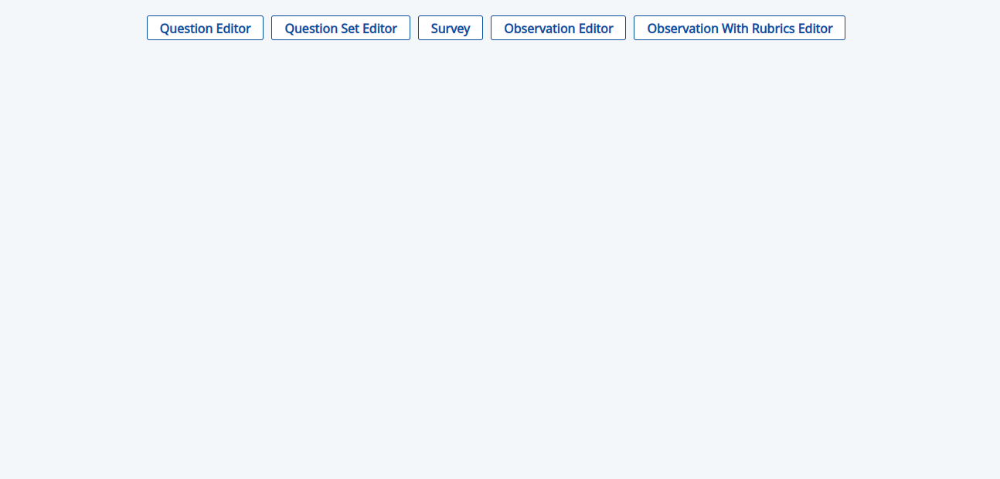
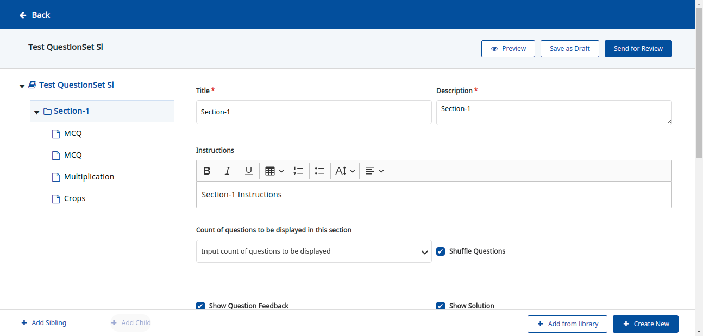

Fork repo - [https://github.com/Sunbird-inQuiry/editor](https://github.com/Sunbird-inQuiry/editor)


```
git clone git@github.com:rajnishdargan/editor.git
cd editor
git remote add upstream git@github.com:Sunbird-inQuiry/editor.git
git remote -v
git fetch upstream
git checkout -b release-8.0.0 upstream/release-8.0.0
git fetch upstream
git merge upstream/release-8.0.0
```
You got the latest code of release-8.0.0 by following above steps

Check node version


```
node -v
```
Use node 18.19.1 or latest of 18

Install dependencies


```
npm i // root folder
```


Open three terminals

Terminal1 (Build the library)


```
ng build questionset-editor-library --watch=true
```
Terminal2 (Run Demo app) - Once the terminal 1 execution complete then run the terminal2


```
npm run start
```
Terminal3


```
node server.js
```
or


```
nodemon server.js
```


Set the Base URL and API Key in .env file

If .env file is not present create a .env file and add the API key and Base Url as


```
BASE_URL="dev.sunbirded.org"
AUTH_API_TOKEN="--Replace with Actual API Key--"
USER_API_TOKEN=""; // not needed
```
Change the questionset identifier in data.ts file to launch diffrent questionset.

[https://github.com/Sunbird-inQuiry/editor/blob/release-8.0.0/src/app/data.ts#L12](https://github.com/Sunbird-inQuiry/editor/blob/release-8.0.0/src/app/data.ts#L12)

Go to [http://localhost:4200/](http://localhost:4200/)

It will launch the Demo app

To launch Practise Questionset click on Quetsion Set Editor

 **Note**  - The type of Primary category or the editor get stored in localstorage to Launch the editor as per another Primary category config clear the localstore manually then Click on The flow as per need.

Questionset Editor (inQuiry default flow used in ED)

Question Editor ( Samagra use case VDN - change the config in data.ts file and Base_URL + API_KEY in .env file)

Survey , Observation, Rubrics (Sikhalokam Flow - VDN Dev)

Once you click on Question Set Editor it will launch the editor locally



For any proxy related changes make necessary changes in proxy.config.json and server.js file.


After all the Testing Related to Editor is completed build the web component and change the package version


```
npm run build-web-component
```
Change the version in editor/projects/questionset-editor-library/package.json for angular library.

Change the version in editor/web-component/package.json for web component.


 **Dev Debug Help** 

 Mock API’s by modifying server.js (note this require code changes and you need to be careful while pushing the changes in PR)

Update the server.js file as per the need of proxing the API’s locally

Here is one of the sample that can be used

server.js
```
var express = require('express'),
    http = require('http');
    bodyParser = require('body-parser'),
    proxy = require('express-http-proxy'),
    urlHelper = require('url');
const latexService = require('./latexService.js')
const dotenv = require('dotenv');
dotenv.config();

const fwReadResponse = require('./mock-apis/frameworkRead.js')
const channelResponse = require('./mock-apis/channelRead.js')

const BASE_URL = process.env.BASE_URL || "dev.sunbirded.org";
const API_AUTH_TOKEN = process.env.AUTH_API_TOKEN;
const USER_TOKEN = process.env.USER_API_TOKEN;
const PORTAL_COOKIES= ""

const ASSET = {
    "CREATE": "/action/asset/v1/create",
    "CONTENT_UPLOAD_URL": "/action/content/v3/upload/url/*",
    "ASSET_UPLOAD": "/action/asset/v1/upload/*"
}

var app = express();
app.set('port', 3000);
app.use(express.json())
app.get("/latex/convert", latexService.convert)
app.post("/latex/convert", bodyParser.json({ limit: '1mb' }), latexService.convert);
app.use(express.static(__dirname + '/web-component-examples/vanilla-js'));

const decoratePublicRequestHeaders2 = function () {
    return function (proxyReqOpts, srcReq) {
        proxyReqOpts.headers['authorization'] = `Bearer ${API_AUTH_TOKEN}`;
        proxyReqOpts.headers['x-authenticated-user-token'] = USER_TOKEN;
        return proxyReqOpts;     
    }
};


var publicRequestHeaders = {
    "authorization": `Bearer ${API_AUTH_TOKEN}`,
    "x-channel-id": "0137541424673095687"
};

var contentTypeHeaders = {
    'content-type': "application/json"
}

const customDecorateReqHeaders = function () {
    return function (proxyReqOpts, srcReq) {
        proxyReqOpts.headers = Object.assign({}, proxyReqOpts.headers, publicRequestHeaders);
        return proxyReqOpts;
    }
}

const decoratePublicRequestHeaders = function () {
    return function (proxyReqOpts, srcReq) {
        proxyReqOpts.headers = Object.assign({}, proxyReqOpts.headers, publicRequestHeaders, contentTypeHeaders);
        return proxyReqOpts;
    }
}

app.get('/api/framework/v1/read/*', function (req, res) {
    res.send(fwReadResponse.frameworkRead);
})

app.get('/api/channel/v1/read/*', function (req, res) {
    res.send(channelResponse.channelRead);
})

app.all(['/api/question/v2/list'], proxy(BASE_URL, {
    https: true,
    limit: '30mb',
    proxyReqPathResolver: function (req) {
        let originalUrl = req.originalUrl.replace('/api/', '/learner/')
        console.log('proxyReqPathResolver questionset', originalUrl, require('url').parse(originalUrl).path);
        return require('url').parse(originalUrl).path;
    },
    proxyReqOptDecorator: decoratePublicRequestHeaders()
}));

app.use(['/action/questionset/v2/*',
    '/action/question/v2/*',
    '/action/collection/v1/*',
    '/action/object/category/definition/v1/*',
    '/action/collection/v1/*'
    ], proxy(BASE_URL, {
    https: true,
    limit: '30mb',
    proxyReqPathResolver: function (req) {
        let originalUrl = req.originalUrl.replace('/action/', '/api/')
        console.log('proxyReqPathResolver questionset', originalUrl, require('url').parse(originalUrl).path);
        return require('url').parse(originalUrl).path;
    },
    proxyReqOptDecorator: decoratePublicRequestHeaders()
}));

app.use(['/action/composite/v3/search',
    ], proxy(BASE_URL, {
    https: true,
    limit: '30mb',
    proxyReqPathResolver: function (req) {
        let originalUrl = req.originalUrl.replace('/action/composite/v3/', '/api/composite/v1/')
        console.log('proxyReqPathResolver questionset', originalUrl, require('url').parse(originalUrl).path);
        return require('url').parse(originalUrl).path;
    },
    proxyReqOptDecorator: decoratePublicRequestHeaders()
}));

app.use(['/action/program/v1/*',
    '/action/question/v2/bulkUpload',
    '/action/question/v2/bulkUploadStatus',
    '/action/asset/v1'
    ], proxy(BASE_URL, {
    https: true,
    limit: '30mb',
    proxyReqPathResolver: function (req) {
        let originalUrl = req.originalUrl.replace('/action/', '/api/')
        console.log('proxyReqPathResolver questionset', originalUrl, require('url').parse(originalUrl).path);
        return require('url').parse(originalUrl).path;
    },
    proxyReqOptDecorator: decoratePublicRequestHeaders()
}));

app.use(['/action', '/assets'], proxy(BASE_URL, {
    https: true,
    limit: '30mb',
    proxyReqPathResolver: function(req) {
        console.log('proxyReqPathResolver ',  urlHelper.parse(req.url).path);
        return urlHelper.parse(req.url).path;
    },
    proxyReqOptDecorator: decoratePublicRequestHeaders()
}));

app.use(['/assets/public/*'], proxy(BASE_URL, {
    https: true,
    proxyReqPathResolver: function(req) {
        return require('url').parse(`https://${BASE_URL}` + req.originalUrl).path
    }
}));

http.createServer(app).listen(app.get('port'), 3000);
```
Unzip mock-api  folder in root folder


run the node server.js again after making any changes in server.js


*****

[[category.storage-team]] 
[[category.confluence]] 
