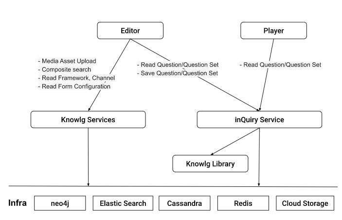

# Context
Sunbird inQuiry has been created as part of the larger Sunbird Ed infrastructure to support high scalability, at India scale. Sunbird inQuiry provides capabilities of managing Questions and Question Sets. These are created using QuML specification.

inQuiry is an independent building block that can be used without Sunbird Ed. It also has a potential to be used independently in various use cases. However, to make it adopted across various government, non-government and market players, requires the following has to be addressed:

1. It has to be cost viable for varied scale

1. It needs to be easy to understand, install, upgrade, operate & maintain with low tech needs 

1. It has to be usable in varied contexts

This requires a restructuring of its components. This document describes a proposed approach for the same.

# Current Structure

The components of inQuiry are:

1. Editor - Front end component that provides user interface to create question sets with different types of questions

1. Player - Front end component that provides user interface to play question sets with different types of questions

1. Services - Backend Microservices that provide functionalities of CRUD operations for questions and question sets. They also provide search capabilities

The services depend on Knowlg Services for certain functionalities such as:

* Retrieving taxonomy framework data

* Creating and Updating media assets (like image, video, audio) that are part of a question

* Flink jobs for publishing questions and question sets

# Limitations with current structure

1. There is a tight coupling between the different components. Editor and Player require inQuiry Services to be deployed. inQuiry Services require Knowlg Services to be deployed.

    1. The tight coupling doesn’t provide flexibility of using inQuiry in low scale deployments unless Knowlg enables it. 

    1. It also doesn’t provide flexibility to easily plugin inQuiry components in an existing system (that has its own content repository and CMS)

    
1. There is significant amount of code duplicated between Knowlg and inQuiry - because the create, review, publish logic is quite similar between question/question set and content/collection.

    1. Due to this, any improvements/optimizations that Knowlg services do in terms of the infrastructure, may have to be done again in inQuiry.

    

# Proposed Structure
Functionally, there are three parts to inQuiry:

1. UI components specific to question/question set: These are front end components to create and play question/question set

1. Business Logic specific to question/question set: This is logic specific to question/question set such as 

    1. Compliance to QuML Specification

    1. Scoring a question based on the answer. Calculation of score of a question set based on score of individual questions

    1. Adaptive questioning

    
1. Storage and retrieval of question/question set: This is the logic of storing and retrieving questions and question sets

The proposal is to restructure inQuiry components in such a way that these three parts are decoupled from each other and make them independently usable. It means the following changes to the existing components:

## inQuiry Editor and Player 

1. Editor and Player become pluggable components that do not depend on a service to implement the storage and retrieval of question/question set. 

1. Editor takes no input in case of creation of new question set. It takes a QuML compliant Question Set as input in case of modification of existing question set. It outputs a QuML compliant Question Set. 

1. Player takes QuML compliant Question Set as input. It outputs an “event set” (data of question set play) that is compliant to Telemetry specification.

1. Editor and Player may additionally use business logic specific to question/question set which is bundled as a library.

 **An alternative to this:** 

An alternative to this design is to define an API spec for storage and retrieval Editor and Player use this API to fetch question set and store question set. An adopter can implement that API as per their needs. 

* The limitation of this approach is that it would be additional effort for an adopter with an existing CMS system to implement new API with this spec. 

This alternative doesn’t seem to have any advantage in having this restriction. Hence it is not suggested.

## inQuiry Services

1. inQuiry will not have services. Each adopter can implement their own way of storing and retrieving the question and question sets.

1. Any adopter who wants to implement a scalable system to store and retrieve question/question sets can adopt Knowlg Services as part of their system.

## inQuiry Library 

1. This is a new component that will implement any question/question set specific business logic as a set of stateless, reusable functions. 

1. The library can be embedded as part of Editor and Player for any relevant business logic that needs to be supported by those components.

1. The library can also be embedded in any microservices that the adopter might have to provide the business logic through backend. 

## inQuiry Reference App

1. This is a lightweight reference web application that provides capabilities of creating and playing QuML based question sets using inQuiry Editor and Player. 

1. This can probably implement a simple storage and retrieval mechanism of Question and Question Sets - not using Knowlg Services.

 **Open Questions** 
1. Can existing Sunbird Knowlg services support storage and retrieval of Question and Question Sets or do they need any changes? 

1. How will the additional attributes of a question related to framework stored and retrieved by Editor and Player?

    1. Will it be part of QuML?

    1. Player probably wouldn’t need these attributes. So should this not be part of inQuiry?

    

*****

[[category.storage-team]] 
[[category.confluence]] 
