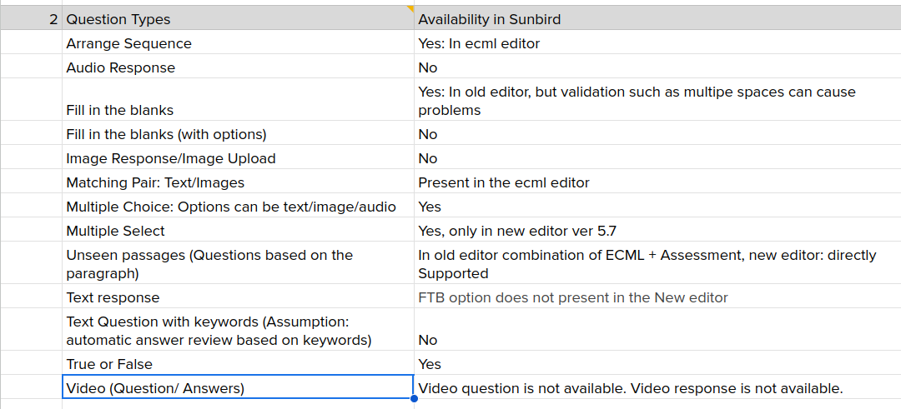

# Release 8.0.0 Scope

1. Question types feature parity

    

1. Request traceability \[Finalise the strategy and during the testing cycle] \[? days]

    1. \[Questions]

    1. How to generate request id?

    1. What happens if one these params for eg. req id is not present. Will the API fail?

    

    
1. API automation

    1. Migration of test cases from V1 to v2

    1. Strategy for test data deletion

    
1. Analysis and resolution of vulnerabilities

# Release 7.0.0 Scope

1. Removal of Hardcoding

1. User Deletion

1. Simplify installation of inQuiry (as per of Sunbird ED)

1. QuML Spec for the following attributes

    1. interactionTypes

    1. interactions

    
1. Primary Category based configuration for attribute behaviour

1. POC - Primary Category based configuration for attribute behaviour \[1 day]

# Release 6.2.0 Scope

1. CSP changes \[3 days - dev + testing]

1. Request traceability \[Finalise the strategy and during the testing cycle] \[? days]

    1. \[Questions]

    1. How to generate request id?

    1. What happens if one these params for eg. req id is not present. Will the API fail?

    

    
1. Backend unit test cases - Improving the coverage \[1 week]

1. Analyse \[Editor, Player] - \[Confirm on the pending tasks  ]:

    1. Streamline BB code/ remove deprecated code etc. 

    
1. NPM package release automation (Needs DevOps support)

1. Analyse how APIs errors are consumed by Editor & Player

    1. List down all the error messages

    1. Review & refactor the error messages

    
1. Documentation updates \[Needs clarity  ]

    1. Configurations of contributed features/properties

    
1. Demystification of SB BB & documentation 

1. Scala version upgrade

# Release 6.1.0 Scope

1. Migration Script  \[2.5 weeks]

    1. Approach \[1-2 days]

    1. QuML Migrator \[1 week]

    1. Event generator \[3 days]

    1. Re-publish \[3 days]

    
1. Backend unit test cases - Improving the coverage \[1 week]

1. POC - Primary Category based configuration for attribute behaviour \[1 day]

1. FTB Implementation

    1. Discuss in the working group connect

    1. Catchup with Mathew / other relevant folks. 

    
1. Analyse \[Editor, Player] :

    1. Streamline BB code/ remove deprecated code etc. to ensure a clean offering that is fully understood by the team that owns it.

    1. Code review, remove unused code

    1. Check for any code inspection tool?

    

    
    1. Hard coding of content organisation and target frameworks in editors and other components to point to a specific framework has to be removed

    
1. Web component to Editor & Player

1. Documentation updates

    1. Configurations of contributed features/properties

    
1. NPM package release automation (Needs DevOps support)

    1. Finalise the strategy

    1. Implementation design

    
1. Analyse how APIs errors are consumed by Editor & Player

    1. Backend is sending API error and Editor & Player are displaying different error messeges

    

 **Pending Discussion** 

* Ed Team

    * Request traceability - Expectation / priority / proposed design ?

    * Simplify inQuiry Installation 

    * Feature parity b/w ECML & QuML  

    
* DC

    * Finalise the strategy for NPM package release automation 

    

# Release 6.0.0 Scope

1. inQuiry upgrade to v2

# Release 5.7.0 Scope

1. QuML Compliance changes

1. FTB Implementation

1. Pending bugs

1. Editor Web component

# Release 5.6.0 Scope

1. inQuiry MS > Schema deployment - documentation

    1. Update the steps in confluence for future reference

    1. What are the list configs, we need list in confluence/ microsite for reference 

    1. How to deploy steps document. So, anyone from the team can deploy in the absence of core member. 

    1. List Jira tickets, create Confluence pages, and update the microsite

    
1. QuML Compliance

1. FTB Design

1. Question reusability: Create within a QueSet, use in another (Visibility private (P3), Old ECML (P3)). Review question lifecycle.

1. Attach or record audio (across all question types)

1. Functional Testing Automation: Today the coverage is x/total APIs and x%. We want to achieve >90% coverage across all APIs.

1. Performance Testing & Benchmarking: Today we don’t know this. We want to achieve <5% error rate. Expected scale: 25k TPS.

1. Health monitoring: Today there is no health monitoring, we want to provide monitor-ability.

1. Debuggability: FAQs to help adopters to debug any issues.

1. Installation

*****

[[category.storage-team]] 
[[category.confluence]] 
