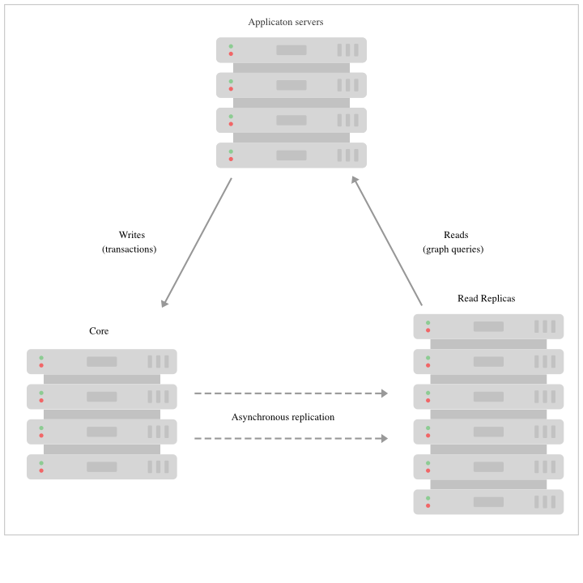

# Neo4J Causal Cluster Analysis and POC

### Introduction 

The HA cluster of neo4j is a master-slave cluster with single master node which handles all writes. Due to the continuous increase in number of writes to this node, there is a high possibility of master node going down. Also, single master acts as a bottle-neck for scalability and fault tolerance. As a resolution, we have causal cluster setup from neo4j.

### Background & Problem Statement 

At present learning platform is running with HA cluster setup. HA cluster is a single master instance setup, which is capable of handling number of requests based on its configuration. As the write requests increases, master instance has to be scaled up. But a single instance cannot be scaled up above a threshold limit.

### Design 

To setup a fault tolerant, scalable and secured system neo4j provides causal clustering setup with three main:

\- Safety: Core Servers provide a fault tolerant platform for transaction processing which will remain available while a simple majority of those Core Servers are functioning.\
\- Scale: Read Replicas provide a massively scalable platform for graph queries that enables very large graph workloads to be executed in a widely distributed topology.\
\- Causal consistency: when invoked, a client application is guaranteed to read at least it's own writes.

From operational point of view, the cluster is being composed of two different roles: Core and Read Replica

**Core Servers:**

Core Servers' main responsibility is to safeguard data. The Core Servers do so by replicating all transactions using the Raft protocol. Raft ensures that the data is safely durable before confirming transaction commit to the end user application. In practice this means once a majority of Core Servers in a cluster (N/2+1) have accepted the transaction, it is safe to acknowledge the commit to the end user application.

The safety requirement has an impact on write latency. Implicitly writes will be acknowledged by the fastest majority, but as the number of Core Servers in the cluster grows so do the size of the majority needed to acknowledge a write.

In practice this means that there are relatively few machines in a typical Core Server cluster, enough to provide sufficient fault tolerance for the specific deployment. This is simply calculated with the formula M = 2F + 1 where M is the number of Core Servers required to tolerate F faults. For example:

In order to tolerate two failed Core Servers we would need to deploy a cluster of five Cores.

\
**ReadReplicas:**

Read Replicas' main responsibility is to scale out graph workloads (Cypher queries, procedures, and so on). Read Replicas act like caches for the data that the Core Servers safeguard, but they are not simple key-value caches. In fact Read Replicas are fully-fledged Neo4j databases capable of fulfilling arbitrary (read-only) graph queries and procedures.

Read Replicas are asynchronously replicated from Core Servers via transaction log shipping. Periodically (usually in the ms range) a Read Replica will poll a Core Server for any new transactions that it has processed since the last poll, and the Core Server will ship those transactions to the Read Replica. Many Read Replicas can be fed data from a relatively small number of Core Servers, allowing for a large fan out of the query workload for scale.

Unlike Core Servers however, Read Replicas do not participate in decision making about cluster topology. Read Replicas should be typically run in relatively large numbers and treated as disposable. Losing a Read Replica does not impact the cluster’s availability, aside from the loss of its fraction of graph query throughput. It does not affect the fault tolerance capabilities of the cluster.

\

**Causal Consistency:**

Causal consistency makes it easy to write to Core Servers (where data is safe) and read those writes from a Read Replica (where graph operations are scaled out). For example, causal consistency guarantees that the write which created a user account will be present when that same user subsequently attempts to log in

\
On executing a transaction, the client can ask for a bookmark which it then presents as a parameter to subsequent transactions. Using that bookmark the cluster can ensure that only servers which have processed the client’s bookmarked transaction will run its next transaction. This provides a causal chain which ensures correct read-after-write semantics from the client’s point of view.

Aside from the bookmark everything else is handled by the cluster. The database drivers work with the cluster topology manager to choose the most appropriate Core Servers and Read Replicas to provide high quality of service.

\

**Causal-Cluster SetUp:**

A sample docker-compose.yml which creates 3 node core cluster and a read replica is at [**docker-compose.yml**](../../../../.gitbook/assets/791806044.yml)

Once we run the attached compose file, and get the system-info from neo4j, we get 3 core clusters(1 Leader and 2 Followers) and 1 read replica as below

### Conclusion: 
