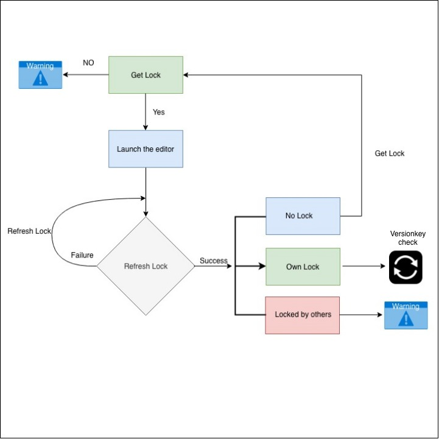

# Sunbird Design : \[Design discussion] Editor implementation for Collaboration

### **Overview:** 

This page explains the design of collaboration implementation inside Editor using lock and unlock a resource using lock service.

Design Wiki: **Lock Service (**[**https://project-sunbird.atlassian.net/wiki/spaces/SBDES/pages/create?useDraft=true\&draftId=715292797\&draftShareId=4c68f0ea-0cdc-4886-aecb-dd1bb70c6aed**](https://project-sunbird.atlassian.net/wiki/spaces/SBDES/pages/create?useDraft=true\&draftId=715292797\&draftShareId=4c68f0ea-0cdc-4886-aecb-dd1bb70c6aed)**)**

Currently in editors only content creator can edit his contents that he created. if he wants to ask some other user(teacher/colleague) to request to just cross check it for improvement, user needs to share his credentials.

### **Problem Statement** 

Collaborator of a content can have multiple use cases, which the proposed implementation should support

1. Only 1 user can edit content at a time. When a user is editing content, other users get a warning/information that a user is currently editing the content.(lock the content)
2. Refresh lock when user editing the content until he closes the editor/content
3. When the creator loses internet connectivity, the lock/unlock mechanism needs to be handled
4. When the editor unable to get a proper server response, the lock/unlock mechanism needs to be handled
5. When the creator comes back from inactivity (sleep mode/gets internet connectivity/switched browser tabs), the lock/unlock mechanism needs to be handled
6. When there's a manual browser refresh, the lock/unlock mechanism needs to be handled
7. Lock/unlock mechanism need not be applied in the editors read only mode. (When reviewer opens a content)

### **Solution -1: Using Lock Service to check content collaboration status.** 

1. When a creator is trying to edit a content, the content is locked for that particular user id and device id using the GetLock API.
2. In the configuration, the editor will also get an `Expiry time` in milliseconds. This `Expiry time` is basically the time in which the lock will expire.
3. The editor will then make use of this `Expire time` to calculate the interval, which is 1/3rd of the `Expiry time` to call `Refresh Lock` API.
4. For example, if the configuration is set the `Expiry time` to 30 minutes (1800s), the `Refresh Lock` API will be called every 10mins (600s).
5. Every time the `Refresh Lock` API is called, the `Expiry time` is extended by its 1/3rd value.
6. If the creator has lost connectivity due to any technical mishap, the system will release the lock for the content once it hits the `Expiry time`.
7. If the same creator is trying to gain access to the same content, we have to get the `version key` to check the conflict in the content.
8. If there is a conflict in the content, we have to get the latest content and lock the content.&#x20;

\

<figure><figcaption></figcaption></figure>

1. To track user idle time, we will be using Idle.js ([https://github.com/shawnmclean/Idle.js](https://github.com/shawnmclean/Idle.js)). But there are a few exceptions that we need to handle i.e. Iframe, player preview.&#x20;
2. To track timer locally, we will be using Timer.js ([https://github.com/husa/timer.js](https://github.com/husa/timer.js)).

When a content is being created or updated, two scenarios arise.&#x20;

**Scenario 1: With the Internet**

When the content is opened, the GetLock API is called.

1. If the get lock is successful, the creator will continue editing the content.&#x20;
2. If the get lock failed, i.e if someone else is editing, a warning will be shown with the details of the person who has the lock.

When the content is open and idle for **X** amount of time (**X** is the same time as `refreshLockTime` and can be configured),

Idle time warning will be shown with an option to Resume.&#x20;

On Resume:

1. If the current time is beyond expiry time, then we check for `version key` change.&#x20;
   1. If the version key is the same, we call `GetLock API`.&#x20;
   2. If the version key is different, we give a warning.&#x20;
2. if current time **<** expire time we will call refresh lock API and will update the expire time which we will get from API response

\

<figure><figcaption></figcaption></figure>

\

**Scenario 2: Without the Internet**

When we get the internet back we will check difference between current time and expire time

1. if current time **<** expire time we will call refresh lock API and will update the expire time which we will get from API response
2. if current time **>** expire time we will check is versionKey changed.&#x20;
   1. if version key not matching we will show warning&#x20;
   2. if version key is matching, then we will call get lock API&#x20;
   3. If user get lock he will continue editing otherwise we will show warning

\

<figure><figcaption></figcaption></figure>

\

**Scenario 3: API down(500 Internal Server Error)**

In the case of API inaccessibility, this situation can be handled in two ways.

1. Call the API at the Exponential backoff time.&#x20;
2. Call the API at the regular interval with `refreshLockTime.`

\

\
