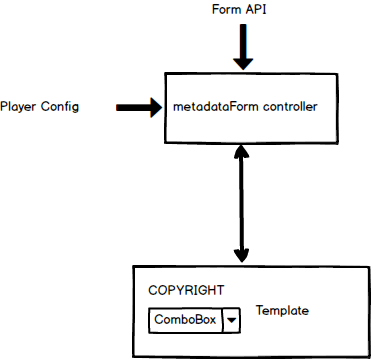
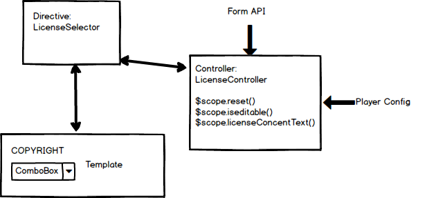

# Sunbird Design : The design approach for DIKSHA License Support in the content metadata plugin

**The design approach for Diksha Licensing**

**Approach 1:** Plugin base controller \[ metadata form ] will expect the license form element from the metadata API and build the forms accordingly. It will be having the same behavior as '''BOARD/SYLLABUS\
Get the license object from API

* Get the player config to get the content is copied or not and create a flag\
  \- Show license attached for the content

**Pros**: Easy to achieve and less development effort\
**Cons**: Not reusable

<figure><figcaption></figcaption></figure>

\

**Approach 2**: We can write a custom directive for license drop-down which will expect the license data from metadata API.

* Get the license object from form API\
  \- Get the player config and perform actions on the dropdown list\
  \- Show license attached for the content

Pros: Directive can be reusable in future\
cons: Development effort is more than the first approach

<figure><figcaption></figcaption></figure>

\

### Attachments: 

.gif>) [Controller\_approach.png](../../../../.gitbook/assets/1124827192.png) (image/png)\
.gif>) [Directive\_approach.png](../../../../.gitbook/assets/1124892690.png) (image/png)\
