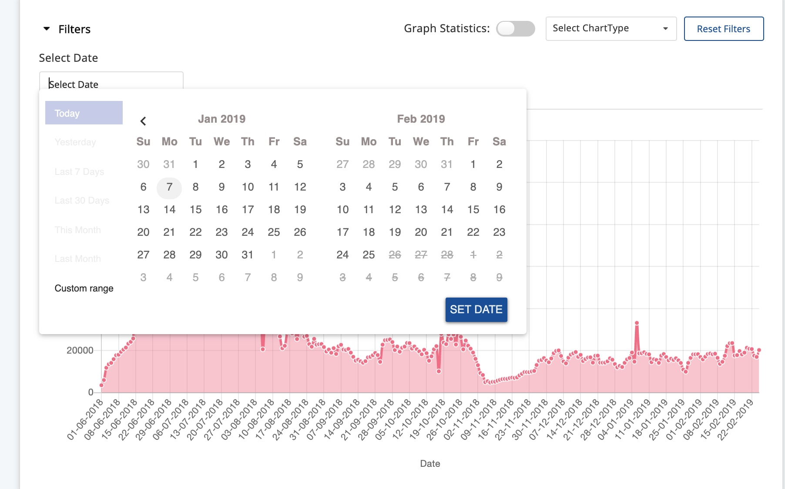
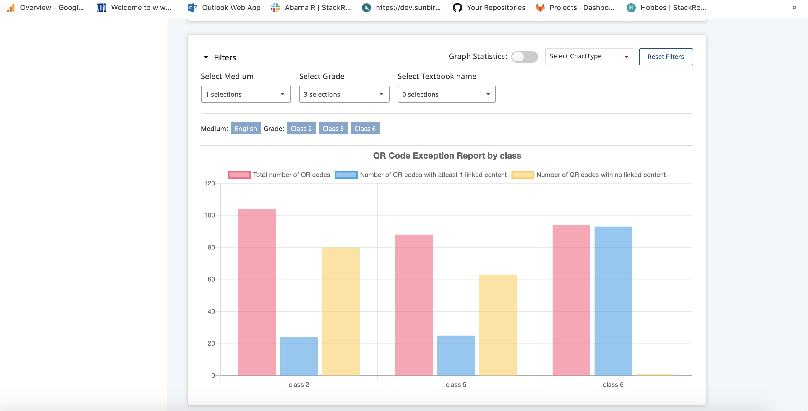
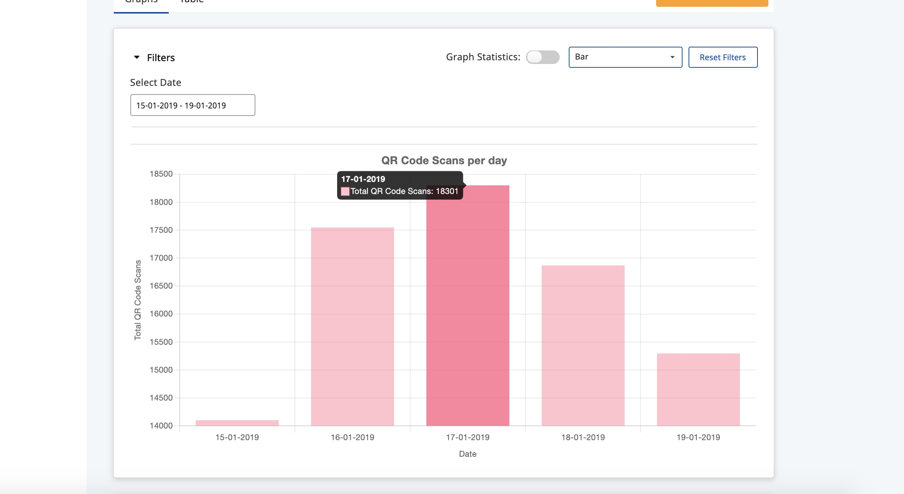
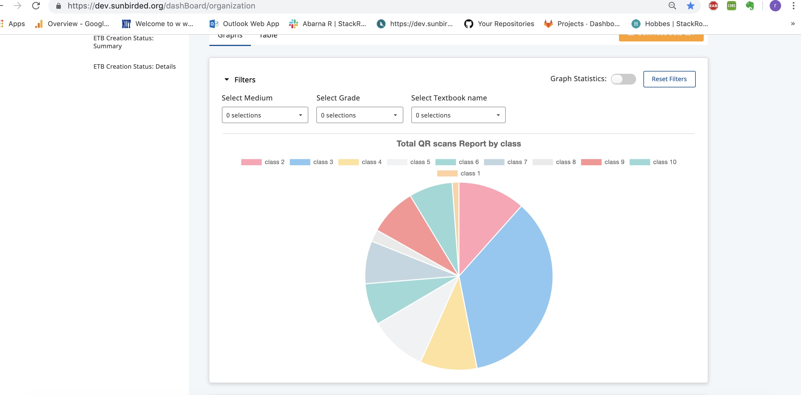
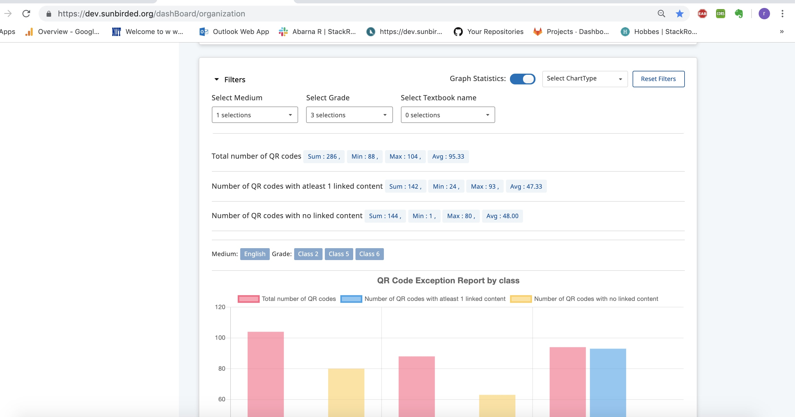
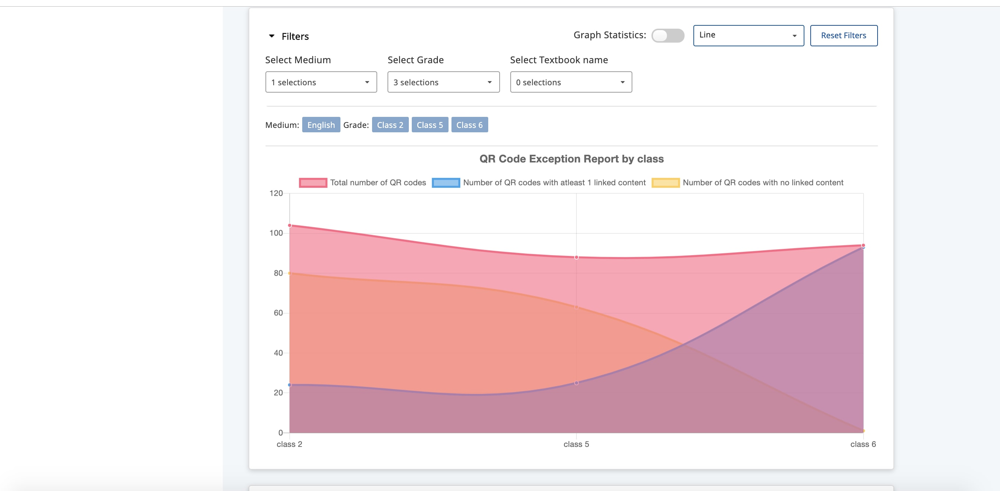

# Filters in admin dashboard

### Filters in Charts <a href="#filtersinadmindashboard-filtersincharts" id="filtersinadmindashboard-filtersincharts"></a>

### Background <a href="#filtersinadmindashboard-background" id="filtersinadmindashboard-background"></a>

Purpose of this report is to add filtering capabilities to charts in the admin dashboard so that users can narrow down the data set to their time period/ labels (Course name , class , subject name etc).

#### **Proposed Solution:** <a href="#filtersinadmindashboard-proposedsolution" id="filtersinadmindashboard-proposedsolution"></a>

* To render the chart , we've **config.json** which has specific information for particular type of chart.
* In config.json we need to specify the x-axis and y-axis values.\

  * **labelsExpr** : reference to the table's column header name which has to act as a x-axis.
  * **dataExpr** : reference to the table's column header name which has to act as a y-axis.
* To show/enable the filters we are adding a filters property  to each chart object. (type : **Array\<Objects>** )
* every filter object will have three properties which are as follows :-&#x20;
  * **displayName** : placeholder value for the element
  * **controlType** : determines the element type (multi-select, select, date ).&#x20;
  * **reference** : reference to the table's column name which has to act as a filter
* In case of timeLine filters  , we can narrow down our result for yesterday,  Last 7 days , Last 15 days , Last 30 days , Last Month or you can go with **custom date**.
* Moreover dates are bound to minDate and maxDate that can be selected . If data is not available for particular dates , it will be disabled . User cant select those dates as shown in below image.\
  \
  \
  &#x20;\
  \

* we can filter out which labels we want to display if same column is specified in filters also which is user for labelsExpr .
* Reset filter button removes all filters and renders the initial chart.
* When any filter is applied , we're rendering the chart in real time.
* ChartType dropdown is also provided to select which chart type should be used to render the chart (Note :- as of now user can only select between Line chart and Bar Chart , but later it can be extended to other chart types also).
* There is a graph statistics button at the top of each chart to show Total count , min value , max value and average count for the data.

\


sample chart object

```
{
  "id": "aggregated_live_textbook_qr_content_status",
  "datasets": [
    {
      "label": "Total number of QR codes",
      "dataExpr": "Total number of QR codes"
    },
    {
      "label": "Number of QR codes with atleast 1 linked content",
      "dataExpr": "Number of QR codes with atleast 1 linked content"
    },
    {
      "label": "Number of QR codes with no linked content",
      "dataExpr": "Number of QR codes with no linked content"
    }
  ],
  "colors": [
    {
      "backgroundColor": [
        "rgb(0, 199, 134)",
        "rgb(255, 69, 88)"
      ]
    }
  ],
  "labelsExpr": "Grade",
  "chartType": "bar",
  "options": {
    "tooltips": {
      "titleSpacing": 5,
      "bodySpacing": 5
    },
    "title": {
      "fontSize": 16,
      "display": true,
      "text": "QR Code Exception Report by class"
    },
    "legend": {
      "display": true
    },
    "responsive": true
  },
  "filters": [
    {
      "displayName": "Select Medium",
      "reference": "Medium",
      "controlType": "multi-select"
    },
    {
      "displayName": "Select Grade",
      "reference": "Grade",
      "controlType": "multi-select"
    },
    {
      "displayName": "Select Textbook name",
      "reference": "Textbook name",
      "controlType": "multi-select"
    }
  ]
}
```

\


sample filter object

```
  "filters": [
    {
      "displayName": "Select Medium",
      "reference": "Medium",
      "controlType": "multi-select"
    },
    {
      "displayName": "Select Grade",
      "reference": "Grade",
      "controlType": "multi-select"
    },
    {
      "displayName": "Select Textbook name",
      "reference": "Textbook name",
      "controlType": "multi-select"
    }
  ]
```

\


**Images : -**

\


&#x20;

\


\
\
\
\









\




\
