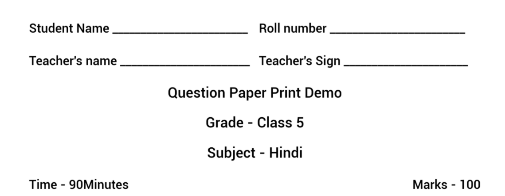

# Provision of Templatizing Question Papers during Print

### **Current behavior of print preview service** 

The style of print preview is determined by three variables: **Grade**, **medium,** and **question type**.

The question paper is divided into 3 sections, style for each section is explained below:

1. **Start of question paper**
2. **Question paper name, Grade, Subject, Max marks, Max time**
3. **Question style**

**Start of question paper**

| **Grade** | **Medium** | **Start of question paper**                               |
| --------- | ---------- | --------------------------------------------------------- |
| 1-5       | Hindi      | Student name, Roll, Teacher name and sign are in Hindi.   |
| 1-5       | English    | Student name, Roll, Teacher name and sign are in English. |
| 6-12      | Hindi      | Student name, Roll, Teacher name and sign are in Hindi.   |
| 612       | English    | Student name, Roll, Teacher name and sign are in English. |

**Question paper name, Grade, Subject, Max marks, Max time -** has a fixed view \<image below>

<figure><figcaption></figcaption></figure>

&#x20;

**Question style**

| **Grade** | **Question type** | **Style** |
| --------- | ----------------- | --------- |

| **Grade** | **Question type** | **Style**                                                                                   |
| --------- | ----------------- | ------------------------------------------------------------------------------------------- |
| 1-5, 6-12 | MCQ               | Question fowllwed by answers options are added in pairs of 2.                               |
| 1-5, 6-12 | MTF               | Tabular view of all the columns and its items                                               |
| 1-5, 6-12 | FTB               | Exact copy of what question is added, the blank is entered at the time of question creation |
| 1-5       | VSA               | One dotted line for answer (fixed)                                                          |
| 1-5       | SA                | Three dotted lines for answer (fixed)                                                       |
| 1-5       | LA                | Eleven (11) dotted lines for answer (fixed)                                                 |
| 6-12      | VSA               | Only question, no line for answering                                                        |
| 6-12      | SA                | Exact same as question, No line for answering                                               |
| 6-12      | LA                | Exact same as question, No line for answering                                               |
