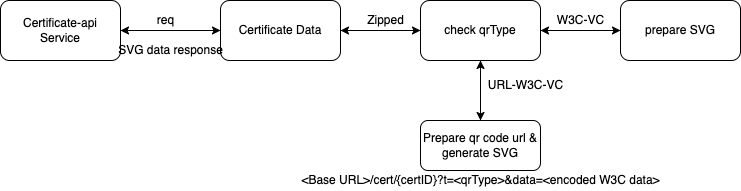

# Sunbird RC QR code generation

* Introduction
* Problem Statement
  * Prerequisite
* Solution

### Introduction <a href="#sunbirdrcqrcodegeneration-introduction" id="sunbirdrcqrcodegeneration-introduction"></a>

This document describes implementation of sunbird rc qr code generation based on the [wiki](broken-reference).

[SB-29126](https://project-sunbird.atlassian.net/browse/SB-29126) - Getting issue details... STATUS

### Problem Statement <a href="#sunbirdrcqrcodegeneration-problemstatement" id="sunbirdrcqrcodegeneration-problemstatement"></a>

To support the backward compatibility for qr code generation.

#### Prerequisite <a href="#sunbirdrcqrcodegeneration-prerequisite" id="sunbirdrcqrcodegeneration-prerequisite"></a>

Add the below data in `/sunbird-rc-core/services/certificate-api/configs/keys.js`

```
const qrType = process.env.QR_TYPE || 'W3C-VC'; 
const certDomainUrl = process.env.CERTIFICATE_DOMAIN_URL || "https://dev.sunbirded.org";
```

We are supporting 2 types of qr code.

1. W3C-VC (old)
2. URL-W3C-VC (new)

according to the formate what you need, change the `process.env.QR_TYPE` variable;

change the `signingKeyType` to `KeyType.RSA` in `/sunbird-rc-core/services/certificate-signer/configs/keys.js`

```
const signingKeyType = process.env.SIGNING_KEY_TYPE || KeyType.RSA;
```

### Solution <a href="#sunbirdrcqrcodegeneration-solution" id="sunbirdrcqrcodegeneration-solution"></a>

To make the Sunbird RC QR codes compatible with the existing version of Sunbird consumption app, the QR code generated by Sunbird RC should also be a URL. The proposed solution is to enable a provision in Sunbird RC to generate the QR code in URL format along with the W3C-VC data.



**Request**:

```
{{host}}/api/v1/TrainingCertificate/1-969a75a1-ac69-4a5b-a67b-092ddd4b29e2
```

**Curl**

```
curl --location --request GET 'http://localhost:8081/api/v1/TrainingCertificate/1-969a75a1-ac69-4a5b-a67b-092ddd4b29e2' \
--header 'Accept: image/svg+xml' \
--header 'template: https://sunbirddev.blob.core.windows.net/sunbird-content-dev/content/do_1131445945205145601809/artifact/template-2.svg'
```

**Response**:

We will get SVG file as a response.


