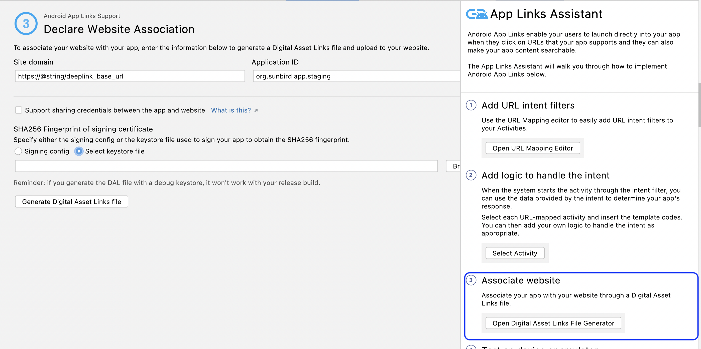

# Deep link support in Android 12 devices

### Background: <a href="#deeplinksupportinandroid12devices-background" id="deeplinksupportinandroid12devices-background"></a>

Deep links help us provide a seamless experience between the Sunbird portal and the mobile application. Assuming the application is installed, when a user taps a link from an email client or WhatsApp, we want the Android device to route the request directly to the Sunbird app application instead of the web experience.

### Problem Statement: <a href="#deeplinksupportinandroid12devices-problemstatement" id="deeplinksupportinandroid12devices-problemstatement"></a>

Deep link support is broken in android 12(Snow Cone / SDK 31-32) devices due to some behavioral changes to apps targeting android 12

### Design: <a href="#deeplinksupportinandroid12devices-design" id="deeplinksupportinandroid12devices-design"></a>

To support this Google has provided the following steps

**Step - 1**

Update the intent filters in AndroidManifest.xml with `android:autoVerify="true"`

```
<activity android:configChanges="orientation|keyboardHidden|keyboard|screenSize|locale|smallestScreenSize|screenLayout|uiMode" android:exported="true" android:label="@string/activity_name" android:launchMode="singleInstance" android:name="MainActivity" android:screenOrientation="portrait" android:theme="@style/Theme.AppCompat.NoActionBar" android:windowSoftInputMode="adjustResize">
      <intent-filter android:autoVerify="true" tools:targetApi="m">
            <action android:name="android.intent.action.VIEW" />
            <category android:name="android.intent.category.DEFAULT" />
            <category android:name="android.intent.category.BROWSABLE" />
            <data android:host="@string/deeplink_base_url" android:pathPrefix="/public" android:scheme="https" />
        </intent-filter>     
</activity>
```

**Step - 2**

Option - 1

Create an assetlinks.json file and add the following info to that file

```
[{
  "relation": ["delegate_permission/common.handle_all_urls"],
  "target": {
    "namespace": "android_app",
    "package_name": "<Your App’s package name>",
    "sha256_cert_fingerprints":
    ["<Your App’s SHA256 finger print>"]
  }
}]
```

Option - 2

Use Android Studio’s App Link Assistant to generate the assetlinks.json file



**Step - 3**

Deploy the assetlinks.json to the host in .well-known directory such as

[https://staging.sunbirded.org/.well-known/assetlinks.json](https://staging.sunbirded.org/.well-known/assetlinks.json)

**Step - 4**

Verify the asset link using DigitalAssetLink API like following

https://digitalassetlinks.googleapis.com/v1/statements:list?source.web.site=\<Domain name>\&relation=delegate\_permission/common.handle\_all\_urls

**Step - 5**

Verify the changes in android app using the deeplinks
