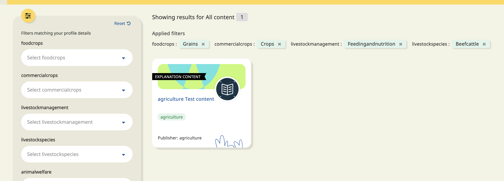

# \[ED-Portal] DC: Design-Docs for Hardcoded BMGS removal

## Introduction <a href="#id-ed-portal-dc-design-docsforhardcodedbmgsremoval-introduction" id="id-ed-portal-dc-design-docsforhardcodedbmgsremoval-introduction"></a>

This document describes the design approach of BMGS removal in the portal.

* Introduction
  * Background :
  * Existing workflow:
  * Problem Statement:
    * Any adopter should be able to perform the following:
  * Onboarding - Flow - Framework Cateogories(BMGS)
    * Key design problems
    * Design:
      * Solution 1
      * Pros:
  * Search filter (BMGS)
    * Key design problems
    * Design:
      * Solution 1:
      * Pros:

### Background : <a href="#id-ed-portal-dc-design-docsforhardcodedbmgsremoval-background" id="id-ed-portal-dc-design-docsforhardcodedbmgsremoval-background"></a>

Jira Ticket : [ED-2004](https://project-sunbird.atlassian.net/browse/ED-2004) - Getting issue details... STATUS

Observation Link : [https://tarento-my.sharepoint.com/:w:/r/personal/rajesh\_kumaravel\_tarento\_com/\_layouts/15/Doc.aspx?sourcedoc=%7BD950D821-5A6E-4ED5-83BB-EB04A8E38CC3%7D\&file=Portal%20-%20BMGS.docx\&action=default\&mobileredirect=true](https://tarento-my.sharepoint.com/:w:/r/personal/rajesh\_kumaravel\_tarento\_com/\_layouts/15/Doc.aspx?sourcedoc=%7BD950D821-5A6E-4ED5-83BB-EB04A8E38CC3%7D\&file=Portal%20-%20BMGS.docx\&action=default\&mobileredirect=true)

Currently, Sunbird -Portal uses hard-coded BMGS. that is tightly coupled with our code base

### Existing workflow: <a href="#id-ed-portal-dc-design-docsforhardcodedbmgsremoval-existingworkflow" id="id-ed-portal-dc-design-docsforhardcodedbmgsremoval-existingworkflow"></a>

Change request: As part of [ED-2004](https://project-sunbird.atlassian.net/browse/ED-2004) - Getting issue details... STATUS BMGS should be configurable.

### Problem Statement: <a href="#id-ed-portal-dc-design-docsforhardcodedbmgsremoval-problemstatement" id="id-ed-portal-dc-design-docsforhardcodedbmgsremoval-problemstatement"></a>

* Give the flexibility for Sunbird Ed Adopters from **any domain** will be able to install Sunbird Ed & update the required form configuration, and allow the end-to-end creation and consumption of course (+ certificate issuance), textbook and reports.

#### Any adopter should be able to perform the following: <a href="#id-ed-portal-dc-design-docsforhardcodedbmgsremoval-anyadoptershouldbeabletoperformthefollowing" id="id-ed-portal-dc-design-docsforhardcodedbmgsremoval-anyadoptershouldbeabletoperformthefollowing"></a>

* Create a new framework for any domain without any BMGS reference.
* Configure the home page. (For example, Diksha has 4 to 5 sections which is completely based on search API. Each section contains a different search query based upon the requirement.). So on the home page, these sections should be configured.
* Skip user selection & framework selection given we have a default value, and also skip selection of location.
* Add or remove categories in the framework selection page, ie. the user can configure the number of categories to be displayed in the framework selection page in portal.
* Create contents(Collection, Course, QuestionSet, Resource) in respective editors and tag it to the newly developed framework, and attach a certificate for trackable content.
* See / discover all the contents tagged to the selected framework on the home page.
* Configure filters depending on the requirement (post content discovery).
* Consume all trackable and non-trackable contents.
* Check the progress and get a certificate after consuming trackable content.
* View the reports after the consumption of trackable content - Hawkeye report should be configurable

### Onboarding - Flow - Framework Cateogories(BMGS) <a href="#id-ed-portal-dc-design-docsforhardcodedbmgsremoval-onboarding-flow-frameworkcateogories-bmgs" id="id-ed-portal-dc-design-docsforhardcodedbmgsremoval-onboarding-flow-frameworkcateogories-bmgs"></a>

#### [Key design problems](https://project-sunbird.atlassian.net/wiki/spaces/SUN/pages/3369369685/Sunbird-ED+Gap+Analysis+Docs+for+BMGS#Onboarding-Pop-up--BMGS) <a href="#id-ed-portal-dc-design-docsforhardcodedbmgsremoval-keydesignproblems" id="id-ed-portal-dc-design-docsforhardcodedbmgsremoval-keydesignproblems"></a>

In current code base, the BMGS framework is hardcoded in the popup displayed for non-logged-in & logged-in users. This makes it challenging to configure this for any other framework category.

How to change the label, placeholder of the below BMGS screen?

How to add the new dropdown fields if required?

How to handle the BMGS hardcoded keyword?

Code is tightly coupled with hardcoded data to fix the above problem

BMGS Screenshot

#### Design: <a href="#id-ed-portal-dc-design-docsforhardcodedbmgsremoval-design" id="id-ed-portal-dc-design-docsforhardcodedbmgsremoval-design"></a>

**Solution 1**

In the case of one channel having multiple frameworks, the framework read API should be executed using the Deafultframework input. The user's update of framework configuration should then show the drop-down list of categories for the frameworks.

In the first dropdown, the user should be able to select another framework based on the selected framework below dropdown should be change

Fetch the framework category details form the below framework read api response

```
{
    "id": "api.framework.read",
    "ver": "1.0",
    "ts": "2023-10-12T13:29:14.721Z",
    "params": {
        "resmsgid": "56353510-6903-11ee-979f-f91a1a05304d",
        "msgid": "1ed35094-c59d-46fb-8cd8-ca3ec6ef180c",
        "status": "successful",
        "err": null,
        "errmsg": null
    },
    "responseCode": "OK",
    "result": {
        "framework": {
            "identifier": "agriculture_framework",
            "code": "agriculture_framework",
            "name": "agriculture_framework",
            "description": "Sunbird TPD framework",
            "categories": [
                {
                    "identifier": "agriculture_framework_foodcrops",
                    "code": "foodcrops",
                    "terms": [
                        {
                            "associations": [
                                {
                                    "identifier": "agriculture_framework_livestockmanagement_geneticsandselection",
                                    "code": "geneticsandselection",
                                    "translations": null,
                                    "name": "geneticsandselection",
                                    "description": null,
                                    "index": 0,
                                    "category": "livestockmanagement",
                                    "status": "Live"
                                },
                                {
                                    "identifier": "agriculture_framework_commercialcrops_crops",
                                    "code": "crops",
                                    "translations": null,
                                    "name": "crops",
                                    "description": null,
                                    "index": 0,
                                    "category": "commercialcrops",
                                    "status": "Live"
                                },
                                {
                                    "identifier": "agriculture_framework_livestockmanagement_feedingandnutrition",
                                    "code": "feedingandnutrition",
                                    "translations": null,
                                    "name": "feedingandnutrition",
                                    "description": null,
                                    "index": 0,
                                    "category": "livestockmanagement",
                                    "status": "Live"
                                },
                                {
                                    "identifier": "agriculture_framework_animalwelfare_diseases",
                                    "code": "diseases",
                                    "translations": null,
                                    "name": "diseases",
                                    "description": null,
                                    "index": 0,
                                    "category": "animalwelfare",
                                    "status": "Live"
                                },
                                {
                                    "identifier": "agriculture_framework_commercialcrops_pastures",
                                    "code": "pastures",
                                    "translations": null,
                                    "name": "pastures",
                                    "description": null,
                                    "index": 0,
                                    "category": "commercialcrops",
                                    "status": "Live"
                                },
                                {
                                    "identifier": "agriculture_framework_livestockspecies_beefcattle",
                                    "code": "beefcattle",
                                    "translations": null,
                                    "name": "beefcattle",
                                    "description": null,
                                    "index": 0,
                                    "category": "livestockspecies",
                                    "status": "Live"
                                },
                                {
                                    "identifier": "agriculture_framework_livestockspecies_bees",
                                    "code": "bees",
                                    "translations": null,
                                    "name": "bees",
                                    "description": null,
                                    "index": 0,
                                    "category": "livestockspecies",
                                    "status": "Live"
                                }
                            ],
                            "identifier": "agriculture_framework_foodcrops_grains",
                            "code": "grains",
                            "translations": null,
                            "name": "grains",
                            "description": null,
                            "index": 1,
                            "category": "foodcrops",
                            "status": "Live"
                        },
                        {
                            "associations": [
                                {
                                    "identifier": "agriculture_framework_commercialcrops_pastures",
                                    "code": "pastures",
                                    "translations": null,
                                    "name": "pastures",
                                    "description": null,
                                    "index": 0,
                                    "category": "commercialcrops",
                                    "status": "Live"
                                },
                                {
                                    "identifier": "agriculture_framework_livestockspecies_bees",
                                    "code": "bees",
                                    "translations": null,
                                    "name": "bees",
                                    "description": null,
                                    "index": 0,
                                    "category": "livestockspecies",
                                    "status": "Live"
                                },
                                {
                                    "identifier": "agriculture_framework_commercialcrops_crops",
                                    "code": "crops",
                                    "translations": null,
                                    "name": "crops",
                                    "description": null,
                                    "index": 0,
                                    "category": "commercialcrops",
                                    "status": "Live"
                                },
                                {
                                    "identifier": "agriculture_framework_livestockmanagement_feedingandnutrition",
                                    "code": "feedingandnutrition",
                                    "translations": null,
                                    "name": "feedingandnutrition",
                                    "description": null,
                                    "index": 0,
                                    "category": "livestockmanagement",
                                    "status": "Live"
                                },
                                {
                                    "identifier": "agriculture_framework_animalwelfare_diseases",
                                    "code": "diseases",
                                    "translations": null,
                                    "name": "diseases",
                                    "description": null,
                                    "index": 0,
                                    "category": "animalwelfare",
                                    "status": "Live"
                                },
                                {
                                    "identifier": "agriculture_framework_livestockspecies_beefcattle",
                                    "code": "beefcattle",
                                    "translations": null,
                                    "name": "beefcattle",
                                    "description": null,
                                    "index": 0,
                                    "category": "livestockspecies",
                                    "status": "Live"
                                },
                                {
                                    "identifier": "agriculture_framework_livestockmanagement_geneticsandselection",
                                    "code": "geneticsandselection",
                                    "translations": null,
                                    "name": "geneticsandselection",
                                    "description": null,
                                    "index": 0,
                                    "category": "livestockmanagement",
                                    "status": "Live"
                                }
                            ],
                            "identifier": "agriculture_framework_foodcrops_horticulture",
                            "code": "horticulture",
                            "translations": null,
                            "name": "horticulture",
                            "description": null,
                            "index": 2,
                            "category": "foodcrops",
                            "status": "Live"
                        }
                    ],
                    "translations": null,
                    "name": "foodcrops",
                    "description": null,
                    "index": 1,
                    "status": "Live"
                },
                {
                    "identifier": "agriculture_framework_commercialcrops",
                    "code": "commercialcrops",
                    "terms": [
                        {
                            "associations": [
                                {
                                    "identifier": "agriculture_framework_livestockmanagement_geneticsandselection",
                                    "code": "geneticsandselection",
                                    "translations": null,
                                    "name": "geneticsandselection",
                                    "description": null,
                                    "index": 0,
                                    "category": "livestockmanagement",
                                    "status": "Live"
                                },
                                {
                                    "identifier": "agriculture_framework_livestockspecies_beefcattle",
                                    "code": "beefcattle",
                                    "translations": null,
                                    "name": "beefcattle",
                                    "description": null,
                                    "index": 0,
                                    "category": "livestockspecies",
                                    "status": "Live"
                                },
                                {
                                    "identifier": "agriculture_framework_livestockmanagement_feedingandnutrition",
                                    "code": "feedingandnutrition",
                                    "translations": null,
                                    "name": "feedingandnutrition",
                                    "description": null,
                                    "index": 0,
                                    "category": "livestockmanagement",
                                    "status": "Live"
                                },
                                {
                                    "identifier": "agriculture_framework_animalwelfare_diseases",
                                    "code": "diseases",
                                    "translations": null,
                                    "name": "diseases",
                                    "description": null,
                                    "index": 0,
                                    "category": "animalwelfare",
                                    "status": "Live"
                                },
                                {
                                    "identifier": "agriculture_framework_livestockspecies_bees",
                                    "code": "bees",
                                    "translations": null,
                                    "name": "bees",
                                    "description": null,
                                    "index": 0,
                                    "category": "livestockspecies",
                                    "status": "Live"
                                }
                            ],
                            "identifier": "agriculture_framework_commercialcrops_crops",
                            "code": "crops",
                            "translations": null,
                            "name": "crops",
                            "description": null,
                            "index": 1,
                            "category": "commercialcrops",
                            "status": "Live"
                        },
                        {
                            "associations": [
                                {
                                    "identifier": "agriculture_framework_livestockmanagement_feedingandnutrition",
                                    "code": "feedingandnutrition",
                                    "translations": null,
                                    "name": "feedingandnutrition",
                                    "description": null,
                                    "index": 0,
                                    "category": "livestockmanagement",
                                    "status": "Live"
                                },
                                {
                                    "identifier": "agriculture_framework_animalwelfare_diseases",
                                    "code": "diseases",
                                    "translations": null,
                                    "name": "diseases",
                                    "description": null,
                                    "index": 0,
                                    "category": "animalwelfare",
                                    "status": "Live"
                                },
                                {
                                    "identifier": "agriculture_framework_livestockspecies_beefcattle",
                                    "code": "beefcattle",
                                    "translations": null,
                                    "name": "beefcattle",
                                    "description": null,
                                    "index": 0,
                                    "category": "livestockspecies",
                                    "status": "Live"
                                },
                                {
                                    "identifier": "agriculture_framework_livestockspecies_bees",
                                    "code": "bees",
                                    "translations": null,
                                    "name": "bees",
                                    "description": null,
                                    "index": 0,
                                    "category": "livestockspecies",
                                    "status": "Live"
                                },
                                {
                                    "identifier": "agriculture_framework_livestockmanagement_geneticsandselection",
                                    "code": "geneticsandselection",
                                    "translations": null,
                                    "name": "geneticsandselection",
                                    "description": null,
                                    "index": 0,
                                    "category": "livestockmanagement",
                                    "status": "Live"
                                }
                            ],
                            "identifier": "agriculture_framework_commercialcrops_pastures",
                            "code": "pastures",
                            "translations": null,
                            "name": "pastures",
                            "description": null,
                            "index": 2,
                            "category": "commercialcrops",
                            "status": "Live"
                        }
                    ],
                    "translations": null,
                    "name": "commercialcrops",
                    "description": null,
                    "index": 2,
                    "status": "Live"
                },
                {
                    "identifier": "agriculture_framework_livestockmanagement",
                    "code": "livestockmanagement",
                    "terms": [
                        {
                            "associations": [
                                {
                                    "identifier": "agriculture_framework_livestockspecies_bees",
                                    "code": "bees",
                                    "translations": null,
                                    "name": "bees",
                                    "description": null,
                                    "index": 0,
                                    "category": "livestockspecies",
                                    "status": "Live"
                                },
                                {
                                    "identifier": "agriculture_framework_animalwelfare_diseases",
                                    "code": "diseases",
                                    "translations": null,
                                    "name": "diseases",
                                    "description": null,
                                    "index": 0,
                                    "category": "animalwelfare",
                                    "status": "Live"
                                },
                                {
                                    "identifier": "agriculture_framework_livestockspecies_beefcattle",
                                    "code": "beefcattle",
                                    "translations": null,
                                    "name": "beefcattle",
                                    "description": null,
                                    "index": 0,
                                    "category": "livestockspecies",
                                    "status": "Live"
                                }
                            ],
                            "identifier": "agriculture_framework_livestockmanagement_feedingandnutrition",
                            "code": "feedingandnutrition",
                            "translations": null,
                            "name": "feedingandnutrition",
                            "description": null,
                            "index": 1,
                            "category": "livestockmanagement",
                            "status": "Live"
                        },
                        {
                            "associations": [
                                {
                                    "identifier": "agriculture_framework_animalwelfare_diseases",
                                    "code": "diseases",
                                    "translations": null,
                                    "name": "diseases",
                                    "description": null,
                                    "index": 0,
                                    "category": "animalwelfare",
                                    "status": "Live"
                                },
                                {
                                    "identifier": "agriculture_framework_livestockspecies_beefcattle",
                                    "code": "beefcattle",
                                    "translations": null,
                                    "name": "beefcattle",
                                    "description": null,
                                    "index": 0,
                                    "category": "livestockspecies",
                                    "status": "Live"
                                },
                                {
                                    "identifier": "agriculture_framework_livestockspecies_bees",
                                    "code": "bees",
                                    "translations": null,
                                    "name": "bees",
                                    "description": null,
                                    "index": 0,
                                    "category": "livestockspecies",
                                    "status": "Live"
                                }
                            ],
                            "identifier": "agriculture_framework_livestockmanagement_geneticsandselection",
                            "code": "geneticsandselection",
                            "translations": null,
                            "name": "geneticsandselection",
                            "description": null,
                            "index": 2,
                            "category": "livestockmanagement",
                            "status": "Live"
                        }
                    ],
                    "translations": null,
                    "name": "livestockmanagement",
                    "description": null,
                    "index": 3,
                    "status": "Live"
                },
                {
                    "identifier": "agriculture_framework_livestockspecies",
                    "code": "livestockspecies",
                    "terms": [
                        {
                            "associations": [
                                {
                                    "identifier": "agriculture_framework_animalwelfare_diseases",
                                    "code": "diseases",
                                    "translations": null,
                                    "name": "diseases",
                                    "description": null,
                                    "index": 0,
                                    "category": "animalwelfare",
                                    "status": "Live"
                                }
                            ],
                            "identifier": "agriculture_framework_livestockspecies_beefcattle",
                            "code": "beefcattle",
                            "translations": null,
                            "name": "beefcattle",
                            "description": null,
                            "index": 1,
                            "category": "livestockspecies",
                            "status": "Live"
                        },
                        {
                            "associations": [
                                {
                                    "identifier": "agriculture_framework_animalwelfare_diseases",
                                    "code": "diseases",
                                    "translations": null,
                                    "name": "diseases",
                                    "description": null,
                                    "index": 0,
                                    "category": "animalwelfare",
                                    "status": "Live"
                                }
                            ],
                            "identifier": "agriculture_framework_livestockspecies_bees",
                            "code": "bees",
                            "translations": null,
                            "name": "bees",
                            "description": null,
                            "index": 2,
                            "category": "livestockspecies",
                            "status": "Live"
                        }
                    ],
                    "translations": null,
                    "name": "livestockspecies",
                    "description": null,
                    "index": 4,
                    "status": "Live"
                },
                {
                    "identifier": "agriculture_framework_animalwelfare",
                    "code": "animalwelfare",
                    "terms": [
                        {
                            "identifier": "agriculture_framework_animalwelfare_diseases",
                            "code": "diseases",
                            "translations": null,
                            "name": "diseases",
                            "description": null,
                            "index": 1,
                            "category": "animalwelfare",
                            "status": "Live"
                        }
                    ],
                    "translations": null,
                    "name": "animalwelfare",
                    "description": null,
                    "index": 5,
                    "status": "Live"
                }
            ],
            "type": "K-12",
            "objectType": "Framework"
        }
    }
}
```

Update/Create the below framework-update form config for framewok categories : \{{host\}}/api/data/v1/form/update

```
{
 
    "request": {
            "type": "user",
            "subtype": "framework",
            "action": "update",
            "component": "*",
            "framework": "agriculture_framework",
            "rootOrgId": "{{channel_id}}"
            "data": {
                "templateName": "defaultTemplate",
                "action": "update",
                "fields": [
                    {
                        "code": "foodcrops",
                        "dataType": "text",
                        "name": "foodcrops",
                        "label": "Foodcrops",
                        "description": "Education foodcrops",
                        "editable": true,
                        "inputType": "multi-select",
                        "required": true,
                        "displayProperty": "Editable",
                        "visible": true,
                        "renderingHints": {
                            "semanticColumnWidth": "four"
                        },
                        "index": 1,
                        "translation": "frmelmnts.lbl.foodcrops"
                    },
                    {
                        "code": "commercialcrops",
                        "dataType": "text",
                        "name": "Commercial Crops",
                        "label": "Commercial Crops",
                        "description": "Commercial Crops of instruction",
                        "editable": true,
                        "inputType": "multi-select",
                        "required": true,
                        "displayProperty": "Editable",
                        "visible": true,
                        "renderingHints": {
                            "semanticColumnWidth": "four"
                        },
                        "index": 2,
                        "translation": "frmelmnts.lbl.commercialcrops"
                    },
                    {
                        "code": "livestockmanagement",
                        "dataType": "text",
                        "name": "livestockmanagement",
                        "label": "Livestockmanagement",
                        "description": "livestockmanagement",
                        "editable": true,
                        "inputType": "multi-select",
                        "required": true,
                        "displayProperty": "Editable",
                        "visible": true,
                        "renderingHints": {
                            "semanticColumnWidth": "four"
                        },
                        "index": 3,
                        "translation": "frmelmnts.lbl.livestockmanagement"
                    },
                    {
                        "code": "livestockspecies",
                        "dataType": "text",
                        "name": "Livestockspecies",
                        "label": "Livestockspecies",
                        "description": "livestockspecies of the Content to use to teach",
                        "editable": true,
                        "inputType": "multi-select",
                        "required": false,
                        "displayProperty": "Editable",
                        "visible": false,
                        "renderingHints": {
                            "semanticColumnWidth": "four"
                        },
                        "index": 4,
                        "translation": "frmelmnts.lbl.livestockspecies"
                    },
                    {
                        "code": "animalwelfare",
                        "dataType": "text",
                        "name": "Animalwelfare",
                        "label": "Animalwelfare",
                        "description": "Animalwelfare of the Content to use to teach",
                        "editable": true,
                        "inputType": "multi-select",
                        "required": false,
                        "displayProperty": "Editable",
                        "visible": false,
                        "renderingHints": {
                            "semanticColumnWidth": "four"
                        },
                        "index": 5,
                        "translation": "frmelmnts.lbl.animalwelfare"
                    }
                ]
            }
           
        
    },
    "ts": "2023-10-12T13:41:54.238Z",
    "ver": "1.0"
}
```

Create an new array & push the framework response data(dropdown range) with form config details(type,isEnable,label,placeholder,code…)

formOptions array that will contain the details of label, placeholder, formType and dropdown value etc to show on framework categories(BMGS) screen

```
[
    {
        "code": "foodcrops",
        "dataType": "text",
        "name": "foodcrops",
        "label": "Foodcrops",
        "description": "Education foodcrops",
        "editable": true,
        "inputType": "multi-select",
        "required": true,
        "displayProperty": "Editable",
        "visible": true,
        "renderingHints": {
            "semanticColumnWidth": "four"
        },
        "index": 1,
        "translation": "frmelmnts.lbl.foodcrops",
        "range": [
            {
                "associations": [
                    {
                        "identifier": "agriculture_framework_livestockmanagement_geneticsandselection",
                        "code": "geneticsandselection",
                        "translations": null,
                        "name": "geneticsandselection",
                        "description": null,
                        "index": 0,
                        "category": "livestockmanagement",
                        "status": "Live"
                    },
                    {
                        "identifier": "agriculture_framework_commercialcrops_crops",
                        "code": "crops",
                        "translations": null,
                        "name": "crops",
                        "description": null,
                        "index": 0,
                        "category": "commercialcrops",
                        "status": "Live"
                    },
                    {
                        "identifier": "agriculture_framework_livestockmanagement_feedingandnutrition",
                        "code": "feedingandnutrition",
                        "translations": null,
                        "name": "feedingandnutrition",
                        "description": null,
                        "index": 0,
                        "category": "livestockmanagement",
                        "status": "Live"
                    },
                    {
                        "identifier": "agriculture_framework_animalwelfare_diseases",
                        "code": "diseases",
                        "translations": null,
                        "name": "diseases",
                        "description": null,
                        "index": 0,
                        "category": "animalwelfare",
                        "status": "Live"
                    },
                    {
                        "identifier": "agriculture_framework_commercialcrops_pastures",
                        "code": "pastures",
                        "translations": null,
                        "name": "pastures",
                        "description": null,
                        "index": 0,
                        "category": "commercialcrops",
                        "status": "Live"
                    },
                    {
                        "identifier": "agriculture_framework_livestockspecies_beefcattle",
                        "code": "beefcattle",
                        "translations": null,
                        "name": "beefcattle",
                        "description": null,
                        "index": 0,
                        "category": "livestockspecies",
                        "status": "Live"
                    },
                    {
                        "identifier": "agriculture_framework_livestockspecies_bees",
                        "code": "bees",
                        "translations": null,
                        "name": "bees",
                        "description": null,
                        "index": 0,
                        "category": "livestockspecies",
                        "status": "Live"
                    }
                ],
                "identifier": "agriculture_framework_foodcrops_grains",
                "code": "grains",
                "translations": null,
                "name": "grains",
                "description": null,
                "index": 1,
                "category": "foodcrops",
                "status": "Live"
            },
            {
                "associations": [
                    {
                        "identifier": "agriculture_framework_commercialcrops_pastures",
                        "code": "pastures",
                        "translations": null,
                        "name": "pastures",
                        "description": null,
                        "index": 0,
                        "category": "commercialcrops",
                        "status": "Live"
                    },
                    {
                        "identifier": "agriculture_framework_livestockspecies_bees",
                        "code": "bees",
                        "translations": null,
                        "name": "bees",
                        "description": null,
                        "index": 0,
                        "category": "livestockspecies",
                        "status": "Live"
                    },
                    {
                        "identifier": "agriculture_framework_commercialcrops_crops",
                        "code": "crops",
                        "translations": null,
                        "name": "crops",
                        "description": null,
                        "index": 0,
                        "category": "commercialcrops",
                        "status": "Live"
                    },
                    {
                        "identifier": "agriculture_framework_livestockmanagement_feedingandnutrition",
                        "code": "feedingandnutrition",
                        "translations": null,
                        "name": "feedingandnutrition",
                        "description": null,
                        "index": 0,
                        "category": "livestockmanagement",
                        "status": "Live"
                    },
                    {
                        "identifier": "agriculture_framework_animalwelfare_diseases",
                        "code": "diseases",
                        "translations": null,
                        "name": "diseases",
                        "description": null,
                        "index": 0,
                        "category": "animalwelfare",
                        "status": "Live"
                    },
                    {
                        "identifier": "agriculture_framework_livestockspecies_beefcattle",
                        "code": "beefcattle",
                        "translations": null,
                        "name": "beefcattle",
                        "description": null,
                        "index": 0,
                        "category": "livestockspecies",
                        "status": "Live"
                    },
                    {
                        "identifier": "agriculture_framework_livestockmanagement_geneticsandselection",
                        "code": "geneticsandselection",
                        "translations": null,
                        "name": "geneticsandselection",
                        "description": null,
                        "index": 0,
                        "category": "livestockmanagement",
                        "status": "Live"
                    }
                ],
                "identifier": "agriculture_framework_foodcrops_horticulture",
                "code": "horticulture",
                "translations": null,
                "name": "horticulture",
                "description": null,
                "index": 2,
                "category": "foodcrops",
                "status": "Live"
            }
        ]
    },
    {
        "code": "commercialcrops",
        "dataType": "text",
        "name": "Commercial Crops",
        "label": "Commercial Crops",
        "description": "Commercial Crops of instruction",
        "editable": true,
        "inputType": "multi-select",
        "required": true,
        "displayProperty": "Editable",
        "visible": true,
        "renderingHints": {
            "semanticColumnWidth": "four"
        },
        "index": 2,
        "translation": "frmelmnts.lbl.commercialcrops",
        "range": []
    },
    {
        "code": "livestockmanagement",
        "dataType": "text",
        "name": "livestockmanagement",
        "label": "Livestockmanagement",
        "description": "livestockmanagement",
        "editable": true,
        "inputType": "multi-select",
        "required": true,
        "displayProperty": "Editable",
        "visible": true,
        "renderingHints": {
            "semanticColumnWidth": "four"
        },
        "index": 3,
        "translation": "frmelmnts.lbl.livestockmanagement",
        "range": []
    },
    {
        "code": "livestockspecies",
        "dataType": "text",
        "name": "Livestockspecies",
        "label": "Livestockspecies",
        "description": "livestockspecies of the Content to use to teach",
        "editable": true,
        "inputType": "multi-select",
        "required": false,
        "displayProperty": "Editable",
        "visible": false,
        "renderingHints": {
            "semanticColumnWidth": "four"
        },
        "index": 4,
        "translation": "frmelmnts.lbl.livestockspecies",
        "range": []
    },
    {
        "code": "animalwelfare",
        "dataType": "text",
        "name": "Animalwelfare",
        "label": "Animalwelfare",
        "description": "Animalwelfare of the Content to use to teach",
        "editable": true,
        "inputType": "multi-select",
        "required": false,
        "displayProperty": "Editable",
        "visible": false,
        "renderingHints": {
            "semanticColumnWidth": "four"
        },
        "index": 5,
        "translation": "frmelmnts.lbl.animalwelfare",
        "range": []
    }
]
```

Using the above formOption config will render the framework categories screen

**To remove hardcoded BMGS Keyword**

1. Create a new `framework_category` form config

Sample framework\_category config

```
{
    "id": "api.form.read",
    "params": {
        "resmsgid": "6a2c34b9-d98d-4097-abf1-d253d0d8bfe5",
        "msgid": "8b024784-8f49-4da3-9d7b-0e89fe7addcd",
        "status": "successful"
    },
    "responseCode": "OK",
    "result": {
        "form": {
            "type": "config",
            "subtype": "framework_category",
            "action": "get",
            "component": "*",
            "framework": "agriculture_framework",
            "data": {
                "templateName": "framework",
                "action": "get",
                "fields": [
                    {
                        "code": "foodcrops",
                        "identifier": "fwCategory1",
                        "label": "Foodcrops",
                        "placeHolder": "Select Foodcrops",
                        "index": 1,
                        "translation": "{\"en\":\"Foodcrops\"}"
                    },
                    {
                        "code": "commercialcrops",
                        "identifier": "fwCategory2",
                        "label": "Commercial Crops",
                        "placeHolder": "Select Commercial Crops",
                        "index": 2,
                        "translation": "{\"en\":\"Commercial Crops\"}"
                    },
                    {
                        "code": "livestockmanagement",
                        "identifier": "fwCategory3",
                        "label": "Live Stock Management",
                        "placeHolder": "Select Live Stock Management",
                        "index": 3,
                        "translation": "{\"en\":\"Live Stock Management\"}"
                    },
                    {
                        "code": "livestockspecies",
                        "identifier": "fwCategory4",
                        "label": "Live Stock Species",
                        "placeHolder": "Select Live StockSpecies",
                        "index": 4,
                        "translation": "{\"en\":\"Live Stock Species\"}"
                    },
                    {
                        "code": "animalwelfare",
                        "identifier": "fwCategory5",
                        "label": "Animal Welfare",
                        "placeHolder": "Select Animal Welfare",
                        "index": 5,
                        "translation": "{\"en\":\"Animal Welfare\"}"
                    }
                ]
            },
            "created_on": "2023-10-25T05:58:55.017Z",
            "last_modified_on": "2023-10-25T06:13:01.309Z",
            "rootOrgId": "0138934136407244800"
        }
    },
    "ts": "2023-10-25T06:15:35.545Z",
    "ver": "1.0"
}
```

2. Write a get\_fw\_categories config service inside **sunbird-client-services** Use `framework_category` form config create a new object and return to ED

Sample new config object using framework\_category form config

```
const fwCategoryObject = {
        "fwCategory1": {
            "code": "foodcrops",
            "identifier": "fwCategory1",
            "label": "Foodcrops",
            "placeHolder": "Select Foodcrops",
            "index": 1,
            "translation": "{\"en\":\"Foodcrops\"}"
        },
        "fwCategory2": {
            "code": "commercialcrops",
            "identifier": "fw_category_2",
            "label": "Commercial Crops",
            "index": 2,
            "translation": "{\"en\":\"Commercial Crops\"}"
        },
        "fwCategory3": {
            "code": "livestockmanagement",
            "identifier": "fw_category_3",
            "label": "Live Stock Management",
            "index": 3,
            "translation": "{\"en\":\"Live Stock Management\"}"
        },
        "fwCategory4": {
            "code": "livestockspecies",
            "identifier": "fw_category_4",
            "label": "Live Stock Species",
            "index": 4,
            "translation": "{\"en\":\"Live Stock Species\"}"
        },
        "fwCategory5": {
            "code": "animalwelfare",
            "identifier": "fw_category_4",
            "label": "Animal Welfare",
            "index": 5,
            "translation": "{\"en\":\"Animal Welfare\"}"
        }
    }
```

3. Fetch the service & store the config object in \[localstorage,globaVariable] and reuse this in all the palces where BMGS key is hardcoded .

**Old approcach**: Code Using`'BMGS'` as hardcoded in below example

```
const fieldOptions = [board,
          { code: 'medium', label: 'Medium', index: 2 },
          { code: 'gradeLevel', label: 'Class', index: 3 },
          { code: 'subject', label: 'Subject', index: 4 }];
        return of(fieldOptions);
```

**New approcah**: Code Using `fWcategoryObject.fwCategory1.code ...` generic value

```
const fieldOptions = [fwCategoryObject.fwCategory1.code,
          { code: fwCategoryObject.fwCategory2.code, label: fwCategoryObject.fwCategory2.label, index: fwCategoryObject.fwCategory2.index },
          { code: fwCategoryObject.fwCategory3.code, label: fwCategoryObject.fwCategory3.label, index: fwCategoryObject.fwCategory3.index },
          { code: fwCategoryObject.fwCategory4.code, label: fwCategoryObject.fwCategory4.label, index: fwCategoryObject.fwCategory4.index }];
        return of(fieldOptions);
```

On submit create a generic request & save in local-storage as per the existing design

Sample : Guest user details preference on framework submit :local-storage

```
{
    "name": "guest",
    "formatedName": "Guest",
    "framework": {
        "foodcrops": [
            "grains"
        ],
        "commercialcrops": [
            "crops"
        ],
        "livestockmanagement": [
            "feedingandnutrition"
        ],
        "livestockspecies": [
            "beefcattle"
        ],
        "animalwelfare": [
            "diseases"
        ],
        "board": [],
        "id": "agriculture_framework"
    },
    "role": "farmer1"
}
```

Sample : logged-in user details preference on framework submit : \{{host\}}/learner/user/v3/update

```
{
    "framework": {
        "foodcrops": [
            "grains"
        ],
        "commercialcrops": [
            "crops"
        ],
        "livestockmanagement": [
            "feedingandnutrition"
        ],
        "livestockspecies": [
            "beefcattle"
        ],
        "animalwelfare": [
            "diseases"
        ],
        "id": [
            "agriculture_framework"
        ]
    }
}
```

**Pros:**

* Using the form Config changes Adopter can create their own framework categories
* No code level changes required.

### Search filter (BMGS) <a href="#id-ed-portal-dc-design-docsforhardcodedbmgsremoval-searchfilter-bmgs" id="id-ed-portal-dc-design-docsforhardcodedbmgsremoval-searchfilter-bmgs"></a>

In Portal there are two type of search filter i.e page-level search-filter(exclude the All tab) & global-search-filter(used in All tab & groups facets based) .

#### [Key design problems](https://project-sunbird.atlassian.net/wiki/spaces/SUN/pages/3369369685/Sunbird-ED+Gap+Analysis+Docs+for+BMGS#Search-filter-\(BMGS\)) <a href="#id-ed-portal-dc-design-docsforhardcodedbmgsremoval-keydesignproblems.1" id="id-ed-portal-dc-design-docsforhardcodedbmgsremoval-keydesignproblems.1"></a>

In Existing code base there are multiple places where BMGS keyword is hardcoded for event handling and creating a new dropdown object array for facets using search response.

How to change the label,placeholder?

How to add a new search filter dropdown?

How to modify/remove the dropdown?

How to handle the filters event?

How to handle the BMGS hardcorded code?

How to handle the label transaltion?

Code is tightly coupled with hardcoded data to fix event handling and dropdown for filters

Search filter screenshoot

#### Design: <a href="#id-ed-portal-dc-design-docsforhardcodedbmgsremoval-design-.1" id="id-ed-portal-dc-design-docsforhardcodedbmgsremoval-design-.1"></a>

**Solution 1:**

To add/remove a new filter dropdown

Create/Upate the menubar form config tab based

```
"request": {
        "type": "contentcategory",
        "action": "menubar",
        "subType": "global",
        "rootOrgId": "0138934136407244800",
        "data": {
            "action": "list",
            "fields": [
                {
                    "index": 0,
                    "search": {
                        "fields": [
                            "name",
                            "appIcon",
                            "medium",
                            "subject",
                            "resourceType",
                            "contentType",
                            "organisation",
                            "topic",
                            "mimeType",
                            "trackable",
                            "foodcrops",
                            "livestockmanagement",
                            "commercialcrops",
                            "livestockspecies",
                            "animalwelfare"
                        ],
                        "facets": [
                            "subject",
                            "primaryCategory",
                            "medium",
                            "banner",
                            "additionalCategories",
                            "search",
                            "ContinueLearning",
                            "foodcrops",
                            "livestockmanagement",
                            "commercialcrops",
                            "livestockspecies",
                            "animalwelfare"
                        ],
                        "filters": {
                            "commercialcrops": [],
                            "livestockmanagement": [],
                            "audience": [],
                            "foodcrops": [],
                            "primaryCategory": [
                                "Digital Textbook",
                                "eTextbook",
                                "Course"
                            ],
                            "channel": [],
                            "subject": []
                        }
                    },
                    "contentType": "home",
                    "title": "frmelmnts.lbl.home",
                    "default": true,
                    "isEnabled": true,
                    "anonumousUserRoute": {
                        "route": "/explore",
                        "queryParam": "home"
                    },
                    "loggedInUserRoute": {
                        "route": "/resources",
                        "queryParam": "home"
                    },
                    "filter": {
                        "isEnabled": false,
                        "type": "facet"
                    },
                    "theme": {
                        "className": "home",
                        "baseColor": "",
                        "textColor": "",
                        "supportingColor": "",
                        "imageName": "courses-banner-img.svg"
                    },
                    "desc": "frmelmnts.lbl.home",
                    "isOnlineOnly": true,
                    "sections": [
                        {
                            "index": 4,
                            "apiConfig": {
                                "url": "",
                                "req": {
                                    "request": {
                                        "fields": [
                                            "name",
                                            "appIcon",
                                            "mimeType",
                                            "identifier",
                                            "pkgVersion",
                                            "resourceType",
                                            "contentType",
                                            "channel",
                                            "organisation",
                                            "trackable",
                                            "foodcrops",
                                            "livestockmanagement",
                                            "commercialcrops",
                                            "livestockspecies",
                                            "animalwelfare",
                                            "lastPublishedOn"
                                        ],
                                        "facets": [
                                            "se_subjects"
                                        ],
                                        "limit": 100,
                                        "filters": {
                                            "status": [
                                                "Live"
                                            ],
                                            "contentType": [
                                                "Course"
                                            ],
                                            "batches.status": [
                                                1
                                            ],
                                            "livestockmanagement": [
                                                "feedingandnutrition"
                                            ],
                                            "livestockspecies": [
                                                "bees"
                                            ],
                                            "animalwelfare": [
                                                "diseases"
                                            ],
                                            "batches.enrollmentType": "open",
                                            "commercialcrops": [
                                                "pastures"
                                            ],
                                            "foodcrops": [
                                                "grains"
                                            ],
                                            "primaryCategory": [
                                                "Course"
                                            ]
                                        },
                                        "sort_by": {
                                            "lastPublishedOn": "desc"
                                        }
                                    }
                                },
                                "params": "",
                                "sortBy": "lastPublishedOn",
                                "contextKey": "res.facet.search",
                                "method": ""
                            },
                            "title": "frmelmnts.lbl.recentlyPublishedCourses",
                            "isEnabled": true,
                            "facetKey": "search",
                            "desc": "Section for Searched contents"
                        },
                        {
                            "index": 0,
                            "facetKey": "ContinueLearning",
                            "title": "Continue Learning",
                            "isEnabled": true,
                            "desc": "Continue Learning"
                        },
                        {
                            "index": 5,
                            "apiConfig": {
                                "url": "",
                                "req": {
                                    "request": {
                                        "fields": [
                                            "name",
                                            "appIcon",
                                            "mimeType",
                                            "identifier",
                                            "pkgVersion",
                                            "resourceType",
                                            "contentType",
                                            "channel",
                                            "organisation",
                                            "trackable",
                                            "foodcrops",
                                            "livestockmanagement",
                                            "commercialcrops",
                                            "livestockspecies",
                                            "animalwelfare",
                                            "lastPublishedOn"
                                        ],
                                        "facets": [
                                            "se_subjects"
                                        ],
                                        "limit": 100,
                                        "filters": {
                                            "status": [
                                                "Live"
                                            ],
                                            "primaryCategory": [
                                                "Course",
                                                "Digital Textbook"
                                            ],
                                            "channel": "01329314824202649627"
                                        },
                                        "sort_by": {
                                            "lastPublishedOn": "desc"
                                        }
                                    }
                                },
                                "params": "",
                                "sortBy": "lastPublishedOn",
                                "contextKey": "res.facet.search",
                                "method": ""
                            },
                            "title": "frmelmnts.lbl.fromncert",
                            "isEnabled": true,
                            "defaultTitle": "From NCERT",
                            "facetKey": "search",
                            "desc": "Section for Searched contents"
                        },
                        {
                            "index": 3,
                            "apiConfig": {
                                "url": "",
                                "params": "",
                                "req": {
                                    "request": {
                                        "fields": [
                                            "name",
                                            "appIcon",
                                            "mimeType",
                                            "identifier",
                                            "pkgVersion",
                                            "resourceType",
                                            "primaryCategory",
                                            "contentType",
                                            "channel",
                                            "organisation",
                                            "trackable",
                                            "foodcrops",
                                            "livestockmanagement",
                                            "commercialcrops",
                                            "livestockspecies",
                                            "animalwelfare"
                                        ],
                                        "facets": [
                                            "se_subjects"
                                        ],
                                        "limit": 100,
                                        "filters": {
                                            "livestockmanagement": [
                                                "geneticsandselection"
                                            ],
                                            "audience": [],
                                            "commercialcrops": [
                                                "pastures"
                                            ],
                                            "foodcrops": [
                                                "grains"
                                            ],
                                            "primaryCategory": [
                                                "Digital Textbook"
                                            ],
                                            "channel": [],
                                            "livestockspecies": [],
                                            "animalwelfare": []
                                        }
                                    }
                                },
                                "contextKey": "res.facet.search",
                                "method": ""
                            },
                            "title": "frmelmnts.lbl.search",
                            "isEnabled": true,
                            "facetKey": "search",
                            "desc": "Section for Searched contents"
                        },
                        {
                            "index": 2,
                            "facetKey": "banner",
                            "title": "frmelmnts.lbl.bannerTitle",
                            "isEnabled": true,
                            "desc": "Section for Banner"
                        },
                        {
                            "index": 1,
                            "apiConfig": {
                                "url": "",
                                "params": "",
                                "req": {},
                                "contextKey": "res.facet.subject",
                                "method": ""
                            },
                            "anonumousUserRoute": {
                                "route": "/explore-course",
                                "queryParam": "course"
                            },
                            "isEnabled": true,
                            "title": "frmelmnts.lbl.subjects",
                            "loggedInUserRoute": {
                                "route": "/learn",
                                "queryParam": "course"
                            },
                            "landing": {
                                "description": "frmelmnts.lbl.exploredescription",
                                "title": "frmelmnts.lbl.exploretitle"
                            },
                            "theme": {
                                "component": "sb-pills-grid",
                                "limit": 10,
                                "colorMapping": [
                                    {
                                        "primary": "rgba(255,139,46,1)",
                                        "secondary": "rgba(255,139,46,0.3)"
                                    },
                                    {
                                        "primary": "rgba(163,99,255,1)",
                                        "secondary": "rgba(163,99,255,0.3)"
                                    },
                                    {
                                        "primary": "rgba(34,139,255,1)",
                                        "secondary": "rgba(34,139,255,0.3)"
                                    },
                                    {
                                        "primary": "rgba(95,192,32,1)",
                                        "secondary": "rgba(95,192,32,0.3)"
                                    },
                                    {
                                        "primary": "rgba(255,128,47,1)",
                                        "secondary": "rgba(255,128,47,0.3)"
                                    },
                                    {
                                        "primary": "rgba(251,70,70,1)",
                                        "secondary": "rgba(251,70,70,0.3)"
                                    },
                                    {
                                        "primary": "rgba(83,109,252,1)",
                                        "secondary": "rgba(83,109,252,0.3)"
                                    },
                                    {
                                        "primary": "rgba(15,186,208,1)",
                                        "secondary": "rgba(15,186,208,0.3)"
                                    }
                                ],
                                "infiniteCard": false,
                                "icons": {
                                    "default": "assets/images/book_default.svg",
                                    "science": "assets/images/globe.svg",
                                    "english": "assets/images/book_english.svg",
                                    "mathematics": "assets/images/calculator.svg"
                                }
                            },
                            "facetKey": "subject",
                            "desc": "Section for subjects"
                        },
                        {
                            "index": 6,
                            "apiConfig": {
                                "url": "",
                                "params": "",
                                "req": {},
                                "contextKey": "res.facet.primaryCategory",
                                "method": ""
                            },
                            "anonumousUserRoute": {
                                "route": "/explore-course",
                                "queryParam": "course"
                            },
                            "isEnabled": true,
                            "search": {
                                "facets": [
                                    "foodcrops",
                                    "livestockmanagement",
                                    "commercialcrops",
                                    "livestockspecies",
                                    "animalwelfare",
                                    "primaryCategory",
                                    "additionalCategories"
                                ]
                            },
                            "title": "frmelmnts.lbl.dscfrmctgries",
                            "loggedInUserRoute": {
                                "route": "/learn",
                                "queryParam": "course"
                            },
                            "landing": {
                                "description": "frmelmnts.lbl.exploredescription",
                                "title": "frmelmnts.lbl.exploretitle"
                            },
                            "filter": {
                                "additionalCategories": [
                                    "tv lesson"
                                ],
                                "primaryCategory": [
                                    "course",
                                    "digital textbook",
                                    "etextbook"
                                ]
                            },
                            "merge": {
                                "source": "primaryCategory",
                                "destination": "additionalCategories"
                            },
                            "theme": {
                                "component": "sb-pills-grid",
                                "limit": 10,
                                "colorMapping": [
                                    {
                                        "primary": "rgba(255,255,255,1)",
                                        "secondary": "rgba(255,255,255,1)"
                                    }
                                ],
                                "infiniteCard": false,
                                "icons": {
                                    "digital textbooks": "assets/images/textbook.svg",
                                    "documents": "assets/images/documents.svg",
                                    "videos": "assets/images/videos.svg",
                                    "default": "assets/images/all_content.svg",
                                    "courses": "assets/images/course.svg",
                                    "tv programs": "assets/images/tv.svg"
                                }
                            },
                            "facetKey": "primaryCategory",
                            "desc": "Section for category"
                        },
                        {
                            "index": 7,
                            "apiConfig": {
                                "url": "",
                                "params": "",
                                "req": {},
                                "contextKey": "res.facet.medium",
                                "method": ""
                            },
                            "anonumousUserRoute": {
                                "route": "/home",
                                "queryParam": "course"
                            },
                            "isEnabled": false,
                            "title": "frmelmnts.lbl.medium",
                            "loggedInUserRoute": {
                                "route": "/learn",
                                "queryParam": "course"
                            },
                            "theme": {
                                "component": "sb-pills-grid",
                                "limit": 10,
                                "colorMapping": [
                                    {
                                        "primary": "rgba(255,139,46,1)",
                                        "secondary": "rgba(255,139,46,0.3)"
                                    },
                                    {
                                        "primary": "rgba(163,99,255,1)",
                                        "secondary": "rgba(163,99,255,0.3)"
                                    },
                                    {
                                        "primary": "rgba(34,139,255,1)",
                                        "secondary": "rgba(34,139,255,0.3)"
                                    },
                                    {
                                        "primary": "rgba(95,192,32,1)",
                                        "secondary": "rgba(95,192,32,0.3)"
                                    },
                                    {
                                        "primary": "rgba(255,128,47,1)",
                                        "secondary": "rgba(255,128,47,0.3)"
                                    },
                                    {
                                        "primary": "rgba(251,70,70,1)",
                                        "secondary": "rgba(251,70,70,0.3)"
                                    },
                                    {
                                        "primary": "rgba(83,109,252,1)",
                                        "secondary": "rgba(83,109,252,0.3)"
                                    },
                                    {
                                        "primary": "rgba(15,186,208,1)",
                                        "secondary": "rgba(15,186,208,0.3)"
                                    }
                                ],
                                "infiniteCard": false
                            },
                            "facetKey": "medium",
                            "desc": "Section for medium"
                        }
                    ],
                    "menuType": "Content",
                    "metaData": {
                        "defaultFilters": {
                            "commercialcrops": [],
                            "foodcrops": [
                                "grains"
                            ],
                            "livestockmanagement": [
                                ""
                            ]
                        },
                        "groupByKey": "subject",
                        "filters": [
                            "foodcrops",
                            "livestockmanagement",
                            "commercialcrops",
                            "livestockspecies",
                            "animalwelfare",
                            "publisher",
                            "audience",
                            "channel"
                        ]
                    }
                },
                {
                    "index": 1,
                    "search": {
                        "fields": [
                            "audience",
                            "name",
                            "appIcon",
                            "mimeType",
                            "gradeLevel",
                            "identifier",
                            "medium",
                            "pkgVersion",
                            "resourceType",
                            "primaryCategory",
                            "contentType",
                            "channel",
                            "organisation",
                            "trackable",
                            "foodcrops",
                            "livestockmanagement",
                            "commercialcrops",
                            "livestockspecies",
                            "animalwelfare",
                            "creator"
                        ],
                        "facets": [
                            "audience",
                            "foodcrops",
                            "livestockmanagement",
                            "commercialcrops",
                            "livestockspecies",
                            "animalwelfare",
                            "organisation",
                            "creator"
                        ],
                        "filters": {
                            "primaryCategory": [
                                "Digital Textbook",
                                "eTextbook"
                            ]
                        }
                    },
                    "contentType": "textbook",
                    "title": "frmelmnts.lbl.textbooks",
                    "isLoginMandatory": false,
                    "isEnabled": true,
                    "anonumousUserRoute": {
                        "route": "/explore",
                        "queryParam": "textbook"
                    },
                    "loggedInUserRoute": {
                        "route": "/resources",
                        "queryParam": "textbook"
                    },
                    "theme": {
                        "className": "textbooks",
                        "baseColor": "",
                        "textColor": "",
                        "supportingColor": "",
                        "imageName": "textbooks-banner-img.svg"
                    },
                    "desc": "frmelmnts.lbl.textbooks",
                    "isOnlineOnly": true,
                    "menuType": "Content",
                    "metaData": {
                        "defaultFilters": {
                            "commercialcrops": [],
                            "foodcrops": [],
                            "livestockmanagement": []
                        },
                        "cacheTimeout": 86400000,
                        "groupByKey": "subject",
                        "filters": [
                            "publisher",
                            "audience",
                            "channel",
                            "creator",
                            "organisation"
                        ],
                        "searchFilterConfig": [
                            {
                                "category": "foodcrops",
                                "type": "dropdown",
                                "placeholderText": "frmelmnts.lbl.selectFoodcrops",
                                "defaultPlaceholderText": "select foodcrops",
                                "dataSource": "framework",
                                "multiple": false
                            },
                            {
                                "category": "livestockmanagement",
                                "type": "dropdown",
                                "placeholderText": "frmelmnts.lbl.selectLivestockmanagement",
                                "defaultPlaceholderText": "select livestockmanagement",
                                "dataSource": "framework",
                                "multiple": true
                            },
                            {
                                "category": "commercialcrops",
                                "type": "dropdown",
                                "placeholderText": "frmelmnts.lbl.selectCommercialcrops",
                                "defaultPlaceholderText": "select commercialcrops",
                                "dataSource": "framework",
                                "multiple": true
                            },
                            {
                                "category": "livestockspecies",
                                "type": "dropdown",
                                "placeholderText": "frmelmnts.lbl.selectLivestockspecies",
                                "dataSource": "framework",
                                "defaultPlaceholderText": "select livestockspecies",
                                "multiple": true
                            },
                            {
                                "category": "animalwelfare",
                                "type": "dropdown",
                                "placeholderText": "frmelmnts.lbl.selectAnimalwelfare",
                                "dataSource": "framework",
                                "defaultPlaceholderText": "Select animalwelfare",
                                "multiple": true
                            },
                            {
                                "category": "creator",
                                "type": "dropdown",
                                "placeholderText": "Select Creator",
                                "dataSource": "facet",
                                "defaultPlaceholderText": "Select creator",
                                "multiple": true
                            }
                        ]
                    }
                },
               
                {
                    "index": 3,
                    "search": {
                        "fields": [
                            "name",
                            "appIcon",
                            "mimeType",
                            "identifier",
                            "pkgVersion",
                            "resourceType",
                            "contentType",
                            "channel",
                            "organisation",
                            "trackable",
                            "foodcrops",
                            "livestockmanagement",
                            "commercialcrops",
                            "livestockspecies",
                            "animalwelfare",
                            "creator"
                        ],
                        "facets": [
                            "foodcrops",
                            "livestockmanagement",
                            "commercialcrops",
                            "livestockspecies",
                            "animalwelfare",
                            "creator",
                            "organisation"
                        ],
                        "filters": {
                            "status": [
                                "Live"
                            ],
                            "contentType": [
                                "Course"
                            ],
                            "primaryCategory": [
                                "Course",
                                "Course Assessment"
                            ]
                        }
                    },
                    "contentType": "course",
                    "title": "frmelmnts.tab.courses",
                    "isLoginMandatory": false,
                    "isEnabled": true,
                    "anonumousUserRoute": {
                        "route": "/explore",
                        "queryParam": "course"
                    },
                    "loggedInUserRoute": {
                        "route": "/resources",
                        "queryParam": "course"
                    },
                    "theme": {
                        "className": "courses",
                        "baseColor": "",
                        "textColor": "",
                        "supportingColor": "",
                        "imageName": "courses-banner-img.svg"
                    },
                    "batchEndCounter": 4,
                    "desc": "frmelmnts.tab.courses",
                    "isOnlineOnly": true,
                    "menuType": "Content",
                    "metaData": {
                        "defaultFilters": {
                            "commercialcrops": [],
                            "foodcrops": [
                                "grains"
                            ],
                            "livestockmanagement": [
                                "feedingandnutrition"
                            ]
                        },
                        "cacheTimeout": 86400000,
                        "groupByKey": "subject",
                        "filters": [
                            "publisher",
                            "audience",
                            "channel",
                            "creator",
                            "organisation"
                        ],
                        "searchFilterConfig": [
                            {
                                "category": "foodcrops",
                                "type": "dropdown",
                                "labelText": "frmelmnts.lbl.foodcrops",
                                "defaultLabelText": "foodcrops",
                                "placeholderText": "frmelmnts.lbl.selectFoodcrops",
                                "defaultPlaceholderText": "select foodcrops",
                                "dataSource": "framework",
                                "multiple": false
                            },
                            {
                                "category": "commercialcrops",
                                "type": "dropdown",
                                "labelText": "frmelmnts.lbl.commercialcrops",
                                "defaultLabelText": "commercialcrops",
                                "placeholderText": "frmelmnts.lbl.selectCommercialcrops",
                                "defaultPlaceholderText": "select commercialcrops",
                                "dataSource": "framework",
                                "multiple": true
                            },
                            {
                                "category": "livestockspecies",
                                "type": "dropdown",
                                "labelText": "frmelmnts.lbl.livestockspecies",
                                "defaultLabelText": "livestockspecies",
                                "placeholderText": "frmelmnts.lbl.selectLivestockspecies",
                                "defaultPlaceholderText": "select livestockspecies",
                                "dataSource": "framework",
                                "multiple": true
                            },
                            {
                                "category": "animalwelfare",
                                "type": "dropdown",
                                "labelText": "frmelmnts.lbl.animalwelfare",
                                "defaultLabelText": "animalwelfare",
                                "placeholderText": "frmelmnts.lbl.selectanimalwelfare",
                                "dataSource": "framework",
                                "defaultPlaceholderText": "select animalwelfare",
                                "multiple": true
                            },
                            {
                                "category": "livestockmanagement",
                                "type": "dropdown",
                                "labelText": "frmelmnts.lbl.livestockmanagement",
                                "defaultLabelText": "livestockmanagement",
                                "placeholderText": "frmelmnts.lbl.selectLivestockmanagement",
                                "dataSource": "framework",
                                "defaultPlaceholderText": "Select livestockmanagement",
                                "multiple": true
                            },
                            {
                                "category": "creator",
                                "type": "dropdown",
                                "labelText": "Creator",
                                "defaultLabelText": "creator",
                                "placeholderText": "Select Creator",
                                "dataSource": "facet",
                                "defaultPlaceholderText": "Select creator",
                                "multiple": true
                            },
                            {
                                "category": "organisation",
                                "type": "dropdown",
                                "labelText": "Organisation",
                                "defaultLabelText": "org",
                                "placeholderText": "Select Organisation",
                                "dataSource": "facet",
                                "defaultPlaceholderText": "Select org",
                                "multiple": true
                            }
                        ]
                    }
                },
              
                {
                    "index": 5,
                    "search": {
                        "fields": [
                            "name",
                            "appIcon",
                            "mimeType",
                            "identifier",
                            "pkgVersion",
                            "resourceType",
                            "primaryCategory",
                            "contentType",
                            "channel",
                            "organisation",
                            "trackable",
                            "foodcrops",
                            "livestockmanagement",
                            "commercialcrops",
                            "livestockspecies",
                            "animalwelfare"
                        ],
                        "facets": [
                            "foodcrops",
                            "livestockmanagement",
                            "commercialcrops",
                            "livestockspecies",
                            "animalwelfare",
                            "primaryCategory",
                            "mediaType",
                            "mimeType"
                        ],
                        "filters": {
                            "primaryCategory": [
                                "Collection",
                                "Resource",
                                "Content Playlist",
                                "Course",
                                "Course Assessment",
                                "Digital Textbook",
                                "eTextbook",
                                "Explanation Content",
                                "Learning Resource",
                                "Lesson Plan Unit",
                                "Practice Question Set",
                                "Teacher Resource",
                                "Textbook Unit",
                                "LessonPlan",
                                "FocusSpot",
                                "Learning Outcome Definition",
                                "Curiosity Questions",
                                "MarkingSchemeRubric",
                                "ExplanationResource",
                                "ExperientialResource",
                                "Practice Resource",
                                "TVLesson",
                                "Course Unit",
                                "Exam Question",
                                "Question paper"
                            ],
                            "visibility": [
                                "Default",
                                "Parent"
                            ]
                        }
                    },
                    "contentType": "all",
                    "title": "frmelmnts.tab.all",
                    "isLoginMandatory": false,
                    "isEnabled": true,
                    "anonumousUserRoute": {
                        "route": "/explore/1",
                        "queryParam": "all"
                    },
                    "loggedInUserRoute": {
                        "route": "/search/Library/1",
                        "queryParam": "all"
                    },
                    "theme": {
                        "className": "all",
                        "baseColor": "",
                        "textColor": "",
                        "supportingColor": "",
                        "imageName": "all-banner-img.svg"
                    },
                    "desc": "frmelmnts.tab.all",
                    "isOnlineOnly": true,
                    "menuType": "Content",
                    "metaData": {
                        "cacheTimeout": 3600000
                    }
                }
            ],
            "templateName": "menuConfig"
        }
    }
```

Update the new filter key in below schemas form config

```
 "request": {
        "type": "schemas",
        "action": "get",
        "subType": "search",
        "rootOrgId": "0138934136407244800",
        "data": {
            "templateName": "defaultTemplate",
            "action": "get",
            "fields": [
                {
                    "id": "content",
                    "schema": {
                        "properties": [
                            "name",
                            "code",
                            "createdOn",
                            "lastUpdatedOn",
                            "status",
                            "channel",
                            "mimeType",
                            "osId",
                            "contentEncoding",
                            "contentDisposition",
                            "mediaType",
                            "os",
                            "minOsVersion",
                            "compatibilityLevel",
                            "minGenieVersion",
                            "minSupportedVersion",
                            "filter",
                            "variants",
                            "config",
                            "visibility",
                            "audience",
                            "posterImage",
                            "badgeAssertions",
                            "targets",
                            "contentCredits",
                            "appIcon",
                            "grayScaleAppIcon",
                            "thumbnail",
                            "screenshots",
                            "format",
                            "duration",
                            "size",
                            "idealScreenSize",
                            "idealScreenDensity",
                            "releaseNotes",
                            "pkgVersion",
                            "semanticVersion",
                            "versionKey",
                            "resources",
                            "downloadUrl",
                            "artifactUrl",
                            "previewUrl",
                            "streamingUrl",
                            "objects",
                            "organization",
                            "createdFor",
                            "developer",
                            "source",
                            "notes",
                            "pageNumber",
                            "publication",
                            "edition",
                            "publisher",
                            "author",
                            "owner",
                            "attributions",
                            "collaborators",
                            "creators",
                            "contributors",
                            "voiceCredits",
                            "soundCredits",
                            "imageCredits",
                            "copyright",
                            "license",
                            "language",
                            "words",
                            "text",
                            "forkable",
                            "translatable",
                            "ageGroup",
                            "interactivityLevel",
                            "contentType",
                            "resourceType",
                            "category",
                            "templateType",
                            "genre",
                            "theme",
                            "themes",
                            "rating",
                            "rating_a",
                            "quality",
                            "genieScore",
                            "authoringScore",
                            "popularity",
                            "downloads",
                            "launchUrl",
                            "activity_class",
                            "draftImage",
                            "scaffolding",
                            "feedback",
                            "feedbackType",
                            "teachingMode",
                            "skills",
                            "keywords",
                            "domain",
                            "dialcodes",
                            "optStatus",
                            "description",
                            "instructions",
                            "body",
                            "oldBody",
                            "stageIcons",
                            "editorState",
                            "data",
                            "loadingMessage",
                            "checksum",
                            "learningObjective",
                            "createdBy",
                            "creator",
                            "reviewer",
                            "lastUpdatedBy",
                            "lastSubmittedBy",
                            "lastSubmittedOn",
                            "lastPublishedBy",
                            "lastPublishedOn",
                            "versionDate",
                            "origin",
                            "originData",
                            "versionCreatedBy",
                            "me_totalSessionsCount",
                            "me_creationSessions",
                            "me_creationTimespent",
                            "me_totalTimespent",
                            "me_totalInteractions",
                            "me_averageInteractionsPerMin",
                            "me_averageSessionsPerDevice",
                            "me_totalDevices",
                            "me_averageTimespentPerSession",
                            "me_averageRating",
                            "me_totalDownloads",
                            "me_totalSideloads",
                            "me_totalRatings",
                            "me_totalComments",
                            "me_totalUsage",
                            "me_totalLiveContentUsage",
                            "me_usageLastWeek",
                            "me_deletionsLastWeek",
                            "me_lastUsedOn",
                            "me_lastRemovedOn",
                            "me_hierarchyLevel",
                            "me_totalDialcodeAttached",
                            "me_totalDialcodeLinkedToContent",
                            "me_totalDialcode",
                            "flagReasons",
                            "flaggedBy",
                            "flags",
                            "lastFlaggedOn",
                            "tempData",
                            "copyType",
                            "pragma",
                            "publishChecklist",
                            "publishComment",
                            "rejectReasons",
                            "rejectComment",
                            "totalQuestions",
                            "totalScore",
                            "ownershipType",
                            "reservedDialcodes",
                            "dialcodeRequired",
                            "lockKey",
                            "badgeAssociations",
                            "framework",
                            "lastStatusChangedOn",
                            "uploadError",
                            "appId",
                            "s3Key",
                            "consumerId",
                            "organisation",
                            "nodeType",
                            "prevState",
                            "publishError",
                            "publish_type",
                            "ownedBy",
                            "purpose",
                            "toc_url",
                            "reviewError",
                            "mimeTypesCount",
                            "contentTypesCount",
                            "childNodes",
                            "leafNodesCount",
                            "depth",
                            "SYS_INTERNAL_LAST_UPDATED_ON",
                            "assets",
                            "version",
                            "qrCodeProcessId",
                            "migratedUrl",
                            "totalCompressedSize",
                            "programId",
                            "leafNodes",
                            "editorVersion",
                            "unitIdentifiers",
                            "questionCategories",
                            "certTemplate",
                            "topic",
                            "subDomains",
                            "subjectCodes",
                            "difficultyLevel",
                            "licenseterms",
                            "copyrightYear",
                            "organisationId",
                            "itemSetPreviewUrl",
                            "textbook_name",
                            "level1Name",
                            "level1Concept",
                            "level2Name",
                            "level2Concept",
                            "level3Name",
                            "level3Concept",
                            "sourceURL",
                            "me_totalTimeSpentInSec",
                            "me_totalPlaySessionCount",
                            "me_totalRatingsCount",
                            "monitorable",
                            "userConsent",
                            "trackable",
                            "credentials",
                            "processId",
                            "primaryCategory",
                            "additionalCategories",
                            "prevStatus",
                            "cloudStorageKey",
                            "batches",
                            "year",
                            "plugins",
                            "showNotification",
                            "collectionId",
                            "learningOutcome",
                            "displayScore",
                            "topicsIds",
                            "targetFWIds",
                            "targetTopicIds",
                            "maxAttempts",
                            "se_frameworkIds",
                            "se_topicIds",
                            "targetfoodcropsIds",
                            "targetlivestockmanagementIds",
                            "targetlivestockmanagementIds",
                            "targetcommercialcropsIds",
                            "targetlivestockspeciesIds",
                            "targetanimalwelfareIds",
                            "foodcropsIds",
                            "livestockmanagementIds",
                            "commercialcropsIds",
                            "livestockspeciesIds",
                            "animalwelfareIds",
                            "foodcrops",
                            "livestockmanagement",
                            "commercialcrops",
                            "se_topics",
                            "livestockspecies",
                            "animalwelfare",
                            ""
                        ]
                    }
                }
            ]
        }
    }
```

Steps to add a filter config:

```
formType: 'contentcategory', formAction: 'menubar', contentType: 'global'
```

To add a new filter dropdown "foodcrops" user have to add a new object in below config(searchFilterConfig)

```
 "searchFilterConfig": [
                                {
                                    "category": "foodcrops",
                                    "type": "dropdown",
                                    "placeholderText": "frmelmnts.lbl.selectFoodcrops",
                                    "defaultPlaceholderText": "select foodcrops",
                                    "dataSource": "framework",
                                    "multiple": false
                                },
                                ]
```

Update the new key "foodcrops" in the below config (filters)

```
 "filters": [
                                "board",
                                "gradeLevel",
                                "subject",
                                "medium",
                                "publisher",
                                "audience",
                                "channel",
                                "se_subjects",
                                "creator",
                                "foodcrops"
                            ],
```

Update the new key "foodcrops" in the below config (search>fields) , (search>facets)

```
     "search": {
                            "fields": [
                                "name",
                                "appIcon",
                                "mimeType",
                                "gradeLevel",
                                "identifier",
                                "medium",
                                "pkgVersion",
                                "board",
                                "subject",
                                "resourceType",
                                "primaryCategory",
                                "contentType",
                                "channel",
                                "organisation",
                                "trackable",
                                "foodcrops"
                                
                            ],
                            "facets": [
                                "se_boards",
                                "se_gradeLevels",
                                "se_subjects",
                                "se_mediums",
                                "primaryCategory",
                                "mediaType",
                                "mimeType",
                                "foodcrops"
                                
                            ],
                            "filters": {
                                "primaryCategory": [
                                    "Collection",
                                    "Resource",
                                    "Content Playlist",
                                    "Course",
                                    "Course Assessment",
                                    "Digital Textbook",
                                    "eTextbook",
                                    "Explanation Content",
                                    "Learning Resource",
                                    "Lesson Plan Unit",
                                    "Practice Question Set",
                                    "Teacher Resource",
                                    "Textbook Unit",
                                    "LessonPlan",
                                    "FocusSpot",
                                    "Learning Outcome Definition",
                                    "Curiosity Questions",
                                    "MarkingSchemeRubric",
                                    "ExplanationResource",
                                    "ExperientialResource",
                                    "Practice Resource",
                                    "TVLesson",
                                    "Course Unit",
                                    "Exam Question",
                                    "Question paper"
                                ],
                                "visibility": [
                                    "Default",
                                    "Parent"
                                ]
                            }
                        },
```

Fetch the search response & update the facets data for search filter

Sample Response : api.content.search

```
{
    "id": "api.content.search",
    "ver": "1.0",
    "ts": "2023-10-13T10:22:11.599Z",
    "params": {
        "resmsgid": "5f1e71f0-69b2-11ee-b204-070a60b74f80",
        "msgid": "9dbce44e-5292-4318-871f-88346281485f",
        "status": "successful",
        "err": null,
        "errmsg": null
    },
    "responseCode": "OK",
    "result": {
        "count": 1,
        "content": [
            {
                "trackable": {
                    "enabled": "No",
                    "autoBatch": "No"
                },
                "identifier": "do_11390265103267430411",
                "livestockmanagement": "feedingandnutrition",
                "foodcrops": "grains",
                "channel": "0138934136407244800",
                "organisation": [
                    "agriculture"
                ],
                "livestockspecies": "beefcattle",
                "animalwelfare": "diseases",
                "mimeType": "video/mp4",
                "pkgVersion": 1,
                "objectType": "Content",
                "primaryCategory": "Explanation Content",
                "name": "agriculture Test content",
                "commercialcrops": "crops",
                "contentType": "Resource",
                "resourceType": "Learn",
                "orgDetails": {
                    "orgName": "agriculture"
                }
            }
        ],
        "facets": [
            {
                "values": [
                    {
                        "name": "grains",
                        "count": 1
                    }
                ],
                "name": "foodcrops"
            },
            {
                "values": [
                    {
                        "name": "feedingandnutrition",
                        "count": 1
                    }
                ],
                "name": "livestockmanagement"
            },
            {
                "values": [
                    {
                        "name": "explanation content",
                        "count": 1
                    }
                ],
                "name": "primaryCategory"
            },
            {
                "values": [
                    {
                        "name": "crops",
                        "count": 1
                    }
                ],
                "name": "commercialcrops"
            },
            {
                "values": [
                    {
                        "name": "beefcattle",
                        "count": 1
                    }
                ],
                "name": "livestockspecies"
            },
            {
                "values": [
                    {
                        "name": "diseases",
                        "count": 1
                    }
                ],
                "name": "animalwelfare"
            },
            {
                "values": [
                    {
                        "name": "content",
                        "count": 1
                    }
                ],
                "name": "mediaType"
            },
            {
                "values": [
                    {
                        "name": "video/mp4",
                        "count": 1
                    }
                ],
                "name": "mimeType"
            }
        ]
    }
}
```

To change label, placeholder

Create a new form config for the search filter & use the config in below code to make it generic

Write the generic code logic for facets data instead of hardcorded in code

```
 updateFacetsData(facets) {
    return _.map(facets, facet => {
      switch (_.get(facet, 'name')) {
        case 'foodcrops':
        case 'se_foodcrops':
          facet['index'] = '2';
          facet['label'] = 'foodcrops'
          facet['placeholder'] = 'select foodcrops'
          break;
        case 'commercialcrops':
        case 'se_commercialcrops':
          facet['index'] = '3';
          facet['label'] = 'commercialcrops'
          facet['placeholder'] = 'Select Commercialcrops';
          break;
        case 'livestockmanagement':
        case 'se_livestockmanagement':
          facet['index'] = '4';
          facet['label'] = 'livestockmanagement';
          facet['placeholder'] = 'Selct livestockmanagement ';
          break;
        case 'livestockspecies':
        case 'se_livestockspecies':
          facet['index'] = '5';
          facet['label'] = 'livestockspecies';
          facet['placeholder'] = 'Select livestockspecies';
          break;
        case 'animalwelfare':
            case 'se_animalwelfare':
              facet['index'] = '5';
              facet['label'] = 'animalwelfare';
              facet['placeholder'] = 'Select animalwelfare';
        break;
        case 'publisher':
          facet['index'] = '6';
          facet['label'] = this.resourceService.frmelmnts.lbl.publisher;
          facet['placeholder'] = this.resourceService.frmelmnts.lbl.selectPublisher;
          break;
        case 'primaryCategory':
          facet['index'] = '7';
          facet['label'] = this.resourceService.frmelmnts.lbl.contentType;
          facet['placeholder'] = this.resourceService.frmelmnts.lbl.selectContentType;
          break;
        case 'mimeType':
          facet['index'] = '8';
          facet['name'] = 'mediaType';
          facet['label'] = this.resourceService.frmelmnts.lbl.mediaType;
          facet['mimeTypeList'] = this.mimeTypeList;
          break;
        case 'mediaType':
            facet['index'] = '8';
            facet['label'] = this.resourceService.frmelmnts.lbl.mediaType;
            facet['mimeTypeList'] = this.mimeTypeList;
            break;
        case 'audience':
            facet['index'] = '9';
            facet['label'] =  this.resourceService.frmelmnts.lbl.userType;
            facet['placeholder'] =  this.resourceService.frmelmnts.lbl.selectMeantFor;
            break;
        case 'channel':
          facet['index'] = '1';
          facet['label'] = _.get(this.resourceService, 'frmelmnts.lbl.orgname');
          facet['placeholder'] =  _.get(this.resourceService, 'frmelmnts.lbl.orgname');
          facet['values'] = _.map(facet.values || [], value => ({ ...value, name: value.orgName }));
          break;
          case 'additionalCategories':
            facet['index'] = '71';
            facet['label'] = this.resourceService.frmelmnts.lbl.additionalCategories;
            facet['placeholder'] = this.resourceService.frmelmnts.lbl.selectAdditionalCategory;
            break;
      }
      return facet;
    });
  }
```

Create a generic form config for ““`supportedFilterAttributes`" facets keywords instead of hardcoded BMGS keyword in code.

Search filter screenshot with new framework

**Pros:**

* Using the form Config changes Adopter can create their own search filter dropdown
* No code level changes required.
