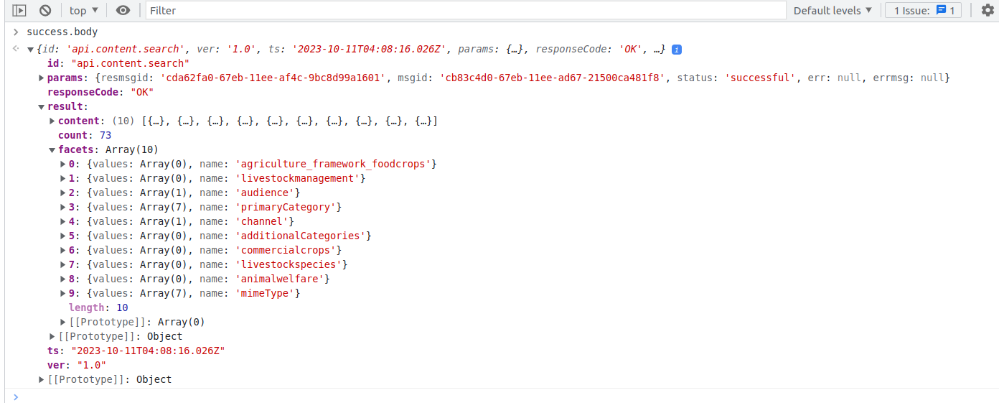

# Gap Analysis for Framework Details

## Introduction: <a href="#gapanalysisforframeworkdetails-introduction" id="gapanalysisforframeworkdetails-introduction"></a>

* Introduction:
  * Background:
  * Problem Statement :
  * User-Type Selection for Onboarding
    * Problem
    * Solution : Approach
  * Onboarding flow of BMGS Selection
    * Problem
  * Support multiple framework categories
    * Problem
    * Solution: Approach
  * Onboarding flow of Location page
    * Problem
    * Solution: Approach
  * Skip the Onboarding Steps
    * Problem
    * Solution : Approach
  * Update User Profile:
    * Problem
    * Solution: Approach
  * Search Filter and Applied filter
    * Problem
    * Solution : Approach
  * Consume trackable and non-trackable content
    * Solution :Approach

### Background: <a href="#gapanalysisforframeworkdetails-background" id="gapanalysisforframeworkdetails-background"></a>

​Currently, Sunbird has 4 types of static categories board, medium, grade, and subject(optional), If any adopter wants to use multiple categories with non-educational domain then we have to change the label static to dynamic (category1, category2, category3 …. categoryN) and allow the 1 to n number of categories and update the required form configuration, and allow the end-to-end creation and consumption of course (+ certificate issuance), textbook and reports

Jira ticket: [ED-1959](https://project-sunbird.atlassian.net/browse/ED-1959) - Getting issue details... STATUS

### **Problem Statement :** <a href="#gapanalysisforframeworkdetails-problemstatement" id="gapanalysisforframeworkdetails-problemstatement"></a>

* [User Type selection](https://project-sunbird.atlassian.net/wiki/spaces/SUN/pages/3342696449/Gap+Analysis+for+Framework+Details#User-Type-Selection)
* [Remove BMGS framework label.](https://project-sunbird.atlassian.net/wiki/spaces/SUN/pages/3342696449/Gap+Analysis+for+Framework+Details#BMGS-Selection)
* [Add multiple framework categories in local DB](https://project-sunbird.atlassian.net/wiki/spaces/SUN/pages/3342696449/Gap+Analysis+for+Framework+Details#Support-multiple-framework-categories)
* [Configure user location and skip the location](https://project-sunbird.atlassian.net/wiki/spaces/SUN/pages/3342696449/Gap+Analysis+for+Framework+Details#Onboarding-flow-of-Location-page)
* [Skip the onboarding steps](https://project-sunbird.atlassian.net/wiki/spaces/SUN/pages/3342696449/Gap+Analysis+for+Framework+Details#Skip-the-Onboarding-Steps).
* [Manage facet filters for searching in multiple framework categories](https://project-sunbird.atlassian.net/wiki/spaces/SUN/pages/3342696449/Gap+Analysis+for+Framework+Details#Search-Filter-and-Applied-filter)
* [Consume trackable and non-trackable content, update the progress and get certificate](https://project-sunbird.atlassian.net/wiki/spaces/SUN/pages/3342696449/Gap+Analysis+for+Framework+Details#Consume-trackable-and-non-trackable-content)
* Suppose the default framework is framework 1. So, it shows board, medium and grade labels on the onboarding page. Now we select framework 2. Then the BMG label will change to department, block or what happens?

### User-Type Selection for Onboarding <a href="#gapanalysisforframeworkdetails-user-typeselectionforonboarding" id="gapanalysisforframeworkdetails-user-typeselectionforonboarding"></a>

* Will work as per the proposed system with config changes ?
* Will work as per the proposed system with config changes & minor code changes ?
* Hardcoded & major code changes required to work as per the proposed system ?

#### Problem <a href="#gapanalysisforframeworkdetails-problem" id="gapanalysisforframeworkdetails-problem"></a>

How to configure user type selection page if a new framework introduced

Audience-filter

1. ```
    if (this.profile?.profileType === ProfileType.STUDENT) {
           this.audienceFilter = AudienceFilter.GUEST_STUDENT;
         } 
         
         const requestParams: ContentRequest = {
         uid: this.profile ? this.profile.uid : undefined,
         primaryCategories: [],
         audience: this.audienceFilter,
         recentlyViewed: false,
       };
       this.contentService.getContents(requestParams).subscribe((data) => {
         this.ngZone.run(() => {
           this.locallyDownloadResources = data;
         });
       });
     }
   ```

Hardcode userType label

1. ```
   "AVAILABLE_FOR_TEACHERS": "Available only for teachers ", 
   "LEADER": "Head Teacher & Officials " 
   BTN_I_AM_A_TEACHER = 'btn-i-am-a-teacher', 
   TEACHER_DECLARATION = 'teacher-declaration', 
   TEACHER_SELF_DECLARATION = 'teacher-self-declaration', 
   "USER_TYPE_1": "Teacher", 
   "USER_TYPE_2": "Student", 
   "USER_TYPE_3": "Other", 
   "USER_TYPE_5": "Parent",
   ```

#### Solution : [Approach](https://project-sunbird.atlassian.net/wiki/spaces/SUN/pages/3355607062/Design+of+hardcoded+BMGS+removal#User-type-selection-%3A) <a href="#gapanalysisforframeworkdetails-solution-approach" id="gapanalysisforframeworkdetails-solution-approach"></a>

### Onboarding flow of BMGS Selection <a href="#gapanalysisforframeworkdetails-onboardingflowofbmgsselection" id="gapanalysisforframeworkdetails-onboardingflowofbmgsselection"></a>

* Will work as per the proposed system with config changes ?
* Will work as per the proposed system with config changes & minor code changes ?
* Hardcoded & major code changes required to work as per the proposed system ?

#### Problem <a href="#gapanalysisforframeworkdetails-problem.1" id="gapanalysisforframeworkdetails-problem.1"></a>

How to change the label placeholder of the below BMGS screen?


There are some hardcoded of BMGS code for framework label and get framework details in onboarding page, guest and logIn profile page.

Hardcoded framework categories

```
export enum FrameworkCategoryCode {
    BOARD = 'board',
    MEDIUM = 'medium',
    GRADE_LEVEL = 'gradeLevel',
    SUBJECT = 'subject',
    TOPIC = 'topic',
    PURPOSE = 'purpose'
}
```

BMGS list for respective framework

```
 this.framework = await this.frameworkService.getFrameworkDetails({
            from: CachedItemRequestSourceFrom.SERVER,
            frameworkId: value[0],
            requiredCategories: FrameworkCategoryCodesGroup.DEFAULT_FRAMEWORK_CATEGORIES
          }).toPromise();

          const boardCategoryTermsRequet: GetFrameworkCategoryTermsRequest = {
            frameworkId: this.framework.identifier,
            requiredCategories: [FrameworkCategoryCode.BOARD],
            currentCategoryCode: FrameworkCategoryCode.BOARD,
            language: this.translate.currentLang
          };

          const boardTerm = (await this.frameworkUtilService.getFrameworkCategoryTerms(boardCategoryTermsRequet).toPromise())
            .find(b => b.name === (this.syllabusList.find((s) => s.code === value[0]).name));

          this.boardControl.patchValue([boardTerm.code]);

          const nextCategoryTermsRequet: GetFrameworkCategoryTermsRequest = {
            frameworkId: this.framework.identifier,
            requiredCategories: [FrameworkCategoryCode.MEDIUM],
            prevCategoryCode: FrameworkCategoryCode.BOARD,
            currentCategoryCode: FrameworkCategoryCode.MEDIUM,
            language: this.translate.currentLang,
            selectedTermsCodes: this.boardControl.value
          };

          this.mediumList = (await this.frameworkUtilService.getFrameworkCategoryTerms(nextCategoryTermsRequet).toPromise())
            .map(t => ({ name: t.name, code: t.code }));
          if (!this.mediumControl.value) {
            this.mediumControl.patchValue(this.profile.medium || []);
```

Framework details

```
getFrameworkDetails(guestProfile?: any) {
        const framework = {};
        const boardList = await this.getBoardList(guestProfile).then((board) => {
            return board.map(t => ({ name: t.name, code: t.code }));
        });

        const mediumList = await this.getMediumList(guestProfile).then((medium) => {
            return medium.map(t => ({ name: t.name, code: t.code }));
        });

        const gradeList = await this.getGradeList(guestProfile).then((grade) => {
            return grade.map(t => ({ name: t.name, code: t.code }));
        });

        const subjectList = await this.getSubjectList(guestProfile).then((subject) => {
            return subject.map(t => ({ name: t.name, code: t.code }));
        });
        framework['id'] = guestProfile.syllabus;
        if (guestProfile.board && guestProfile.board.length) {
            const code = typeof (guestProfile.board) === 'string' ? guestProfile.board : guestProfile.board[0];
            framework['board'] = [boardList.find(board => code === board.code).name];
        }
        if (guestProfile.medium && guestProfile.medium.length) {
            const Names = [];
            guestProfile.medium.forEach(element => {
                Names.push(mediumList.find(medium => element === medium.code).name);
            });
            framework['medium'] = Names;
        }
        if (guestProfile.grade && guestProfile.grade.length) {
            const Names = [];
            guestProfile.grade.forEach(element => {
                Names.push(gradeList.find(grade => element === grade.code).name);
            });
            framework['gradeLevel'] = Names;
        }
        if (guestProfile.subject && guestProfile.subject.length) {
            const Names = [];
            guestProfile.subject.forEach(element => {
                Names.push(subjectList.find(subject => element === subject.code).name);
            });
            framework['subject'] = Names;
        }
```

Get medium-list

```
 const nextCategoryTermsRequet: GetFrameworkCategoryTermsRequest = {
            frameworkId: this.framework.identifier,
            requiredCategories: [FrameworkCategoryCode.MEDIUM],
            prevCategoryCode: FrameworkCategoryCode.BOARD,
            currentCategoryCode: FrameworkCategoryCode.MEDIUM,
            language: this.translate.currentLang,
            selectedTermsCodes: this.boardControl.value
          };

          this.mediumList = (await this.frameworkUtilService.getFrameworkCategoryTerms(nextCategoryTermsRequet).toPromise())
            .map(t => ({ name: t.name, code: t.code }));
```

Get grade-list

```
const nextCategoryTermsRequet: GetFrameworkCategoryTermsRequest = {
            frameworkId: this.framework.identifier,
            requiredCategories: [FrameworkCategoryCode.GRADE_LEVEL],
            prevCategoryCode: FrameworkCategoryCode.MEDIUM,
            currentCategoryCode: FrameworkCategoryCode.GRADE_LEVEL,
            language: this.translate.currentLang,
            selectedTermsCodes: this.mediumControl.value
          };

          this.gradeList = (await this.frameworkUtilService.getFrameworkCategoryTerms(nextCategoryTermsRequet).toPromise())
            .map(t => ({ name: t.name, code: t.code }));
```

Update BMG validator

```
  switch (attribute) {
        case 'board':
          subscriptionArray.push(this.onSyllabusChange());
          this.boardControl.setValidators((c) => c.value.length ? undefined : { length: 'NOT_SELECTED' });
          break;
        case 'medium':
          subscriptionArray.push(this.onMediumChange());
          this.mediumControl.setValidators((c) => c.value.length ? undefined : { length: 'NOT_SELECTED' });
          break;
        case 'gradeLevel':
          subscriptionArray.push(this.onGradeChange());
          this.gradeControl.setValidators((c) => c.value.length ? undefined : { length: 'NOT_SELECTED' });
          break;
      }
```

content metadata

```
            <p *ngIf="contentData?.se_gradeLevels || contentData.gradeLevel">{{'CLASS' | translate}} : {{contentData?.se_gradeLevels || contentData.gradeLevel}}</p>
            <p *ngIf="contentData?.se_mediums || contentData.medium">{{'MEDIUM' | translate}} : {{contentData?.se_mediums || contentData.medium}}</p>
            <p *ngIf="contentData?.se_boards || contentData.board">{{'BOARD' | translate}} : {{contentData?.se_boards || contentData.board}}</p>
            <p *ngIf="contentData?.audience">{{'USER_TYPE' | translate}} : {{contentData?.audience}}</p>
```

**Solution**: [Approach](https://project-sunbird.atlassian.net/wiki/spaces/SUN/pages/3355607062/Design+of+hardcoded+BMGS+removal#Framework-selection-page\(BMGS-removal\)%3A)

### **Support multiple framework categories** <a href="#gapanalysisforframeworkdetails-supportmultipleframeworkcategories" id="gapanalysisforframeworkdetails-supportmultipleframeworkcategories"></a>

* Will work as per the proposed system with config changes ?
* Will work as per the proposed system with config changes & minor code changes ?
* Hardcoded & major code changes required to work as per the proposed system ?

#### **Problem** <a href="#gapanalysisforframeworkdetails-problem.2" id="gapanalysisforframeworkdetails-problem.2"></a>

How to add multiple framework categories in local DB?

1. Profile updation in DB:-

Request for create new profile

1. ```
   {
       "userId": "07135164-2bb2-4450-b009-925fa6eb29dc",
       "name": "user-1",
       "framework": {
           "id": [
               "ekstep_ncert_k-12"
           ],
           "board": [
               "CBSE"
           ],
           "medium": [
               "English"
           ],
           "gradeLevel": [
               "Class 4"
           ],
           "subject": [
               "Environmental Studies"
           ]
       }
   }
   ```

Request for update profile

1. ```
   request: {
       "board": [
           "cbse"
       ],
       "grade": [
           "class3"
       ],
       "subject": [],
       "medium": [
           "english"
       ],
       "uid": "4268628e-2c95-4789-af97-234a953d9939",
       "handle": "Guest1",
       "profileType": "teacher",
       "source": "local",
       "createdAt": 1695902485725,
       "syllabus": [
           [
               "ekstep_ncert_k-12"
           ]
       ],
       "gradeValue": {
           "class3": "Class 3"
       }
   }
   ```

Previously all categories were saved in individual columns which is not scalable and can't support if a specific framework will have more than 4 categories.

| **board** | **medium** | **gradeLevel** | **subject** |
| --------- | ---------- | -------------- | ----------- |
| cbse      | english    | class1         | mathematics |

#### Solution: [Approach](https://project-sunbird.atlassian.net/wiki/spaces/SUN/pages/3355607062/Design+of+hardcoded+BMGS+removal#Skip-the-Onboarding-Steps-%3A) <a href="#gapanalysisforframeworkdetails-solution-approach.1" id="gapanalysisforframeworkdetails-solution-approach.1"></a>

**b) Content DB :** The same DB migration will be also applied to the content table.

### Onboarding flow of Location page <a href="#gapanalysisforframeworkdetails-onboardingflowoflocationpage" id="gapanalysisforframeworkdetails-onboardingflowoflocationpage"></a>

* Will work as per the proposed system with config changes ?
* Will work as per the proposed system with config changes & minor code changes ?
* Hardcoded & major code changes required to work as per the proposed system ?

#### **Problem** <a href="#gapanalysisforframeworkdetails-problem.3" id="gapanalysisforframeworkdetails-problem.3"></a>

How to configure user location page, so we can change the label and add the label without any code change?

location UI in profile page

```
  <div *ngIf="userLocation?.state && userLocation?.state?.name && userLocation?.state?.name?.length">
        <span class="bolder">{{'STATE' | translate}}: </span>
        <span>{{userLocation.state.name}}</span>
        <span *ngIf="!(userLocation?.state && userLocation?.state?.name && userLocation?.state?.name?.length)"
            class="lighter">{{'ADD_STATE' | translate}}</span>
    </div>
    <div *ngIf="userLocation?.district && userLocation?.district?.name && userLocation?.district?.name?.length">
        <span class="bolder">{{'DISTRICT' | translate}}: </span>
        <span>{{userLocation.district.name}}</span>
        <span
            *ngIf="!(userLocation?.district && userLocation?.district?.name && userLocation?.district?.name?.length)"
            class="lighter">{{'ADD_DISTRICT' | translate}}</span>
    </div>
    <div *ngIf="userLocation?.block && userLocation?.block?.name && userLocation?.block?.name?.length">
        <span class="bolder">{{'FRMELEMNTS_LBL_BLOCK' | translate}}: </span>
        <span>{{userLocation.block.name}}</span>
        <span *ngIf="!(userLocation?.block && userLocation?.block?.name && userLocation?.block?.name?.length)"
            class="lighter">{{'FRMELEMNTS_LBL_ADD_BLOCK' | translate}}</span>
    </div>
    <div *ngIf="userLocation?.cluster && userLocation?.cluster?.name && userLocation?.cluster?.name?.length">
        <span class="bolder">{{'FRMELEMNTS_LBL_CLUSTER' | translate}}: </span>
        <span>{{userLocation.cluster.name}}</span>
        <span *ngIf="!(userLocation?.cluster && userLocation?.cluster?.name && userLocation?.cluster?.name?.length)"
            class="lighter">{{'FRMELEMNTS_LBL_ADD_CLUSTER' | translate}}</span>
    </div>
    <div *ngIf="userLocation" class="location text-center">
        <div *ngIf="userLocation?.school && userLocation?.school?.name && userLocation?.school?.name?.length">
            <span  class="bolder">{{'FRMELEMNTS_LBL_SCHOOL' | translate}}: </span>
            <span>{{userLocation.school.name}}</span>
            <span *ngIf="!(userLocation?.school && userLocation?.school?.name && userLocation?.school?.name?.length)"
                class="lighter">{{'FRMELEMNTS_LBL_ADD_SCHOOL' | translate}}</span>
        </div>
```

Get user location

```
 getUserLocation(profile: any) {
        const userLocation = {
            state: {},
            district: {}
        };
        if (profile && profile.userLocations && profile.userLocations.length) {
            for (let i = 0, len = profile.userLocations.length; i < len; i++) {
                if (profile.userLocations[i].type === 'state') {
                    userLocation.state = profile.userLocations[i];
                } else if (profile.userLocations[i].type === 'district') {
                    userLocation.district = profile.userLocations[i];
                }
            }
        }

        return userLocation;
    }
```

Organization location

```
  getOrgLocation(organisation: any) {
        const location = { 'state': '', 'district': '', 'block': '' };
        if (organisation.locations) {
            for (let j = 0, l = organisation.locations.length; j < l; j++) {
                if (organisation.locations[j]) {
                    switch (organisation.locations[j].type) {
                        case 'state':
                            location.state = organisation.locations[j];
                            break;

                        case 'block':
                            location.block = organisation.locations[j];
                            break;

                        case 'district':
                            location.district = organisation.locations[j];
                            break;

                        default:
                            console.log('default');
                    }
                }
            }
        }
        return location;
    }
```

#### Solution: [Approach](https://project-sunbird.atlassian.net/wiki/spaces/SUN/pages/3355607062/Design+of+hardcoded+BMGS+removal#Location-page-%3A) <a href="#gapanalysisforframeworkdetails-solution-approach.2" id="gapanalysisforframeworkdetails-solution-approach.2"></a>

### Skip the Onboarding Steps <a href="#gapanalysisforframeworkdetails-skiptheonboardingsteps" id="gapanalysisforframeworkdetails-skiptheonboardingsteps"></a>

* Will work as per the proposed system with config changes ?
* Will work as per the proposed system with config changes & minor code changes ?
* Hardcoded & major code changes required to work as per the proposed system ?

#### **Problem** <a href="#gapanalysisforframeworkdetails-problem.4" id="gapanalysisforframeworkdetails-problem.4"></a>

How can skip the onboarding page and land to the Home page?

#### **Solution :** [**Approach**](https://project-sunbird.atlassian.net/wiki/spaces/SUN/pages/3355607062/Design+of+hardcoded+BMGS+removal#Skip-the-Onboarding-Steps-%3A) <a href="#gapanalysisforframeworkdetails-solution-approach.3" id="gapanalysisforframeworkdetails-solution-approach.3"></a>

### Update User Profile: <a href="#gapanalysisforframeworkdetails-updateuserprofile" id="gapanalysisforframeworkdetails-updateuserprofile"></a>

* Will work as per the proposed system with config changes ?
* Will work as per the proposed system with config changes & minor code changes ?
* Hardcoded & major code changes required to work as per the proposed system ?

#### **Problem** <a href="#gapanalysisforframeworkdetails-problem.5" id="gapanalysisforframeworkdetails-problem.5"></a>

How to update profile framework with category key instead of BMGS?

#### Solution: [**Approach**](https://project-sunbird.atlassian.net/wiki/spaces/SUN/pages/3355607062/Design+of+hardcoded+BMGS+removal#Update-User-Profile%3A) <a href="#gapanalysisforframeworkdetails-solution-approach.4" id="gapanalysisforframeworkdetails-solution-approach.4"></a>


### Search Filter and Applied filter <a href="#gapanalysisforframeworkdetails-searchfilterandappliedfilter" id="gapanalysisforframeworkdetails-searchfilterandappliedfilter"></a>

* Will work as per the proposed system with config changes ?
* Will work as per the proposed system with config changes & minor code changes ?
* Hardcoded & major code changes required to work as per the proposed system ?

#### **Problem** <a href="#gapanalysisforframeworkdetails-problem.6" id="gapanalysisforframeworkdetails-problem.6"></a>

How to manage facet filters for searching in multiple framework categories?

facet filters

```
this.filterCriteria.facetFilters.forEach(facet => {
      if (facet.values && facet.values.length > 0) {
        if (facet.name === 'gradeLevel') {
          const maxIndex: number = facet.values.reduce((acc, val) => (val.index && (val.index > acc)) ? val.index : acc, 0);
          facet.values.sort((i, j) => (i.index || maxIndex + 1) - (j.index || maxIndex + 1));
        } else if (facet.name === 'audience') {
          facet.values.sort((i, j) => i.name.localeCompare(j.name));
          facet.values.forEach((element, index) => {
            this.supportedUserTypesConfig.forEach((userType, newIndex) => {
              if (userType['ambiguousFilters'].includes(element.name)) {
                element.name = userType['code'];
              }
            });

          });
          facet.values = this.commonUtilService.deDupe(facet.values, 'name');
```

#### **Solution :** [**Approach**](https://project-sunbird.atlassian.net/wiki/spaces/SUN/pages/3355607062/Design+of+hardcoded+BMGS+removal#Search-Filter-and-Applied-filter-%3A) <a href="#gapanalysisforframeworkdetails-solution-approach.5" id="gapanalysisforframeworkdetails-solution-approach.5"></a>

**Search Filter testing with agriculture framework**


New api’s path:

```
path: '/api/content/v1/search?framework=agriculture_framework&lang=en&orgdetails=orgName'
```

New search request:

```
{
    "request": {
        "query": "content",
        "offset": 0,
        "limit": 10,
        "mode": "soft",
        "exists": [],
        "facets": [
            "foodcrops",
            "commercialcrops",
            "livestockmanagement",
            "livestockspecies",
            "animalwelfare",
            "primaryCategory",
            "channel",
            "mimeType",
            "audience",
            "additionalCategories"
        ],
        "sort_by": {},
        "filters": {
            "audience": [],
            "objectType": [
                "Content",
                "QuestionSet"
            ],
            "contentType": [],
            "primaryCategory": [],
            "se_mediums": [],
            "se_boards": [],
            "language": [],
            "topic": [],
            "purpose": [],
            "channel": [],
            "mimeType": [],
            "subject": []
        }
    }
}
```

**Response:**



Contents are not available for agriculture\_framework, so all the categories values are empty.

### Consume trackable and non-trackable content <a href="#gapanalysisforframeworkdetails-consumetrackableandnon-trackablecontent" id="gapanalysisforframeworkdetails-consumetrackableandnon-trackablecontent"></a>

* Will work as per the proposed system with config changes ?
* Will work as per the proposed system with config changes & minor code changes ?
* Hardcoded & major code changes required to work as per the proposed system ?

We implemented how to consume trackable and non-trackable content, calculate the course progress and getting certificate flow

#### Solution :[Approach](https://project-sunbird.atlassian.net/wiki/spaces/SUN/pages/3355607062/Design+of+hardcoded+BMGS+removal#Content-Cosumption) <a href="#gapanalysisforframeworkdetails-solution-approach.6" id="gapanalysisforframeworkdetails-solution-approach.6"></a>
