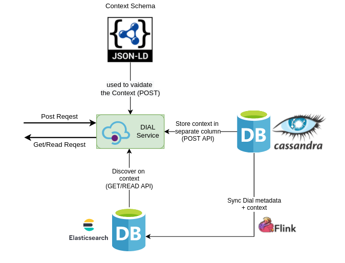
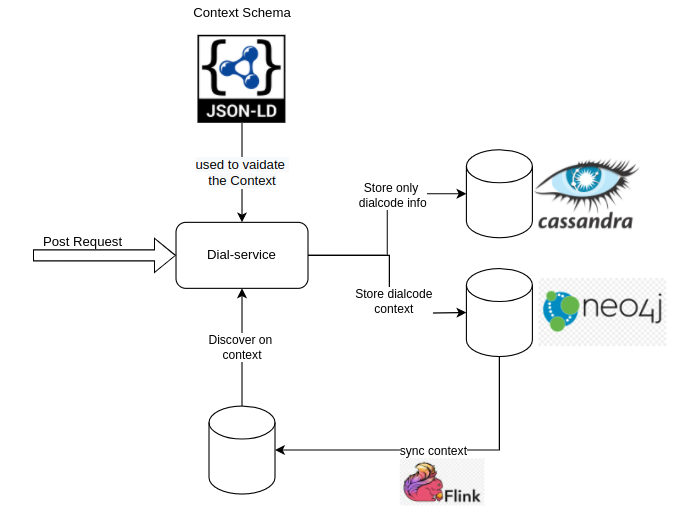
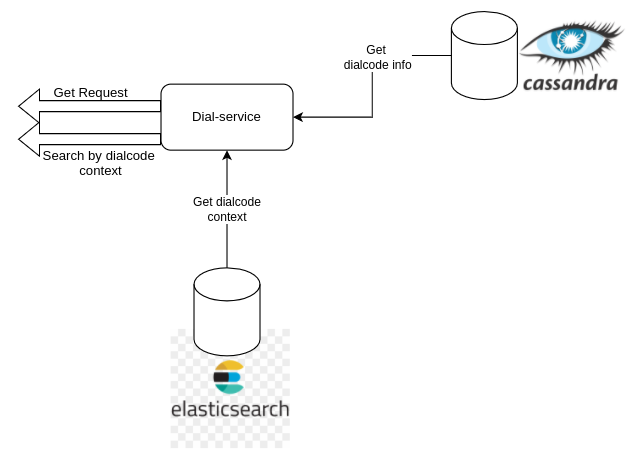

# Dialcode context

* Introduction:
* Background:
* Problem Statement:
* Key design problems:
* Design:
  * How to define JSON-LD schema?
* JSON-LD Samples
  * Context whitout @graph
    *
      * End-point:
      * @context:
    * Textbook: http://example.org/dialcode-textbook.json
      * Request:
      * Response:
    * Certificate: http://example.org/dialcode-cert.json
      * Request:
      * Response:
    * Pros:
    * Cons:
  * Context with @graph
    * Textbook: http://example.org/dialcode-textbook.json
      * Request:
      * Response:
    * Certificate: http://example.org/dialcode-cert.json
      * Request:
      * Response:
    * Pros:
    * Cons:
  * Context with @graph & Validation
    * JSON-LD Frame
    * JSON-LS Input
    * Sample:
  * references:
  * Solution 1:
    * APIs:
    * Generate DIAL code API
      * request:
      * response:
    * Update DIAL code API
      * request:
      * response:
    * Read DIAL code API
      * response:
      * Pros:
      * Cons:
  * Solution 2:
    * Post: DIAL code context
    * Get: DIAL code context
      * Pros:
      * Cons:
  * Reference links:
  * MOM:

### Introduction: <a href="#dialcodecontext-introduction" id="dialcodecontext-introduction"></a>

This document describes how to get the DIAL code context information.

### Background: <a href="#dialcodecontext-background" id="dialcodecontext-background"></a>

At present, the dial-service is not storing any information/context about the DIAL code linked to what(ex Textbook, Textbook unit, etc). So if we want to get the DIAL code context information we should always use the content-search API to get the DIAL code linked content details.

If we want to extend the use-case to Bazaar, using DIAL code scan if they want to get the context(like BGMS etc) information to show the relevant contents which adopters having is not possible at the moment.

Jira Story: [SB-28757](https://project-sunbird.atlassian.net/browse/SB-28757) - Getting issue details... STATUS

Discussion: [https://github.com/sunbird-specs/DIAL-specs/discussions/2](https://github.com/sunbird-specs/DIAL-specs/discussions/2)

### Problem Statement: <a href="#dialcodecontext-problemstatement" id="dialcodecontext-problemstatement"></a>

Should return the context information of the DIAL code to which it is linked?

### Key design problems: <a href="#dialcodecontext-keydesignproblems" id="dialcodecontext-keydesignproblems"></a>

How to store the context information of the DIAL code to which it is linked?

How to get the context information using the existing `dial/{dialcode}` API?

How to validate the context information stored against the DIAL code?

How to define the customized validation schema specific to the domain/product?

### Design: <a href="#dialcodecontext-design" id="dialcodecontext-design"></a>

#### How to define JSON-LD schema? <a href="#dialcodecontext-howtodefinejson-ldschema" id="dialcodecontext-howtodefinejson-ldschema"></a>

* **Customize schema:** Customer/Host provider can define their own JSON-LD schema to validate the context.
* **Single Schema for all use-cases**: The single JSON-LD schema for all the different user-cases of validating the context properties. The same schema can we updated for new properties of new use-cases.
* **Validation:** We are validating only the properties which are passing in the request (as context) are exist in schema or not and the property value type. We are not validating the mandatory & optional properties of different use-cases.

Sample JSON-LD schema

[https://github.com/sunbird-specs/DIAL-specs/blob/main/v1/schema.jsonld](https://github.com/sunbird-specs/DIAL-specs/blob/main/v1/schema.jsonld)

## JSON-LD Samples <a href="#dialcodecontext-json-ldsamples" id="dialcodecontext-json-ldsamples"></a>

### [Context whitout @graph](https://json-ld.org/playground/#startTab=tab-flattened\&copyContext=true\&json-ld=%7B%22%40context%22%3A%7B%22schema%22%3A%22http%3A%2F%2Fschema.org%2F%22%2C%22framework%22%3A%7B%22%40id%22%3A%22schema%3Aname%23framework%22%2C%22%40type%22%3A%22schema%3Aname%22%7D%2C%22board%22%3A%7B%22%40id%22%3A%22schema%3Aname%23board%22%2C%22%40type%22%3A%22schema%3Aname%22%7D%2C%22medium%22%3A%7B%22%40id%22%3A%22schema%3Aname%23medium%22%2C%22%40type%22%3A%22schema%3Aname%22%7D%2C%22gradeLevel%22%3A%7B%22%40id%22%3A%22schema%3Aname%23grade\_level%22%2C%22%40type%22%3A%22%40id%22%2C%22%40container%22%3A%22%40list%22%7D%2C%22subject%22%3A%7B%22%40id%22%3A%22schema%3Aname%23subject%22%2C%22%40type%22%3A%22%40id%22%2C%22%40container%22%3A%22%40list%22%7D%2C%22textbook%22%3A%22schema%3ABook%22%2C%22textBookUnit%22%3A%22schema%3AChapter%22%2C%22certificate-test%22%3A%22schema%3ACourse%22%7D%2C%22%40id%22%3A%22http%3A%2F%2Fexample.org%2Fdialcode%2F1234%22%2C%22%40type%22%3A%22schema%3ACode%22%2C%22board%22%3A%22AP%22%2C%22framework%22%3A%22NCF%22%2C%22medium%22%3A%22English%22%2C%22subject%22%3A%5B%22Maths%22%2C%22Social%22%5D%2C%22gradeLevel%22%3A%22Grande%201%22%2C%22textbook%22%3A%7B%22%40id%22%3A%22http%3A%2F%2Fexample.org%2Fcollection%2F4728-2345-2343-3455%22%2C%22identifier%22%3A%224728-2345-2343-3455%22%2C%22name%22%3A%22Sample%20textbook%22%7D%2C%22textBookUnit%22%3A%7B%22name%22%3A%22Unit%20name%22%7D%2C%22certificate%22%3A%7B%22%40id%22%3A%22http%3A%2F%2Fexample.org%2Fcert%2F1%22%2C%22name%22%3A%22Course%20completion%22%7D%2C%22course%22%3A%7B%22name%22%3A%22Course%20name%22%7D%7D\&frame=%7B%7D) <a href="#dialcodecontext-contextwhitout-graph" id="dialcodecontext-contextwhitout-graph"></a>

**End-point:**

```
{host}/v1/dialcode/update/V1T2P8
```

> note:\
> V1T2P8 -> DIAL code used to link the content

**@context:**

Context information will be stored in the JSON file. Which can be configured/defined by the user specific to each context type. User can send the request of specific context, which will be validated against this JSON-LD context file.

> note:\
> Here we are not using `@graph` object declaration in the context data/file.\
> Hence all the context information will be stored against single graph node of the DIAL code.(if we use graph DB to store)

Examples:

*   For `Textbook`: [http://example.org/dialcode-textbook.json](http://example.org/dialcode-textbook.json)

    For `certificate`: [http://example.org/dialcode-cert.json](http://example.org/dialcode-cert.json)

#### `Textbook`: [http://example.org/dialcode-textbook.json](http://example.org/dialcode-textbook.json) <a href="#dialcodecontext-textbook-http-example.org-dialcode-textbook.json" id="dialcodecontext-textbook-http-example.org-dialcode-textbook.json"></a>

Context file data to validation when textbook is linked to dialcode

```
{
    "@context": {
        "schema": "http://schema.org/",
        "framework": {
            "@id": "schema:name#framework",
            "@type": "schema:name"
        },
        "board": {
            "@id": "schema:name#board",
            "@type": "schema:name"
        },
        "medium": {
            "@id": "schema:name#medium",
            "@type": "schema:name"
        },
        "gradeLevel": {
            "@id": "schema:name#grade_level",
            "@type": "@id",
            "@container": "@list"
        },
        "subject": {
            "@id": "schema:name#subject",
            "@type": "@id",
            "@container": "@list"
        },
        "textbook": "schema:Book",
        "textBookUnit": "schema:Chapter",
    }
}
```

**Request:**

```
{
  "request": {
    "dialcode": {
      "contextInfo": {  // OPTIONAL
        "@context": "http://example.org/dialcode-textbook.json", // URL path of context file
        "@id": "http://example.org/dialcode/V1T2P8",
        "board": "AP",
        "framework": "NCF",
        "medium": "English",
        "subject": ["Maths", "Social"],
        "gradeLevel": "Grande 1",
        "textbook": {
            "@id": "http://example.org/collection/4728-2345-2343-3455",
            "identifier": "4728-2345-2343-3455",
            "name": "Sample textbook"
        },
        "textBookUnit": {
            "name": "Unit name"
        },
      }
    }
  }
}
```

**Response:**

```
"id": "api.dialcode.update",
  "ver": "1.0",
  "ts": "2020-12-18T07:10:28.747Z",
  "params": {
    "resmsgid": "1bd1c5b0-4100-11eb-9b0c-abcfbdf41bc3",
    "msgid": "19fe8c50-4100-11eb-9b0c-abcfbdf41bc3",
    "status": "successful",
    "err": null,
    "errmsg": null
  },
  "responseCode": "OK",
  "result": {
    "identifier": "V1T2P8",
    "@id": "http://example.org/dialcode/V1T2P8",
  }

```

#### `Certificate`: [http://example.org/dialcode-cert.json](http://example.org/dialcode-cert.json) <a href="#dialcodecontext-certificate-http-example.org-dialcode-cert.json" id="dialcodecontext-certificate-http-example.org-dialcode-cert.json"></a>

Context file data to validation when textbook is linked to dialcode

```
{
    "@context": {
        "schema": "http://schema.org/",
        "certificate": "schema:CreativeWork",
        "course": "schema:Course"
    }
}
```

**Request:**

```
{
  "request": {
    "dialcode": {
      "contextInfo": {  // OPTIONAL
        "@context": "http://example.org/dialcode-cert.json", // URL path of context file
        "@id": "http://example.org/dialcode/V2T2P4",
        
        "certificate": {
            "@id": "http://example.org/cert/123",
            "name": "Certificate of Completion"
        },
        "course": {
            "@id": "http://example.org/course/4728-2345-2343-3455",
            "identifier": "4728-2345-2343-3455",
            "name": "Course Name"
        }
      }
    }
  }
}
```

**Response:**

```
"id": "api.dialcode.update",
  "ver": "1.0",
  "ts": "2020-12-18T07:10:28.747Z",
  "params": {
    "resmsgid": "1bd1c5b0-4100-11eb-9b0c-abcfbdf41bc3",
    "msgid": "19fe8c50-4100-11eb-9b0c-abcfbdf41bc3",
    "status": "successful",
    "err": null,
    "errmsg": null
  },
  "responseCode": "OK",
  "result": {
    "identifier": "V2T2P4",
    "@id": "http://example.org/dialcode/V2T2P4",
  }

```

#### Pros: <a href="#dialcodecontext-pros" id="dialcodecontext-pros"></a>

* API request format is simple
* We can validate any invalid property has sent as part of request against the JSON-LD schema.

#### Cons: <a href="#dialcodecontext-cons" id="dialcodecontext-cons"></a>

* All the properties are storing against the single node object(DIAL code).

### [Context with @graph](https://json-ld.org/playground/#startTab=tab-flattened\&copyContext=true\&json-ld=%7B%22%40context%22%3A%7B%22schema%22%3A%22https%3A%2F%2Fschema.org%2F%22%2C%22framework%22%3A%7B%22%40id%22%3A%22dial%3Aframework%22%2C%22%40type%22%3A%22schema%3Aname%22%2C%22%40container%22%3A%22%40graph%22%7D%2C%22board%22%3A%7B%22%40id%22%3A%22dial%3Aboard%22%2C%22%40type%22%3A%22schema%3Aname%22%2C%22%40container%22%3A%22%40graph%22%7D%2C%22medium%22%3A%7B%22%40id%22%3A%22dial%3Amedium%22%2C%22%40type%22%3A%22schema%3Aname%22%2C%22%40container%22%3A%22%40graph%22%7D%2C%22gradeLevel%22%3A%7B%22%40id%22%3A%22dial%3AgradeLevel%22%2C%22%40type%22%3A%22%40id%22%2C%22%40container%22%3A%22%40graph%22%7D%2C%22subject%22%3A%7B%22%40id%22%3A%22schema%3Aname%23subject%22%2C%22%40type%22%3A%22%40id%22%2C%22%40container%22%3A%22%40graph%22%7D%2C%22textbook%22%3A%7B%22%40id%22%3A%22schema%3ABook%22%2C%22%40container%22%3A%22%40graph%22%7D%2C%22textBookUnit%22%3A%7B%22%40id%22%3A%22schema%3AChapter%22%2C%22%40container%22%3A%22%40graph%22%7D%2C%22certificate%22%3A%7B%22%40id%22%3A%22schema%3ACourse%22%2C%22%40type%22%3A%22%40id%22%2C%22%40container%22%3A%22%40graph%22%7D%7D%2C%22%40id%22%3A%22http%3A%2F%2Fexample.org%2Fdialcode%2F1234%22%2C%22%40type%22%3A%22schema%3ACode%22%2C%22%40graph%22%3A%5B%7B%22%40id%22%3A%221%22%2C%22%40type%22%3A%22certificate%22%2C%22name%22%3A%22Course%20completion%22%7D%2C%7B%22%40id%22%3A%22http%3A%2F%2Fexample.org%2Fcollection%2F4728-2345-2343-3455%22%2C%22%40type%22%3A%22textbook-test%22%2C%22identifier%22%3A%224728-2345-2343-3455%22%2C%22name%22%3A%22Sample%20textbook%22%2C%22realtion%22%3A%22child%2Fparent%22%7D%2C%7B%22%40id%22%3A%22framework%2F1%22%2C%22%40type%22%3A%22framework%22%2C%22name%22%3A%22NCF%22%2C%22associatedTo%22%3A%22http%3A%2F%2Fexample.org%2Fcollection%2F4728-2345-2343-3455%22%7D%5D%7D\&frame=%7B%7D) <a href="#dialcodecontext-contextwith-graph" id="dialcodecontext-contextwith-graph"></a>

Here we are using `@graph` declaration in the context for JSON-LD declaration. Hence user has to send the `request` also in the `graph` format so that we can validate the request against the `@context` declaration.

We are taking he same examples of `Textbook` & `Certificate` explained above.

#### `Textbook`: [http://example.org/dialcode-textbook.json](http://example.org/dialcode-textbook.json) <a href="#dialcodecontext-textbook-http-example.org-dialcode-textbook.json.1" id="dialcodecontext-textbook-http-example.org-dialcode-textbook.json.1"></a>

Context file data to validation when textbook is linked to DIAL code

```
{
  "@context": {
    "schema": "http://schema.org/",
    "dial": "https://example.org/dial"
  },
  "@graph": [
    {
      "@id": "framework",
      "@type": "schema:name",
      "rdfs:comment": "Class to represent a framework.",
      "rdfs:label": "framework",
      "rdfs:subClassOf": {
        "@id": "schema:CreativeWork"
      }
    },
    {
      "@id": "DIALCode",
      "@type": "schema:Code",
      "rdfs:comment": "Class to represent a DIAL code.",
      "rdfs:label": "DIALCode",
      "rdfs:subClassOf": {
        "@id": "schema:Code"
      }
    }
  ]
}
```

**Request:**

```
{
  "request": {
    "dialcode": {
      "contextInfo": {
        "@context": {
          "@vocab": "http://example.org/",
          "linkedTo": {
            "@type": "@id"
          }
        },
        "@graph": [
          {
            "@id": "http://example.org/framework/1",
            "@type": "framework",
            "name": "NCF",
            "linkedTo": "http://example.org/textbook/1"
          },
          {
            "@id": "http://example.org/DIALCode/V1T2P8",
            "@type": "DIALCode",
            "name": "V1T2P8",
            "linkedTo": "http://example.org/framework/1"
          },
          {
            "@id": "http://example.org/textbook",
            "@type": "textbook",
            "identifier": "4728-2345-2343-3455",
            "name": "Textbook Name"
          }
        ]
      }
    }
  }
}
```

**Response:**

```
"id": "api.dialcode.update",
  "ver": "1.0",
  "ts": "2020-12-18T07:10:28.747Z",
  "params": {
    "resmsgid": "1bd1c5b0-4100-11eb-9b0c-abcfbdf41bc3",
    "msgid": "19fe8c50-4100-11eb-9b0c-abcfbdf41bc3",
    "status": "successful",
    "err": null,
    "errmsg": null
  },
  "responseCode": "OK",
  "result": {
    "identifier": "V1T2P8",
    "@id": "http://example.org/dialcode/V1T2P8",
  }

```

#### `Certificate`: [http://example.org/dialcode-cert.json](http://example.org/dialcode-cert.json) <a href="#dialcodecontext-certificate-http-example.org-dialcode-cert.json.1" id="dialcodecontext-certificate-http-example.org-dialcode-cert.json.1"></a>

Context file data to validation when certificate is linked to dialcode

```
{
    "@context": {
        "schema": "http://schema.org/",
      	"dial": "https://example.org/dial/"
    },
    "@graph": [
      {
        "@id": "dial:DIALCode",
        "@type": "dial:DIALCode",
            "rdfs:comment":  "Class to represent a DIAL code.",
            "rdfs:label": "DialCode",
            "rdfs:subClassOf": {
                "@id": "schema:Code"
            }
        },
        {
          "@id": "certificate",
            "@type": "dial:certificate",
            "rdfs:comment":  "Class to represent a Certificate.",
            "rdfs:label": "framework",
            "rdfs:subClassOf": {
                "@id": "schema:CreativeWork"
            }
        },
        {
          "@id": "course",
            "@type": "dial:course",
            "rdfs:comment":  "Class to represent a Course.",
            "rdfs:label": "Course",
            "rdfs:subClassOf": {
                "@id": "schema:CreativeWork"
            }
        }
    ]
}
```

**Request:**

```
{
  "request": {
    "dialcode": {
      "contextInfo": {
        "@context": {
          "@vocab": "http://example.org/dial",
          "linkedTo": {
            "@type": "@id"
          },
          "dial": "https://example.org/dial/"
        },
        "@graph": [
          {
            "@id": "http://example.org/DIALCode/V2T2P4",
            "@type": "dial:DIALCode",
            "name": "V2T2P4",
            "linkedTo": "http://example.org/cert/123"
          },
          {
            "@id": "http://example.org/cert/123",
            "@type": "dial:certificate",
            "name": "Certificate of Completion",
            "linkedTo": "http://example.org/course/4728-2345-2343-3455"
          },
          {
            "@id": "http://example.org/course4728-2345-2343-3455",
            "@type": "dial:course",
            "name": "Course Name",
            "linkedTo": "http://example.org/course/4728-2345-2343-3455"
          }
        ]
      }
    }
  }
}
```

**Response:**

```
"id": "api.dialcode.update",
  "ver": "1.0",
  "ts": "2020-12-18T07:10:28.747Z",
  "params": {
    "resmsgid": "1bd1c5b0-4100-11eb-9b0c-abcfbdf41bc3",
    "msgid": "19fe8c50-4100-11eb-9b0c-abcfbdf41bc3",
    "status": "successful",
    "err": null,
    "errmsg": null
  },
  "responseCode": "OK",
  "result": {
    "identifier": "V2T2P4",
    "@id": "http://example.org/dialcode/V2T2P4",
  }

```

#### Pros: <a href="#dialcodecontext-pros-.1" id="dialcodecontext-pros-.1"></a>

* We can define our own named node-objects & its relations(If we are storing in graph DB)

#### Cons: <a href="#dialcodecontext-cons-.1" id="dialcodecontext-cons-.1"></a>

* User can send the new graph node object which is not present in the JSON-LD context. It is still allowed to store. We have to explicitly validate this.
* The API request also need to change to send in the format of graph nodes

### [Context with @graph & Validation](https://file+.vscode-resource.vscode-webview.net/home/test/vinu/projects/experiments/json-ld/README.md) <a href="#dialcodecontext-contextwith-graph-and-validation" id="dialcodecontext-contextwith-graph-and-validation"></a>

* Validation of API request with JSON-LD context(Using JSON-LD Frame)

#### JSON-LD Frame <a href="#dialcodecontext-json-ldframe" id="dialcodecontext-json-ldframe"></a>

The frame object is used to validate the required object & properties present in the request or not.

```
{
  "@context": {
    "@vocab": "http://example.org/",
     "DIALCode": "schema:Code"
  },
  "@type": "DIALCode",
  "contains": {
    "@type": "Book",
    "sbName": "",
    "@requireAll": true,
     "contains": {
        "@type": "Chapter"
      }
  }
}
```

#### JSON-LS Input <a href="#dialcodecontext-json-lsinput" id="dialcodecontext-json-lsinput"></a>

```
{
  "@context": {
    "@vocab": "http://example.org/",
    "contains": {
      "@type": "@id"
    },
    "DIALCode": "schema:Code",
    "textbook": "schema:Book"
    
  },
  "@graph": [
     {
      "@id": "http://example.org/code",
      "@type": "DIALCode",
      "identifier": "123245",
       "name": "Some text",
      "contains": "http://example.org/dialcode/textbook/1"
    },
    {
      "@id": "http://example.org/dialcode/textbook/1",
      "@type": "Book",
      "name": "Textbook name",
      "identifier": "3453-2343-4535-3467",
      "contains": "http://example.org/dialcode/textbook/1/chapter/1"
    },
    {
      "@id": "http://example.org/dialcode/textbook/1/chapter/1",
      "@type": "Chapter",
      "name": "Chpter 1"
    }
  ]
}
```

#### Sample: <a href="#dialcodecontext-sample" id="dialcodecontext-sample"></a>

Sample test in playground tool

### references: <a href="#dialcodecontext-references" id="dialcodecontext-references"></a>

[https://linked.art/api/1.0/json-ld/](https://linked.art/api/1.0/json-ld/)\
[https://www.w3.org/TR/json-ld11/#named-graphs](https://www.w3.org/TR/json-ld11/#named-graphs)

[https://www.w3.org/TR/json-ld11-framing/#framing-named-graphs](https://www.w3.org/TR/json-ld11-framing/#framing-named-graphs)

### Solution 1: <a href="#dialcodecontext-solution1" id="dialcodecontext-solution1"></a>

* Use the existing metadata(rename to context) column to store the context information of the DIAL code as JSON string.
* Use [DIAL/update](http://docs.sunbird.org/latest/apis/dialapi/#operation/UpdateDialcode) API to update the context of the exiting DIAL codes.
* Add context while Generating the dialcodes(if it is common for all dialcodes which are generting)
* Restrict the context infomation to max(1000 characters).



#### APIs: <a href="#dialcodecontext-apis" id="dialcodecontext-apis"></a>

#### Generate DIAL code API <a href="#dialcodecontext-generatedialcodeapi" id="dialcodecontext-generatedialcodeapi"></a>

If user is generating more than one DIAL code and passing the context in request body then same context will be store for all DIAL code. Context will be optional while generate DIAL code.

`/v1/dialcode/generate`

**request:**

```
{
  "request": {
    "dialcodes": {
      "count": 5,
      "publisher": "publisher1",
      "batchCode": "b672038a-7660-49fe-abc9-2696de81931d",
      "context": {  // OPTIONAL
        "gradeLevel": "Class 5",
        "subject": "Math",
        "board": "Test Board",
        "medium": "English"
      }
    }
  }
}
```

**response:**

```
{
  "id": "api.dialcode.generate",
  "ver": "1.0",
  "ts": "2020-12-17T15:20:45.354Z",
  "params": {
    "resmsgid": "6f1208a0-407b-11eb-9b0c-abcfbdf41bc3",
    "msgid": "6ebeb880-407b-11eb-9b0c-abcfbdf41bc3",
    "status": "successful",
    "err": null,
    "errmsg": null
  },
  "responseCode": "OK",
  "result": {
    "dialcodes": [
      "N5U3S6",
      "U4X6A2",
      "K5W8G9",
      "Z7N4G2",
      "T8K1Y6"
    ],
    "count": 5,
    "batchcode": "b672038a-7660-49fe-abc9-2696de81931d",
    "publisher": "publisher1",
    "context": {
      "gradeLevel": "Class 5",
      "subject": "Math",
      "board": "Test Board",
      "medium": "English"
    }
  }
}
```

#### Update DIAL code API <a href="#dialcodecontext-updatedialcodeapi" id="dialcodecontext-updatedialcodeapi"></a>

`/v1/dialcode/update/{dialcode}`

**request:**

```
"request": {
  "dialcode": {
    "context": {
      "gradeLevel": "Class 5",
      "subject": "Math",
      "board": "Test Board",
      "medium": "English"
    }
  }
}
```

**response:**

```
{
  "id": "api.dialcode.update",
  "ver": "1.0",
  "ts": "2020-12-18T07:10:28.747Z",
  "params": {
    "resmsgid": "1bd1c5b0-4100-11eb-9b0c-abcfbdf41bc3",
    "msgid": "19fe8c50-4100-11eb-9b0c-abcfbdf41bc3",
    "status": "successful",
    "err": null,
    "errmsg": null
  },
  "responseCode": "OK",
  "result": {
    "identifier": "V1T2P8"
  }
}
```

#### Read DIAL code API <a href="#dialcodecontext-readdialcodeapi" id="dialcodecontext-readdialcodeapi"></a>

`/v1/dialcode/read/{dialcode}`

**response:**

```
{
  "id": "api.dialcode.read",
  "ver": "1.0",
  "ts": "2020-12-17T16:09:58.255Z",
  "params": {
    "resmsgid": "4f22f7f0-4082-11eb-9b0c-abcfbdf41bc3",
    "msgid": "4f21e680-4082-11eb-9b0c-abcfbdf41bc3",
    "status": "successful",
    "err": null,
    "errmsg": null
  },
  "responseCode": "OK",
  "result": {
    "dialcode": {
      "identifier": "V1T2P8",
      "channel": "sunbird",
      "publisher": "ef41a799-0438-4397-bbb4-a2a65aed4e55",
      "batchCode": "ede34398-5310-4009-a49e-4f3dd0147c69",
      "status": "Draft",
      "generatedOn": "2020-12-17T16:09:13.008+0000",
      "publishedOn": null,
      "context": {
        "gradeLevel": "Class 5",
        "subject": "Math",
        "board": "Test Board",
        "medium": "English"
      }
    }
  }
}
```

**Pros:**

* Easy & quick solution to implement on the existing DB without any modifications in the DB.
* Discovery by doalcode context. We can do any queries on DIAL code metadata/context.

**Cons:**

* Duplicate entries in the context column, if the DIAL codes at linked to the child nodes of the same collection.
* Any update on the context information on the parent node should update all the child node context(multiple entires in the DB)

### Solution 2: <a href="#dialcodecontext-solution2" id="dialcodecontext-solution2"></a>

Separate DIAL code context information from dial-service metadata DB.

#### Post: DIAL code context <a href="#dialcodecontext-post-dialcodecontext" id="dialcodecontext-post-dialcodecontext"></a>



#### Get: DIAL code context <a href="#dialcodecontext-get-dialcodecontext" id="dialcodecontext-get-dialcodecontext"></a>



**Pros:**

* Discovery by context is not possible. We can’t do any queries on DIAL code metadata/context.
* Easy to store any unstructured data as nodes & give the relation between nodes. This helps to store different types of context with respect to multiple use-cases.
* Any update of the root level context is just a linking to different node.

**Cons:**

* Multiple DB’s involved for the simple service like dial-service.
*

### Reference links: <a href="#dialcodecontext-referencelinks" id="dialcodecontext-referencelinks"></a>

* JSON-LD reference: [https://linked.art/api/1.0/json-ld/](https://linked.art/api/1.0/json-ld/)
* DIAL spec: [https://github.com/sunbird-specs/DIAL-specs](https://github.com/sunbird-specs/DIAL-specs)

### MOM: <a href="#dialcodecontext-mom" id="dialcodecontext-mom"></a>

March 1, 2022

* Decided to not using @graph object declaration in the context data/file.
* Decided to use schema instead on frame object for validation. Understanding the frame object is overhead for adopter.
* Action Item: [Jayaprakash Narayanaswamy](https://project-sunbird.atlassian.net/wiki/people/5b9cb7fdb8c62b2c1fd970b5?ref=confluence) needs to build the POC for schema validation while accepting the request and return json-ld object in response.
