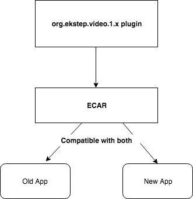

# Youtube in ECML content

### Introduction 

This wiki explains the design and implementation to make able to add YouTube videos in between slides while creating content.

### Background 

With the help of the video plugin `org.ekstep.video-1.x`, a content creator is made able to add/upload videos directly from Google Drive or by providing direct url of an mp4 video from online.

It is rendered using content-player's `VideoPlugin.js` and `org.ekstep.videorenderer-1.x core plugin`.

### Problem Statement 

Currently, in the content editor, a user can add/upload video only from Google drive or via direct URL of an mp4 video from online.\`

\* Creator cannot add YouTube video\
\* Limitations in the size of the video. \
\* Size of `ecar` file shoots up if there are more videos added in the content.

### Key Design Problems 

Currently, at the player's end, the uploaded video is rendered using HTML5 \`\<video>...\</video>\` tag. This does not allow us to add YouTube video to \`src\` attribute of \`video\` tag since YouTube does not work that way.

This forces us to go for a different helper function or a stable third-party library to make sure the content is rendered across all platforms.

Also, to comply with YouTube Licensing, a creator can add YouTube content to the resource only through `Generic Editor`.

it is an external content. cannot be added to the ECML content

### Solution 1- Existing LessonBrowser plugin 

When a user is trying to add a YouTube video from the new drop-down menu called \`Add YouTube\`, the existing \`LessonBrowser\` plugin will be invoked which has the video to show only YouTube content that were published on \`Generic Editor\`

#### Cons: 

Existing `LessonBrowser` does not support single select unless modified and also it is tightly coupled.

### Solution 2 - A new plugin -  ResourceBrowser 

In the `Content Editor`, a new plugin `Resource browser` will be created to allow `single select`.

and on the `renderer` side, we can use a third-party library called `video.js` to handle YouTube videos. This workflow is currently being using in `Content-Player` in `org.ekstep.videorenderer-1.x` plugin. We can use the same tested logic to implement in `org.ekstep.video-1.x` plugin.

We can identify with the use of regular expression if the source of the video is YouTube and call a different `createVideoElement` function which uses `video.js` to create a `<video>` tag.

This will become an HTML5 element rather than an `Iframe` and makes sure it can be rendered across platforms and devices.

#### Cons: 

1. Requires altogether an additional plugin&#x20;
2. Makes it a little complicated for the creator providing them with additional filter features.

### Solution 3 -  Using existing \`org.ekstep.video-x.x\` plugin 

When the `Add video` is triggered, the pop up will contain another tab to search/browse for already published YouTube resources on the platform. And in another tab, the existing workflow where the creator adds drive/mp4/WebM videos will remain unchanged.

\

We can make use of the existing `org.ekstep.video-x.x` plugin and modify it to make able the creator to look for YouTube videos with a minimal search option.

The creator can select a single video at a time and add it to the stage which is similar to the existing flow that a creator takes while adding a Drive/MP4 videos.

And on the renderer side, we can use a third-party library called `video.js` to handle YouTube videos. This workflow is currently being using in `Content-Player` in `org.ekstep.videorenderer-1.x` plugin. We can use the same tested logic to implement in `org.ekstep.video-1.x` plugin.&#x20;

We can identify with the use of regular expression if the source of the video is YouTube and call a different `createVideoElement` function which uses `video.js` to create a `<video>` tag.

This will become an HTML5 element rather than an `Iframe` and makes sure it can be rendered across platforms and devices with backward compatibility.

\

We will also make use of the default messaging that YouTube provides when a video is not available or there is no internet.

#### Pros 

1. There is only a little deviation from the current workflow.
2. Minimum work required compared to the previous two solutions.
3. `ecar` is bundling with `org.ekstep.video-1.x` plugin. So it will contain the required rendered code. So it will work on both new and old apps.

#### Conclusion.  

As discussed in the design review meeting, **#Solution 3** is chosen as a most viable solution.&#x20;

The solution should also take care of the following:

1. Bumping up of YouTube version compatibility&#x20;
2. Suitability/pragma field to address external content
3. Licensing of Youtube and ECML content. We have to update the license and it should have both ECML(CC by) & Youtube(standard/CC by)

\
