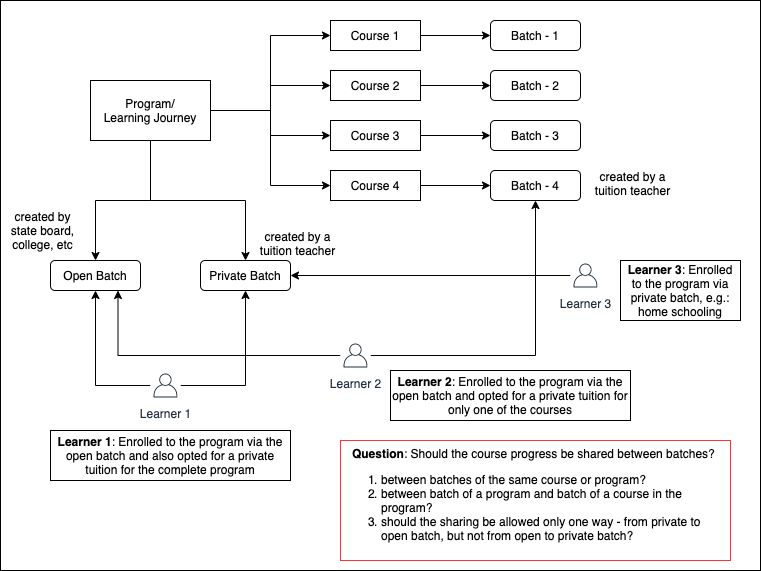
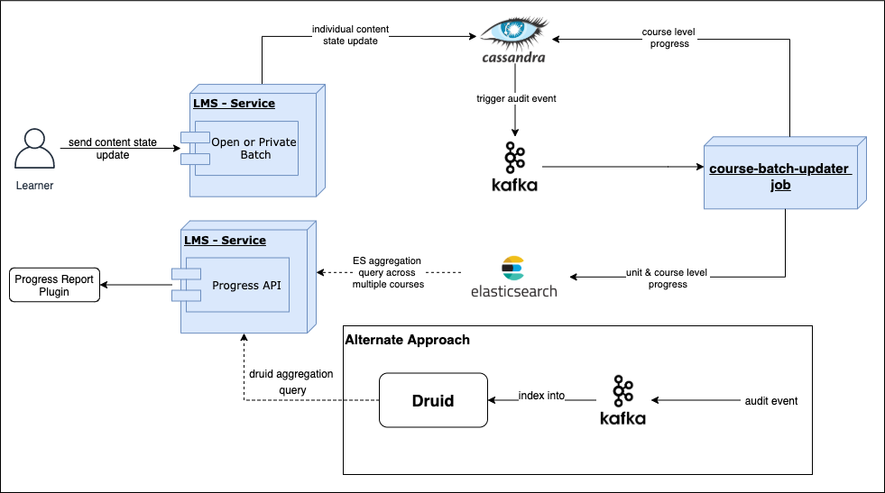

# e-Schooling---Batches

**Introduction** Course based learning is enabled in sunbird platform via batches. A course batch enables the following functionality:

* Enrolling learners into courses
* Tracking the progress of learners by mentors
* Open batches that allow any user to enrol for a course
* Private batches which allow only select users to be enrolled into a course

The current “batch” functionality suffices simple use cases of learning, but it needs to be enhanced to support advanced and more complex scenarios of learning (which are more prevalent in real world). For example, a batch can be currently associated with one course only and if a mentor wants to monitor multiple batches, it requires context switching. Similarly, if there are thousands of learners in a batch (e.g. open batches which enable organic learning), it is practically impossible for a mentor to track and guide one or more specific learners (who are the mentees of the mentor) to complete the course.

#### Future Capabilities

To serve a variety of learning and tutoring needs, there is a need to enhance the platform with the following capabilities (specifically in courses and learning modules):

* Tutors should be able to mentor a learner or a set of learners in multiple courses easily
* Tutors should be provided with multiple mentoring tools (e.g: assessments, progress report, grade book, announcements, etc) which can be used by the tutor to guide the learners
* Decouple the learning and mentoring aspects of learning, i.e. a learner should be able to take a course in an open or private batch created by one tutor and enrol for mentoring in these courses by a different tutor
* Tutors should be able to put special focus on a set of learners and also provide personalised mentoring for them

**Design** An important use case in learning is the ability to personalise the learning for a set of learners in the course depending on their current progress or score or some other criteria. Below are some examples:

* A private batch can be created for one or more courses and specific assessments can be released only for the learners enrolled to the course via this private batch.
* In an open batch, multiple sub-groups can be created and supplementary learning material, or assessments can be provided for each sub-group. For example, a sub-group could be the learners who scored less in an assessment and another sub-group could be of learners who enrolled into the course recently & needs to catch-up with the rest of the learners.
* A parent or a tuition teacher or a student can create a group of learners (who are taking multiple courses via different batches) to track, mentor or collaborate with the group in learning.

#### Program/Learning Journey

Currently, a batch can be created for only one course. This will be enhanced to enable a batch for a set of courses using a Program (or Learning Journey). It is a collection of courses and a mentor can create one batch for multiple courses. A learner gets enrolled to the complete collection but has the option to start/complete any course in the collection.

#### Group

A group is a collection of users and any user could create groups. In the context of batches, a group gets auto-created with all learners enrolled into the batch and in addition, mentors can create additional groups with a sub-set of learners in the batch. Groups can be created outside of batches also, e.g.: parents can create a group for their children to track their progress, a student can create a study circle (using groups) and collaborate with other students. Groups do not have any functional behaviour, but a functional plugin can be linked to a group to enable a set of functionality for the users in the group.

#### Functional Plugins

As mentioned above, groups will not have any functionality by themselves. To enable a functionality for users in the group, group owner must add a plugin to the group. Discussion forum is an example plugin which can be used to enable discussions among the users in the group.

* Plugins will have a config that needs to be configured while adding to a group. For example, “Progress Report” plugin should be configured with list of course identifiers and the progress of users in the configured courses will be available in the report. This config will be stored in the group metadata.
* Plugins use one or more platform or other APIs. In addition, they could have their own APIs. E.g.: Progress report will use the course search and content state API to get the course and progress details.
* Plugins should be embeddable within the client apps and instantiated with the appropriate config when launched within a group. **TODO: design for “group” plugins.**

Groups and Plugins usage in a course batch

* A group gets auto-created when a batch is created. All learners enrolled to the batch will become members of the group.
* “Progress Report” plugin gets automatically linked to the above group. This enables mentors in the batch to view the progress of learners in the courses related to the batch.
* Mentors can choose and add other plugins like “Discussion Forum”, “Leaderboard”, etc to the batch.

#### Progress Report

One of the important learning scenarios is to enable teachers, tutors, and parents to track progress of learners in multiple courses easily. “Progress Report” plugin can be used for this.

* List of course identifiers have to be configured in the Progress Report plugin. This plugin will fetch the progress of the group members in the configured list of courses.
* This plugin will also have metadata like board, medium, gradeLevel and subject to search for courses.
* The plugin config (along with the plugin Id) will be stored in the group metadata.

* In the first version, “Progress Report” plugin will be implemented as a tab in the group page. It will have options to:
  * view courses and add more courses to the list for tracking
  * view progress of the group members across the selected courses
* This plugin implementation will be enhanced to make plugins configurable and embeddable within a group.

#### Fetching course progress data from multiple courses

Progress Report plugin needs to fetch progress of learners in multiple courses that are consumed via one or more batches. For this, the course progress data needs to be collected and aggregated from different batches.

Currently, when a learner consumes a content, the corresponding content state update is sent to the “batch” micro-service which in turn updates the state of the content (for the specific learner in the batch and the course) in the database. The database generates an audit event into kafka which is then processed by course-batch-updater job which computes the progress at course level and writes it back in to the database. Following enhancements should be done in this job to support progress tracking in a tutoring batch:

* Compute the progress at course units level also. This is to enable progress view at a unit level.
* In addition to writing the aggregate data into the primary database (cassandra), the job should index the unit and course level progress info into elastic search also. ES aggregation queries can then be used to create a view to track the progress of learners across multiple courses.

An alternate approach is to leverage the telemetry pipeline and druid infra for this. If the audit event is generated with required rollup information (module, course and batch ids), then we can aggregate the progress at different levels using druid queries.

#### Group Plugins

In addition to progress tracking, there are several other plugins that can be used in a learning context:

* Discussion Forum: for learners to discuss on topics amongst themselves or with mentors for Q\&A discussions
* Leaderboard: a leaderboard of learners visible to all to show the top performers in a course, batch or a collection of courses
* Assessment: to conduct an exam for a group of learners as part of a course or in general
* Gradebook: a tool to view the scores achieved by learners in a list of assessments, will have different views for both learners and teachers
* Supplementary Material: additional learning material can be added in a course for a group of learners, mainly used for guiding learners to complete the course successfully
* Announcements: to send an announcement to a group of learners about an upcoming exam, web session, or other things
* Activity Stream: a social network type of stream for learners and teachers to share posts and updates with others

TODO items:

1. Design the plugin architecture to add new plugins in the platform, link plugins to a group, configure and launch plugins using the config
2. Implementation of multiple plugins using the plugin architecture

**Roadmap**

#### June 15:

* Groups
* Progress Report Plugin - first version, tightly coupled with group page.
* Fetching course progress data from multiple courses

***

\[\[category.storage-team]] \[\[category.confluence]]
