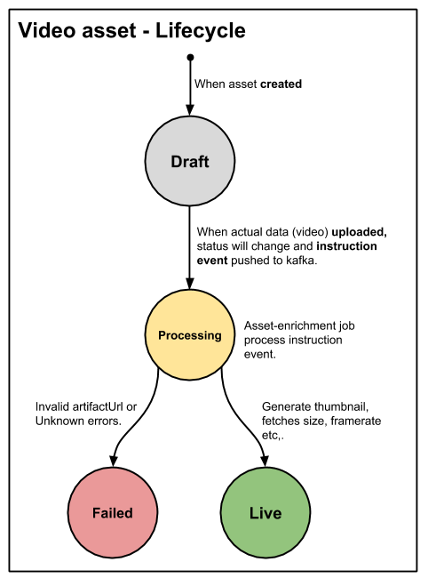
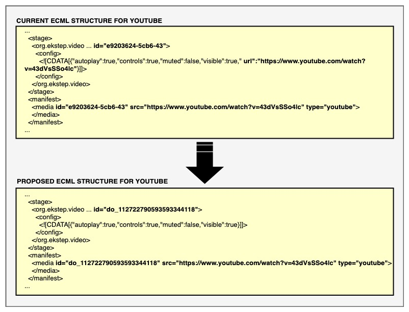
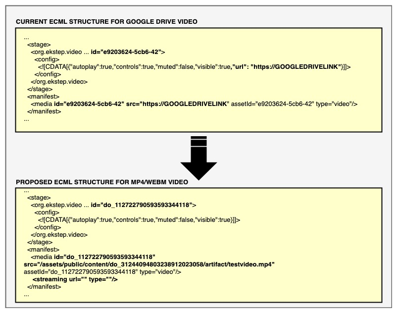

# \[Design discussion] ECML content with videos

### **Introduction:** <a href="#id-designdiscussion-ecmlcontentwithvideos-introduction" id="id-designdiscussion-ecmlcontentwithvideos-introduction"></a>

This wiki explains the key design problems and the design for them to use videos in ECML content.

### **Background:** <a href="#id-designdiscussion-ecmlcontentwithvideos-background" id="id-designdiscussion-ecmlcontentwithvideos-background"></a>

Currently, the creator can add a video into an ECML content by adding a Google Drive or Youtube URL (external public URL). If the external public URL of the video is taken down/ removed, the video becomes unavailable in ECML content. There is no way to restrict that from happening, though it continues to work on the mobile app as it was packaged inside ECAR for offline use.

### **Problem Statement:** <a href="#id-designdiscussion-ecmlcontentwithvideos-problemstatement" id="id-designdiscussion-ecmlcontentwithvideos-problemstatement"></a>

With the current approach, using external public URLs of the video creating problems when they become unavailable. So, we decided to use only Local and Youtube videos in ECML content.

1. The user should able to upload/browser local videos into ECML content.
2. Generating a streaming URL for the local/browsed video files added into ECML content.
3. Identify existing ECML content which has Google drive video support. Migrate all these Google drive videos to asset & update the body of the ECML content with the asset(Azure & streaming URL of the video)&#x20;

### **Key Design Problems:** <a href="#id-designdiscussion-ecmlcontentwithvideos-keydesignproblems" id="id-designdiscussion-ecmlcontentwithvideos-keydesignproblems"></a>

1. Create a video as an asset for Local/browsed video files, Youtube video links&#x20;
2. Create a streaming URL for video asset
3. Updating ECML with video asset after generating streaming URL
4. Backward compatibility & Migration
   1. Existing googl

### **Design**: <a href="#id-designdiscussion-ecmlcontentwithvideos-design" id="id-designdiscussion-ecmlcontentwithvideos-design"></a>

To add an image into ECML content we should create an asset of type image (image asset). All the image assets are part of cloud storage (platform saves them to cloud storage when the image is uploaded). So, they are always available and the editor enables the creator to reuse existing image assets.\
\
Similarly, create the local video as an asset (video asset) and enable the creator to browse and add it to ECML content. With this, all the videos will be available in the cloud storage.&#x20;


#### **Video asset - Lifecycle:** <a href="#id-designdiscussion-ecmlcontentwithvideos-videoasset-lifecycle" id="id-designdiscussion-ecmlcontentwithvideos-videoasset-lifecycle"></a>

Creating an asset will define its status as **Draft** by default along with given metadata. When the actual data (video) is uploaded, it's status will change to **Processing** by updating the artifactUrl and the **instruction event** will be pushed to Kafka for further processing.\
\
Below is the sample instruction event for video asset:

```
{
    "eid": "BE_JOB_REQUEST",
    "ets": 1551795222924,
    "mid": "LP.1551795222924.5f1b37ea-29ce-418c-b665-a5b2091c0f14",
    "actor":
    {
        "id": "Asset Enrichment Samza Job",
        "type": "System"
    },
    "context":
    {
        "pdata":
        {
            "ver": "1.0",
            "id": "org.ekstep.platform"
        },
        "channel": "in.ekstep",
        "env": "local"
    },
    "object":
    {
        "ver": "1551795170238",
        "id": "do_11271230463616614411"
    },
    "edata":
    {
        "action": "asset-enrichment",
        "iteration": 1,
        "mediaType": "video",
        "contentType": "Asset",
        "status": "Processing"
    }
}
```

\
Asset-enrichment job (image-tagging will be renamed as asset-enrichment) will read the instruction event and update its metadata with few more properties (size, thumbnail, framerate etc,.) and change the status to **Live**. In case of an unknown failure or invalid artifactUrl, the status will be updated as **Failed** with the error message.\
\
The asset-enrichment job will also trigger the async task (submitting azure media-service job) to generate _**streamingUrl**_.



## **Solution 1:** <a href="#id-designdiscussion-ecmlcontentwithvideos-solution1" id="id-designdiscussion-ecmlcontentwithvideos-solution1"></a>

#### **Change in ECML:** <a href="#id-designdiscussion-ecmlcontentwithvideos-changeinecml" id="id-designdiscussion-ecmlcontentwithvideos-changeinecml"></a>

For ECML content, **assets** are also added as an out-relations (**usesContent**).

Below is the change in ECML to support **video as an asset**.

1. Added **asset** attribute in the org.ekstep.video tag
2. Video renderer will play video based on the media tag’s attribute `src`, `streamingUrl`
   * `streamingUrl` will have more priority when both values are available.

**ECML:**

```
<stage>
	<manifest>
		<media assetId="do_31244094803238912023058"/> 
	</manifest>
	<org.ekstep.video asset="do_31244094803238912023058" y="7.9" x="10.97" w="78.4" h="79.51" rotate="0" z-index="0" id="b2600e00-0395-4d63-a3a1-3957db2dec12">
		<config>
			<![CDATA[{"autoplay":true,"controls":true,"muted":false,"visible":true}]]>
		</config>
	</org.ekstep.video>
</stage>

<manifest>
	<media id="do_31244094803238912023058" src="/assets/public/content/do_31244094803238912023058/artifact/testvideo.mp4" type="video">
		<streaming url="" type="" />
	</media>
</manifest>
```

\


#### **Video Streaming:** <a href="#id-designdiscussion-ecmlcontentwithvideos-videostreaming" id="id-designdiscussion-ecmlcontentwithvideos-videostreaming"></a>

Only for the content with videos require a separate process to generate streaming data and update the metadata. For video content (mimeType: video/\*), publish process is sending a request to video streaming job and updating **streamingUrl** as content metadata.

The same process is followed for video assets also using asset enrichment job.

A separate process will be triggered to check the status of all the assets used by an ecml. Once all the video assets for a particular ecml is updated with streamingUrl, the published index.ecml file will be updated with the streaming URL as stated above.


## **Solution 2:** <a href="#id-designdiscussion-ecmlcontentwithvideos-solution2" id="id-designdiscussion-ecmlcontentwithvideos-solution2"></a>

#### **Adding asset(video image, audio) information into content metadata object.**  <a href="#id-designdiscussion-ecmlcontentwithvideos-addingasset-videoimage-audio-informationintocontentmetadat" id="id-designdiscussion-ecmlcontentwithvideos-addingasset-videoimage-audio-informationintocontentmetadat"></a>

Instead of adding in the body of the ECML, we can create an array of objects in the metadata in which each object will have `type(`type of the streaming protocol ,  `streamingUrl`, and `assetId`.

In the player, we have to map the `media` object in the ECML body to `asset` object in the content metadata with the help of `assetId`.

\


```
{
    "identifier": "do_11246748805719654416",
    "language": ["English"],
    "mimeType": "application/vnd.ekstep.ecml-archive",
    ...
    "assets": [
        {
            "identifier": "do_3122672348172451841329",
            "mimetype": "video/mp4",
			"mediatype": "video"
			"type": "HLS",
            "streamingUrl": "https://ntppreprodmedia-inct.streaming.media.azure.net/dbfde611-fc77-457c-859-94f6c6974b/videoplayback.ism/manifest(format=m3u8-aapl-v3)",
        },
        {
            "assetId": "do_3122672348172451844568",
            "mediatype": "image",
			"mimetype": "image/jpg"
        },
        ...
    ]
}
```

\


### **Youtube URL as video asset:** <a href="#id-designdiscussion-ecmlcontentwithvideos-youtubeurlasvideoasset" id="id-designdiscussion-ecmlcontentwithvideos-youtubeurlasvideoasset"></a>

Create an asset of type video while adding a Youtube URL (only CC-BY) to the ECML content. Video asset from Youtube URL doesn't require asset-enrichment so, its status will be updated to **Live** with required metadata when the artifactUrl is set. Also, it doesn't require the generation of streaming data.

#### **Updating ECML content body with StreamingUrl of the assets (video)** <a href="#id-designdiscussion-ecmlcontentwithvideos-updatingecmlcontentbodywithstreamingurloftheassets-video" id="id-designdiscussion-ecmlcontentwithvideos-updatingecmlcontentbodywithstreamingurloftheassets-video"></a>

When the creator is adding a Youtube URL, currently we are just creating `media` tag with the `src` URL. Going forward, we will create it an asset similar to the uploaded video.



\


## **Migration:** <a href="#id-designdiscussion-ecmlcontentwithvideos-migration" id="id-designdiscussion-ecmlcontentwithvideos-migration"></a>

For migrating the existing Google Drive contents, we will first create an asset for each video and generate `streamingUrl` for the same. Once the `streamingUrl` is generated, we will update the `ECML` body with the `streamingUrl` by replacing the existing GoogleDrive URL and also change the `UUID` with **`do_`** Id.&#x20;

The change in the ECML is described in the following image:

### &#x20; <a href="#id-designdiscussion-ecmlcontentwithvideos" id="id-designdiscussion-ecmlcontentwithvideos"></a>

\


\


**Backward Compatibility:**

**IN THE EDITOR:**

If the asset attribute is not present in the `video` tag, we will look for `CDATA`'s URL attribute.

If the asset attribute is present we will load it from `media` tag with the corresponding `assetId`.

### **Reference Links**  <a href="#id-designdiscussion-ecmlcontentwithvideos-referencelinks" id="id-designdiscussion-ecmlcontentwithvideos-referencelinks"></a>

1. [Support for Video as Asset](https://project-sunbird.atlassian.net/wiki/spaces/SBDES/pages/988315675/Support+for+Video+as+Asset)
2. [Video streaming](https://project-sunbird.atlassian.net/wiki/spaces/SBDES/pages/702480385/Video+streaming)
3. [Design Brainstorm: Migrating all the content's previewUrl to streamingUrl based on the mimeType](https://project-sunbird.atlassian.net/wiki/spaces/SBDES/pages/838828094/Design+Brainstorm+Migrating+all+the+content+s+previewUrl+to+streamingUrl+based+on+the+mimeType)

\


### **Conclusion** <a href="#id-designdiscussion-ecmlcontentwithvideos-conclusion" id="id-designdiscussion-ecmlcontentwithvideos-conclusion"></a>

1. [Kartheek Palla](https://project-sunbird.atlassian.net/wiki/people/557058:9f800fda-c0d5-42bd-896d-d7b80b367795?ref=confluence) Editor has to send array of all assets used in the ECML content in the content metadata as **'assets': \[asset\_id]**
2. [Mahesh Kumar Gangula](https://project-sunbird.atlassian.net/wiki/people/557058:29d67dbe-b7e0-4d02-b91d-9da3c76d3367?ref=confluence) - Add new metadata **assets** as list of asset IDs to ecml content metadata.
3. [Mahesh Kumar Gangula](https://project-sunbird.atlassian.net/wiki/people/557058:29d67dbe-b7e0-4d02-b91d-9da3c76d3367?ref=confluence) - Once ECML content is published, submit the asset for streaming job for which streamingUrl dos not exist -&#x20;
4. For content consumption we have either of the below approaches:&#x20;
   1. [Vinaya Kumar B](https://project-sunbird.atlassian.net/wiki/people/5a83eca5899ddd34fb10fd15?ref=confluence) , [Rajeev Sathish](https://project-sunbird.atlassian.net/wiki/people/5a37a044077fe037c504ae1e?ref=confluence) - Content-service search for streamingUrl for assets using assetId and merge the response with content get response. (To be followed if feasible from content-service end).
   2. [Mahesh Kumar Gangula](https://project-sunbird.atlassian.net/wiki/people/557058:29d67dbe-b7e0-4d02-b91d-9da3c76d3367?ref=confluence) - If the above case is not achievable - then KP has to create a job to check streamingUrl for all the assets in ECML manifest. Once all the assets are updated with streamingUrl, the ECML in blobstore is updated with asset streamingUrls. Please refer the image in the "Migration" section.&#x20;
5. [Swayangjit Parida](https://project-sunbird.atlassian.net/wiki/people/557058:69780b52-eed2-43e4-b273-6473bac18bac?ref=confluence), [Rajeev Sathish](https://project-sunbird.atlassian.net/wiki/people/5a37a044077fe037c504ae1e?ref=confluence) - The portal or mobile team has to verify assets object in the content metadata to get streamingUrls. Content Player will depend on this field to stream the assets used in the ECML content.

\


CC - [Santhosh Vasabhaktula](https://project-sunbird.atlassian.net/wiki/people/557058:6be72d49-04d0-4cce-aaec-cb8ccf26e787?ref=confluence), [Rayulu Villa](https://project-sunbird.atlassian.net/wiki/people/557058:cee0b254-59ea-4cde-9b36-aa4d8d417643?ref=confluence), [Vinu Kumar](https://project-sunbird.atlassian.net/wiki/people/557058:461fa645-cdc5-460b-9212-9971d54e645e?ref=confluence)

\


\


\


\
