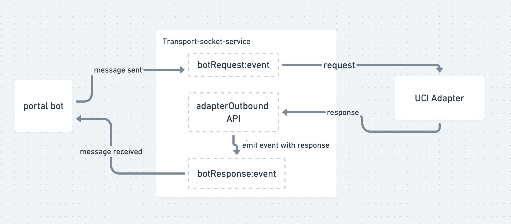

# Developer's Doc - How to set up and use the portal chatbot client library

This document will help you to how to set up and use a portal chatbot client library.

#### Background: <a href="#developersdoc-howtosetupandusetheportalchatbotclientlibrary-background" id="developersdoc-howtosetupandusetheportalchatbotclientlibrary-background"></a>

This is built as an Angular library. Where this angular library can be integrated into any Angular application(like sunbird portal). Once we integrate this library into the portal user can interact with a bot for his queries by navigating through the options provided by the bot.

#### Git Repository: <a href="#developersdoc-howtosetupandusetheportalchatbotclientlibrary-gitrepository" id="developersdoc-howtosetupandusetheportalchatbotclientlibrary-gitrepository"></a>

[https://github.com/project-sunbird/sunbird-bot-client](https://github.com/project-sunbird/sunbird-bot-client)

#### Peer dependencies: <a href="#developersdoc-howtosetupandusetheportalchatbotclientlibrary-peerdependencies" id="developersdoc-howtosetupandusetheportalchatbotclientlibrary-peerdependencies"></a>

* socket.io-client v4.0

#### Dependencies: <a href="#developersdoc-howtosetupandusetheportalchatbotclientlibrary-dependencies" id="developersdoc-howtosetupandusetheportalchatbotclientlibrary-dependencies"></a>

[https://github.com/samagra-comms/transport-socket](https://github.com/samagra-comms/transport-socket)

#### Prerequisite: <a href="#developersdoc-howtosetupandusetheportalchatbotclientlibrary-prerequisite" id="developersdoc-howtosetupandusetheportalchatbotclientlibrary-prerequisite"></a>

* Node v10+
* Transport socket: Local Setup

#### sunbird-bot-client library local set-up: <a href="#developersdoc-howtosetupandusetheportalchatbotclientlibrary-sunbird-bot-clientlibrarylocalset-up" id="developersdoc-howtosetupandusetheportalchatbotclientlibrary-sunbird-bot-clientlibrarylocalset-up"></a>

Git clone the sunbird-bot-client library:

```
> git clone https://github.com/project-sunbird/sunbird-bot-client.git
> cd sunbird-bot-client 
> yarn
```

Now build package with below command and it will generate chat-lib package in the **dist** folder

```
npm run build
```

#### Available components & service in sunbird-bot-client <a href="#developersdoc-howtosetupandusetheportalchatbotclientlibrary-availablecomponents-and-serviceinsunbird" id="developersdoc-howtosetupandusetheportalchatbotclientlibrary-availablecomponents-and-serviceinsunbird"></a>

| Feature                                                                                                                                                      | Notes                                                                             | Selector                    |
| ------------------------------------------------------------------------------------------------------------------------------------------------------------ | --------------------------------------------------------------------------------- | --------------------------- |
| [Chat Window](https://github.com/project-sunbird/sunbird-bot-client/tree/master/projects/chat-lib/src/lib/chat-window)                                       | Chat Window for Chat Bot                                                          | lib-chat-window             |
| [Chat Message List](https://github.com/project-sunbird/sunbird-bot-client/tree/master/projects/chat-lib/src/lib/chat-message-list)                           | Chat Messages Get Listed in Widget                                                | lib-chat-message-list       |
| [Chat Message](https://github.com/project-sunbird/sunbird-bot-client/tree/master/projects/chat-lib/src/lib/chat-message)                                     | Library Chat Message Component                                                    | lib-chat-message            |
| [Chat Message Bottom bar](https://github.com/project-sunbird/sunbird-bot-client/tree/master/projects/chat-lib/src/lib/chat-message-bottom-bar)               | Can be used to send plain text message                                            | lib-chat-message-bottom-bar |
| [chat-lib-service.ts](https://github.com/Nik720/sunbird-bot-client/blob/SB-26255-socket-bot-integration/projects/chat-lib/src/lib/chat-lib.service.ts)       | It has logic to prepare request and store bot responses in chatlist               |                             |
| [websocketio.service.ts](https://github.com/Nik720/sunbird-bot-client/blob/SB-26255-socket-bot-integration/projects/chat-lib/src/lib/websocketio.service.ts) | it has logic to establish and destroy socket connection between server and client |                             |

### &#x20;Integrate the chatbot client library <a href="#developersdoc-howtosetupandusetheportalchatbotclientlibrary-integratethechatbotclientlibrary" id="developersdoc-howtosetupandusetheportalchatbotclientlibrary-integratethechatbotclientlibrary"></a>

create a new simple angular application or use any existing angular app to integrate chatbot client

Step 1: Install the package (install from local dist folder by giving full relative path)

```
npm i sunbird-chatbot-client --save 
```

Step 2: Import the modules and components

Import the NgModule for each component you want to use:

```
import { ChatLibModule, ChatLibService } from '@project-sunbird/chatbot-client-v8';

@NgModule({
    ...
    
    imports: [ChatLibModule],
    
    ...
})
```

Step 3: Add the library component to the HTML page

```
<lib-chat-window [inputValues]="botConfig"></lib-chat-window>
```

**botConfig properties:**

```
appId: string       -> For Telemetry - Unique application indentifier 
userId: string      -> For telemetry - User details who is interacting with the bot
did: string         -> For telemetry - Unique device string for telemetry to log
channel: string     -> For telemetry - Unique channel string to identify the use belongs to which tenant
socketUrl: string   -> API endpoint for transport socket server to establish connection and communicate with server
botInitMsg: string  -> starting bot message which already configured in portal communication console
```

Step 4: Start the application

```
npm run start
```

**How bot-client communicate with the server**


