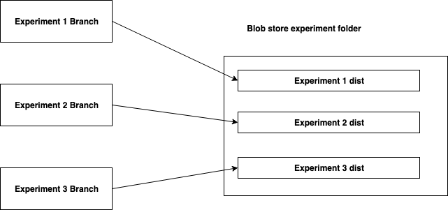

# Experimentation-Capability-on-Portal

## Background:&#x20;

Currently, Sunbird has one portal instance that has all the modules and has multiple tenant support. If a tenant request any changes to an existing feature or a new feature, all tenants will get these changes as well.

## Problem statement:

Sunbird should support experimenting with the portal, which allows customers to load the different portal app/module with new features. This should follow the below principle

1. Experiment feature should be isolated from the main app.
2. Deployment of the experiment should not affect the main app.
3. Loading of the experiment app should be configurable and loading logic should reside in the server.

## Loading Experiment specific app:

### **Solution 1:** Get Experiment details on the first load in the browser.

In this approach will load the default app with devicedId generation script that runs before angular files are loaded. This script generates the deviceId and makes Device register API call to the Analytics server. API will return experiment details if any. If the experiment exists set experiment details in the cookie and reload the app. Portal backend will read the cookie and load experiment specific app.

\*\*Drawback: \*\*

1. Initial app load gets delayed.
2. Loading experiment logic resides on browser and experiment related data need to be passed to the server using a cookie or as URL param.&#x20;
3. Bad user experience because of the delayed portal load&#x20;

### **Solution 2:** Get experiment details in portal backend.

In this approach when a request comes to the portal, the portal will make an API call to analytics server to get the experiment details with URL and (deviceId and userId if available). If the experiment exist portal backend will send experiment specific app.

\*\*Drawback: \*\*

1. DeviceId will not be available for the anonymous user for the first time load.
2. We need new API endpoint from the analytic server that can be called from the portal backend.&#x20;

### \*\*Solution 3: \*\* Get experiment details in static page and store the experiment result in a cookie.

In this approach, we are making device register API call from static pages and storing the experiment result in the cookie and will the user navigate to the portal, the backend will read this cookie and determine which app to load from the cookie.&#x20;

\*\*Drawback: \*\*

1. If the user goes to the portal page directly, will not know which experiment to load
2. All static pages need to have this logic.&#x20;

## Deployment:

### **Solution 1** : Store experiment app build in common blob folder with experiment Id as a folder name.

Each experiment will have its respective repo/branch. Sunbird will have common blob folder for the experiment application folder. Each experiment can be deployed from different branches to a common folder. This isolates a different experiment build. One can happen without affecting other or core build. Deployment steps/config will be same for all experiment only config that changes are branch and dist folder. This should to same as experimentId.

***

\[\[category.storage-team]] \[\[category.confluence]]
