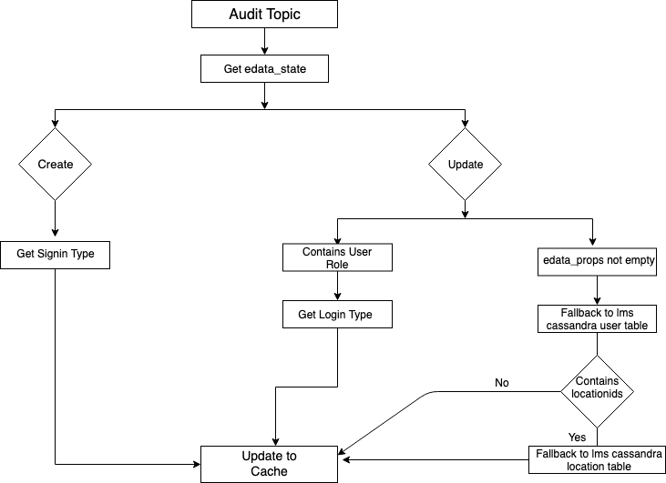

# Splitting-the-Redis-Updater-samza-job

**Purpose:** **Currently** , the Redis Updater job updates all three: User Cache, Content Cache and Dialcode Cache. The events it processes are:

*   AUDIT

    &#x20; \-  It updates the user signin type and role type into the User Cache.
*   learning graph events

    &#x20; \- It updates the dialcode metadata into the Dialcode Cache.

    &#x20; \- It updates the content data from the learning graph events into the Content Cache.

**Now** , the job needs to be split in a way such that the load it handles is distributed into two different samza jobs by grouping the similar kind of events. It will also make the debugging for the jobs easy.

**Previous Design:**

### **New Design** :

**Workflow:** The Redis Updater samza job updates the User, Content and Dialcode cache currently. The redis updater will be split in two different samza jobs, i.e. User Cache Updater and Content Cache Updater.

*   User Cache Updater

    &#x20; \- This job would process the AUDIT event and filters it based on edata\_state.

    &#x20; \- If edata\_state has the value 'Update', it looks for locationids from the user db.

    &#x20; \- Based on the locationids, it searches for state and district information from the location db and updates the Redis Cache along with the existing metadata.

    
*   Content Cache Updater

    &#x20; \- This job would process the learning graph events and filters it based on object type.

    &#x20; \- The events containing object type as 'DialCode' update the Dialcode Cache:

    &#x20;        a) If the 'nodeUniqueId' already exists in cache, the new properties get appended with the existing metadata and updated in Cache.

    &#x20;        b) If not found, a new entry is created with the properties in Redis Cache.

    &#x20; \- Events without object type 'DialCode' update the Content Cache:

    &#x20;        a) It checks for the content model fields in the message envelope and updates the cache with the new value from the transactionData.  &#x20;

    &#x20;        b) It creates a new entry if the 'nodeUniqueId' is not found in cache, else appends the existing values with the new data.

***

\[\[category.storage-team]] \[\[category.confluence]]
