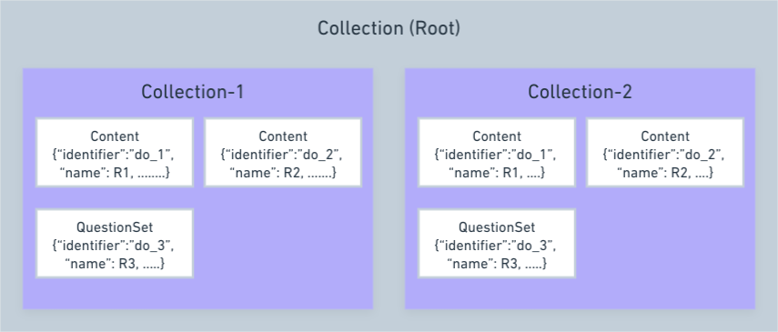
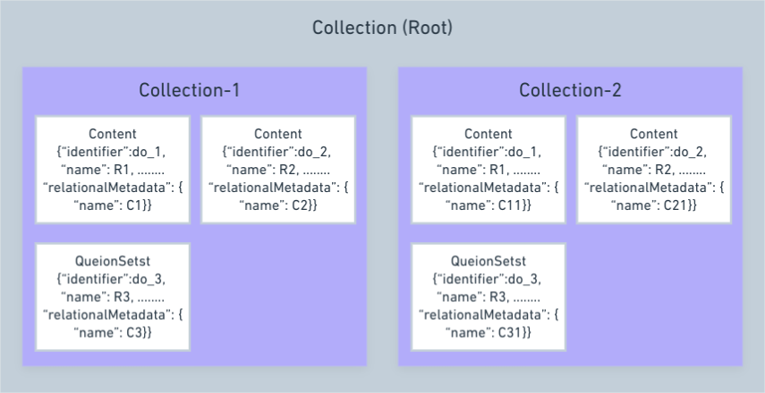

# Design - Relational metadata to asset linked to a collection

### Introduction: <a href="#design-relationalmetadatatoassetlinkedtoacollection-introduction" id="design-relationalmetadatatoassetlinkedtoacollection-introduction"></a>

Relational metadata that can be added to the relation between an asset and the folder to which it is linked. These attributes have to be stored as part of the relation between the asset and the folder to which it is linked. Some examples for such metadata are:

* Schedule (start and end date) or Duration of the asset
* “Track in collection progress” - Yes or No. This defines whether the progress of this asset should be considered as part of the progress of this collection

### Current Behaviour: <a href="#design-relationalmetadatatoassetlinkedtoacollection-currentbehaviour" id="design-relationalmetadatatoassetlinkedtoacollection-currentbehaviour"></a>



### Expected Behaviour: <a href="#design-relationalmetadatatoassetlinkedtoacollection-expectedbehaviour" id="design-relationalmetadatatoassetlinkedtoacollection-expectedbehaviour"></a>



### Key Design Problems: <a href="#design-relationalmetadatatoassetlinkedtoacollection-keydesignproblems" id="design-relationalmetadatatoassetlinkedtoacollection-keydesignproblems"></a>

* Relation metadata attributes are completely different from metadata attributes of the asset that is being linked.
* The relational metadata is stored as part of folder to asset relation. So if the same asset is linked to multiple folders within the same collection, it will have different set of relational metadata stored for each link.
* The relation metadata can be modified as part of Collection modification. This means, the collection has to be in draft state, for the relation metadata to be modified.
* Currently platform do not have the way to accept, store and return the relational metadata.

### Design: <a href="#design-relationalmetadatatoassetlinkedtoacollection-design" id="design-relationalmetadatatoassetlinkedtoacollection-design"></a>

**Solution 1:**

We can accept and store the relational metadata as a part on hierarchy in Cassandra. While consuming from consumption side, traverse and check if any relationalMetadata is available and use that relative metadata. For supporting the backward compatibility on mobile and desktop app we can bump up the compatibilityLevel or we can choose to display the actual metadata of the content.

Sample collection 1

```
Class 1 Maths Course
    Lesson 1 - Unit
        Content 1
            {
                "name": "ABC",
                "relationalMetadata": {
                    "name": "R1"
                }
            }
    Lesson 2 - Unit
        Content 1
            {
                "name": "ABC"
                "relationalMetadata": {
                    "name": "R2"
                }
            }
```

Sample collection 2 (collection 1 is added as a nested collection)

```
All Class Maths Course
	Class 1 - Unit
		Class 1 Maths Course
			Lesson 1 - Unit
				Content 1
				{
				"name": "ABC",
				"relationalMetadata": {
					"name": "R1"
				}
			}
			Lesson 2 - Unit
				Content 1
				{
				"name": "ABC",
				"relationalMetadata": {
					"name": "R2"
				}
			}
	Class 2 - Unit
			Content 1
			{
				"name": "ABC",
				"relationalMetadata": {
					"name": "R3"
				}
			}
```

**Solution 2:**

Store the relational metadata in a separate column in hierarchy table in Cassandra and merge this data while returning the hierarchy data.

**Required Schema changes:**

Add the new column relational\_metadata as text in **hierarchy\_store.content\_hierarchy**

`ALTER TABLE hierarchy_store.content_hierarchy ADD relational_metadata text;`

Sample data for **relational\_metadata** column:

```
{
  "do_11342063677881548811": {
      "name": "Collection Publish T21",
      "children": [
          "do_11342063777635532812"
      ],
      "root": true
  },
  "do_11342063777635532812": {
      "name": "Collection Parent",
      "children": [
          "do_11342063777714176014",
          "do_11340096165525094411"
      ],
      "relationMetadata": {
        "do_11340096165525094411": {
          "name": "R11"
        }
      },
      "root": false
  },
  "do_11342063777714176014": {
      "name": "L2 Folder",
      "children": [
          "do_11340096165525094411"
      ],
      "relationMetadata": {
        "do_11340096165525094411": {
          "name": "R21"
        }
      },
      "root": false
  },
  "do_11340096165525094411": {
      "name": "R1",
      "children": [],
      "root": false
  }
}
```

**API spec changes for Read/Update hierarchy**

Update hierarchy API request body (option 1): Accept the relationalMetadata as part of **nodesModified**

```
{
    "request": {
        "data": {
            "nodesModified": {
                "do_11342063777635532812": {
                    "root": false,
                    "objectType": "Content",
                    "metadata": {
                        "name": "Collection Parent",
                        "contentType": "TextBookUnit",
                        "primaryCategory": "Textbook Unit",
                        "attributions": [],
                        "keywords": [
                            "UnitKW1",
                            "UnitKW2"
                        ]
                    },
                    "isNew": false
                },
                "do_11340096165525094411": {
                    "root": false,
                    "objectType": "Content",
                    "metadata": {
                        "name": "R1",
                        .....
                    },
                    "relationMetadata": {
                      "name": "R11"
                    },
                    "isNew": false
                }
            },
            "hierarchy": {
                "do_11342063677881548811": {
                    "name": "Collection Publish T21",
                    "children": [
                        "do_11342063777635532812"
                    ],
                    "root": true
                },
                "do_11342063777635532812": {
                    "name": "Collection Parent",
                    "children": [
                        "do_11342063777714176014",
                        "do_11340096165525094411"
                    ],
                    "root": false
                },
                "do_11342063777714176014": {
                    "name": "L2 Folder",
                    "children": [
                        "do_11340096165525094411"
                    ],
                    "root": false
                },
                "do_11340096165525094411": {
                    "name": "R1",
                    "children": [],
                    "root": false
                }
            },
            "lastUpdatedBy": "4cd4c690-eab6-4938-855a-447c7b1b8ea9"
        }
    }
}
```

Update hierarchy API request body (option 2): Accept the relationalMetadata as a part of **hierarchy**.

```
{
    "request": {
        "data": {
            
            "nodesModified": {
                "do_11342063777635532812": {
                    "root": false,
                    "objectType": "Content",
                    "metadata": {
                        "name": "Collection Parent",
                        "contentType": "TextBookUnit",
                        "primaryCategory": "Textbook Unit",
                        "attributions": [],
                        "keywords": [
                            "UnitKW1",
                            "UnitKW2"
                        ]
                    },
                    "isNew": false
                },
                "do_11340096165525094411": {
                    "root": false,
                    "objectType": "Content",
                    "metadata": {
                        "name": "R1",
                        .....
                    },
                    "isNew": false
                }
            },
            "hierarchy": {
                "do_11342063677881548811": {
                    "name": "Collection Publish T21",
                    "children": [
                        "do_11342063777635532812"
                    ],
                    "root": true
                },
                "do_11342063777635532812": {
                    "name": "Collection Parent",
                    "children": [
                        "do_11342063777714176014",
                        "do_11340096165525094411"
                    ],
                    "relationMetadata": {
                      "do_11340096165525094411": {
                        "name": "R11"
                      }
                    },
                    "root": false
                },
                "do_11342063777714176014": {
                    "name": "L2 Folder",
                    "children": [
                        "do_11340096165525094411"
                    ],
                    "relationMetadata": {
                      "do_11340096165525094411": {
                        "name": "R21"
                      }
                    },
                    "root": false
                },
                "do_11340096165525094411": {
                    "name": "R1",
                    "children": [],
                    "root": false
                }
            },
            "lastUpdatedBy": "4cd4c690-eab6-4938-855a-447c7b1b8ea9"
        }
    }
}
```

**Add hierarchy API request:** Accept the relationalMetadata and store it as we will be doing in update hierarchy API (**relational\_metadata** → new column in **hierarchy\_store.content\_hierarchy**).

```
Request:

{
    "request": {
        "rootId" : "do_11342063677881548811",     // {collection root ID}
        "unitId" : "do_11342063777635532812",     // {first Level parent of the children}
        "children": ["do_11340096165525094411"],  // List of children identifier to be added
        "relationMetadata": {
          "do_11340096165525094411": {
            "name": "R21"
          }
        }
    }
}
```

**Remove hierarchy API:** Update the **relational\_metadata** → new column in **hierarchy\_store.content\_hierarchy** after removing from hierarchy.

**Read Hierarchy API response:** When pass the **mode=edit** in query param then only return the relationalMetadata in response otherwise don’t return in response.

```
{
  "id": "api.content.hierarchy.get",
  "ver": "3.0",
  "ts": "YYYY-MM-DDThh:mm:ssZ+/-nn.nn",
  "params": {
    "resmsgid": "4c664135-163f-4e75-8174-09dfd2b47817",
    "msgid": "",
    "err": "",
    "status": "successful",
    "errmsg": ""
  },
  "responseCode": "OK",
  "result": {
    "content": {
      "mimeType": "application/vnd.ekstep.content-collection",
      "primaryCategory": "Digital Textbook",
      "trackable": {
        "enabled": "No",
        "autoBatch": "No"
      },
      "identifier": "do_2134199831937351681505",
      "visibility": "Default",
      "name": "DIYA_2021",
      ........
      "children": [
        {
          "parent": "do_2134199831937351681505",
          "mimeType": "application/vnd.ekstep.content-collection",
          "primaryCategory": "Textbook Unit",
          "identifier": "do_2134199838264279041509",
          "visibility": "Parent",
          "index": 1,
          "name": "Textbook Unit-1",
          "children": [
            {
              "unitIdentifiers": [
                "do_213419803935105024129"
              ],
              "parent": "do_2134199838264279041509",
              "mimeType": "video/mp4",
              "primaryCategory": "Explanation Content",
              "trackable": {
                "enabled": "No",
                "autoBatch": "No"
              },
              "identifier": "do_213419877827911680157",
              "name": "Regional Language",
              "compatibilityLevel": 1,
              .......,
              "relationalMetadata": {
                "name": "Regional Language Modified"
              }
            }
          ]
        }
      ]
    }
  }
}
```

**Schema Validation:**

User can add the existing attribute in relationalMetadata or new attribute. To validate the added values in relationalMetadata, it requires schema validation based on objectType. So to address this will do the schema validation against that objectType schema and add the new attribute if it needs to support the new field in relationalMetadata.

**Pros and Cons:**

| **S.No.**  | **Pros**                                                                                             | **Cons**                                                                                         |
| ---------- | ---------------------------------------------------------------------------------------------------- | ------------------------------------------------------------------------------------------------ |
| Solution 1 | <ul><li>Storing and returning the data is simple.</li></ul>                                          | <ul><li>Manipulation or any migration later is complex, related to relationalMetadata.</li></ul> |
| Solution 2 | <ul><li>Manipulation or any migration later will be simple, related to relationalMetadata.</li></ul> | <ul><li>Traversing and merging the relationalMetadata will be overhead.</li></ul>                |
