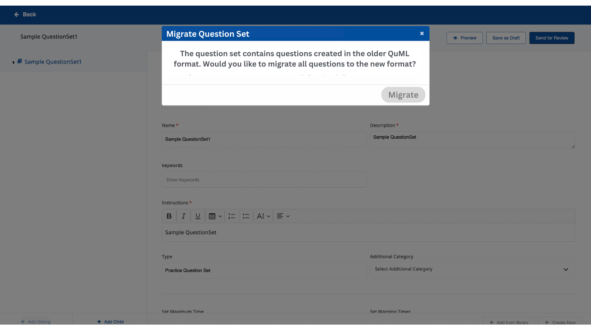

# Backward Compatibility of V2 APIs

### Context : 

Following in the behaviour of version 2 of inQuiry APIs, Editor and Player

(a) Follow the QuML Spec 1.1 and

(b) Support backward capability to Version1 and QuML Spec 1.0 and perform on-demand migration.

* Update of Q 1.0 question/question sets using the V2 APIs will migrate the question/question sets to Q 1.1 and save the changes
* Reading of Q 1.0 question/question sets using the V2 APIs is supported temporarily. The data will remain in the Q 1.1.
* Publish / Review of Q 1.0 question/question sets is not allowed using the V2 APIs

### Problem Statement : 

A question set created in the Q 1.0 format may contain questions with visibility mode `parent`as well `default` . When an update is made to the question set using the V2 APIs, the question set should be migrated to Q 1.1 ie all the question in the question set will be migrated. The questions with the visibility mode `parent`can be migrated on-demand, whereas the question with `default` visibility mode having scope outside of the question set, cannot be migrated as part of the question set migration.

### Proposed User Flow: 

1. User opens a Question set created as per the QuML 1.0 using the V2 Editor
   1. Allows reading of Question set created as per Q 1.0. No updates on the Question set or Question
   2.  Display Pop-up saying `The question set contains question created in the older format. Would you like to migrate all questions to the new format? Yes/ No`\

       

       1. **Migrate**
          1.  Migrate all the question with visibility as `parent` to `Q 1.1`\

          2.  If there are questions with visibility as `public/default` , another pop-up will display with an alert saying ``The question `name of question` does not belong to this question set. You can either migrate this question (individually) or remove this from the question set.``\

              1. Option 1 : The user removes the question(s) from the question set, repeats `1.b.i.1` and all the questions and the question set will be completely migrated and saved in `Q 1.1`
              2. Option 2 : The user migrates the `default` questions to `Q 1.1`\
                 \[Note] This cannot be done within the Question set (using the question set editor ) since these questions be present in other question sets and is has scope outside of the question set and repeats `1.b.i.1`\
                 `The capability will be introduced in the question editor, to migrate question to Q.1.1 on demand.`
2. User tries to edit the question set and `Save as draft` / `Send for review`
   1. Scenario 1 : The Question set API contains question in Q 1.0 format. Upon attempting any update, the screen will freeze and pop-up will appear with the following message:
      1. `The question set contains question created in the Q 1.0 format. You can either migrate all the questions to Q 1.1 or remove the questions from the question set.`
         1. Option 1 : `Migrate all the questions to Q 1.1 - YES / NO`
            1. **YES**
               1. Follows same steps mentioned in `1.a.ii.1`
