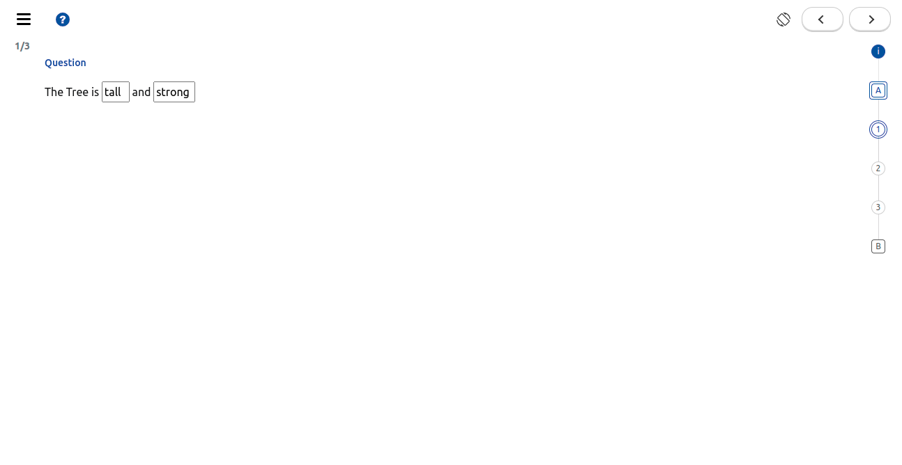

# \[Design] Fill in The Blank - Editor & Player

## **Introduction**  <a href="#id-design-fillintheblank-editor-and-player-introduction" id="id-design-fillintheblank-editor-and-player-introduction"></a>

This document describes the design approach for enhancing the inQuiry editor and player to support the creation and consumption of the FTB question.

JIRA Issue: [IQ-245](https://project-sunbird.atlassian.net/browse/IQ-245), [IQ-273](https://project-sunbird.atlassian.net/browse/IQ-273)

## **Background**  <a href="#id-design-fillintheblank-editor-and-player-background" id="id-design-fillintheblank-editor-and-player-background"></a>

As we are [deprecating the ECML Question creation](https://project-sunbird.atlassian.net/wiki/spaces/PRD/pages/2395176986/Deprecating+ECML+Question+creation+inside+Interactive+Content+Editor) inside the Interactive content editor. So inQuiry would need to have a suitable substitute for all its used capabilities in the (New) Question set editor and Player.

Here’s a list of features currently available and supported by the Interactive Content Editor for FTB Question. &#x20;

1. There should be at least one blank&#x20;
2. Blanks can be created by using square brackets \[\[ ]] to indicate words to be made blank in a sentence&#x20;
3. Multiple blanks are supported&#x20;
4. ~~Keyboard type:~~&#x20;
   1. ~~System (Android / OS)~~&#x20;
   2. ~~English (A-Z, not QWERTY)~~&#x20;
   3. ~~Numbers only~~&#x20;
   4. ~~26 keys configurable~~&#x20;
5. Partial scoring&#x20;
6. Unordered evaluation&#x20;
7. Add Image and ~~Audio~~ to Question or Option&#x20;
8. Add Math & Scientific Text (Formulae & Equation) to Question or Option&#x20;

The keyboard type and audio will be not part of this design. We will plan these features for later releases.

## **Problem Statement**  <a href="#id-design-fillintheblank-editor-and-player-problemstatement" id="id-design-fillintheblank-editor-and-player-problemstatement"></a>

Currently, the QuestionSet editor/Player does not support FTB Question creation and consumption workflow.  How can inQuiry enable the same capabilities in the new QuestionSet Editor and Player with the same features supported by the existing Interactive editor and player?

* The creator should be able to create the Fill In The Blank question with multiple blanks.
* The creator should be able to add the image and Math & Scientific Text (Formulae & Equation) to the Question
* The creator should be able to define scoring and configure the evaluation unordered configuration.
* The consumer should be able to consume the FTB question created by the creator.

## **Design** <a href="#id-design-fillintheblank-editor-and-player-design" id="id-design-fillintheblank-editor-and-player-design"></a>

In this design approach, inQuiry will cover the creation and consumption workflow changes along with the FTB Data model as per QuML spec.

**Creation workflow:**


* For creating the question, inQuiry will use the same question component used for other question types.
* The creator can create the blanks using square brackets \[\[ ]] to indicate words to be made blank in a sentence.
  * The words between \[\[ ]] will appear as blanks in a player. \
    **Example:** 'The tree is \[\[tall]] and \[\[strong]].'\
    The question will be created as: 'The tree is \_\_\_\_\_\_\_ and \_\_\_\_\_\_\_.'\
    The correct answers will be `tall` and `strong`.&#x20;
* The editor will throw a validation error if the question does not contain any answers.
* When a blank is inserted, Answers will be extracted from the question using the regular expression (Ex. `/(?:^|)\[\[(.*?(?:\]\]|$)/g` )
  * We will refer to the existing code to extract the answers from the questions. Here’s the link: [https://github.com/Sunbird-Knowlg/sunbird-content-plugins/blob/c7c385c7c3848f4fdeabd4f889a46675ef608cf3/org.ekstep.questionunit.ftb-1.1/editor/controllers/ftb-controller.js#L124](https://github.com/Sunbird-Knowlg/sunbird-content-plugins/blob/c7c385c7c3848f4fdeabd4f889a46675ef608cf3/org.ekstep.questionunit.ftb-1.1/editor/controllers/ftb-controller.js#L124)
* The current QuestionSet editor has the capability to add the image and Math & Scientific Text to the question. So We will use the same question component for adding the same.
* Question with multiple answers will have Scoring Logic = PARTIAL by default. Thus,
  * All responses entered as correct will get equal marks. The total marks of the question will be divided equally amongst all responses
*   Partial scoring and unordered evaluation configuration will be stored as part of the question metadata as below:

    ```
    {
      ....
      "evalUnordered": false,
      "partialScore": true
    }
    ```

    * These configurations required changes in the question schema file.
*   All media images will be stored the way we are storing the images for the others question type. For example:

    ```
    // Question HTML 
    <figure class="image">
      
    </figure>
    <p>Who is this ?</p>  

    // Media body of question
    "media": [{ 
    "id": "do_2136875639892623361238", 
    "type": "image", 
    "src": "/assets/public/content/assets/do_2136875639892623361238/download-1.jpg", 
    "baseUrl": "https://dev.inquiry.sunbird.org" 
    }]  
    ```

    (Note: The audio workflow will be not enabled in the new FTB workflow as the new question set editor and QuML Player does not have any audio feature support)\


**Consumption workflow:**

When rendering the question on the player, consider the following:

*   The QuML Player will read the question properties and replace all blanks with a \<input> tag as per the QuML spec format. Here’s a sample example:

    ```
    The tree is <input type="text" data-text-interaction data-response-variable="response1"/> and <input type="text" data-text-interaction data-response-variable="response2" />
    ```



For Replacing of the blank with \<input> tag we will refer to the existing code. [blank-to-input-tag](https://github.com/Sunbird-Knowlg/sunbird-content-plugins/blob/c7c385c7c3848f4fdeabd4f889a46675ef608cf3/org.ekstep.questionunit.ftb-1.1/renderer/ftbcontroller.js#L126)

* Ignoring of white-space and case sensitive will be considered by default at the player level.

By default, The below points will be considered during the evaluation:

1. All user answers will be converted to lowercase and compared against each of the answer variations after converting them also to lowercase.
2. Consider removing white spaces from the user answer and the expected answer variations (trim and also remove embedded white spaces)

#### **Partial scoring** <a href="#id-design-fillintheblank-editor-and-player-partialscoring" id="id-design-fillintheblank-editor-and-player-partialscoring"></a>

A Scoring Logic can have the following values:

* ALL
  * Full marks are assigned only when all the correct answers are entered.
* PARTIAL
  * Partial scores are assigned of any one or more correct answers entered. The total marks of the question will be divided equally amongst all responses.

| **ALL**                                                                                                                                                                                                                                                                                                                                                                                                                                                                                                                                                                                                                                                                                                                                            | **PARTIAL**                                                                                                                                                                                                                                                                                                                                                                                                                                                                                                                                                                                                                                                                                                              |
| -------------------------------------------------------------------------------------------------------------------------------------------------------------------------------------------------------------------------------------------------------------------------------------------------------------------------------------------------------------------------------------------------------------------------------------------------------------------------------------------------------------------------------------------------------------------------------------------------------------------------------------------------------------------------------------------------------------------------------------------------- | ------------------------------------------------------------------------------------------------------------------------------------------------------------------------------------------------------------------------------------------------------------------------------------------------------------------------------------------------------------------------------------------------------------------------------------------------------------------------------------------------------------------------------------------------------------------------------------------------------------------------------------------------------------------------------------------------------------------------ |
| <p><strong>Q: The color on the Indian flag are ____ , _____ , _____.</strong><br>A: The color on the Indian flag are saffron , white , green.<br><code>User gets full marks for filling the blanks giving the all the 3 answers</code></p><p>A: The color on the Indian flag are saffron , white , _____.</p><p><em>OR</em></p><p>A: The color on the Indian flag are saffron, white, yellow.<br><code>User does not score any marks for filling the blanks with 2 correct answers</code><br></p><p>A:The color on the Indian flag are saffron , ______ , _____.</p><p><em>OR</em></p><p>A: The color on the Indian flag are white , ______ , _____.<br><code>User does not score any marks for filling the blank with 1 correct answer</code></p> | <p><strong>Q: The color on the Indian flag are ____ , _____ , _____.</strong></p><p>A:The color on the Indian flag are saffron , _____ , _____.</p><p><em>OR</em><br>A:The color on the Indian flag are white , _____ , _____.</p><p><em>OR</em><br>A:The color on the Indian flag are green , _____ , _____.</p><p><code>User gets 1/3 marks for entering one of the blanks with the correct answer</code></p><p> </p><p>A:The color on the Indian flag are saffron , white , ____.</p><p>A.The color on the Indian flag are saffron , green , _____.</p><p>A:The color on the Indian flag are green , white, _____.</p><p><code>User gets 2/3 marks for entering two of the blanks with the correct answers</code></p> |

The default value of Scoring Logic will be `PARTIAL`

#### Unordered evaluation <a href="#id-design-fillintheblank-editor-and-player-unorderedevaluation" id="id-design-fillintheblank-editor-and-player-unorderedevaluation"></a>

An Unordered evaluation Logic can have the following values:

* TRUE
  * Answers entered in an unordered sequence will be considered correct answers.
* FALSE
  * Answers entered in an unordered sequence will be not considered correct answers.

| **TRUE**                                                                                                                                                                                                                                                                                                                                                                                                                                                                                                                         | **FALSE**                                                                                                                                                                                                                                                                                                                                                                                                                                                                                                                                                                                                                                                                                                                                                                                                      |
| -------------------------------------------------------------------------------------------------------------------------------------------------------------------------------------------------------------------------------------------------------------------------------------------------------------------------------------------------------------------------------------------------------------------------------------------------------------------------------------------------------------------------------- | -------------------------------------------------------------------------------------------------------------------------------------------------------------------------------------------------------------------------------------------------------------------------------------------------------------------------------------------------------------------------------------------------------------------------------------------------------------------------------------------------------------------------------------------------------------------------------------------------------------------------------------------------------------------------------------------------------------------------------------------------------------------------------------------------------------- |
| <p><strong>Q: The color on the Indian flag are ____ , _____ , _____.</strong><br>A: The color on the Indian flag are green , white , saffron.<br><code>User gets full marks for filling the blanks giving the all the 3 answers</code></p><p>OR</p><p><strong>Q: The color on the Indian flag are ____ , _____ , _____.</strong></p><p>A: The color on the Indian flag are red , white , saffron.</p><p><code>User gets 2/3 marks for entering one of the blanks with the correct answer when partial scoring enabled</code></p> | <p><strong>Q: The color on the Indian flag are ____ , _____ , _____.</strong><br>A: The color on the Indian flag are saffron , white , green.<br><code>User gets full marks when all the answers are in valid order</code></p><p>OR<br><br><strong>Q: The color on the Indian flag are ____ , _____ , _____.</strong><br>A: The color on the Indian flag are green , white , saffron.<br><code>User does not score any marks for filling the blanks with unordered sequence when partial scoring is disabled.</code></p><p>OR</p><p><strong>Q: The color on the Indian flag are ____ , _____ , _____.</strong><br>A: The color on the Indian flag are green , white , saffron.<br><br><code>User gets 1/3 marks for entering one of the blanks with the correct answer when partial scoring enabled</code></p> |

The default value of Unordered evaluation will be `FALSE`

#### **FTB Data Model** <a href="#id-design-fillintheblank-editor-and-player-ftbdatamodel" id="id-design-fillintheblank-editor-and-player-ftbdatamodel"></a>

The `editorState` will have two properties called `options` and `question` to support storing the multiple values for each blank. This entire block is for the editor’s use. These values are saved as they are entered by the creator.\
The question content is obtained from CKEditor will contain the HTML markup of the question text.

For example, `<p>capital of india is [[New Delhi]]. and capital of USA is [[New York]]</p>`

`interactions` are the pre-processed data for the player’s use. All the values are converted to lowercase and removed white spaces depending on the evaluation needed on the player side.

`responseDeclaration` is contain the expected matching indices when comparing the user answers against the expected answers array.\
\
Here’s the new schema structure for the FTB which is as per QuML compliance.

**Solution 1 (Recommended) :**

```
{
  "editorState": {
    "options": [
      {
        "answer": true,
        "value": {
          "body": "New Delhi",
          "value": 0
        }
      },
      {
        "answer": true,
        "value": {
          "body": "New York",
          "value": 1
        }
      }
    ],
    "question": "<p>capital of india is [[New Delhi]]. and capital of USA is [[New York]]</p>"
  },
  "body": "<p>capital of india is [[New Delhi]]. and capital of USA is [[New York]]</p>",
  "responseDeclaration": {
    "response1": {
      "cardinality": "single",
      "type": "string",
      "correctResponse": {
        "value": ["New Delhi", "New York"]
      },
      "mapping": [
        {
          "response": "New Delhi",
          "outcomes": {
            "score": 0.5
          }
        },
        {
          "response": "New York",
          "outcomes": {
            "score": 0.5
          }
        }
      ]
    }
  },
  "outcomeDeclaration": {
    "maxScore": 1
  },
  "interactionTypes": [
    "text"
  ],
  "media": [
    {
      "id": "do_2136875567564144641233",
      "type": "image",
      "src": "/assets/public/content/assets/do_2136875567564144641233/download.jpg",
      "baseUrl": "https://dev.inquiry.sunbird.org"
    }
  ],
  "name": "Fill In The Blanks",
  "mimeType": "application/vnd.sunbird.question",
  "objectType": "Question",
  "primaryCategory": "FTB Question",
  "qType": "FTB"
}
```

In QuML spec [https://github.com/sunbird-specs/QuML/blob/master/v1/question-schema.json#L344](https://github.com/sunbird-specs/QuML/blob/master/v1/question-schema.json#L344) the mapping definition does not allow storing of value as string, it’s value type is defined as `number`

We need to update the spec to support this schema structure.

**Pros:**

* This approach requires minimal effort to implement.
* Creating the views for both editor and player becomes easier with this structure.
* No need to store the interaction properties as we are storing values as it is.
* Reduce the payload size compare to solution 1 and solution 2.
* Players can easily evaluate the question by comparing the user answers against the expected `correctResponse` array.

**Cons:**

* The proposed structure is different from the current structure supported by the QuML spec.

**Solution 2:**

```
{
  "editorState": {
    "options": [{
        "answer": true,
        "value": {
          "body": "New Delhi",
          "value": 0
        }
      },
      {
        "answer": true,
        "value": {
          "body": "New York",
          "value": 1
        }
    }],
    "question": "<figure class="image"></figure><figure class="image"></figure>
        <p>capital of india is [[New Delhi]]. and capital of USA is [[New York]]</p>"
  },
  "body": "<figure class="image"></figure>
        <p>capital of india is [[New Delhi]]. and capital of USA is [[New York]]</p>",
  "interactions": {
    "response1": {
      "type": "text",
      "options": [{
          "label": "New Delhi",
          "value": 0
        },
        {
          "label": "New York",
          "value": 1
        }
      ]
    },
    "validation": {
      "required": "Yes"
    }
  },
  "responseDeclaration": {
    "response1": {
      "cardinality": "multiple",
      "type": "string",
      "correctResponse": {
        "value": [
          "0",
          "1"
        ]
      },
      "mapping": [
        {
          "response": 0,
          "outcomes": {
            "score": 0.5
          }
        },
        {
          "response": 1,
          "outcomes": {
            "score": 0.5
          }
        }
      ]
    }
  },
  "outcomeDeclaration": {
    "maxScore": 1
  },
  "interactionTypes": [
    "text"
  ],
  "media": [{
    "id": "do_2136875567564144641233",
    "type": "image",
    "src": "/assets/public/content/assets/do_2136875567564144641233/download.jpg",
    "baseUrl": "https://dev.inquiry.sunbird.org"
  }],
  "name": "Fill In The Blanks",
  "mimeType": "application/vnd.sunbird.question",
  "objectType": "Question",
  "primaryCategory": "FTB Question",
  "qType": "FTB",
  "keyboardConfig": {
    "type": "Device",
    "customKeys": ""
  }
}
```

**Pros**:

* This structure is similar to the existing MCQ question structure.

**Cons:**

* The player needs to perform more operations to evaluate the question as we are storing the value as an index under `responseDeclaration`.
* Interactions for FTB will only be used for getting the matching indices when comparing the user answers against the expected answers array.

**Solution 3:**

```
{
  "editorState": {
    "options": [
      {
        "answer": true,
        "value": {
          "body": "New Delhi",
          "value": 0
        }
      },
      {
        "answer": true,
        "value": {
          "body": "New York",
          "value": 1
        }
      }
    ],
    "question": "<p>capital of india is [[New Delhi]]. and capital of USA is [[New York]]</p>"
  },
  "body": "<p>capital of india is [[New Delhi]]. and capital of USA is [[New York]]</p>",
  "interactions": {
    "response1": {
      "type": "text",
      "options": [
        {
          "label": "New Delhi",
          "value": 0
        }
      ]
    },
    "response2": {
      "type": "text",
      "options": [
        {
          "label": "New York",
          "value": 1
        }
      ]
    },
    "validation": {
      "required": "Yes"
    }
  },
  "responseDeclaration": {
    "response1": {
      "cardinality": "single",
      "type": "string",
      "correctResponse": {
        "value": "0"
      },
      "mapping": [
        {
          "response": "0",
          "outcomes": {
            "score": 0.5
          }
        }
      ]
    },
    "response2": {
      "cardinality": "single",
      "type": "string",
      "correctResponse": {
        "value": "1"
      },
      "mapping": [
        {
          "response": "1",
          "outcomes": {
            "score": 0.5
          }
        }
      ]
    }
  },
  "outcomeDeclaration": {
    "maxScore": 1
  },
  "interactionTypes": [
    "text"
  ],
  "media": [
    {
      "id": "do_2136875567564144641233",
      "type": "image",
      "src": "/assets/public/content/assets/do_2136875567564144641233/download.jpg",
      "baseUrl": "https://dev.inquiry.sunbird.org"
    }
  ],
  "name": "Fill In The Blanks",
  "mimeType": "application/vnd.sunbird.question",
  "objectType": "Question",
  "primaryCategory": "FTB Question",
  "qType": "FTB",
  "keyboardConfig": {
    "type": "Device",
    "customKeys": ""
  }
}
```

**Pros:**

* This structure can define separate behavior for each response.
* Support multiple data types for each response.

**Cons:**

* Increase the player complexity to evaluate the question.
* Increase the question payload size as we are storing each answer in a separate response for multiple properties.\
  For example, `response1` and `response2` have similar structures. As the number of `responseVariables` increases this structure will repeat multiple times and each will be storing the same data such as `cardinality`, `type`
