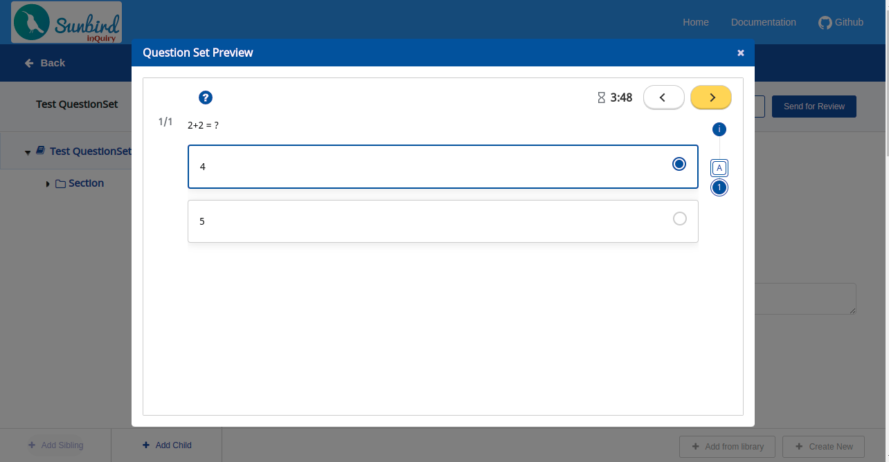
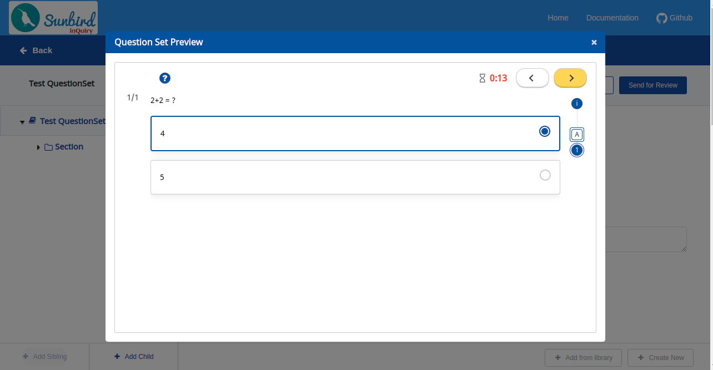

# \[Design] - Making Question Set Editor and QuML Player QuML Compliant

* Background
  * Question metadata which has some differences from the QuML specs are:-
    * responseDeclaration
      * Proposed Solution for responseDeclaration
        * Editor Changes:
        * Player Changes:
    * media
      * Proposed Solution for media
        * Editor Changes:
        * Player Changes:
  * QuestionSet metadata which has some differences from the QuML specs is:-
    * timeLimits
      * Proposed Solution for timeLimits
        * Editor Changes:
        * Player Changes:

## Background <a href="#id-design-makingquestionseteditorandqumlplayerqumlcompliant-background" id="id-design-makingquestionseteditorandqumlplayerqumlcompliant-background"></a>

While comparing the existing inQuiry question and question set metadata with QuML specs we found a few gaps. Below are the properties having some differences from the QuML specs:

### **Question metadata which has some differences from the QuML specs are:-** <a href="#id-design-makingquestionseteditorandqumlplayerqumlcompliant-questionmetadatawhichhassomedifferencesf" id="id-design-makingquestionseteditorandqumlplayerqumlcompliant-questionmetadatawhichhassomedifferencesf"></a>

* responseDeclaration
* media

#### **responseDeclaration** <a href="#id-design-makingquestionseteditorandqumlplayerqumlcompliant-responsedeclaration" id="id-design-makingquestionseteditorandqumlplayerqumlcompliant-responsedeclaration"></a>

Currently, the `responseDeclaration` is stored in the below format but `maxScore` is not allowed in it and   `outcomes` property is not allowed inside `correctResponse`

```
"responseDeclaration": {
       "response1": {
           "maxScore": 1, // maxScore is not allowed here
           "cardinality": "single",
           "type": "integer",
           "correctResponse": {
               "value": "0",
               "outcomes": {
                   "SCORE": 1
               } // outcome is not allowed here, only property ‘value’ is allowed
           },
           "mapping": []
       }
   }
```

**Proposed Solution for responseDeclaration**

**Editor Changes:**

Instead of keeping `maxScore` and `outcomes` in `responseDeclaration` we can store `maxScore` in `outcomeDeclaration` as below:

```
"outcomeDeclaration": {
    "maxScore": {
      "cardinality": "single",
      "type": "integer",
      "defaultValue": 3
    }
  },
```

We will not store `outcomes.score` inside `correctResponse` because `maxScore` and `outcomes.score` holds the same value.

For newly created single select MCQ question `responseDecleration` and `outcomeDeclaration` will be stored in the below format:

```
"responseDeclaration": {
    "response1": {
      "cardinality": "single",
      "type": "integer",
      "correctResponse": {
        "value": 2
      },
      "mapping": [
        {
          "value": 2,
          "score": 3
        }
      ]
    }
  },
  "outcomeDeclaration": {
    "maxScore": {
      "cardinality": "single",
      "type": "integer",
      "defaultValue": 3
    }
}
```

For multi-select MCQ, `responseDecleration` and `outcomeDeclaration` will be in the below format:

```
"responseDeclaration": {
    "response1": {
      "cardinality": "single",
      "type": "integer",
      "correctResponse": {
        "value": [2,1]
      },
      "mapping": [
        {
          "value": 2,
          "score": 0.5
        },
        {
          "value": 1,
          "score": 0.5
        }
      ]
    }
  },
  "outcomeDeclaration": {
    "maxScore": {
      "cardinality": "single",
      "type": "integer",
      "defaultValue": 1
    }
  },
```

We will store the `maxScore` inside the `outcomeDeclaration` property for new question creation using v2 API.

* **No Data Migration (Recommended)**
  * We will do these changes as part of the v2 API and will give the data in the above format.
  * If a user edits the old question using v2 API, We will store `maxScore` inside the `outcomeDeclaration` and remove the `maxScore` from the `responseDeclaration`.
* **Data Migration (Not Recommended)**
  * We can do the data migration for the old questions and update the question metadata with the format mentioned above.
  * This solution is not recommended because, with the migration of old questions, the old mobile app will break.

**Player Changes:**

* The player will check if the question is having the `outcomeDeclaration` in the metadata of the question and what’s the `maxScore` value present in it.
* If the `outcomeDeclaration` property is found then the player will use it as is it.
* If the question does not have the `outcomeDeclaration` property in the metadata then the player will look for the `maxScore` property in the `responseDeclartion`.

#### **media** <a href="#id-design-makingquestionseteditorandqumlplayerqumlcompliant-media" id="id-design-makingquestionseteditorandqumlplayerqumlcompliant-media"></a>

Currently, Question metadata contains media in the below format:

```
"media": [{
   "id": "do_2136952965043896321346",
   "type": "image", //instead of ‘type’ it should be ‘mediaType’
   "src": "/assets/public/content/assets/do_2136952965043896321346/mountain.jpeg",
   "baseUrl": "https://dev.inquiry.sunbird.org"
}]
```

As per QuML specs, it should be stored in the below format:

```
"media": [{
   "id": "do_2136952965043896321346",
   "mediaType": "image",
   "src": "/assets/public/content/assets/do_2136952965043896321346/mountain.jpeg",
   "baseUrl": "https://dev.inquiry.sunbird.org"
}]
```

**Proposed Solution for media**

**Editor Changes:**

* **Update QuML specs (Recommended)**
  * If we can update the QuML spec then change will not be required in the editor and player.
* **No Data Migration (Recommended)**
  * If we are not updating the QuML specs then we have to do the following changes:
    * For the new question creation, we will store the media in a new format using v2 API.
    * If the user edits the old question using v2 API, we will check if the `type` is present in the media object, and convert it to `mediaType` while editing the question.
* **No migration (Not Recommended)**
  * We can do the data migration for the old questions and update the question with the above-mentioned format.
  * This solution is not recommended because, with the migration of old questions, the old mobile app will break.

**Player Changes:**

(Note: Following changes will not be required if we are updating the QuML specs as mentioned above).

* The player will first check if the question media have `mediaType` property if not it will check in `type` property.

***

### **QuestionSet metadata which has some differences from the QuML specs is:-** <a href="#id-design-makingquestionseteditorandqumlplayerqumlcompliant-questionsetmetadatawhichhassomedifferenc" id="id-design-makingquestionseteditorandqumlplayerqumlcompliant-questionsetmetadatawhichhassomedifferenc"></a>

* timeLimits

#### **timeLimits** <a href="#id-design-makingquestionseteditorandqumlplayerqumlcompliant-timelimits" id="id-design-makingquestionseteditorandqumlplayerqumlcompliant-timelimits"></a>

Time limits are currently being stored in the question set metadata as below:

```
timeLimits: {
   "maxTime": "240",
   "warningTime": "60"
}
```

The use of `maxTime` is to show the timer on the QuML player and the use of `warningTime` is to indicate the time remaining to complete the question set.



But as per the QuML schema, `timeLimits`\` should be stored in the below format:

```
timeLimits:
{
  "description": "Time limits for the complete set and/or for each question in the question set.",
   questionset: {
           min: number,
           max: number
   },
   question: {
           min: number,
           max: number
   }
}
```

**Proposed Solution for timeLimits**

We can set the `timeLimits` for the question set as:

```
timeLimits:
{
   questionset: {
           min: number,
           max: number,
           warn: number // update the QuML specs
           
   }
}
```

If we have a time limit for each of the questions we will store the `timeLimits` to the question set metadata as:

```
timeLimits:
{
   question: {
           min: number,
           max: number,
           warn: number // update the QuML specs
   }
}
```

If we want to store `max` and `warn` value but don't want to store `min` value we can store the data in the below format:

```
timeLimits:
{
   questionset: {
           min: null,
           max: 240,
           warn: 60
           
   }
}
```

We will have to update the QuML spec so the warn time should be stored inside `timeLimits`

**Editor Changes:**

* **No Data Migration (Recommended)**
  * For the new question creation, we will store the `timeLimits` in a new format using v2 API.
  * If the user edits the old question using V2 API, we will check for the `timeLimits` if it's present in the old format we will convert it to the new format on save.
* **Data Migration (Not Recommended)**
  * we can do the data migration for the old questions and update the question with the above-mentioned format.

**Player Changes:**

The player will first check if the question has `timeLimits.questionset` it will take the `min` and `warn` value from there, if `timeLimits.questionset` is undefined and `timeLimits` directly contains `maxTime` and `warningTime` it will take the value from there.
