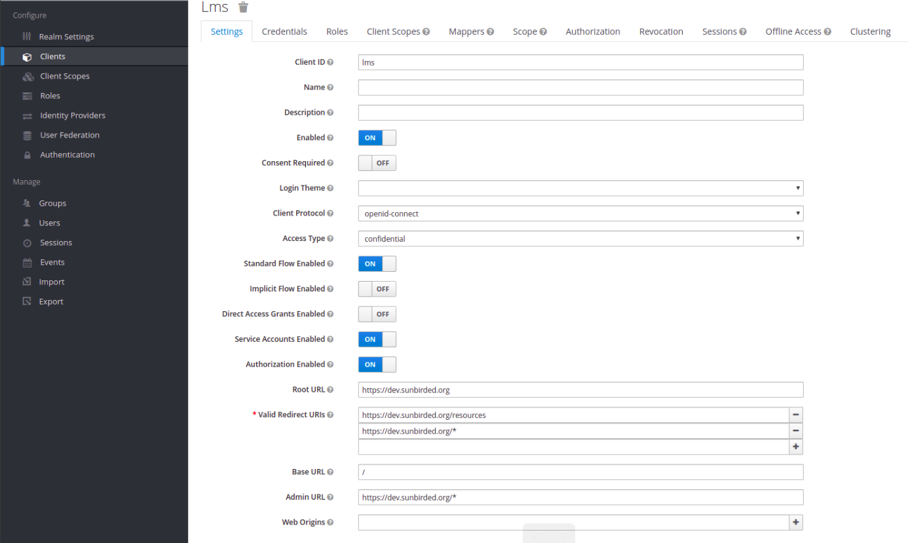
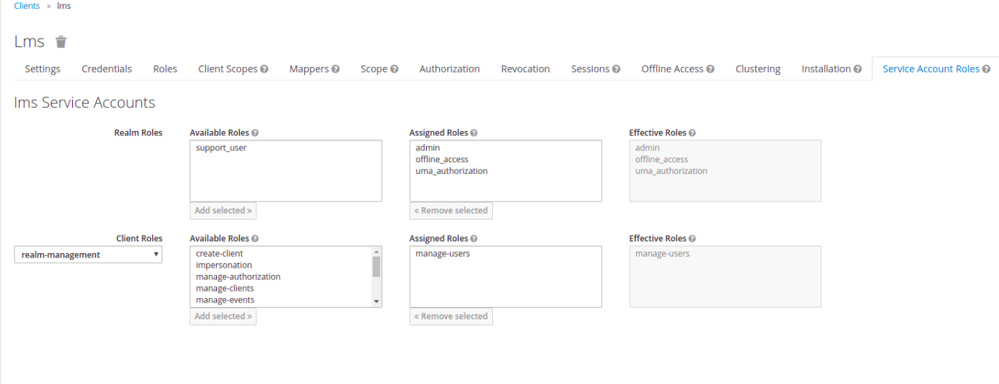

# LMS-client-setup-in-keycloak

### About

To create a new client in keycloak : lms.

### Steps for creating lms client in keycloak

|   | **Steps**                                                                             | **Screen**                                                                                                                                              |
| - | ------------------------------------------------------------------------------------- | ------------------------------------------------------------------------------------------------------------------------------------------------------- |
| 1 | Login to admin console                                                                |  |
| 2 | Select the Realm                                                                      |  |
| 3 | Go to Clients tab on left side of admin console                                       |                                                                                            |
| 4 | Click create button on left hand side of screen                                       |                                                                                            |
| 5 | Fill the given details eg: client id and root url and save                            |                                                                                            |
| 6 | Fill the given details As shown in screen                                             |                                                                                            |
| 7 | Go to service Account Roles tab and add admin role in Realm Role Box as shown         |                                                                                            |
| 8 | In client role drop down , select realm-management and add manage-users role as shown |                                                                                            |

***

\[\[category.storage-team]] \[\[category.confluence]]
