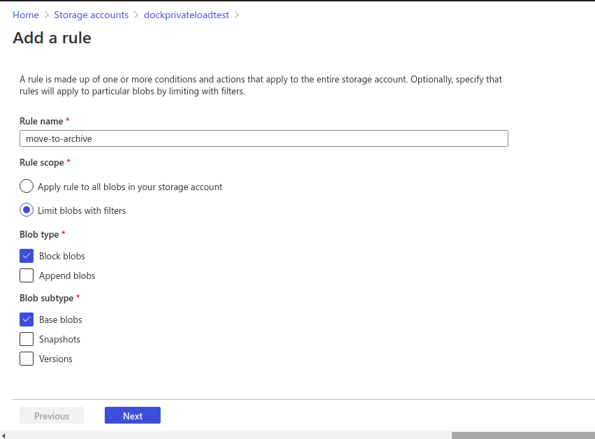
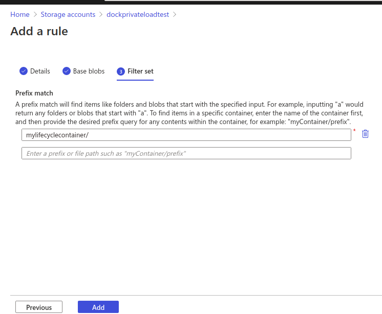

# Archive Azure Storage account data

we have 3 different access tiers in azure, hot, cold, archive

* Hot - Optimized for storing data that is accessed frequently(default tier)
* Cool - Optimized for storing data that is infrequently accessed and stored for at least 30 days.
* Archive - Optimized for storing data that is rarely accessed and stored for at least 180 days with flexible latency requirements\
  it has the lowest storage cost. But it has higher data retrieval costs compared to the hot and cool tiers\
  Data in the archive tier can take several hours to retrieve depending on the priority of the rehydration. Blobs in the archive tier should be stored for a minimum of 180 days. Deleting or rehydrating archived blobs before 180 days will incur early deletion fees

Only the hot and cool access tiers can be set at the account level. The archive access tier isn't available at the account level.

storage data tiering is supported only in Blob storage and General Purpose v2 (GPv2) accounts.

### Steps to Archive storage account data 

1. Sign in to azure portal and select your storage account
2. Under **Blob service**, select **Lifecycle Management** to add a rule

3\. Select **Add a rule** and name your rule on the **Details** form. You can also set the **Rule scope**, **Blob type**, and **Blob subtype** values. The following example sets the scope to filter blobs

4\. Set the conditions for your rule. In the following example, blobs are moved to cool storage if they haven't been modified for 30 days.

5\. Add **Filter set** to rule. The following example filters on all blobs in the _mylifecyclecontainer_ container.

after adding a rule, it can take up to 24 hours for some actions to run for the first time. Also, if you update the existing policy- Then the updated policy takes up to 24 hours to go into effect. Once the policy is in effect, it could take up to 24 hours for the actions to run. Therefore, the policy actions may take up to 48 hours to complete
