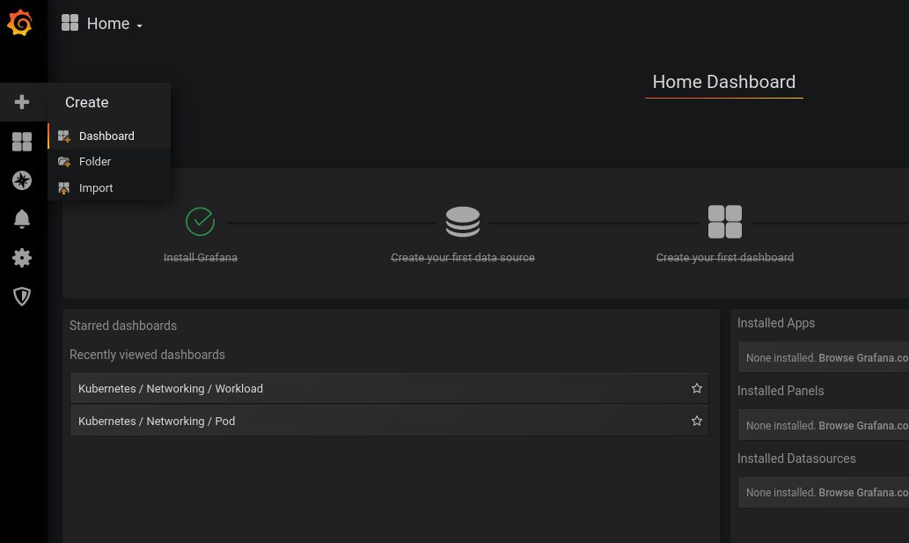
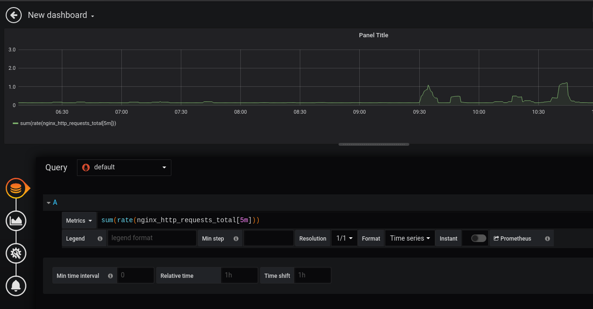
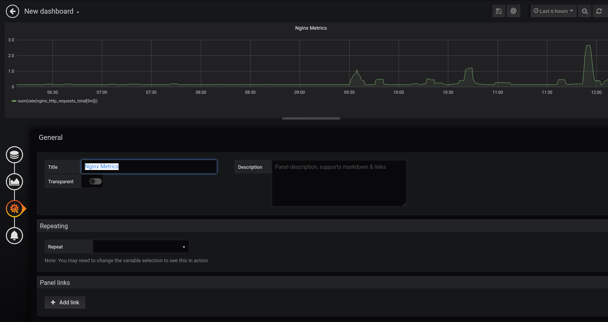
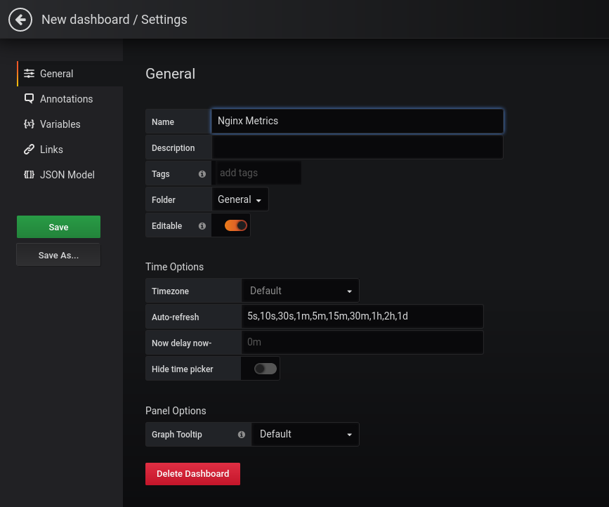
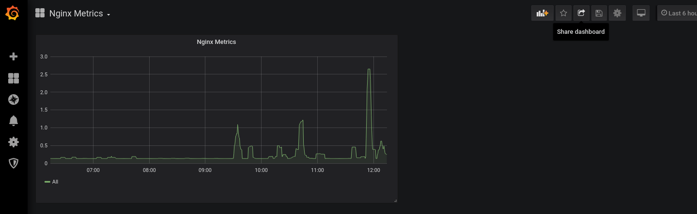
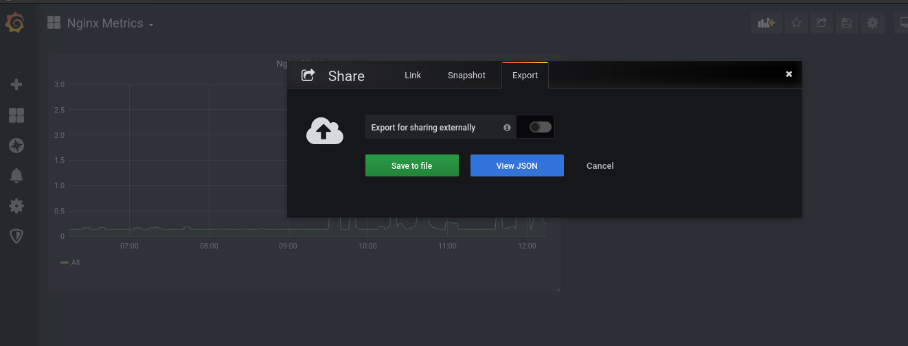
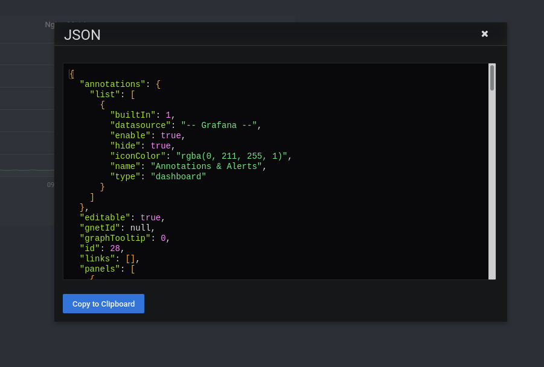
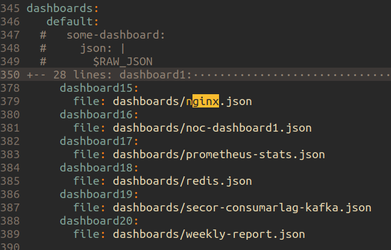

# How-to-create-a-dashboard-in-grafana

1. Open grafana url and enter username and password
2. Create a dashboard

 **after that select** Add Query **and write query**

 **Change Appropriate title and save(on the top right corner)**

 **Click on the Settings button(on the right-hand top button) and Give Proper name and save**



1. After that you’ve to commit the dashboard to github in sunbird-devops, Click on the share icon on the right hand side

Click on export, and View json



```
And copy to clipboard

```



1. Clone sunbird-devops [repo](https://github.com/project-sunbird/sunbird-devops)
2. Add the copied json to sunbird-devops/kubernetes/helm\_charts/monitoring/dashboards/dashboards/.json
3.  Add the dashboard file path in values.yaml under dashboards.default dictionary.

    Here the dashboard name is nginx.json



1. Commit the changes and Create a PR against github.com/project-sunbird/sunbird-devops
2. Once your PR is merged, Go to Jenkins and run the Deploy/Kubernetes/Monitoring → type dashboards as tag and deploy

***

\[\[category.storage-team]] \[\[category.confluence]]
