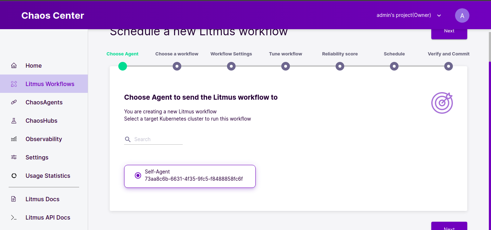

# Install and use litmus for chaos testing

Litmus is an open source Chaos Engineering platform that enables teams to identify weaknesses & potential outages in infrastructures by inducing chaos tests in a controlled way.

**Chaos Experiment:** Chaos Experiments are fundamental units within the LitmusChaos architecture. Users can choose between readily available chaos experiments or create new ones to construct a required Chaos Workflow.

**Chaos Workflow:** A chaos workflow is much more than a simple chaos experiment. It supports the user in defining the expected result, observing the result, analysing the overall system behaviour, and in the decision-making process if the system needs to be tuned for improving the resilience.

## Install Litmus using Helm <a href="#installanduselitmusforchaostesting-installlitmususinghelm" id="installanduselitmusforchaostesting-installlitmususinghelm"></a>

The helm chart will install all the required service account configuration and ChaosCenter.

The following steps will help you install Litmus ChaosCenter via helm.

**Step-1: Add the litmus helm repository**

```
helm repo add litmuschaos https://litmuschaos.github.io/litmus-helm/
helm repo list
```

**Step-2: Create the namespace on which you want to install Litmus ChaosCenter**

```
kubectl create ns litmus
```

**Step-3: Install Litmus ChaosCenter**

```
helm install chaos litmuschaos/litmus --namespace=litmus
```

**Expected Output**

```
NAME: chaos
LAST DEPLOYED: Wed Dec 15 20:18:37 2021
NAMESPACE: litmus
STATUS: deployed
REVISION: 1
TEST SUITE: None
NOTES:
Thank you for installing litmus 😀

Your release is named chaos and it's installed to namespace: litmus.

Visit https://docs.litmuschaos.io to find more info.
```

## Create Workflow and experiments <a href="#installanduselitmusforchaostesting-createworkflowandexperiments" id="installanduselitmusforchaostesting-createworkflowandexperiments"></a>

**Step-1: Login to litmus frontend, Initially password needs to be changed**

**Step-2: Create a workflow and select agent.**




**Note: Agents are kubenetes cluster(we can add other k8s clusters), in above case we are using k8s cluster where litmus is installed(self-agent).**

**Step-3: We can use predefined experiments which are in chaoshub.**


**Step-4: Name the workflow and give description.**


**Step-5: Now add experiments under workflow, multiple experiments can be added.**

For example, lets take pod-delete and pod-network-loss experiments.


Target the application based on labels


Update chaos duration settings according to requirment


Disable Revert schedule option to view chaos logs after experiment:


**Step-6: Choose experiment weight, it will be from 0 to 10 scale.**


**Step-7: Schedule the workflow according to the requirement.**


**Step-8: Review the changes and trigger the experiment.**


we can export workflow in yaml format.

**Observations:**

* Based on experiments please observe the application stability and logs.

After executing experiments:


