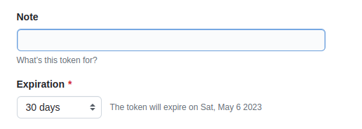
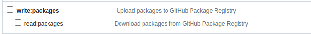
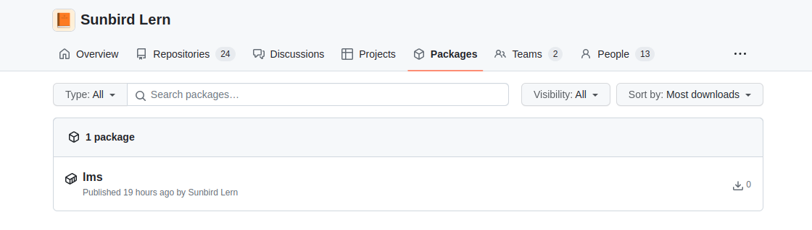
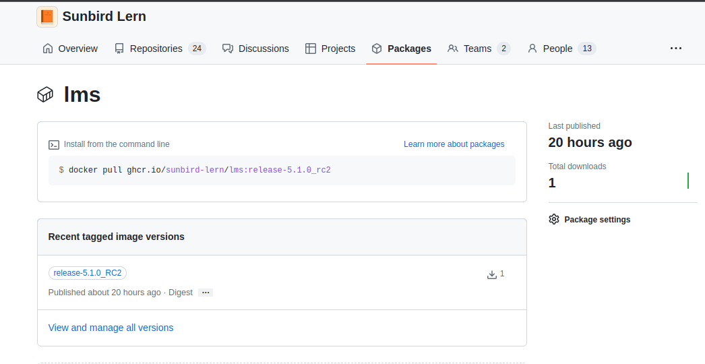
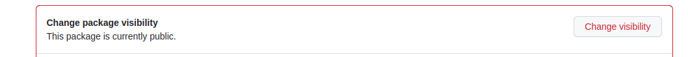
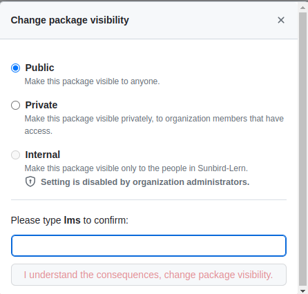
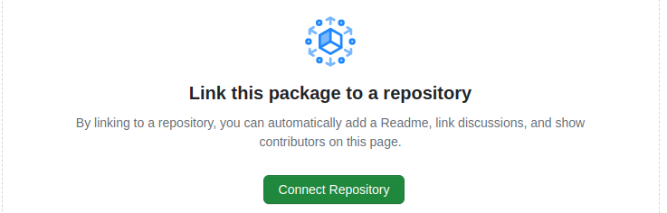
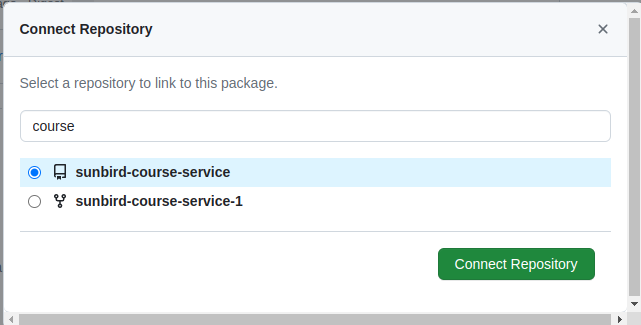
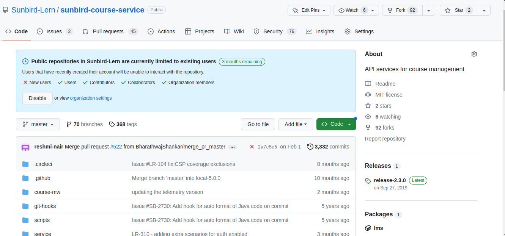

# Publish docker images to github container registry

* Create a github token which have access to organisation
  * settings → developer settings → personal access token → token(classic) → Generate new token
  *   Give name and expiration to the token

      
  *   Select wirte and read permissions to packages

      
  * And click on genarate token, this created token is used as password for github container registry
* The docker image needs to be retagged with below format
  * ```
    ghcr.io/<organisation-name>/<repo-name>:<tag>

    Example: ghcr.io/sunbird-lern/lms:release-5.1.0_RC2
    organisation-name: sunbird-lern
    repo-name: lms
    tag: release-5.1.0_RC2
    ```
* Use below command to retag the images
  * ```
    docker tag saiakhil46/lms:release-5.1.0_RC2 ghcr.io/sunbird-lern/lms:release-5.1.0_RC2
    ```
* Before pushing the retagged image docker login is required
  * ```
    docker login ghcr.io -u <username> -p <github-token>

    Configure a credential helper to remove this warning. See
    https://docs.docker.com/engine/reference/commandline/login/#credentials-store

    Login Succeeded
    ```
* Now push retagged docker image
  * ```
    docker push ghcr.io/sunbird-lern/lms:release-5.1.0_RC2


    9f770ef53b4f: Layer already exists 
    d6dfcff575ad: Layer already exists 
    6349135eaf9a: Layer already exists 
    e8505eec3bf8: Layer already exists 
    d1d8628f979a: Layer already exists 
    50644c29ef5a: Layer already exists 
    release-5.1.0_RC2: digest: sha256:e5fb5efed7112264c1b3d56618975248c171e98fa05f8df011980f952713096d size: 1585
    ```
* Now goto the organisation and click on packages section, then you will see the repo created
  * 
  * 
* By default this repo will be created as private, if you want to change it to public
  * Package settings → change visiblity → public
  * 
  * 
* After uploading the images at organisation level we can also associate indivisual container repo to code repo.
  *   click on connect repo

      
  *   select the repo and click on connect repo

      
  *   Now we can see the packages section under sunbird-course-service repo

      
