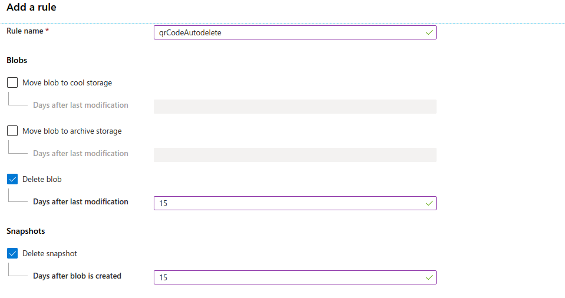
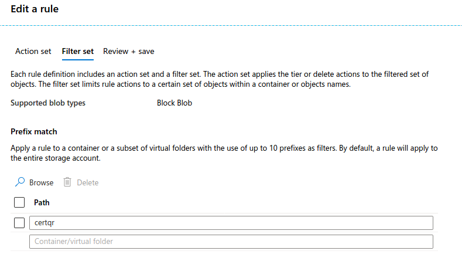

# Storage Account life cycle policy enablement

It is always good to remove unused contents from the storage and enable cold archive for infrequent/unused data into different storage tiers.

### For Enabling Lifecycle management for “certqr” container in sunbird 

* Go to lifecycle management for the storage account and select the below contents as mentioned in the image

* For the container pattern select as mentioned in the image below.

