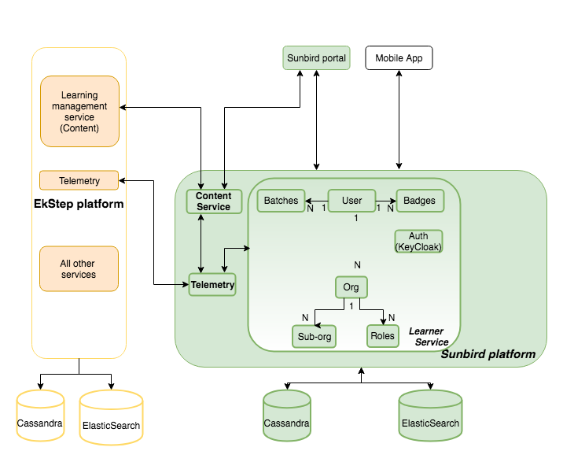
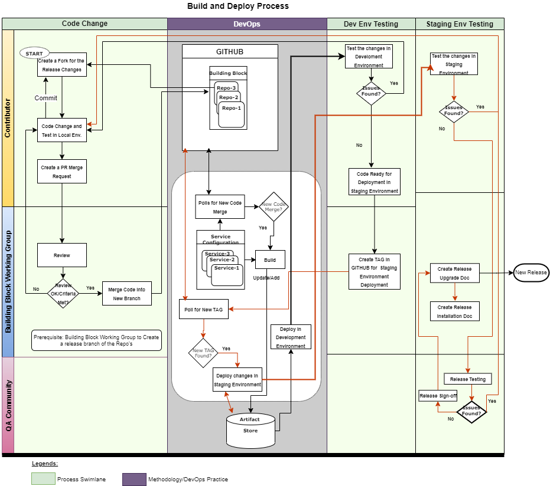

# Onboarding a new hire to engineering

Onboarding a new-hire to engineering

Document status: draft v0.5

**Objective 2**

**Flight guide 2**

**Checklist 3**

**EkStep 4**

Company 4

Solution Architecture 4

Product evolution 5

**EkStep Way 6**

Close to the heart - Developer Process 6

Design Council - TBD 7

Be aware of the responsibility 8

Code of Conduct / Ethics 8

**Engineering 9**

EkStep platform architecture 9

Product Teams 10

Learning Platform (LP) 10

Learning Platform Analytics (LPA) / Telemetry 10

Data Science 11

Content framework 12

Extensibility framework 13

Mobile Apps (Android, iOS)- TBD 13

Open-Saber 13

Sunbird (Open source version) 14

Infrastructure (devops) 15

User Acceptance Testing (UAT) 16

Typical rhythm of an engineer 17

**Other functions 17**

**Gotcha 17**

**Glossary 18**

**People 19**

### Objective 

This document is created to help onboard a new-hire to EkStep engineering team. Reading this document, it is expected that the new-hire will:

1. Get a journey guide for the first 1-2 weeks from the date of joining.
2. Appreciate and assimilate the motivation, mission and foundation of EkStep.
3. Understand The EkStep way and processes.
4. Get a 10,000 feet understanding of the EkStep engineered products.

_Disclaimer_: Read this as a resource of information to a new-hire only. This is NOT an authoritative document for product design, product information or company information.

### Flight guide 

Consider this your flight journey guide to set yourself for success in the organization and to get your things going for the first 1-2 weeks.

.png>)

### Checklist 

Make a copy of this checklist and mark tick against each line item for your own reference.

| **#** | **What**                                                                                                                                                                                                                                                                                                                                                     | **Who**                            | 
<strong>Done?</strong>

<strong>(Give a tick ✓ )</strong>
 |
| ----- | ------------------------------------------------------------------------------------------------------------------------------------------------------------------------------------------------------------------------------------------------------------------------------------------------------------------------------------------------------------ | ---------------------------------- | --------------------------------------------------------------------- |
| 1     | Fill-up this [template](https://github.com/ekstep/Common-Design/wiki/On-boarding-new-developers#kronos-access) and send an email to [Madhu](mailto:madhu@ekstep.org) (Owner, Engineering director, EkStep) AND [Madan Shaanbhog](http://madan.shaanbhog@tarento.com/) (Tarento) for Kronos access AND your manager.                                          | New-hire                           |                                                                       |
| 2     | Update master sheet (EkStep engineer list)                                                                                                                                                                                                                                                                                                                   | New-hire’s manager                 |                                                                       |
| 3     | 
Do the following:
<ol><li>Ensure master sheet is updated</li></ol>                                                                                                                                                                                                                                                                                     | Madhu                              |                                                                       |
|       | <ol><li>GitHub access - <a href="https://github.com/ekstep/Common-Design">common design repo</a></li></ol>                                                                                                                                                                                                                                                   | Madhu                              |                                                                       |
|       | <ol><li>GitHub - Invite to EkStep org</li></ol>                                                                                                                                                                                                                                                                                                              | Madhu                              |                                                                       |
|       | <ol><li>Slack - Invite to EkStep channel</li></ol>                                                                                                                                                                                                                                                                                                           | Madhu                              |                                                                       |
|       | <ol><li>Google Drive - Provide access to <a href="https://drive.google.com/drive/folders/0AGLOnhQ8Fj1QUk9PVA">Ekstep Engineering Google drive</a></li></ol>                                                                                                                                                                                                  | Madhu                              |                                                                       |
| 4     | 
Jira account setup. Click on this <a href="https://project-sunbird.atlassian.net/secure/BrowseProjects.jspa?page=1&#x26;selectedCategory=all&#x26;selectedProjectType=all&#x26;sortKey=name&#x26;sortOrder=ASC">link</a> to do a self-signup.

Reach out to release management team that owns JIRA processes for special privileges, if need be.
 | New-hire                           |                                                                       |
| 5     | Email [DevOps team](mailto:devops@ekstep.org) for AWS, Azure access                                                                                                                                                                                                                                                                                          | New-hire (leads and managers only) |                                                                       |
| 6     | Explore [EkStep style guide](https://github.com/ekstep/Common-Design/wiki/Git-Commit-Message-Hooks) and [udacity style guide](https://udacity.github.io/git-styleguide/)                                                                                                                                                                                     | New-hire                           |                                                                       |
| 7     | Read about [Ekstep platform solution architecture](https://docs.google.com/document/d/1g9GAv23-oZ64-HSH80734HzSkWZG87AAKd9SBKvqmDE/edit?ts=5b51c2b8#heading=h.9kbuwdl9vrg7)                                                                                                                                                                                  | New-hire                           |                                                                       |
| 8     | Contact your manager or lead to pull yourself into other Slack channels or workspaces                                                                                                                                                                                                                                                                        | New-hire                           |                                                                       |

### &#x20;

### EkStep 

This is an engineers’ short version of the company and by any means not the absolute.

### Company 

[Pratham](http://pratham.org/about-us/about-pratham) is a learning organization working to improve the quality of education in India. Pratham conducts a survey annually and publishes a report, called the Annual Status of Education Report ([ASER](http://www.pratham.org/programmes/aser)). This is a household-based survey that collects information on children's schooling status and basic learning outcomes in almost every rural district in the country. The ASER survey is an enormous participatory exercise that has involved about 500 organizations and upwards of 25,000 volunteers every year since 2005.

It is at the influence of this report, Nilekani's and Shankar Maruwada decided to start a social venture called [EkStep](https://ekstep.org/). EkStep was setup as a non-governmental not-for-profit organisation working to reimagine learning opportunity for every child. To start with, EkStep did away with the paperwork of the survey and brought in digitization through the Genie (mobile app) \[[Source](https://www.business-standard.com/article/companies/nilekanis-ekstep-clicks-education-with-its-first-app-115111300110\_1.html)].

EkStep set itself a mission to improve learning opportunities for 200 million children in India (class 1- 5). Given the massive scale and reach, it well planned to take a participatory platform approach to solve this huge a problem.

From the start, Ekstep well recognized that a solution of this size and scale can only be developed by joint collaboration and not just by a single team or in-house engineering. So, it created an extended engineering org spanning several companies. Each one is committed to the mission, but just works from different organization, commonly referred to as dev partners. Ilimi/StackRoute (a NIIT company), Sahaj, Tarento, Qualitrix are dev partners, to name a few.

### Solution Architecture 

Read about Ekstep platform solution architecture [here](https://docs.google.com/document/d/1g9GAv23-oZ64-HSH80734HzSkWZG87AAKd9SBKvqmDE/edit?ts=5b51c2b8#heading=h.9kbuwdl9vrg7) (requires EkStep gdrive access; refer to checklist). This document describes the “Everyone can succeed” goal and the foundations of the EkStep platform. It lays down the core principles and technology direction that must be taken for a learning platform aimed to improve the learning experience of a million learners. The document explains the process of learning and how it can be augmented with the effective use of technology. Towards the end of the document, there are also mentions of technical choices made - middleware, devops, database. You may appreciate the direction and not necessarily the tools mentioned in there; some other alternatives could have been chosen later.

### Product evolution 

EkStep’s mission reads this - “Improve literacy and numeracy by increasing access to learning opportunities for 200 million children in 5 years”. So, there are two main focus areas - literacy and numeracy. At EkStep, we call this inch wide (meaning to say, very sharp and focussed) and want to see it go mile deep (meaning to say, do what it takes to make every child realise these two focus areas). Appreciate the scale of 200 million children and recall that this estimate is arrived from the survey discussed previously.

EkStep’s segmented approach was to solve a precise target set of children, from class 1 to 5. Over the passing of 3 years, its mission remains unchanged. As it took up to solve this mammoth task, adjacent areas were identified and EkStep embraced them. Today, EkStep helps to build the learning content by gathering a community and could touch lives of children from class 1 to 12. This is enabled by the platform approach to problem solving augmented with the idea of becoming a societal platform to solve education challenges. A [Societal Platform](https://societalplatform.org/) approach to resolving a societal challenge necessitates the use of technology to achieve scale, speed, and sustainability. The platform vision is held on these three pillars - **Samaj** (society), **Sarkar** (government) and **Bazaar** (commerce).

EkStep, along with other NGOs and participants (like other eduTech companies) participated in a consultation/exchange program with the Ministry of Human Resource and Development (MHRD), Government of India (GoI). MHRD was much convinced that EkStep had a great potential to solving the needs involving eco-system and expressed interest to using EkStep platform for creating a platform for teachers. Given this interest, EkStep then decided to open-source the EkStep platform, which was until then proprietary to EkStep. Thus was born [Sunbird](https://github.com/project-sunbird). The engineering teams were tasked to to open-source all the code that EkStep built and truly make it open-source, for anyone to be able to run their own platform with all the characteristics and features envisioned in the solution architecture.

Sunbird platform is behind the **D**igital **I**nformation for **K**nowledge **SHA**ring ([DIKSHA](https://diksha.gov.in/)) program, run by the MHRD. The platform was made available - a) for teachers to create and share contents b) for teacher professional development and c) to serve as a registry of schools and teachers. Thus, **N**ational **T**eacher **P**latform (NTP) was born on Sept 5, 2017.

Today, there are many instances of Sunbird running in production, such as Diksha, Shikshalokam, Jaldhara, AILP (500k.ai) and there are many others under various stages of discussions, trials.

As you see, Sunbird is now a prospective solution to all capacity building initiatives spanning different domains - education, infrastructure.

### EkStep Way 

* _**Spotify way, Google way…**_

### Close to the heart - Developer Process 

* _**Jira, Git Issues**_
* _**Story templates**_
* _**Git commit template, Git hooks**_

_**Git branching strategy**_

Master is the ‘main’ branch and has release tags created with format “release-x.y.z”. The following steps are recommended for every release:

1. Checkout from the master and create a branch named “release-x.z” (assuming x.y was the previous release)
2. Using the JIRA ticket identifier (for ease of identification), create a local branch and remote branch. So, these are the feature branches against which commits will happen.
3. Once all developer coding is completed, create a PR for merging with the release branch (release-x.z per example).
4. The tech lead will review the PR, approve and merge to the release branch.
5. Delete the feature branch after merge. The dev, qa and prod artifacts are created from the release branch only; not from the individual feature branch and not from the master branch.
6. Once the release is successfully completed, merge the release branch with the master.
7. Tag the master branch with tag “release-x.z”
8. Delete the release branch

A pictorial representation is given below.

.png>)

* _**Story lifecycle**_

**Time tracking using Kronos**

_EkStep engineering is an extended organisation spanning several partner companies. Each company claims its services cost from EkStep and_ [_Kronos_](https://kronos.tarento.com/) _plays an important role in this process. Ensure you fill your timesheet at least weekly once. Mark your activity and duration worked against the project in Kronos._

* _**Slack (important channels - invalid commits)**_

.png>)

_**Artifact promotion**_

.png>)

### Design Council - TBD 

Design council is a the team that has supervisory insights on every engineering team of the organization. Its members are long-timers working in the EkStep platform and are aware of the strategy and direction we like to go.

### Be aware of the responsibility 

You are part of the mission trying to provide learning opportunities to millions of children. Each line of code written, tested can potentially impact these many. And, this code is open-source and we have to live up to standards we like to follow and those that we like to set for ourselves.

Automation is no longer a choice, but a mandatory requirement in tech engineering work here. Be it unit test-cases or system test-cases. Always, think how can you make the code trustworthy. Trust can be generated from transparent communication of the design on the wiki, the documentation, the test cases and the code. Pay careful attention to all of these.

See below the current system scale we operate for yourself.

.png>)

**Blue Books**

Blue books are a definitive vision and strategy document. This is the holy book for every architectural decision we make. Currently, there are 4 blue books available and it is recommended you go through each of them - TBD (links available?).

1. Overall Platform Vision built for the National Teacher Platform (NTP)
2. Taxonomy Blue Book
3. Content Blue Book
4. Data Blue Book

#### Code of Conduct / Ethics 

EkStep places humongous trust in each of us. So be responsible.

* Remember the mission and contribute towards that irrespective of project, team, company.
* You are part of one large team working to realize the mission.
* Share your work with each other and trust each other.
* Be open to feedback. Stay unbiased while providing feedback and while receiving it.
* Practice DWIT - Do what it takes - philosophy.
* Finally, balance your life - This is a test match not a T20 (so, don’t burn yourself)

### Engineering 

### EkStep platform architecture 

.png>)

Image source: [EkStep Platform Solution Architecture Document](https://docs.google.com/document/d/1g9GAv23-oZ64-HSH80734HzSkWZG87AAKd9SBKvqmDE/edit?ts=5b51c2b8)

### Product Teams 

#### Learning Platform (LP) 

_GitHub repos:_ [learning-platform](https://github.com/project-sunbird/sunbird-learning-platform/)

The learning platform holds the most prominent central place in the product. This component exposes functionality to add/update/remove contents and search contents. The following 4 services form this component:

1. Learning service - service to write content into the platform. Works on Neo4js graph databases for storing relations between various contents and adds large content data into Cassandra.
2. Search service - service to read back content from the platform. More or less static in nature and most often used by learners to discover contents. Hence, backed by ElasticSearch database (which has metadata about contents).
3. Language service - currently not under active development. Intended to be useful to build a vocabulary of similar words.
4. Config service - currently not under active development. The service holds together the static artifacts such as the resource bundles and configurations. May get deprecated in future.

The LP component services are implemented using the following languages: Java (Spring-MVC, Play, Akka frameworks are used), Scala.

#### Learning Platform Analytics (LPA) / Telemetry 

Every API conforms to a standard request-response structure as given [here](https://github.com/ekstep/Common-Design/wiki/API-Specifications). You can notice a field, named “id”

"id": "", // unique API ID

which also happens to be unique. For example, "id" could contain the value "open-saber.registry.create" - denoting the CREATE API for Open-Saber registry component. By the use of this identifier, we can detect how many times an API (or in general terms, an operation) was performed. The telemetry client component resides on the mobile app, web and pushes these notification events to the telemetry service. The client is capable to resend the notification event in case of failures.

This component is also called “Data pipeline” because there is a series of processing that each event notification data goes through. These event notifications data serves to infer useful metrics, by which we can suggest new content to learners in future. The engineering can leverage this data to understand their API usages and fine-tune their implementations. Thus, this data is extremely useful to both Engineering and end-users (learners, content-creators).

The events are processed with help from Apache Kafka. The event notifications go through a series of Topics after which they end up into a cloud archive. Given below is a pictorial representation of all the topics and event life-cycle. Samza is a client library that has a nice integration with Kafka to drain an event message from the Topic and process it extremely fast.

.png>)

#### Data Science 

_GitHub Repos_: [DS repo](https://github.com/ekstep/Data-Science), [ML workbench](https://github.com/ekstep/ML-Workbench)

.png>)

We expect a large quantity of contents to be created and uploaded in the EkStep learning platform. When there are such large number of contents available, it is likely that their discovery and retrieval at the right time to the right users could become a problem. The data science component enables learners to discover new content using the telemetry data available. The team creates statistical models in the context of learning and publishes reports on session summary. This team builds the recommendation engine for the learners and content-creators. In the Genie App or on the portal, the “Next content” recommendation is based on the content just viewed by the user and is immediate. Whereas, user specific recommendations that appear in the home page are computed once every day. Auto-tagging content using machine learning is also one of deliverables from this team amongst the other data products like dashboard.

This team owns the ML-Workbench that enables every user to create independent ML environment to themselves. The development and deployment are made easy by this initiative.

This team uses R and Python to get their daily job done.

#### Content framework 

_GitHub repos: TBD_

The content framework is implemented as a set of

1. authoring tools - to create content
   1. Content-editor - to create content accordance with EkStep Content Markup Language (ECML)
   2. Collection-editor - to create collections of contents, like textbook
   3. Generic-editor - to create contents that are externally available - epub, pdf, youtube.
2. player tools - to playback content

One can create their authoring tool and playback tool via plugins. These can as well be shared back with community.

#### Extensibility framework 

We don’t want to own any content, but want to be a platform that can support multiple varieties of content. We also would like adopters (who fork our code) to whitelist or rebrand or customize any service. How could this be done if not by the Extensibility framework? The framework allows developers of adopter team to create plugins to add differentiating value to their end users. Now, developer may not only create plugins but also could demand native services from the framework. Now, what could this framework provide to them? Think of the framework feature-set to encompass three dimensions - backend services, frontend and mobile apps.

For backend services, imagine as a plugin writer,

1. I want to be able to leverage database (DB as a service - Cassandra, ElasticSearch).
2. I want to be notified of when my plugin is loaded, run, stopped (Lifecycle services).
3. I want to interact and possibly orchestrate other plugins that I own or somebody else developed (Service orchestration).

For frontend, recall EkStep started with ECML. Now, this meant that the adopters needed to know about this language. This could be perceived as a technical challenge. Instead, EkStep envisioned a plugin approach. So, there would be “extension points” in the menus, toolbars and home page which you can use as placeholders to load up custom plugins that you developed.

For mobile, TBD - seek Sunil’s help to fill

#### Mobile Apps (Android, iOS)- TBD 

When the content is displayed in the mobile app, downloading every lesson is not a good idea; imagine children in the remotest part of the country, where network speeds may not be optimal. Considering this, the mobile app downloads an ECAR file (EkStep content archive), by which the app can display the individual resources and its metadata. For example, imagine a textbook containing 10 chapters and the app just displays a mention of these 10 chapters instead of downloading them.

#### Open-Saber 

_GitHub repos:_ [open-saber](https://github.com/project-sunbird/open-saber), [open-saber-client](https://github.com/project-sunbird/open-saber-client) (deprecated)

Open-Saber stands for Open Software Archetype for Building Electronic Registries. Can there be a repository for all teachers, schools, colleges, hospitals? If yes, then Open-Saber is the one that will help build this.

When DIKSHA (National teacher platform) took shape, with Sunbird’s users features, the platform could have turned into a repository of teacher information, that may include PII (Personally identifiable information). This could be a major concern for MHRD or for any other Sunbird adoption. To mitigate this, it was decided to create a registry, which has this information and can exercise controlled-access to this information. Thus was Open-Saber and Consent driven architecture born.

Writing JSON-LD document is not that easy, while most people find ease with JSON. Open-Saber-Client is a wrapper over JSON-LD exposing JSON only functionality.

Open-Saber is written using JSON-LD and Java.

#### Sunbird (Open source version) 

_GitHub repos:_ [project-sunbird](https://github.com/project-sunbird)

Recall Sunbird came into existence (Apr’17) well after EkStep platform marked about 2 years of age. Each of the aforementioned individual components are already part of Sunbird or are in the process of becoming a part of it. It is the open-source of a societal learning platform that EkStep helped build. Any user forking this project would have all the functionality - learning management, analytics and telemetry, extensibility framework and others including support for persistence. As it can be imagined, this is a mammoth exercise to make everything open-source. As of Jul’18, this is a work-in-progress.

In the initial stages of Sunbird evolution, uptill Jul’18, Sunbird created wrapper APIs and was still talking to the EkStep platform for managing content. It is expected that Sunbird will stand alone without any support from EkStep platform services.

For more details, refer to the [architecture document](https://docs.google.com/document/d/1fsig40vuXyziALOgN4uc\_ZfiOcjWLQBwQCotdPj19aw/edit?ts=5b4f2bef) (_not well maintained, looks like, but has some details on how initial implementation looked like_). Take a look at this public [site](http://www.sunbird.org/architecture/) for good insights on Sunbird.

The Sunbird brought in the need of multi-tenancy to an extent. The terms like Org and User management came into existence with this need. The contents created are tied to an Org. However, the content search and retrieval span across Orgs; there is no container like boundary. Several Org’s can co-exist in the same Sunbird instance and can have further sub-orgs. Recall Diksha is an instance of Sunbird. In that context, an Indian state like TN or AP is an org.

The User profile data is stored in the Sunbird platform and not the entire data itself. The platform relies on external authentication (OAuth). A User might belong to one or more Orgs and User could have distinct set of roles in those Orgs. Badge, as the name indicates, could be a qualification of the User. A typical Badge consists of Issuer, BadgeClass and Assertion. For example, Oracle (Issuer) can give Java (BadgeClass) certification to a user (Assertion). The Assertion is an externally verifiable set of information. See also, OpenSaber.

The Sunbird team manages all the code given below in green.

Component level diagram - Sunbird

Note that apart from the learning content, all the other data are read-written to separate, owned databases. The platform is written in Java with usage of Play/Akka frameworks.

Portal

As the name suggests, this is the UI-web team that runs the Sunbird website. Refer to [installation instructions](http://www.sunbird.org/developer-docs/installation/) if you want to run the portal locally; its well documented.

The website is built using Angular v6 and everything in the portal is written in such a way to customize and plug-n-play (menu-bar, header, user-profile, search results page, search results as cards). The team builds these using Semantic-UI framework for the GUI widgets and has good practices such as usage of Codacy, Travis-CI as GitHub pre-checkin gates to good quality code.

#### Infrastructure (devops) 

_GitHub repos:_ [sunbird-devops](https://github.com/project-sunbird/sunbird-devops) [Ekstep Repo](https://github.com/ekstep/ekstep-devops)

Right from day 1, there was a conscious choice to remain agnostic of the cloud infrastructure. So, imagine the monitoring, event alerting are even out-of-the-shelf components, not specific to any cloud provider. Recall there are two broad variants of the platform - (i) EkStep, (ii) Sunbird. Ekstep hosts the learning platform fronted by community portal & mobile app on AWS, whereas the Sunbird environments are hosted on Azure. The devops team is responsible for maintenance and operations on both these cloud providers for EkStep and Sunbird. Several other adoptions of Sunbird run on different cloud environments. For example, Diksha runs on Azure, ShikshaLokam on Google Cloud and Arghyam on AWS. Diksha has a separate implementation team; ShikshaLokam has their own in-house devops team; And Arghyam has a separate implementation partner to support them.

The entire CI/CD pipeline is orchestrated using Jenkins. Any one requiring access to Jenkins will have to connect via VPN to the infra and then access the Jenkins URLs. All developers are encouraged to get read-access to the Jenkins console. The Sunbird releases are done monthly with a typical 3 week sprint followed by a week of independent validation (QA). The engineering team helps with the resource planning and other service specific requirements. However, most of the development and maintenance is done by this team with little or no support from engineering.

As with any 24x7 cloud service, there are dev, staging and production environments. Developers are free to deploy to dev after dev testing. While dev deployments can be done at any time, care should be taken to ensure that there is no significant downtime and no surprises to other systems that depend on the system being deployed. Every Monday the code (artifacts) from dev is promoted to qa. Production deployments are planned for the first Thursday of the month. Adhoc (or priority P1 - critical) defects get into production as and when they are production-ready.

All the microservices in EkStep run on VMs whereas they are containerized and run on a Docker swarm in Sunbird. All services except the oauth service in Sunbird are available as Docker images on Docker Hub (public).

The team maintains its own GitHub repo with ansible scripts used for deployment. Do talk to your leads and get to know your respective team’s script and deployment.

#### User Acceptance Testing (UAT) 

This team controls the last gate from engineering perspective and approves the product artifacts for production. This happens every first Thursdays of the month. The team does the following types of testing:

* Manual Testing - web and mobile
* API testing (normally using postman for manual and learning/troubleshooting the API)
* Automation testing on the web using Selenium
* Performance testing

It is expected that each developer owns the responsibility of the component he/she develops. The UAT is a small team that only focuses on end-to-end testing and cannot be relied upon to catch all cases, that can be best simulated by the developers.

### Typical rhythm of an engineer 

\<TBD - TODO: Release calendar, internal intra-release milestones, and larger milestones including Sunbird 2.0 in Apr 2019>

\<TBD - TODO: 10 things for an EkStep developer. Reference Joel Spolsky>

### Other functions 

Other allied functions to engineering and people involved are given in the People section in this document.

### Gotcha 

As an engineer, you would be very familiar with gotchas. Some of them are captured below:

1. Sounds like components are called a platform/frameworks? The term is probably attached to indicate that it is generic and can stand on its own. For example, LP is a component within the overall EkStep/Sunbird platform. You can run LP standalone with your own database. “System of systems” is the phrase to recall. Each component within the overall solution is a standalone system by itself.
2. There is a usage of ‘framework’ in most places also to indicate it is extensible and used in multiple other contexts.
3. In the interest of being truly open-source, the product could be used in a number of use-cases. Everything we build has to adopt to the plug-n-play philosophy. Hence, there is heavy inclination to indicate being generic rather than being specific. Therefore, the take away for you as an engineer is - Create interfaces and then Implement, Create wrapper over libraries and then Use, Create your own libraries and then Expose cum Use.

### Glossary 

Abbreviations

DIKSHA - Digital information for Knowledge Sharing

MHRD - Ministry of Human Resource and Development

GoI - Government of India

NTP - National Teacher Platform (see also DIKSHA)

ECML - EkStep Content Markup Language

ECAR - EkStep Content archive

Open-Saber - Open Software Archetype for Building Electronic Registries

PII - Personally Identifiable Information

DWIT - Do What It Takes

Definitions

**Content** - The end-user (learner) visible entity. This could be content created using the content authoring tools or point to files, like pdf, epub or point to external URLs like YouTube.

**Registry** = **OpenSaber** - A trusted data store interface for managing profile data of users irrespective of underlying storage.

**Tenant = Channel = Org (more specifically Root org)** - A team of people that wants to create their own ways of organizing contents. For example, a state like TN or AP is a channel/Org in Diksha. Note that the term channel is DIKSHA specific and Org is Sunbird specific.

**Badge** - A qualification a user has earned through training or professional accomplishment. For example, a “Best teacher” awardee could be a badge.

**Batch** - An aggregation of users (learners).

**Role** - A function assumed by a user. For example, a ‘Content-creator’ could be a role.

### People 

Click [here](https://drive.google.com/open?id=1a\_ieo72Lw8phuRGYTLF2JekJtgoMuEP6KUPUJmCKRaw) to identify the key people involved.

Document metadata

**Author**: Rajesh Rathnam with inputs from Tech managers, leads

**Reviewers**: Feroz Sheikh, Madhuchandra R, Manmeet Singh, Vijay Sunkeswari

**Last reviewed**: 17 Aug 2018 (v0.5)

Special note:

An engineer must always work on optimal path without compromising the current feature set and allowing future richness to be augmented. The narrative on the historical perspective and changes are hereby presented to help the engineer understand the market (a.k.a., field) and its direct influences on the technological choices cum direction.

Document History:

| Version-Date      | Comments                                                    |
| ----------------- | ----------------------------------------------------------- |
| V0.5 - 2018-08-17 | This document effort started between Sunbird v1.8 and v1.9. |
