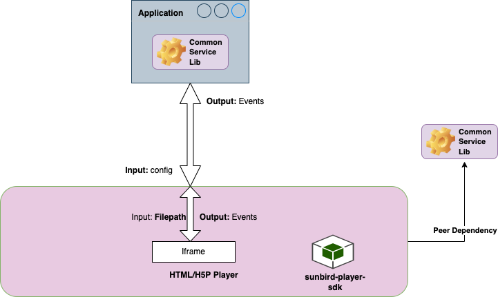

# HTML/H5P Player v2.0 Design

#### Introduction: <a href="#html-h5pplayerv2.0design-introduction" id="html-h5pplayerv2.0design-introduction"></a>

This document describes the design approach for HTML/H5P player

\
[SB-28712](https://project-sunbird.atlassian.net/browse/SB-28712?src=confmacro)

#### Background: <a href="#html-h5pplayerv2.0design-background" id="html-h5pplayerv2.0design-background"></a>

Now to play HTML or H5P content we use content player version 1 which is the combination of all the players as a single player.

* Playing of the content is with the initial load is slow due to the heaviness of the player since it has all the players embedded as one
* Extending it for further enhancements are harder to implement since it is tightly coupled with other players as once player
* The current player is not adaptable to all the screens and it is having limitations on rendering in all the screen resolutions

#### Problem Statement: <a href="#html-h5pplayerv2.0design-problemstatement" id="html-h5pplayerv2.0design-problemstatement"></a>

* Html player should be independently launched and player specific to html only
* The player should have better performance

#### Key design problems: <a href="#html-h5pplayerv2.0design-keydesignproblems" id="html-h5pplayerv2.0design-keydesignproblems"></a>

1. Player - Define player and its dependencies and interactions with other components and the parent container
2. Player config - simplifying the player input configuration to start the content play
3. How to handle telemetry events
4. The player should support to the all screen resolutions
5. Performance of player should be better compared to older player
6. How to handle content consumption progress bar
7. How to handle page change events
8. How to show end page for html content
9. How to handle pagination for html and h5p content
10. How to handle next and previous interact events

#### Solution : <a href="#html-h5pplayerv2.0design-solution" id="html-h5pplayerv2.0design-solution"></a>

* As we are building independent player performance will be better because its not tightly coupled with any player and it will be light weight
*   We can pass minimal player config to player or mandatory config to the player

    ```
    playerConfig = {
      "context": {},
      "config": {},
      "metadata": {
          "identifier": "", // Mandatory, content id
          "name": "",      // Mandatory, name of the content
          "pkgVersion": "", // Mandatory, package version
          "streamingUrl": "", // Mandatory, defines the streaming url
          "artifactUrl": "", // Mandatory, Defines the artifact url
          "isAvailableLocally": "", // Mandatory, defines the content availability status
          "basePath": "", // Mandatory, defines the base path
          "baseDir": "", // Mandatory, defines the base directory
       }, 
      }
    ```
* The screen resolution issue will be resolved by adding css to the iframe
* we can handle telemetry events by using html interface file provided by html content
* We can handle content consumption progress by using interface file provided by html content , below is the code snippet
* ```
  org.ekstep.renderer.html.ProgressBar = function(flag){
  	org.ekstep.contentrenderer.progressbar(flag);
  }
  ```
*   We can handle end page by using methods provided by interface file , bellow is code snippet

    ```
    org.ekstep.renderer.html.showEndPage = function() {
    	org.ekstep.renderer.html.EkstepRendererAPI.showEndPage();
    };
    ```

#### Design : <a href="#html-h5pplayerv2.0design-design" id="html-h5pplayerv2.0design-design"></a>



#### Player config: <a href="#html-h5pplayerv2.0design-playerconfig" id="html-h5pplayerv2.0design-playerconfig"></a>

```
playerConfig = {
  "context": { 
    "mode": "play",  // Optional, To identify preview used by the user to play/edit/preview
    "authToken": "", // Optional, Auth key to make  api calls
    "sid": "7283cf2e-d215-9944-b0c5-269489c6fa56", // Optional,User sessionid on portal or mobile 
    "did": "3c0a3724311fe944dec5df559cc4e006", // Optional, Unique id to identify the device or browser 
    "uid": "anonymous", // Optional, Current logged in user id
    "channel": "505c7c48ac6dc1edc9b08f21db5a571d", // Optional,Unique id of the channel(Channel ID)
    "pdata": { // Optional,
      "id": "sunbird.portal", // Optional, Producer ID. For ex: For sunbird it would be "portal" or "genie"
      "ver": "3.2.12", // Optional, Version of the App
      "pid": "sunbird-portal.contentplayer" // Optional, In case the component is distributed, then which instance of that component
    },
    "contextRollup": { // Optional, Defines the content roll up data
      "l1": "505c7c48ac6dc1edc9b08f21db5a571d"
    },
    "tags": [ // Optional, Defines the tags data
      ""
    ],
    "cdata": [], // Optional, Defines correlation data
    "timeDiff": 0,  // Optional, Defines the time difference
    "objectRollup": {}, // Optional, Defines the object roll up data
    "host": "", // Optional, Defines the from which domain content should be load
    "endpoint": "", // Optional, Defines the end point
    "userData": {  // Optional, Defines the user data firstname & lastname
      "firstName": "",
      "lastName": ""
    }
  },
  "config": { 
    "toolBar": { // Optional
    "showZoomButtons": false, // show/hide zoom buttons. default value is false
    "showPagesButton": false, // show/hide pages button. default value is false
    "showPagingButtons": false, // show/hide paging buttons. default value is false
    "showSearchButton": false, // show/hide search button. default value is false
    "showRotateButton": false // show/hide rotation button. default value is false
    },
    "sideMenu": { // Optional and has default values
      "showShare": true, // show/hide share button in side menu. default value is true
      "showDownload": false, // show/hide download button in side menu. default value is false
      "showReplay": false, // show/hide replay button in side menu. default value is false
      "showExit": false, // show/hide exit button in side menu. default value is false
      "showPrint": false // show/hide print button in side menu. default value is false
    }
  },
  "metadata": {
      "identifier": "", // Mandatory, content id
      "name": "",      // Mandatory, name of the content
      "pkgVersion": "", // Mandatory, package version
      "streamingUrl": "", // Mandatory, defines the streaming url
      "artifactUrl": "", // Mandatory, Defines the streaming url
      "isAvailableLocally": "", // Mandatory, defines the content availability status
      "basePath": "", // Mandatory, defines the base path
      "baseDir": "", // Mandatory, defines the base directory
   }, 
  }
```

### Telemetry property description: <a href="#html-h5pplayerv2.0design-telemetrypropertydescription" id="html-h5pplayerv2.0design-telemetrypropertydescription"></a>

| Property Name   | Description                                                                                                                         | Default Value                      |
| --------------- | ----------------------------------------------------------------------------------------------------------------------------------- | ---------------------------------- |
| `context`       | It is an `object` it contains the `uid`,`did`,`sid`,`mode` etc., these will be logged inside the telemetry                          | `{}`                               |
| `mode`          | It is `string` to identify preview used by the user to play/edit/preview                                                            | `play`                             |
| `authToken`     | It is `string` and Auth key to make api calls                                                                                       | `''`                               |
| `sid`           | It is `string` and User session id on portal or mobile                                                                              | `''`                               |
| `did`           | It is `string` and Unique id to identify the device or browser                                                                      | `''`                               |
| `uid`           | It is `string` and Current logged in user id                                                                                        | `''`                               |
| `channel`       | It is `string` which defines channel identifier to know which channel is currently using.                                           | `in.sunbird`                       |
| `pdata`         | It is an `object` which defines the producer information it should have identifier and version and canvas will log in the telemetry | `{'id':'in.sunbird', 'ver':'1.0'}` |
| `contextRollup` | It is an `object` which defines content roll up data                                                                                | `{}`                               |
| `tags`          | It is an `array` which defines the tag data                                                                                         | `[]`                               |
| `objectRollup`  | It is an `object` which defines object rollup data                                                                                  | `{}`                               |
| `host`          | It is `string` which defines the from which domain content should be load                                                           | `window.location.origin`           |
| `userData`      | It is an `object` which defines user data                                                                                           | `{}`                               |
| `cdata`         | It is an `array` which defines the correlation data                                                                                 | `[]`                               |

### Config property description: <a href="#html-h5pplayerv2.0design-configpropertydescription" id="html-h5pplayerv2.0design-configpropertydescription"></a>

| Property Name                  | Description                                                                              | Default Value                                                                                                                                               |
| ------------------------------ | ---------------------------------------------------------------------------------------- | ----------------------------------------------------------------------------------------------------------------------------------------------------------- |
| `config`                       | It is an `object` it contains the `sideMenu`, these will be used to configure the canvas | `{ sideMenu: {"showShare": true, "showDownload": false, "showReplay": false, "showExit": false,"showPrint": false}}`                                        |
| `config.sideMenu.showShare`    | It is `boolean` to show/hide share button in side menu                                   | `true`                                                                                                                                                      |
| `config.sideMenu.showDownload` | It is `boolean` to show/hide download button in side menu                                | `false`                                                                                                                                                     |
| `config.sideMenu.showReplay`   | It is `boolean` to show/hide replay button in side menu                                  | `false`                                                                                                                                                     |
| `config.sideMenu.showExit`     | It is `boolean` to show/hide exit button in side menu                                    | `false`                                                                                                                                                     |
| `config.sideMenu.showPrint`    | It is `boolean` to show/hide print button in side menu                                   | `false`                                                                                                                                                     |
| `metadata`                     | It is an `object` which defines content metadata json object                             | <p><code>{"identifier": "",</code><br><code>"name": "",</code><br><code>"pkgVersion": "", "streamingUrl": "",</code><br><code>"artifactUrl": ""}</code></p> |
| `metadata.identifier`          | It is `string` which defines the content id                                              | `''`                                                                                                                                                        |
| `metadata.name`                | It is `string` which defines the content name                                            | `''`                                                                                                                                                        |
| `metadata.pkgVersion`          | It is `string` which defines the package version                                         | `''`                                                                                                                                                        |
| `metadata.streamingUrl`        | It is `string` which defines the streaming url of content                                | `''`                                                                                                                                                        |
| `metadata.artifactUrl`         | It is `string` which defines the artifact url of content                                 | `''`                                                                                                                                                        |

#### Player events: <a href="#html-h5pplayerv2.0design-playerevents" id="html-h5pplayerv2.0design-playerevents"></a>

a) Start

This event is the beginning of the player event and will be triggered when the player starts.

```
 {
      eid: ‘START’,  // event id
      ver: ‘1.0’,  // version of the application
      edata: {
        type: ‘START’,    // edata type
        currentPage: ‘2’,  // current page count when content loads
        duration: ‘’     // duration of content play's
      },
      metaData: {    
        identifier: '', // content id
        name: '',      // name of the content
      } 
 }
```

b) End

This is one of the player event , which will be triggered when the player reaches the end of the content.

```
  {
        eid: ‘END’, // event id
        ver: ‘1.0’,   // version of the application
        edata: {
          type: ‘END’,      // edata type
          currentPage: ‘1’,  // current page count when content loads
          totalPages: ‘10’,  // Total number of pages
          duration: ‘’      // duration of content play's
        },
       metaData: {
        "pagesVisited": [1], // page visited data
        "totalPages": 184,   // total numbber of pages
        "duration": [107741], // pages visited/spent time
        "zoom": ["auto"],    // pages zoom values
        "rotation": [0]     // pages rotation values
       }
  }
```

c) HEARTBEAT

The player also has some other events like share, full screen, minimize screen, open menu, close menu, reply. and bellow are the type of heartbeat events with sample data

1.  Open menu\
    This is one of the player event which is triggered when user clicks on menu icon

    ```
    {
      "eid": "HEARTBEAT",
      "ver": "1.0",
      "edata": {
        "type": "OPEN_MENU",
        "currentPage": 1
      },
      "metaData": {
        "pagesVisited": [
          1,
          1
        ],
        "totalPages": 184,
        "duration": [
          11434,
          281039
        ],
        "zoom": [
          90,
          100
        ],
        "rotation": [
          0,
          0
        ]
      }
    }
    ```
2.  Close menu\
    This is one of the player event which is triggered when user clicks on menu close icon

    ```
    {
      "eid": "HEARTBEAT",
      "ver": "1.0",
      "edata": {
        "type": "CLOSE_MENU",
        "currentPage": 1
      },
      "metaData": {
        "pagesVisited": [
          1,
          1
        ],
        "totalPages": 184,
        "duration": [
          11434,
          281039
        ],
        "zoom": [
          90,
          100
        ],
        "rotation": [
          0,
          0
        ]
      }
    }
    ```
3.  Share\
    This is one of the player event which is triggered when user clicks on share icon

    ```
    {
      "eid": "HEARTBEAT",
      "ver": "1.0",
      "edata": {
        "type": "SHARE",
        "currentPage": 4
      },
      "metaData": {
        "pagesVisited": [
          4
        ],
        "totalPages": 184,
        "duration": [
          18
        ],
        "zoom": [
          "auto"
        ],
        "rotation": [
          0
        ]
      }
    }
    ```
4.  Minimize screen\
    This is one of the player event which is triggered when user clicks on minimize

    ```
    {
      "eid": "HEARTBEAT",
      "ver": "1.0",
      "edata": {
        "type": "MINIMIZE_SCREEN",
        "currentPage": 1
      },
      "metaData": {
        "pagesVisited": [
          1
        ],
        "totalPages": 184,
        "duration": [
          11434
        ],
        "zoom": [
          90
        ],
        "rotation": [
          0
        ]
      }
    }
    ```
5.  Full screen\
    This is one of the player event which is triggered when user clicks on fullscreen

    ```
    {
      "eid": "HEARTBEAT",
      "ver": "1.0",
      "edata": {
        "type": "FULL_SCREEN",
        "currentPage": 1
      },
      "metaData": {
        "pagesVisited": [
          1,
          1
        ],
        "totalPages": 184,
        "duration": [
          11434,
          281039
        ],
        "zoom": [
          90,
          100
        ],
        "rotation": [
          0,
          0
        ]
      }
    }
    ```
6.  Turn off sound\
    This is one of the player event which is triggered when user clicks on turn off sound

    ```
    {
      "eid": "HEARTBEAT",
      "ver": "1.0",
      "edata": {
        "type": "MUTE_SOUND",
        "currentPage": 4
      },
      "metaData": {
        "pagesVisited": [
          4
        ],
        "totalPages": 184,
        "duration": [
          18
        ],
        "zoom": [
          "auto"
        ],
        "rotation": [
          0
        ]
      }
    }
    ```
7.  Turn on sound\
    This is one of the player event which is triggered when user clicks on turn on sound

    ```
    {
      "eid": "HEARTBEAT",
      "ver": "1.0",
      "edata": {
        "type": "UNMUTE_SOUND",
        "currentPage": 4
      },
      "metaData": {
        "pagesVisited": [
          4
        ],
        "totalPages": 184,
        "duration": [
          18
        ],
        "zoom": [
          "auto"
        ],
        "rotation": [
          0
        ]
      }
    }
    ```
8.  Replay\
    This is one of the player event which is triggered when user clicks on replay

    ```
    {
      "eid": "HEARTBEAT",
      "ver": "1.0",
      "edata": {
        "type": "REPLAY",
        "currentPage": 184
      },
      "metaData": {
        "pagesVisited": [
          1,
          1,
          1,
          183,
          184
        ],
        "totalPages": 184,
        "duration": [
          11434,
          281039,
          2194402,
          1828,
          99
        ],
        "zoom": [
          90,
          100,
          90,
          90,
          90
        ],
        "rotation": [
          0,
          0,
          0,
          0,
          0
        ]
      }
    }
    ```

| Property Name          | Description                                                                           | Default Value                                                                                                                                                                                                |
| ---------------------- | ------------------------------------------------------------------------------------- | ------------------------------------------------------------------------------------------------------------------------------------------------------------------------------------------------------------ |
| `eid`                  | It is `string` and which holds the event id                                           | `HEARTBEAT`                                                                                                                                                                                                  |
| `ver`                  | It is `string` and which holds the version number                                     | `''`                                                                                                                                                                                                         |
| `edata`                | It is `object` and which holds the e data                                             | <p><code>edata: {</code></p><p><code>"type": "",</code></p><p><code>"currentPage":""}</code></p>                                                                                                             |
| `edata.type`           | It is `string` and which holds the e data type value                                  | `''`                                                                                                                                                                                                         |
| `edata.currentPage`    | It is `string` and which holds the e data current page value                          | `''`                                                                                                                                                                                                         |
| `metaData`             | It is `object` and which holds the meta data values                                   | <p><code>metaData: {</code></p><p><code>"pageVisited": [],</code></p><p><code>"totalPages":"",</code></p><p><code>"duration": [],</code></p><p><code>"zoom":[],</code></p><p><code>"rotation":[]}</code></p> |
| `metaData.pageVisited` | It is `arry` and which has the pages visited numbers                                  | `"pageVisited": []`                                                                                                                                                                                          |
| `metaData.totalPages`  | It is `string` and which holds the total number of pages in content                   | `''`                                                                                                                                                                                                         |
| `metaData.duration`    | It is `array` and which holds the value of given page on which user stayed/spent time | `duration: []`                                                                                                                                                                                               |
| `metaData.zoom`        | It is `array` and which holds the value of given page zoom value                      | `zoom: []`                                                                                                                                                                                                   |
| `metaData.rotation`    | It is `array` and which holds the value of given page rotation value                  | `rotation: []`                                                                                                                                                                                               |

#### Telemetry events: <a href="#html-h5pplayerv2.0design-telemetryevents" id="html-h5pplayerv2.0design-telemetryevents"></a>

a) Start Event

This is the start event that will be triggered when the player starts playing and the following is the sample telemetry data.

```
"edata": {
  "type": "content", // Defines edata type
  "mode": "play", // Defines edata mode
  "pageid": "", // Defines page id/number
  "duration": 7.47 // Defines duration of play
}
```

b) Interact Event

This is the Interact event which will be triggered when the user does any interaction in the player like menu open or share and etc and following is the sample telemetry data.

```
"edata": {
  "type": "TOUCH", // Defines edata type
  "subtype": "", // Defines edata sub type
  "id": "gc_menuopen", // Defines edata id
  "pageid": "2" // Defines page id/number
}
```

c) Impression Event

This is the impression event that will be triggered when we open the player and the following is the sample telemetry data.

```
"edata": {
  "type": "content", // Defines edata type
  "mode": "play", // Defines edata mode
  "pageid": "2", // Defines page id/number
  "duration": 1 // Defines duration
}
```

d) End event

This is the end event and the following is the sample telemetry data.

```
"edata": {
  "type": "content", // Defines edata type
  "mode": "play",   // Defines mode
  "pageid": "sunbird-player-Endpage", // Defines page id
  "summary": [
    {
      "progress": 50
    },
    {
      "totallength": ""
    },
    {
      "visitedlength": ""
    },
    {
      "visitedcontentend": ""
    },
    {
      "totalseekedlength": ""
    },
    {
      "endpageseen": false
    }
  ],
  "duration": 1996.559 // Defines duration of the play
}
```

**Sample complete telemetry data**

```
{
  "eid": "INTERACT", // Event id 
  "ets": 1646727758517, // Event time stamp
  "ver": "3.0", // Version 
  "mid": "INTERACT:e6cf5520a276294b068acfabd52f363a",
  "actor": { // User details 
    "id": "280d913d358428e24c92ed6b9e6d89a7",
    "type": "User"
  },
  "context": {
    "channel": "01268904781886259221", // Channel id
    "pdata": { 
      "id": "preprod.diksha.portal", // Producer ID.
      "ver": "4.7.0", // Version of the app
      "pid": "sunbird-portal.contentplayer" //Optional. In case the component is distributed, then which instance of that component
    },
    "env": "contentplayer",  // Defines the environment 
    "sid": "f7a8a672-9a3b-e83e-42a7-6131a553f65f", // User sessionid
    "did": "280d913d358428e24c92ed6b9e6d89a7", // Unique id to identify the device or browser
    "cdata": [ // Defines correlation data
      {
        "id": "fdaafa8413a27931dc01ff5a4cb3a0e2",
        "type": "ContentSession"
      },
      {
        "id": "7e20b101878957052b8cb9a9ec770ce7",
        "type": "PlaySession"
      }
    ],
    "rollup": { // Roll up data
      "l1": "01268904781886259221"
    }
  },
  "object": {
    "id": "do_2134417722515210241147", // Content identifier
    "type": "Content", // Resource type
    "ver": "1",  // Defines version
    "rollup": {} // Roll up data
  },
  "tags": [ // Defines the tags data
    "01268904781886259221"
  ],
  "edata": {
    "type": "TOUCH", // Event data type
    "subtype": "", // Event sub data type
    "id": "gc_menuopen", // Defines the id
    "pageid": "2" // Defines the page id
  }
}
```

**Pros:**

* Separation of Concern: With Separation of Concern we will have highly modular and maintainable code . Tight Coupling of Systems ends up constraining the player to put most part of the code which is non-functional for itself.
* Any Potential changes to telemetry shouldn’t ideally end up republishing the player. An update on CSL should be enough. Which kind of reduces the risk of regression to Telemetry Only.
* Modular Player: Since the entire player is an npm repo. It becomes easy to detach the existing player and move into the new one without any hassles
* It is quite practical to interpret telemetry spec in a very customized way for most of the adaptors of Sunbird. This telemetry behaviour should be allowed to override with minimal effort.
* Any new players created in future, will be less context aware and more functional in nature.

**Cons:**

* Any player created in the future will have a dependency on CSL for default telemetry implementation. Could potentially be a source of friction.
* Creating a Telemetry Interpreter can be a two-step task.

#### References: <a href="#html-h5pplayerv2.0design-references" id="html-h5pplayerv2.0design-references"></a>

Sunbird content player [https://github.com/project-sunbird/sunbird-content-player/tree/release-4.6.0](https://github.com/project-sunbird/sunbird-content-player/tree/release-4.6.0)

Sunbird player sdk [https://github.com/project-sunbird/sunbird-player-sdk/tree/release-4.8.0](https://github.com/project-sunbird/sunbird-player-sdk/tree/release-4.8.0)

Sunbird telemetry sdk [https://github.com/project-sunbird/sunbird-telemetry-sdk/tree/release-3.3.0](https://github.com/project-sunbird/sunbird-telemetry-sdk/tree/release-3.3.0)

Sunbird client services [https://github.com/Sunbird-Ed/sunbird-client-services/tree/release-4.6.0](https://github.com/Sunbird-Ed/sunbird-client-services/tree/release-4.6.0)
