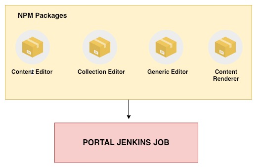

# \[Design Discussion] Deployment Job Changes for SunbirdEd - Content Framework

**Overview:**

Deployment process needs to be made a less dependent, less time-consuming and single trigger process.

Currently, to deploy any changes of Content Framework on Sunbird Portal, the corresponding editor needs to be deployed on Ekstep and Sunbird Portal deployment need to be run in order for the changes to reflect.

\

**Problem Statement:**&#x20;

Every time to deploy Content Framework on Sunbird, currently Ekstep deployment of all the editors to be done first. And to complete the deployment of CF, the portal deployment is also supposed to be triggered.

Also, the plugins that are to be loaded along with the editor, the version number has to be communicated across different teams which leads to the risk of human error.&#x20;

\

**Approach 1:**

Four new Jenkins jobs to be created for

1. Content Editor
2. Collection Editor
3. Generic Editor
4. Content Renderer

During the deployment process in the newly created jobs, all three editors and renderer will be directly fetched from Github Repositories correspondingly.

The minification and bundling process will happen as it is happening currently.

All the Plugins that are required for an Editor will be minified and bundled using Webpack bundler. The plugins that are not bundled in Webpack, will be minified using gulp.&#x20;

Plugins will not be loaded from configurations. This way, the editor will have all the required plugin with the corresponding versions already bundled within which will solve our risk of loading.

\

**Approach 2:**

All three editors can be published as NPM packages and Portal will directly fetch it from NPM.&#x20;

\

**Cons:**

1. Maintaining the version of packages will be unfeasible.&#x20;

\

\
