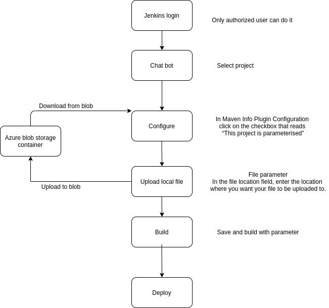
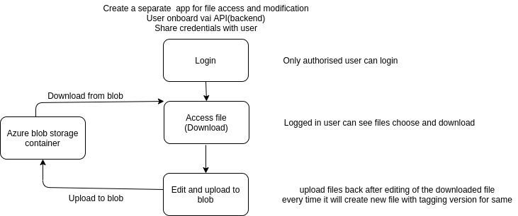

# Menu options configurable - Dev-Ops CD flow development

### **Introduction:** <a href="#menuoptionsconfigurable-dev-opscdflowdevelopment-introduction" id="menuoptionsconfigurable-dev-opscdflowdevelopment-introduction"></a>

Makes chatbot menu options configurable so it can easy to maintain without a dev engineer. So we can add/edit existing menu options. It has the following advantages:

* It will help with a faster deployment process.
* Quick change based on the requirement and easy to deploy.
* Any time/ anyone(authorized) / any flow/menu text can change quickly.
* Add/Edit change the text for Menu options.

### **Problem statement:** <a href="#menuoptionsconfigurable-dev-opscdflowdevelopment-problemstatement" id="menuoptionsconfigurable-dev-opscdflowdevelopment-problemstatement"></a>

As a solution owner, I would want to deploy menu options faster without having to depend on a release on both portal and WhatsApp with the following details -

1. Able to change the text
2. Able to change the menu options (Add/edit/remove)
3. Able to create new flows/structure such as introducing new menu options which are not there
4. Able to change answers to queries
5. Able to add/edit/remove hyperlinks
6. Able to analyze the data after changes

### **Key Design Problems:** <a href="#menuoptionsconfigurable-dev-opscdflowdevelopment-keydesignproblems" id="menuoptionsconfigurable-dev-opscdflowdevelopment-keydesignproblems"></a>

1. How to upload a local file to blob storage.
2. Versioning and rollback for files.
3. Secure (Only authorized users can access)

### **Design solutions:** <a href="#menuoptionsconfigurable-dev-opscdflowdevelopment-designsolutions" id="menuoptionsconfigurable-dev-opscdflowdevelopment-designsolutions"></a>

#### **Solution 1:** <a href="#menuoptionsconfigurable-dev-opscdflowdevelopment-solution1" id="menuoptionsconfigurable-dev-opscdflowdevelopment-solution1"></a>

Using Jenkins job where we can upload a file while build and deploy of the job.



Download and upload files from blob through Jenkins with the following process

* Only the owner/authorized user can log in to Jenkins.
* Using Jenkins azure plugins we can parameterize the build.
* We can choose which file from local and upload in specified blob storage.
* Build a chatbot with a new configuration.
* Upload artifact and deploy.

**Pros:**

 Easy to maintain, add, and modify any time Menu options and query answers just by uploading the JSON object.

 We can keep/maintaining all versions of files.

 It will help to revert back to the old version of files if something went wrong with the new version of files.

 It's secure since the only authorized user can upload and download.

#### **Solution 2:** <a href="#menuoptionsconfigurable-dev-opscdflowdevelopment-solution2" id="menuoptionsconfigurable-dev-opscdflowdevelopment-solution2"></a>

Create a separate application for accessing and modifying the file.\
User onboard via API(backend)\
Share credentials with user

For creating the files in a blob it requires azure services keys.



**Pros:**

 Easy to create and update config JSON using API’s

```
Create
{{host}}/chatbot/config/create
Update
{{host}}/chatbot/config/update
```

 For every new update, it will create a new file with a version number.

 Easy to roll back to the older version.

 Since it is a login based app so only an authorized person only can do.

#### Chatbot download/update configurations and build process: <a href="#menuoptionsconfigurable-dev-opscdflowdevelopment-chatbotdownload-updateconfigurationsandbuildprocess" id="menuoptionsconfigurable-dev-opscdflowdevelopment-chatbotdownload-updateconfigurationsandbuildprocess"></a>

Enable load and execute config from AZURE container for a chatbot.

* Make literals and chart flow configurable.
* Keep files in blob storage public accessible.
*   While doing a build for chatbot/router run the below commands in the docker file

    ```
    FROM node:10.19.0 as builder
    WORKDIR /app
    COPY . /app

    ADD http://source.file/config/literals  /config/literals.js 
    ADD http://source.file/config/chatflow  /config/chatflow.js
    RUN npm install

    FROM node:10.19-slim
    COPY --from=builder /app .
    EXPOSE 4000 8443
    CMD [ "node", "appRest.js" ]
    ```
* For every build, it will download it from the blob and add it `/router/config/*` files.
* So now we can change only those required files and do build and deploy
