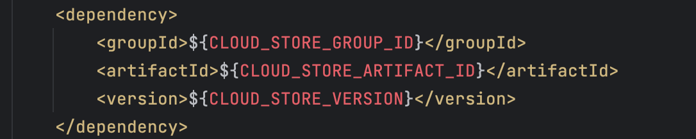

# Sunbird Backend CSP Changes For Generalisation

### Introduction 

Sunbird Building Blocks supports multiple could service providers. The cloud storage-specific code is interfaced and has multiple implementations to support the commonly used CSPs. The implementation of all the supported CSPs are packaged within the final executable microservices. The configuration will be used to load the respective CSP module and process the requests.

Now we are changing this design to unbundle the CSP dependencies. This wiki explains and proposed solution to handle it.

### Background & Problem Statement 

The Sunbird Building Blocks uses **Cloud-Storage-SDK** as a dependency to support different CSP for storage related functionalities. The microservices use a configuration to identify which CSP related modules to load and process the requests.

The Cloud-Storage-SDK has implementations for Azure, AWS etc., and everything bundled together. So, the sunbird building blocks have some logic based on a specific CSP. This made it difficult to ensure Sunbird Building Blocks cloud-agnostic.

### Key Design Problems: 

With the current state, below are the key design problems to ensure the Sunbird Building Blocks functional logic is cloud-agnostic.

* Independent Cloud-Storage-SDK for each cloud service provider.
* Using any one of the Cloud-Storage-SDK.

### Design 

The Cloud-Storage-SDK defined a standard interface and having implementation for different cloud storage services. The current repository will have only the interface with standards or specifications to implement the cloud storage APIs.

This repository will be forked by the respective organisation or individuals to implement the cloud specific storage APIs based on the defined Interface.

The selected Cloud-Storage-SDK implementation will be given as configuration as part of build or compilation of the microservices. All the Sunbird BBs using Maven as build-tool for the backend microservices.

We will follow the below steps to configure the Cloud-Storage dependency at build time.

Step 1: Use variables in the pom.xml file for the cloud-storage dependency.

Open&#x20;

<figure><figcaption></figcaption></figure>

Step 2: Clone and build the selected Cloud-Storage-SDK implementation fork (ensure valid version or banch is cloned). This step is optional if the dependency is available in Maven central repository.

Step 3: Create the Maven command along with parameters to set the required dependency.

<figure><figcaption></figcaption></figure>

&#x20;
