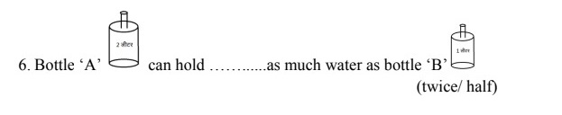

# Inline image support in the Question editor

**Problem statement:**

While adding a question the editor does not allow the images to be added in the same line, the images always get added in a new line.

**Impact:**

This restricts from creating questions that require images to be included in the same line of the question:\
e.g.

<figure><figcaption></figcaption></figure>

&#x20;

**Requirement:**

Provision to allow images to be included in the same line as that of text as inline images.

**Where are we:**

We use CKEditor, there is no native support for inline images.

The CKEditor team is currently working on the implementation of inline images. Latest build is expected by 21st April.

CKEditor Issue: [Inline images - support multiple images in a single block · Issue #2052 · ckeditor/ckeditor5](https://github.com/ckeditor/ckeditor5/issues/2052)

CKEditor Roadmap: [📃 Iteration 42 roadmap · Issue #9394 · ckeditor/ckeditor5](https://github.com/ckeditor/ckeditor5/issues/9394)

**Our approach:**

Approach 1: We wait for the CKEditor team to complete the dev and we include the latest build.

Approach 2: We support the CKEditor team with a developer to help with the inline image issue.

Approach 3: We look for alternative editors ( Markdown editors or others)

Need inputs on what could be a better approach, of these or any other.
