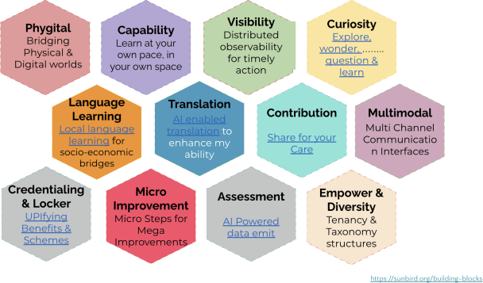
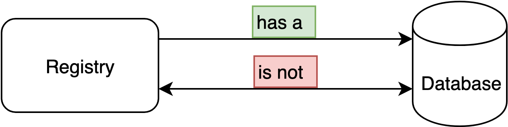
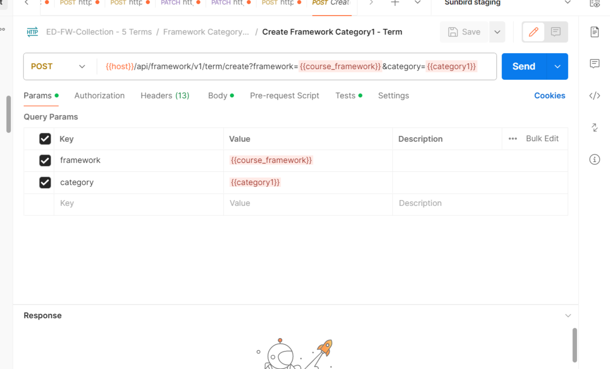
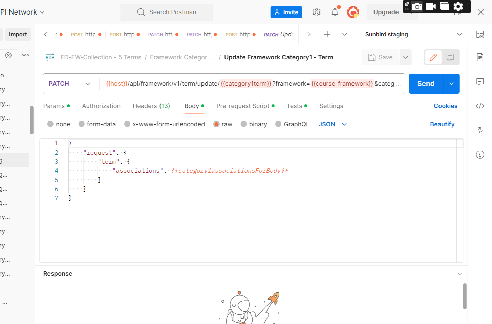
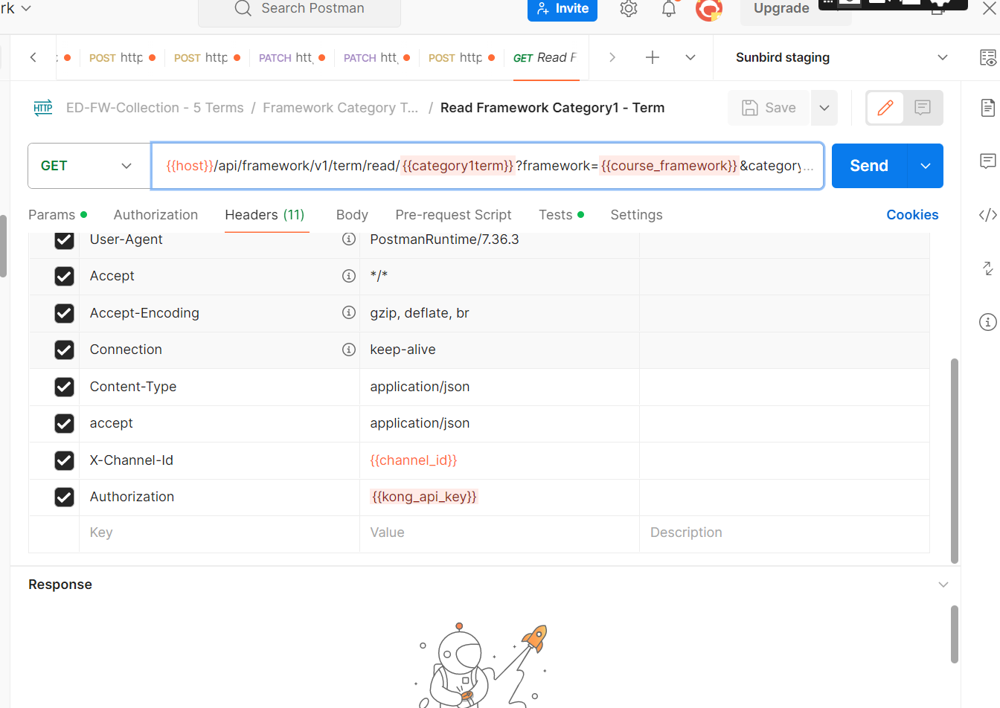
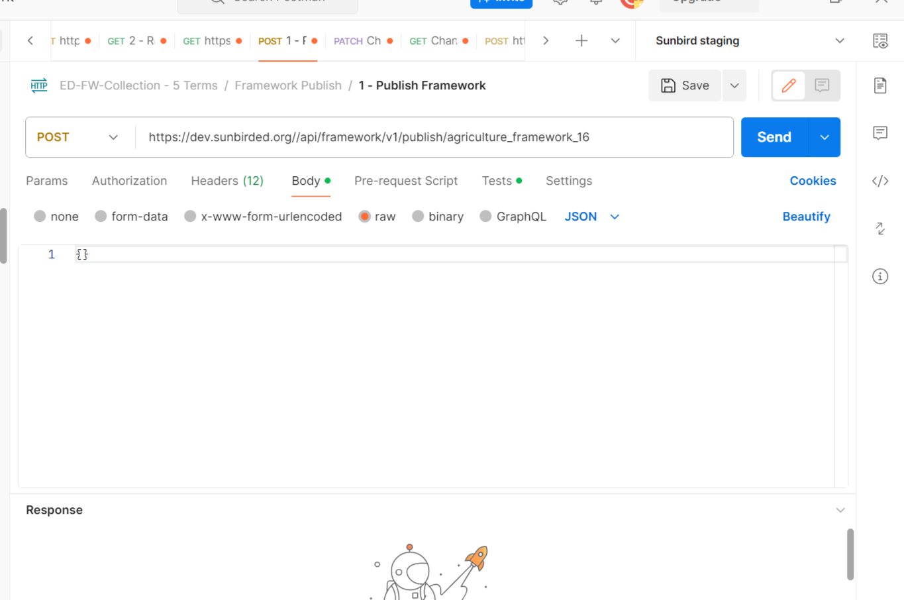
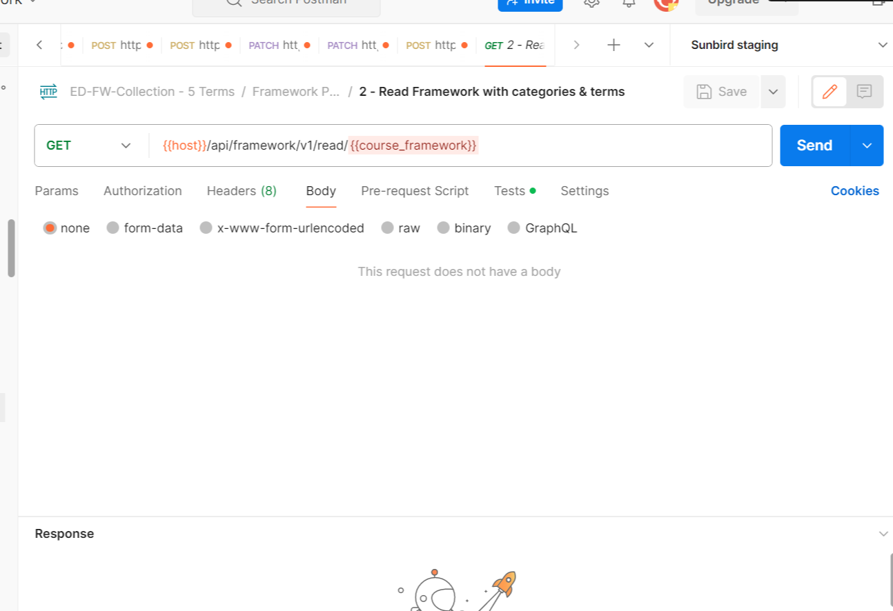

# New Framework Configuration ED

Step1: Configure the Framework for Custodian and Default Channels

1. Make a read call of channel

1. Create Framework

3\. Create Framework Categories (Its based on your framework, If user want to give 6 categories, can create 6 Categories by using same API)

4\. Create Framework category terms

5\. User can update the Framework terms

6.Read Framework Categories

7\. Publish the Framework

8\. Make a read call

